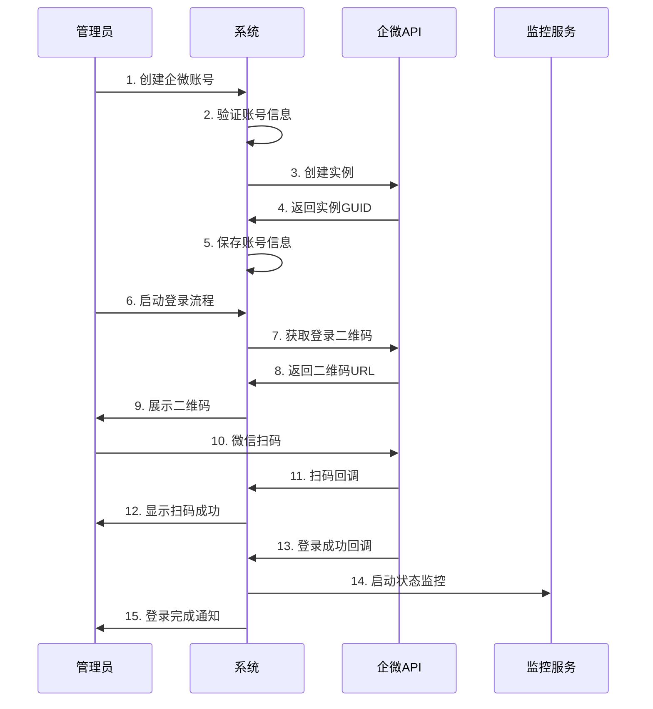
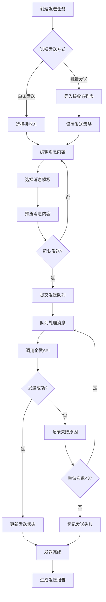
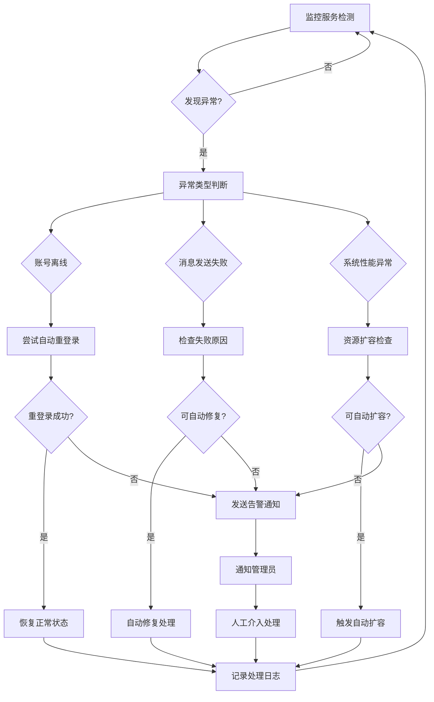

# 📋 企业微信管理平台功能需求文档
*WeWork Management Platform - Functional Requirements Document*

**文档版本**: v1.0  
**编写日期**: 2025年1月  
**负责人**: 产品团队  

---

## 📖 目录

1. [产品概述](#产品概述)
2. [用户角色与权限](#用户角色与权限)
3. [功能模块设计](#功能模块设计)
4. [业务流程设计](#业务流程设计)
5. [用户界面需求](#用户界面需求)
6. [数据需求](#数据需求)
7. [集成需求](#集成需求)
8. [非功能性需求](#非功能性需求)
9. [验收标准](#验收标准)
10. [功能优先级](#功能优先级)

---

## 🎯 产品概述

### 产品定位
**企业微信管理平台**是一个面向企业客户的SaaS服务，提供企业微信账号的统一管理、消息批量发送、实时监控告警等核心功能，帮助企业提升客户运营效率。

### 目标用户
- **企业运营团队**: 负责客户触达和营销活动
- **客服团队**: 处理客户咨询和售后服务
- **销售团队**: 客户关系维护和销售转化
- **IT管理员**: 系统配置和权限管理

### 核心价值
1. **提升效率**: 批量管理多个企微账号，统一消息发送
2. **降低成本**: 自动化运营，减少人工操作
3. **风险控制**: 实时监控账号状态，及时预警异常
4. **数据洞察**: 全面的数据统计和分析报表

### 业务场景
```yaml
营销推广:
  - 活动通知群发
  - 产品宣传推送
  - 节日祝福发送

客户服务:
  - 客服消息回复
  - 售后跟进提醒
  - 客户关怀消息

销售支持:
  - 销售线索跟进
  - 客户关系维护
  - 成交祝贺消息

运营分析:
  - 消息发送统计
  - 账号活跃度分析
  - 客户互动分析
```

---

## 👥 用户角色与权限

### 角色定义

#### 1. 超级管理员 (Super Admin)
**职责**: 系统全局管理和配置
```yaml
权限范围:
  - 租户管理: 创建、编辑、删除租户
  - 系统配置: 全局参数配置、功能开关
  - 数据查看: 所有租户数据查看权限
  - 用户管理: 管理所有租户的用户账号
  - 系统监控: 查看系统运行状态和性能指标
```

#### 2. 租户管理员 (Tenant Admin)
**职责**: 租户内部管理和配置
```yaml
权限范围:
  - 账号管理: 企微账号的增删改查
  - 用户管理: 租户内用户的角色分配
  - 消息管理: 所有消息记录查看和管理
  - 数据统计: 租户数据报表查看
  - 系统配置: 租户级别的参数配置
```

#### 3. 运营人员 (Operator)
**职责**: 日常运营和消息发送
```yaml
权限范围:
  - 消息发送: 单条/批量消息发送
  - 会话查看: 查看分配给自己的会话
  - 模板管理: 消息模板的创建和使用
  - 数据查看: 自己发送的消息统计
  - 账号使用: 使用分配的企微账号
```

#### 4. 客服人员 (Customer Service)
**职责**: 客户服务和咨询处理
```yaml
权限范围:
  - 消息回复: 针对客户咨询进行回复
  - 会话管理: 客服会话的接入和转接
  - 客户信息: 查看客户基本信息
  - 服务记录: 客服服务记录查看
  - 快捷回复: 使用预设的快捷回复模板
```

#### 5. 数据分析师 (Analyst)
**职责**: 数据分析和报表生成
```yaml
权限范围:
  - 数据查看: 所有业务数据查看权限
  - 报表生成: 自定义报表生成和导出
  - 趋势分析: 数据趋势分析和预测
  - 用户行为: 用户行为数据分析
  - 只读权限: 无数据修改权限
```

### 权限矩阵

| 功能模块 | 超级管理员 | 租户管理员 | 运营人员 | 客服人员 | 数据分析师 |
|---------|----------|----------|----------|----------|-----------|
| 租户管理 | ✅ | ❌ | ❌ | ❌ | ❌ |
| 企微账号管理 | ✅ | ✅ | 👁️ | 👁️ | 👁️ |
| 用户权限管理 | ✅ | ✅ | ❌ | ❌ | ❌ |
| 消息发送 | ✅ | ✅ | ✅ | ✅ | ❌ |
| 消息模板管理 | ✅ | ✅ | ✅ | 👁️ | 👁️ |
| 会话管理 | ✅ | ✅ | 🔒 | 🔒 | 👁️ |
| 数据统计 | ✅ | ✅ | 🔒 | 🔒 | ✅ |
| 系统监控 | ✅ | 👁️ | ❌ | ❌ | 👁️ |

*符号说明: ✅ 完全权限 | 👁️ 只读权限 | 🔒 部分权限 | ❌ 无权限*

---

## 🧩 功能模块设计

### 模块1: 账号管理中心

#### 1.1 企微账号管理
**功能描述**: 管理企业微信账号的完整生命周期

**功能列表**:
```yaml
账号注册:
  - 手机号/邮箱注册企微账号
  - 账号基本信息配置
  - 账号分组和标签管理
  - 批量导入账号信息

账号登录:
  - 二维码扫码登录
  - 新设备验证码确认
  - 登录状态实时监控
  - 自动重登录机制

账号状态管理:
  - 在线/离线状态监控
  - 异常状态告警
  - 账号健康度评分
  - 状态变更历史记录

账号配置:
  - 个人信息设置
  - 头像和昵称修改
  - 自动回复配置
  - 消息发送频率限制
```

**业务规则**:
- 单个租户最多支持1000个企微账号
- 账号离线超过5分钟自动告警
- 登录失败3次自动锁定30分钟
- 账号昵称不能包含敏感词汇

#### 1.2 会话管理
**功能描述**: 管理企微账号的所有会话信息

**功能列表**:
```yaml
会话同步:
  - 自动同步企微会话列表
  - 会话基本信息获取
  - 群成员信息同步
  - 会话活跃度统计

会话分配:
  - 会话分配给指定用户
  - 支持按规则自动分配
  - 会话转接功能
  - 会话负载均衡

会话筛选:
  - 按会话类型筛选(私聊/群聊)
  - 按最后消息时间筛选
  - 按关键词搜索会话
  - 自定义筛选条件

会话标记:
  - 重要会话标星
  - 会话备注信息
  - 会话状态标记
  - 会话分类管理
```

### 模块2: 消息发送中心

#### 2.1 单条消息发送
**功能描述**: 向指定联系人或群组发送单条消息

**功能列表**:
```yaml
消息类型支持:
  - 文本消息发送
  - 图片消息发送
  - 文件消息发送
  - 链接消息发送
  - 小程序卡片发送

发送目标选择:
  - 选择发送账号
  - 选择接收会话
  - 支持@群成员
  - 发送时间设置

消息编辑:
  - 富文本编辑器
  - 表情符号插入
  - 模板快速插入
  - 消息预览功能

发送控制:
  - 立即发送
  - 定时发送
  - 发送确认提示
  - 发送失败重试
```

#### 2.2 批量消息发送
**功能描述**: 向多个联系人批量发送消息

**功能列表**:
```yaml
批量目标管理:
  - Excel导入联系人
  - 会话列表批量选择
  - 分组批量发送
  - 排除黑名单用户

发送策略配置:
  - 发送间隔设置
  - 并发数量控制
  - 失败重试策略
  - 发送进度监控

消息个性化:
  - 变量替换(姓名、公司等)
  - 条件消息内容
  - 动态图片替换
  - 个性化链接生成

发送结果统计:
  - 发送成功率统计
  - 失败原因分析
  - 发送时长统计
  - 实时进度展示
```

#### 2.3 消息模板管理
**功能描述**: 管理常用的消息模板

**功能列表**:
```yaml
模板分类管理:
  - 营销推广模板
  - 客服回复模板
  - 节日祝福模板
  - 自定义分类

模板内容编辑:
  - 富文本模板编辑
  - 变量占位符支持
  - 模板预览功能
  - 模板版本管理

模板使用统计:
  - 使用次数统计
  - 使用效果分析
  - 热门模板排行
  - 模板优化建议

模板共享:
  - 公共模板库
  - 团队模板共享
  - 模板权限控制
  - 模板导入导出
```

### 模块3: 监控告警中心

#### 3.1 实时监控面板
**功能描述**: 实时展示系统和业务关键指标

**功能列表**:
```yaml
账号监控:
  - 在线账号数量
  - 账号健康度分布
  - 异常账号列表
  - 登录状态变化

消息监控:
  - 实时发送量统计
  - 发送成功率趋势
  - 队列堆积情况
  - 响应时间分布

系统监控:
  - 服务运行状态
  - 系统资源使用率
  - API调用统计
  - 错误率监控

业务监控:
  - 活跃用户数
  - 消息互动率
  - 转化率统计
  - 业务异常指标
```

#### 3.2 告警管理
**功能描述**: 智能告警和通知机制

**功能列表**:
```yaml
告警规则配置:
  - 自定义告警阈值
  - 告警级别设置
  - 告警触发条件
  - 告警抑制规则

告警通知:
  - 多渠道通知(短信/邮件/微信)
  - 告警升级机制
  - 通知人员配置
  - 静默时间设置

告警处理:
  - 告警确认机制
  - 处理进度跟踪
  - 根因分析记录
  - 解决方案知识库

告警统计:
  - 告警趋势分析
  - 告警处理效率
  - 故障影响评估
  - 改进建议输出
```

### 模块4: 数据分析中心

#### 4.1 数据报表
**功能描述**: 提供丰富的数据统计和分析报表

**功能列表**:
```yaml
发送统计报表:
  - 日/周/月发送量统计
  - 发送成功率分析
  - 消息类型分布统计
  - 发送时段分析

账号分析报表:
  - 账号活跃度分析
  - 账号使用效率统计
  - 账号异常情况统计
  - 账号生命周期分析

用户行为分析:
  - 用户登录活跃度
  - 功能使用统计
  - 操作行为分析
  - 用户满意度调研

业务效果分析:
  - 消息回复率统计
  - 转化漏斗分析
  - ROI效果评估
  - 业务增长趋势
```

#### 4.2 自定义报表
**功能描述**: 支持用户自定义数据报表

**功能列表**:
```yaml
报表设计器:
  - 拖拽式报表设计
  - 多种图表类型支持
  - 数据源配置
  - 样式自定义设置

数据筛选:
  - 时间范围筛选
  - 多维度数据筛选
  - 动态参数配置
  - 数据权限控制

报表分享:
  - 报表链接分享
  - 定期报表推送
  - 报表导出功能
  - 报表权限管理

报表调度:
  - 定时生成报表
  - 自动邮件发送
  - 异常数据预警
  - 报表存储管理
```

### 模块5: 系统管理中心

#### 5.1 用户权限管理
**功能描述**: 管理系统用户和权限分配

**功能列表**:
```yaml
用户管理:
  - 用户账号创建
  - 用户信息维护
  - 用户状态管理
  - 批量用户操作

角色管理:
  - 角色定义和创建
  - 权限分配管理
  - 角色继承关系
  - 角色使用统计

权限控制:
  - 功能权限配置
  - 数据权限控制
  - 操作权限审计
  - 权限变更记录

组织架构:
  - 部门组织管理
  - 用户归属配置
  - 权限继承设置
  - 组织变更记录
```

#### 5.2 系统配置管理
**功能描述**: 系统参数和业务规则配置

**功能列表**:
```yaml
基础配置:
  - 系统基本参数
  - 业务规则配置
  - 功能开关控制
  - 第三方集成配置

安全配置:
  - 密码策略设置
  - 登录安全配置
  - 操作审计配置
  - 数据加密设置

性能配置:
  - 系统性能参数
  - 缓存策略配置
  - 队列配置管理
  - 限流策略设置

通知配置:
  - 邮件服务配置
  - 短信服务配置
  - 推送服务配置
  - 通知模板管理
```

---

## 🔄 业务流程设计

### 流程1: 企微账号接入流程



### 流程2: 批量消息发送流程



### 流程3: 异常监控处理流程



---

## 🖥️ 用户界面需求

### 界面1: 主控制面板
**设计要求**:
- 响应式设计，支持PC和平板访问
- 深色/浅色主题切换
- 多语言支持(中文/英文)
- 快捷操作入口明显

**功能模块布局**:
```yaml
顶部导航栏:
  - Logo和产品名称
  - 主功能菜单导航
  - 用户信息和设置
  - 消息通知中心

左侧边栏:
  - 账号管理
  - 消息中心  
  - 数据分析
  - 系统设置

主内容区:
  - 关键指标卡片
  - 实时监控图表
  - 快捷操作按钮
  - 近期活动列表

右侧面板:
  - 告警信息列表
  - 待处理任务
  - 系统公告
  - 在线帮助
```

### 界面2: 企微账号管理页面
**功能要求**:
```yaml
账号列表视图:
  - 表格形式展示账号信息
  - 支持多条件筛选和搜索
  - 批量操作功能
  - 状态实时更新

账号详情弹窗:
  - 账号基本信息展示
  - 登录状态和历史
  - 会话统计数据
  - 操作日志记录

账号创建/编辑表单:
  - 分步骤向导模式
  - 实时验证和提示
  - 批量导入功能
  - 操作确认机制

状态监控面板:
  - 账号状态分布饼图
  - 登录状态趋势图
  - 异常账号列表
  - 快速修复入口
```

### 界面3: 消息发送页面
**设计要求**:
```yaml
发送方式选择:
  - 单条发送/批量发送切换
  - 立即发送/定时发送选项
  - 发送预览模式
  - 草稿保存功能

消息编辑器:
  - 富文本编辑器
  - 模板快速插入
  - 变量标签支持
  - 内容预览功能

接收方管理:
  - 会话选择器
  - 联系人搜索
  - 分组批量选择
  - 黑名单过滤

发送控制面板:
  - 发送进度条
  - 实时统计数据
  - 暂停/继续控制
  - 错误信息提示
```

### 界面4: 数据分析页面
**可视化要求**:
```yaml
图表类型:
  - 折线图: 趋势分析
  - 柱状图: 对比分析  
  - 饼图: 占比分析
  - 热力图: 时间分布
  - 表格: 详细数据

交互功能:
  - 时间范围选择器
  - 多维度筛选器
  - 图表钻取功能
  - 数据导出功能

仪表板配置:
  - 拖拽式布局
  - 图表尺寸调整
  - 个性化配置
  - 分享功能
```

---

## 💾 数据需求

### 数据存储需求
```yaml
结构化数据:
  - 用户账号信息
  - 企微账号配置
  - 消息记录数据
  - 权限角色数据

半结构化数据:
  - 企微回调数据
  - 系统配置信息
  - 业务规则配置
  - 操作日志数据

时序数据:
  - 系统性能指标
  - 业务监控指标
  - 用户行为数据
  - 告警事件数据

文件数据:
  - 用户上传图片
  - 消息附件文件
  - 系统日志文件
  - 数据备份文件
```

### 数据质量要求
```yaml
数据准确性:
  - 关键业务数据准确率 > 99.9%
  - 数据验证和校验机制
  - 异常数据自动标记
  - 数据修复流程

数据完整性:
  - 必填字段完整性检查
  - 关联数据一致性保证
  - 事务数据完整性
  - 数据备份恢复机制

数据及时性:
  - 实时数据延迟 < 3秒
  - 准实时数据延迟 < 30秒
  - 批量数据处理及时性
  - 数据同步机制

数据安全性:
  - 敏感数据加密存储
  - 数据访问权限控制
  - 数据传输加密
  - 数据审计日志
```

---

## 🔗 集成需求

### 企微API集成
```yaml
核心接口:
  - 实例管理接口
  - 登录状态接口
  - 消息发送接口
  - 会话管理接口
  - 回调接收接口

集成要求:
  - API调用频率限制
  - 错误重试机制
  - 超时处理策略
  - 数据格式转换

监控要求:
  - API调用成功率监控
  - 响应时间监控
  - 错误码统计
  - 调用量统计
```

### 第三方服务集成
```yaml
邮件服务:
  - 腾讯企业邮箱
  - 阿里云邮件推送
  - SendGrid
  - 自建邮件服务

短信服务:
  - 阿里云短信服务
  - 腾讯云短信服务
  - 华为云短信服务
  - 网易云信

对象存储:
  - 阿里云OSS
  - 腾讯云COS
  - 七牛云存储
  - MinIO私有云

支付服务:
  - 微信支付
  - 支付宝
  - 银联支付
  - PayPal
```

### 内部系统集成
```yaml
CRM系统:
  - 客户信息同步
  - 销售机会同步
  - 跟进记录同步
  - 业务数据集成

ERP系统:
  - 订单信息同步
  - 商品信息同步
  - 库存状态同步
  - 财务数据集成

BI系统:
  - 数据指标推送
  - 报表数据同步
  - 分析结果输出
  - 决策支持数据
```

---

## ⚡ 非功能性需求

### 性能需求
```yaml
响应时间:
  - 页面加载时间 < 3秒
  - API响应时间 P95 < 500ms
  - 数据库查询时间 < 200ms
  - 文件上传响应 < 10秒

并发处理:
  - 支持1000并发用户
  - 消息发送QPS > 1000
  - 数据库连接池使用率 < 80%
  - 服务器CPU使用率 < 70%

吞吐量:
  - 日处理消息量 > 1000万条
  - 同时在线账号数 > 1000个
  - 批量操作处理能力
  - 大文件处理能力
```

### 可用性需求
```yaml
服务可用性:
  - 系统可用性 > 99.9%
  - 计划内停机 < 4小时/月
  - 故障恢复时间 < 15分钟
  - 数据备份恢复时间 < 1小时

容错能力:
  - 单点故障自动切换
  - 数据库主从切换
  - 服务熔断和降级
  - 消息队列故障转移

监控告警:
  - 7×24小时监控
  - 关键指标实时监控
  - 多级告警机制
  - 自动故障处理
```

### 扩展性需求
```yaml
水平扩展:
  - 支持服务无状态扩展
  - 数据库分库分表
  - 缓存集群扩展
  - 负载均衡支持

垂直扩展:
  - 支持硬件资源升级
  - 存储容量弹性扩展
  - 带宽自动扩容
  - 计算资源按需分配

功能扩展:
  - 插件化架构设计
  - API开放平台
  - 第三方集成能力
  - 多租户架构支持
```

### 安全需求
```yaml
身份认证:
  - 多因子身份认证
  - SSO单点登录支持
  - OAuth2.0认证
  - LDAP集成支持

数据安全:
  - 数据传输加密(HTTPS/TLS)
  - 数据存储加密(AES-256)
  - 敏感信息脱敏
  - 数据备份加密

访问控制:
  - 基于角色的权限控制
  - 最小权限原则
  - 操作审计日志
  - 异常访问检测

合规性:
  - 数据保护法规遵循
  - 隐私政策实施
  - 安全审计支持
  - 漏洞修复机制
```

---

## ✅ 验收标准

### 功能验收标准
```yaml
账号管理:
  - ✅ 账号创建成功率 > 95%
  - ✅ 登录成功率 > 98%
  - ✅ 状态监控准确率 > 99%
  - ✅ 异常恢复成功率 > 90%

消息发送:
  - ✅ 单条消息发送成功率 > 99%
  - ✅ 批量消息发送成功率 > 98%
  - ✅ 消息发送延迟 < 10秒
  - ✅ 模板使用正确率 > 99%

数据统计:
  - ✅ 数据统计准确率 > 99.9%
  - ✅ 报表生成时间 < 30秒
  - ✅ 数据同步延迟 < 1分钟
  - ✅ 自定义报表功能完整

系统稳定性:
  - ✅ 系统可用性 > 99.9%
  - ✅ 故障恢复时间 < 15分钟
  - ✅ 数据一致性 > 99.99%
  - ✅ 并发处理能力达标
```

### 性能验收标准
```yaml
响应性能:
  - ✅ 页面首屏渲染 < 3秒
  - ✅ API平均响应时间 < 300ms
  - ✅ 数据库查询时间 < 200ms
  - ✅ 文件上传处理 < 10秒

并发性能:
  - ✅ 1000并发用户正常使用
  - ✅ 消息发送QPS达到1000+
  - ✅ 系统资源使用率合理
  - ✅ 无内存泄漏和死锁

压力测试:
  - ✅ 峰值流量处理能力
  - ✅ 长时间稳定运行
  - ✅ 极端场景处理能力
  - ✅ 故障场景恢复能力
```

### 安全验收标准
```yaml
安全测试:
  - ✅ 通过渗透测试
  - ✅ 无严重安全漏洞
  - ✅ 数据加密验证
  - ✅ 权限控制验证

合规检查:
  - ✅ 隐私政策完善
  - ✅ 数据保护合规
  - ✅ 审计日志完整
  - ✅ 安全基线检查
```

---

## 🎯 功能优先级

### P0 - 核心功能 (必须实现)
```yaml
第一期交付 (MVP):
  - 企微账号基础管理
  - 账号登录和状态监控
  - 单条消息发送
  - 基础数据统计
  - 用户权限管理
  - 基础监控告警

时间要求: 8周内完成
成功标准: 核心业务流程可用
```

### P1 - 重要功能 (优先实现)
```yaml
第二期交付:
  - 批量消息发送
  - 消息模板管理
  - 会话管理功能
  - 高级数据分析
  - 系统配置管理
  - 文件消息支持

时间要求: 4周内完成
成功标准: 完整业务闭环
```

### P2 - 一般功能 (条件实现)
```yaml
第三期交付:
  - 自定义报表
  - 高级监控功能
  - API开放平台
  - 移动端适配
  - 多语言支持
  - 第三方集成

时间要求: 6周内完成
成功标准: 产品竞争力提升
```

### P3 - 增强功能 (长期规划)
```yaml
未来版本:
  - AI智能分析
  - 自动化运营
  - 大数据分析
  - 多租户增强
  - 国际化支持
  - 生态平台建设

时间要求: 长期迭代
成功标准: 行业领先地位
```

---

## 📝 附录

### 术语说明
```yaml
企微: 企业微信的简称
SaaS: Software as a Service，软件即服务
QPS: Queries Per Second，每秒查询数
P95: 95%的请求响应时间
RPO: Recovery Point Objective，恢复点目标
RTO: Recovery Time Objective，恢复时间目标
```

### 参考资料
- 企业微信开发者文档
- 微服务架构设计最佳实践
- 数据安全和隐私保护规范
- 系统性能测试标准

---

**文档状态**: 待评审  
**下一步**: 技术方案设计  
**负责人**: 产品团队 & 技术团队  

这份功能需求文档为后续的技术开发提供了详细的指导。您觉得哪个部分需要进一步细化或调整？ 