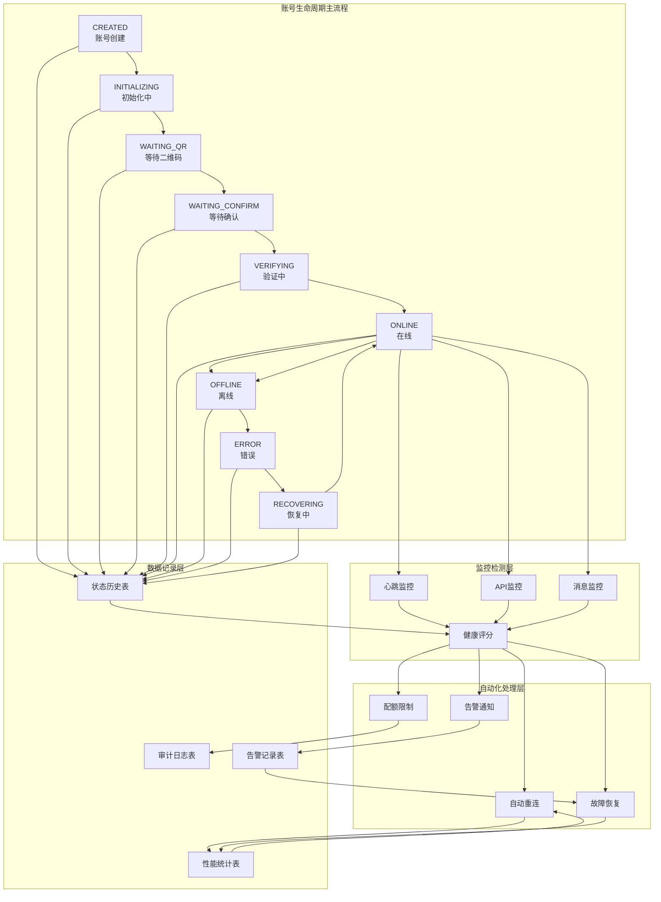
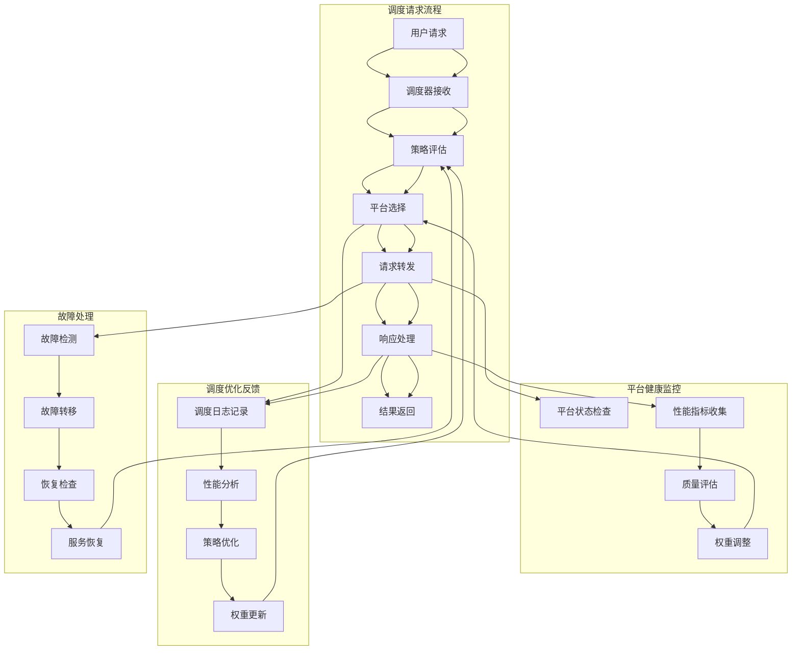
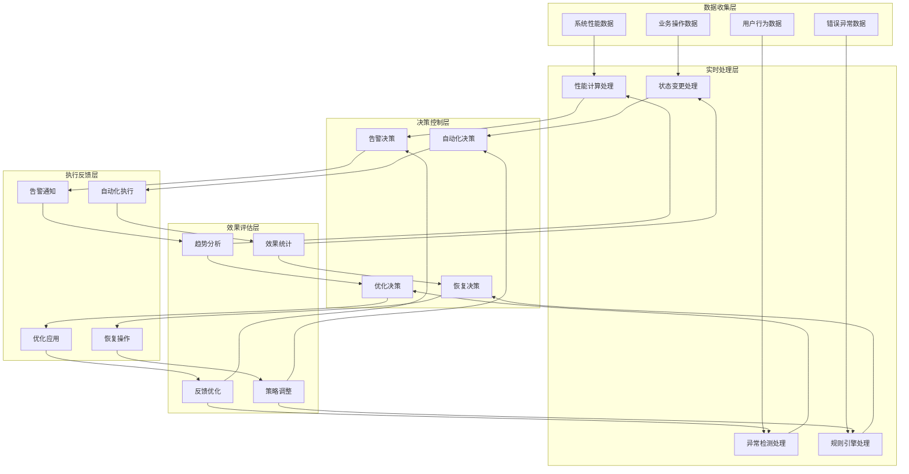

# 生命周期闭环实现逻辑设计

## 📋 概述

本文档详细说明企业级统一数据模型中各个业务模块的生命周期闭环实现逻辑，包括数据流转、触发机制、反馈控制等核心环节。

---

## 🔄 一、企微平台生命周期闭环

### 1.1 企微账号完整生命周期闭环



### 1.2 核心闭环实现逻辑

#### 🎯 **状态驱动闭环**

```java
@Service
public class WeWorkAccountLifecycleService {
    
    /**
     * 状态变更核心方法 - 实现闭环的关键
     */
    @Transactional
    public void changeAccountStatus(String accountId, AccountStatus newStatus, 
                                  StatusChangeReason reason, String operator) {
        
        // 1. 获取当前状态
        WeWorkAccount account = accountRepository.findById(accountId);
        AccountStatus oldStatus = account.getStatus();
        
        // 2. 状态变更合法性检查
        validateStatusTransition(oldStatus, newStatus);
        
        // 3. 计算状态持续时间
        Duration duration = calculateStatusDuration(account);
        
        // 4. 更新账号状态
        account.setStatus(newStatus);
        account.setUpdatedAt(Instant.now());
        accountRepository.save(account);
        
        // 5. 记录状态变更历史 (闭环数据记录)
        StatusHistory history = StatusHistory.builder()
            .accountId(accountId)
            .oldStatus(oldStatus)
            .newStatus(newStatus)
            .changeReason(reason.getDescription())
            .triggerType(reason.getTriggerType())
            .durationSeconds((int)duration.getSeconds())
            .isAbnormalDuration(isAbnormalDuration(oldStatus, duration))
            .operatorId(operator)
            .build();
        statusHistoryRepository.save(history);
        
        // 6. 更新性能统计 (闭环指标更新)
        updatePerformanceMetrics(accountId, oldStatus, newStatus, duration);
        
        // 7. 触发后续处理 (闭环触发机制)
        triggerStatusChangeHandlers(account, oldStatus, newStatus, history);
        
        // 8. 记录统一审计日志
        auditLogService.log(AuditLog.builder()
            .module("wework")
            .action("status_change")
            .targetId(accountId)
            .changeData(Map.of(
                "old_status", oldStatus,
                "new_status", newStatus,
                "duration_seconds", duration.getSeconds(),
                "reason", reason.getDescription()
            ))
            .build());
    }
    
    /**
     * 状态变更后续处理 - 闭环的自动化响应
     */
    private void triggerStatusChangeHandlers(WeWorkAccount account, 
                                           AccountStatus oldStatus, 
                                           AccountStatus newStatus,
                                           StatusHistory history) {
        
        // 1. 自动恢复处理
        if (newStatus == AccountStatus.ERROR) {
            scheduleAutoRecovery(account, history);
        }
        
        // 2. 告警检查
        if (isAlertConditionMet(account, newStatus, history)) {
            createAlert(account, newStatus, history);
        }
        
        // 3. 配额检查
        if (newStatus == AccountStatus.ONLINE) {
            updateTenantUsageStats(account.getTenantId());
        }
        
        // 4. 健康评分更新
        updateHealthScore(account, oldStatus, newStatus, history);
        
        // 5. 监控规则执行
        executeMonitorRules(account, newStatus);
    }
    
    /**
     * 自动恢复调度 - 实现自愈闭环
     */
    private void scheduleAutoRecovery(WeWorkAccount account, StatusHistory history) {
        if (!account.getAutoReconnect()) {
            return;
        }
        
        // 检查重试次数限制
        if (account.getRetryCount() >= account.getMaxRetryCount()) {
            // 创建严重告警
            createCriticalAlert(account, "重试次数超限，需要人工干预");
            return;
        }
        
        // 根据错误类型确定恢复策略
        RecoveryStrategy strategy = determineRecoveryStrategy(account, history);
        
        // 调度自动恢复任务
        autoRecoveryScheduler.schedule(() -> {
            try {
                executeRecovery(account, strategy);
                // 恢复成功 - 闭环完成
                changeAccountStatus(account.getId(), AccountStatus.ONLINE, 
                    StatusChangeReason.AUTO_RECOVERY, "system");
            } catch (Exception e) {
                // 恢复失败 - 增加重试计数
                incrementRetryCount(account);
                // 继续闭环
                scheduleAutoRecovery(account, history);
            }
        }, strategy.getDelaySeconds(), TimeUnit.SECONDS);
    }
}
```

#### 📊 **监控驱动闭环**

```java
@Component
public class WeWorkAccountMonitor {
    
    /**
     * 心跳监控 - 持续健康检查
     */
    @Scheduled(fixedDelay = 30000) // 30秒检查一次
    public void heartbeatMonitor() {
        List<WeWorkAccount> onlineAccounts = accountRepository.findByStatus(AccountStatus.ONLINE);
        
        for (WeWorkAccount account : onlineAccounts) {
            checkAccountHeartbeat(account);
        }
    }
    
    private void checkAccountHeartbeat(WeWorkAccount account) {
        Instant lastHeartbeat = account.getLastHeartbeatTime();
        Duration timeSinceLastHeartbeat = Duration.between(lastHeartbeat, Instant.now());
        
        // 心跳超时检查
        if (timeSinceLastHeartbeat.getSeconds() > account.getMonitorInterval() * 2) {
            // 触发状态变更 - 闭环开始
            lifecycleService.changeAccountStatus(
                account.getId(), 
                AccountStatus.OFFLINE,
                StatusChangeReason.HEARTBEAT_TIMEOUT,
                "system"
            );
            
            // 记录监控事件
            monitorEventService.recordEvent(MonitorEvent.builder()
                .accountId(account.getId())
                .eventType("HEARTBEAT_TIMEOUT")
                .severity("WARNING")
                .details(Map.of(
                    "last_heartbeat", lastHeartbeat,
                    "timeout_seconds", timeSinceLastHeartbeat.getSeconds(),
                    "expected_interval", account.getMonitorInterval()
                ))
                .build());
        }
    }
    
    /**
     * 性能监控 - 质量评估闭环
     */
    @Scheduled(fixedDelay = 300000) // 5分钟统计一次
    public void performanceMonitor() {
        List<WeWorkAccount> accounts = accountRepository.findByStatusIn(
            Arrays.asList(AccountStatus.ONLINE, AccountStatus.OFFLINE));
            
        for (WeWorkAccount account : accounts) {
            updatePerformanceMetrics(account);
        }
    }
    
    private void updatePerformanceMetrics(WeWorkAccount account) {
        // 统计最近1小时的消息数据
        Instant oneHourAgo = Instant.now().minus(1, ChronoUnit.HOURS);
        MessageStats stats = messageRepository.getStatsAfter(account.getId(), oneHourAgo);
        
        // 计算性能指标
        double successRate = stats.getSuccessCount() * 100.0 / stats.getTotalCount();
        double avgResponseTime = stats.getAvgResponseTime();
        
        // 更新账号性能指标
        account.setMessageSuccessRate(BigDecimal.valueOf(successRate));
        account.setAvgMessageResponseTime(BigDecimal.valueOf(avgResponseTime));
        
        // 计算健康评分 - 多维度评估
        int healthScore = calculateHealthScore(account, stats);
        account.setHealthScore(healthScore);
        
        accountRepository.save(account);
        
        // 性能异常检测 - 触发告警闭环
        if (successRate < 90.0 || avgResponseTime > 5000) {
            alertService.createPerformanceAlert(account, stats);
        }
        
        // 记录性能历史数据
        performanceHistoryService.record(PerformanceRecord.builder()
            .accountId(account.getId())
            .timestamp(Instant.now())
            .successRate(successRate)
            .avgResponseTime(avgResponseTime)
            .healthScore(healthScore)
            .messageCount(stats.getTotalCount())
            .build());
    }
}
```

---

## 🤖 二、AI智能体平台生命周期闭环

### 2.1 智能体调度闭环流程



### 2.2 调度闭环核心实现

#### 🎯 **智能调度引擎**

```java
@Service
public class AIAgentDispatchService {
    
    /**
     * 智能调度核心方法 - 实现调度闭环
     */
    public DispatchResult dispatch(DispatchRequest request) {
        String requestId = UUID.randomUUID().toString();
        Instant startTime = Instant.now();
        
        try {
            // 1. 获取调度策略
            SchedulingStrategy strategy = getSchedulingStrategy(request.getAgentId());
            
            // 2. 获取可用平台列表
            List<Platform> availablePlatforms = getAvailablePlatforms(request.getAgentId());
            
            // 3. 平台评分和选择 (闭环的核心决策)
            PlatformSelectionResult selection = selectOptimalPlatform(
                availablePlatforms, strategy, request);
            
            // 4. 执行调度
            DispatchResult result = executeDispatch(selection.getSelectedPlatform(), request);
            
            // 5. 记录调度日志 (闭环数据记录)
            recordDispatchLog(requestId, request, selection, result, startTime);
            
            // 6. 更新平台统计 (闭环反馈)
            updatePlatformStatistics(selection.getSelectedPlatform(), result);
            
            // 7. 触发优化流程 (闭环优化)
            triggerOptimizationIfNeeded(request.getAgentId(), selection, result);
            
            return result;
            
        } catch (Exception e) {
            // 异常处理 - 故障转移闭环
            return handleDispatchFailure(requestId, request, startTime, e);
        }
    }
    
    /**
     * 平台选择算法 - 多维度评分
     */
    private PlatformSelectionResult selectOptimalPlatform(
            List<Platform> platforms, SchedulingStrategy strategy, DispatchRequest request) {
        
        Map<Platform, Double> platformScores = new HashMap<>();
        
        for (Platform platform : platforms) {
            double score = calculatePlatformScore(platform, strategy, request);
            platformScores.put(platform, score);
        }
        
        // 根据策略选择最优平台
        Platform selectedPlatform = selectByStrategy(platformScores, strategy);
        
        // 准备备用平台列表
        List<Platform> fallbackPlatforms = prepareFallbackList(platformScores, selectedPlatform);
        
        return PlatformSelectionResult.builder()
            .selectedPlatform(selectedPlatform)
            .platformScores(platformScores)
            .fallbackPlatforms(fallbackPlatforms)
            .selectionReason(getSelectionReason(selectedPlatform, strategy))
            .build();
    }
    
    /**
     * 平台评分算法 - 多维度评估
     */
    private double calculatePlatformScore(Platform platform, SchedulingStrategy strategy, 
                                        DispatchRequest request) {
        
        // 获取平台最新性能数据
        PlatformMetrics metrics = platformMetricsService.getLatestMetrics(platform.getId());
        
        double score = 0.0;
        
        switch (strategy.getStrategyType()) {
            case RESPONSE_TIME:
                // 响应时间权重 70%，成功率权重 30%
                score = (1000.0 / (metrics.getAvgResponseTime() + 1)) * 0.7 +
                        metrics.getSuccessRate() * 0.3;
                break;
                
            case LEAST_CONNECTIONS:
                // 当前负载权重 80%，成功率权重 20%
                score = (100.0 - metrics.getCurrentLoad()) * 0.8 +
                        metrics.getSuccessRate() * 0.2;
                break;
                
            case COST_OPTIMIZED:
                // 成本效率权重 60%，质量权重 40%
                score = metrics.getCostEfficiency() * 0.6 +
                        metrics.getQualityScore() * 0.4;
                break;
                
            case WEIGHTED:
                // 使用策略中的自定义权重
                Map<String, Double> weights = strategy.getPlatformWeights();
                score = calculateWeightedScore(metrics, weights);
                break;
        }
        
        // 平台优先级调整
        score *= strategy.getPlatformPriorities().getOrDefault(platform.getId(), 1.0);
        
        // 健康状态惩罚
        if (platform.getStatus() != PlatformStatus.ACTIVE) {
            score *= 0.1; // 非活跃平台大幅降低评分
        }
        
        return score;
    }
    
    /**
     * 故障转移处理 - 自动故障恢复闭环
     */
    private DispatchResult handleDispatchFailure(String requestId, DispatchRequest request, 
                                                Instant startTime, Exception originalError) {
        
        // 获取备用平台列表
        SchedulingStrategy strategy = getSchedulingStrategy(request.getAgentId());
        List<Platform> fallbackPlatforms = strategy.getFailoverConfig().getFallbackPlatforms();
        
        for (Platform fallbackPlatform : fallbackPlatforms) {
            try {
                // 尝试备用平台
                DispatchResult result = executeDispatch(fallbackPlatform, request);
                
                // 记录故障转移成功
                recordFailoverSuccess(requestId, request, fallbackPlatform, originalError, startTime);
                
                return result;
                
            } catch (Exception fallbackError) {
                // 记录备用平台也失败
                recordFailoverFailure(requestId, fallbackPlatform, fallbackError);
            }
        }
        
        // 所有平台都失败 - 记录严重故障
        recordCriticalFailure(requestId, request, originalError, startTime);
        
        throw new DispatchFailedException("所有平台调度失败", originalError);
    }
    
    /**
     * 调度优化触发 - 自适应优化闭环
     */
    private void triggerOptimizationIfNeeded(String agentId, PlatformSelectionResult selection, 
                                           DispatchResult result) {
        
        // 检查是否需要优化
        OptimizationTrigger trigger = optimizationAnalyzer.analyze(agentId, selection, result);
        
        if (trigger.shouldOptimize()) {
            // 异步执行优化
            optimizationExecutor.execute(() -> {
                optimizeSchedulingStrategy(agentId, trigger);
            });
        }
    }
    
    /**
     * 调度策略优化 - 机器学习驱动
     */
    private void optimizeSchedulingStrategy(String agentId, OptimizationTrigger trigger) {
        
        // 1. 收集历史调度数据
        List<DispatchLog> historyLogs = dispatchLogRepository
            .findByAgentIdAndCreatedAtAfter(agentId, Instant.now().minus(7, ChronoUnit.DAYS));
        
        // 2. 分析性能模式
        PerformancePattern pattern = performanceAnalyzer.analyze(historyLogs);
        
        // 3. 生成优化建议
        OptimizationSuggestion suggestion = optimizationEngine.generateSuggestion(pattern, trigger);
        
        // 4. 应用优化策略
        if (suggestion.getConfidenceScore() > 0.8) {
            applyOptimization(agentId, suggestion);
            
            // 记录优化操作
            recordOptimizationApplied(agentId, suggestion);
        }
    }
}
```

#### 📈 **平台性能闭环监控**

```java
@Component
public class PlatformPerformanceMonitor {
    
    /**
     * 平台性能持续监控 - 实时性能闭环
     */
    @Scheduled(fixedDelay = 60000) // 1分钟监控一次
    public void monitorPlatformPerformance() {
        List<Platform> activePlatforms = platformRepository.findByStatus(PlatformStatus.ACTIVE);
        
        for (Platform platform : activePlatforms) {
            updatePlatformMetrics(platform);
        }
    }
    
    private void updatePlatformMetrics(Platform platform) {
        Instant now = Instant.now();
        Instant oneMinuteAgo = now.minus(1, ChronoUnit.MINUTES);
        
        // 统计最近1分钟的调用数据
        PlatformCallStats stats = callLogRepository.getStatsByPlatformAndTimeRange(
            platform.getId(), oneMinuteAgo, now);
        
        // 计算实时指标
        double currentSuccessRate = calculateSuccessRate(stats);
        double currentResponseTime = calculateAvgResponseTime(stats);
        double currentLoad = calculateCurrentLoad(stats, platform);
        double currentCostEfficiency = calculateCostEfficiency(stats);
        
        // 更新平台指标
        PlatformMetrics metrics = PlatformMetrics.builder()
            .platformId(platform.getId())
            .successRate(currentSuccessRate)
            .avgResponseTime(currentResponseTime)
            .currentLoad(currentLoad)
            .costEfficiency(currentCostEfficiency)
            .qps(stats.getRequestCount())
            .timestamp(now)
            .build();
        
        platformMetricsRepository.save(metrics);
        
        // 异常检测 - 触发告警闭环
        detectAnomalies(platform, metrics, stats);
        
        // 自动调整 - 平台权重动态优化
        adjustPlatformWeights(platform, metrics);
    }
    
    /**
     * 异常检测 - 自动告警闭环
     */
    private void detectAnomalies(Platform platform, PlatformMetrics currentMetrics, 
                               PlatformCallStats stats) {
        
        // 获取历史基线
        PlatformMetrics baseline = getPerformanceBaseline(platform.getId());
        
        List<PerformanceAnomaly> anomalies = new ArrayList<>();
        
        // 成功率异常检测
        if (currentMetrics.getSuccessRate() < baseline.getSuccessRate() * 0.9) {
            anomalies.add(PerformanceAnomaly.builder()
                .type("SUCCESS_RATE_DROP")
                .severity(getSeverity(currentMetrics.getSuccessRate(), baseline.getSuccessRate()))
                .currentValue(currentMetrics.getSuccessRate())
                .baselineValue(baseline.getSuccessRate())
                .description("平台成功率显著下降")
                .build());
        }
        
        // 响应时间异常检测
        if (currentMetrics.getAvgResponseTime() > baseline.getAvgResponseTime() * 1.5) {
            anomalies.add(PerformanceAnomaly.builder()
                .type("RESPONSE_TIME_HIGH")
                .severity(getSeverity(currentMetrics.getAvgResponseTime(), baseline.getAvgResponseTime()))
                .currentValue(currentMetrics.getAvgResponseTime())
                .baselineValue(baseline.getAvgResponseTime())
                .description("平台响应时间异常升高")
                .build());
        }
        
        // 创建告警
        for (PerformanceAnomaly anomaly : anomalies) {
            createPerformanceAlert(platform, anomaly, currentMetrics);
        }
    }
    
    /**
     * 平台权重动态调整 - 自适应优化闭环
     */
    private void adjustPlatformWeights(Platform platform, PlatformMetrics metrics) {
        
        // 获取该平台相关的所有调度策略
        List<SchedulingStrategy> strategies = strategyRepository.findByPlatformId(platform.getId());
        
        for (SchedulingStrategy strategy : strategies) {
            
            // 计算新的权重
            double currentWeight = strategy.getPlatformWeights().getOrDefault(platform.getId(), 1.0);
            double newWeight = calculateOptimalWeight(platform, metrics, strategy);
            
            // 权重变化超过阈值才更新
            if (Math.abs(newWeight - currentWeight) > 0.1) {
                
                // 更新策略权重
                Map<String, Double> weights = new HashMap<>(strategy.getPlatformWeights());
                weights.put(platform.getId(), newWeight);
                strategy.setPlatformWeights(weights);
                
                strategyRepository.save(strategy);
                
                // 记录权重调整
                recordWeightAdjustment(strategy.getId(), platform.getId(), currentWeight, newWeight, metrics);
            }
        }
    }
}
```

---

## 🔗 三、跨模块统一闭环

### 3.1 统一告警闭环

```java
@Service
public class UnifiedAlertService {
    
    /**
     * 统一告警处理 - 跨模块闭环
     */
    public void processAlert(AlertRequest request) {
        
        // 1. 创建统一告警记录
        UnifiedAlert alert = createUnifiedAlert(request);
        
        // 2. 执行告警规则
        AlertRuleResult ruleResult = executeAlertRules(alert);
        
        // 3. 发送通知
        sendNotifications(alert, ruleResult);
        
        // 4. 触发自动处理
        triggerAutoHandling(alert, ruleResult);
        
        // 5. 更新相关业务状态
        updateBusinessStatus(alert);
        
        // 6. 记录处理结果
        recordAlertProcessing(alert, ruleResult);
    }
    
    /**
     * 自动处理触发 - 跨系统自愈闭环
     */
    private void triggerAutoHandling(UnifiedAlert alert, AlertRuleResult ruleResult) {
        
        if (!ruleResult.isAutoHandlingEnabled()) {
            return;
        }
        
        switch (alert.getSourceModule()) {
            case "wework":
                handleWeWorkAlert(alert, ruleResult);
                break;
                
            case "ai":
                handleAIAlert(alert, ruleResult);
                break;
                
            case "system":
                handleSystemAlert(alert, ruleResult);
                break;
        }
    }
    
    private void handleWeWorkAlert(UnifiedAlert alert, AlertRuleResult ruleResult) {
        
        if (alert.getAlertCategory() == AlertCategory.HEARTBEAT_TIMEOUT) {
            // 触发企微账号自动重连
            weWorkAccountService.triggerAutoReconnect(alert.getSourceId());
            
        } else if (alert.getAlertCategory() == AlertCategory.MESSAGE_FAILURE_RATE) {
            // 暂时降低该账号的消息发送频率
            messageRateLimitService.adjustRateLimit(alert.getSourceId(), 0.5);
            
        } else if (alert.getAlertCategory() == AlertCategory.HEALTH_SCORE_LOW) {
            // 触发深度健康检查
            healthCheckService.performDeepHealthCheck(alert.getSourceId());
        }
    }
    
    private void handleAIAlert(UnifiedAlert alert, AlertRuleResult ruleResult) {
        
        if (alert.getAlertCategory() == AlertCategory.PLATFORM_DOWN) {
            // 从调度策略中暂时移除该平台
            dispatchService.disablePlatform(alert.getSourceId(), Duration.ofMinutes(15));
            
        } else if (alert.getAlertCategory() == AlertCategory.HIGH_ERROR_RATE) {
            // 降低该平台的权重
            strategyService.adjustPlatformWeight(alert.getSourceId(), 0.3);
            
        } else if (alert.getAlertCategory() == AlertCategory.SLOW_RESPONSE) {
            // 触发平台健康检查
            platformHealthService.performHealthCheck(alert.getSourceId());
        }
    }
}
```

### 3.2 统一配额闭环

```java
@Service
public class UnifiedQuotaService {
    
    /**
     * 配额检查和控制 - 实时配额闭环
     */
    public QuotaCheckResult checkAndConsumeQuota(String tenantId, String resourceType, 
                                               int requestAmount, String businessContext) {
        
        // 1. 获取租户配额配置
        TenantQuota quota = getActiveTenantQuota(tenantId);
        
        // 2. 获取当前使用情况
        QuotaUsage currentUsage = getCurrentQuotaUsage(tenantId, resourceType);
        
        // 3. 检查配额限制
        QuotaCheckResult checkResult = performQuotaCheck(quota, currentUsage, requestAmount, resourceType);
        
        if (checkResult.isAllowed()) {
            // 4. 消费配额
            consumeQuota(tenantId, resourceType, requestAmount, businessContext);
            
            // 5. 检查配额告警阈值
            checkQuotaAlertThresholds(tenantId, resourceType, currentUsage, requestAmount);
            
        } else {
            // 6. 记录配额拒绝事件
            recordQuotaRejection(tenantId, resourceType, requestAmount, checkResult);
        }
        
        return checkResult;
    }
    
    /**
     * 配额使用统计更新 - 实时统计闭环
     */
    @EventListener
    public void handleBusinessEvent(BusinessEvent event) {
        
        String tenantId = event.getTenantId();
        
        switch (event.getEventType()) {
            case "wework_message_sent":
                updateQuotaUsage(tenantId, "daily_wework_messages", 1);
                break;
                
            case "ai_conversation_created":
                updateQuotaUsage(tenantId, "daily_ai_conversations", 1);
                break;
                
            case "ai_token_consumed":
                updateQuotaUsage(tenantId, "daily_ai_tokens", event.getTokenCount());
                break;
                
            case "file_uploaded":
                updateQuotaUsage(tenantId, "storage_used_gb", event.getFileSizeGB());
                break;
        }
    }
    
    /**
     * 配额自动调整 - 智能配额闭环
     */
    @Scheduled(cron = "0 0 1 * * ?") // 每天凌晨1点执行
    public void performQuotaOptimization() {
        
        List<String> tenantIds = tenantRepository.findAllActiveTenantIds();
        
        for (String tenantId : tenantIds) {
            optimizeTenantQuota(tenantId);
        }
    }
    
    private void optimizeTenantQuota(String tenantId) {
        
        // 分析过去30天的使用模式
        UsagePattern pattern = usageAnalyzer.analyzeUsagePattern(tenantId, Duration.ofDays(30));
        
        // 生成配额优化建议
        QuotaOptimizationSuggestion suggestion = quotaOptimizer.generateSuggestion(pattern);
        
        if (suggestion.getConfidenceScore() > 0.8) {
            // 自动应用优化建议
            applyQuotaOptimization(tenantId, suggestion);
            
            // 通知租户管理员
            notificationService.sendQuotaOptimizationNotice(tenantId, suggestion);
        }
    }
}
```

---

## 🎯 四、闭环实现的关键机制

### 4.1 事件驱动架构

```java
/**
 * 统一事件总线 - 实现各模块间的闭环联动
 */
@Component
public class UnifiedEventBus {
    
    private final ApplicationEventPublisher eventPublisher;
    
    /**
     * 发布业务事件
     */
    public void publishEvent(String eventType, Object eventData, String tenantId, String sourceModule) {
        
        UnifiedBusinessEvent event = UnifiedBusinessEvent.builder()
            .eventId(UUID.randomUUID().toString())
            .eventType(eventType)
            .eventData(eventData)
            .tenantId(tenantId)
            .sourceModule(sourceModule)
            .timestamp(Instant.now())
            .build();
        
        // 发布事件到Spring事件总线
        eventPublisher.publishEvent(event);
        
        // 同时发布到外部消息队列(如RocketMQ)用于跨服务通信
        messageProducer.sendMessage("business-events", event);
    }
}

/**
 * 跨模块事件监听器
 */
@Component
public class CrossModuleEventListener {
    
    /**
     * 监听企微账号状态变更事件
     */
    @EventListener
    @Async
    public void handleWeWorkAccountStatusChange(WeWorkAccountStatusChangeEvent event) {
        
        // 更新租户使用统计
        quotaService.updateAccountStatusStats(event.getTenantId(), event.getNewStatus());
        
        // 触发相关告警检查
        if (event.getNewStatus() == AccountStatus.ERROR) {
            alertService.checkAccountErrorAlerts(event.getAccountId());
        }
        
        // 记录统一审计日志
        auditLogService.logCrossModuleEvent("wework_account_status_change", event);
    }
    
    /**
     * 监听AI调度性能事件
     */
    @EventListener
    @Async
    public void handleAIDispatchPerformance(AIDispatchPerformanceEvent event) {
        
        // 更新租户AI使用统计
        quotaService.updateAIUsageStats(event.getTenantId(), event.getTokensUsed(), event.getCost());
        
        // 检查性能异常
        if (event.getResponseTime() > 10000) { // 超过10秒
            alertService.createPerformanceAlert(event.getAgentId(), event);
        }
        
        // 触发调度策略优化
        dispatchOptimizer.analyzeAndOptimize(event.getAgentId(), event);
    }
}
```

### 4.2 定时任务协调

```java
/**
 * 统一定时任务调度器 - 协调各模块的周期性任务
 */
@Component
public class UnifiedScheduler {
    
    /**
     * 每分钟执行的实时监控任务
     */
    @Scheduled(fixedDelay = 60000)
    public void realTimeMonitoring() {
        
        // 企微账号健康检查
        weWorkMonitor.performHealthCheck();
        
        // AI平台状态检查
        aiPlatformMonitor.checkPlatformStatus();
        
        // 系统资源监控
        systemResourceMonitor.collectMetrics();
        
        // 配额使用监控
        quotaMonitor.checkUsageThresholds();
    }
    
    /**
     * 每小时执行的性能分析任务
     */
    @Scheduled(cron = "0 0 * * * ?")
    public void hourlyPerformanceAnalysis() {
        
        // 企微账号性能分析
        weWorkAnalyzer.analyzeHourlyPerformance();
        
        // AI调度性能分析
        aiDispatchAnalyzer.analyzeDispatchPerformance();
        
        // 跨模块性能关联分析
        crossModuleAnalyzer.analyzeCrossModulePerformance();
    }
    
    /**
     * 每日执行的优化任务
     */
    @Scheduled(cron = "0 0 2 * * ?") // 每天凌晨2点
    public void dailyOptimization() {
        
        // 清理过期数据
        dataCleanupService.cleanupExpiredData();
        
        // 配额使用统计
        quotaStatisticsService.generateDailyStats();
        
        // 性能趋势分析
        performanceTrendAnalyzer.analyzeDailyTrends();
        
        // 自动优化建议生成
        optimizationEngine.generateDailyOptimizationSuggestions();
    }
}
```

---

## 🏆 五、闭环实现效果总结

### 5.1 企微平台闭环效果

| 闭环类型 | 触发条件 | 自动响应 | 反馈机制 |
|----------|----------|----------|----------|
| **状态监控闭环** | 心跳超时 | 自动重连 | 状态历史记录 |
| **性能监控闭环** | 成功率下降 | 降低发送频率 | 性能统计更新 |
| **健康评分闭环** | 评分过低 | 深度健康检查 | 健康趋势分析 |
| **故障恢复闭环** | 连续错误 | 自动恢复操作 | 恢复成功统计 |

### 5.2 AI智能体闭环效果

| 闭环类型 | 触发条件 | 自动响应 | 反馈机制 |
|----------|----------|----------|----------|
| **调度优化闭环** | 性能异常 | 权重调整 | 调度效果统计 |
| **故障转移闭环** | 平台故障 | 自动切换 | 故障恢复记录 |
| **负载均衡闭环** | 负载不均 | 流量重分配 | 负载分布统计 |
| **质量评估闭环** | 质量下降 | 平台降权 | 质量趋势分析 |

### 5.3 统一管理闭环效果

| 闭环类型 | 触发条件 | 自动响应 | 反馈机制 |
|----------|----------|----------|----------|
| **配额控制闭环** | 使用超限 | 自动限流 | 使用统计分析 |
| **告警处理闭环** | 异常告警 | 自动处理 | 处理效果评估 |
| **审计监控闭环** | 异常操作 | 安全响应 | 安全态势分析 |
| **性能优化闭环** | 性能瓶颈 | 自动调优 | 优化效果验证 |

---

## 📊 六、闭环数据流转图



通过这样的设计，整个系统实现了**真正的生命周期闭环**：

1. **数据驱动** - 所有决策基于实时数据
2. **自动响应** - 异常情况自动处理
3. **持续优化** - 根据反馈不断改进
4. **效果验证** - 处理结果可量化评估
5. **智能学习** - 系统具备自我优化能力

这种闭环设计确保了系统的**高可用性**、**自愈能力**和**持续优化能力**！