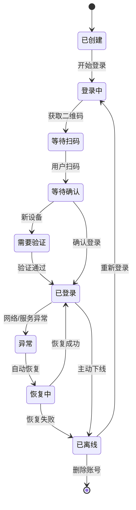
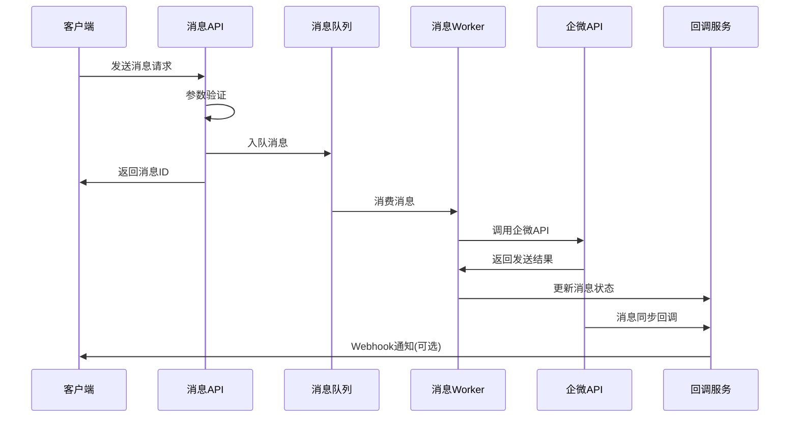

# 🏢 企业微信管理系统设计文档
*生产级企微账号与消息管理平台*

## 📋 目录

1. [系统概述](#系统概述)
2. [系统架构](#系统架构)
3. [核心模块设计](#核心模块设计)
4. [数据模型设计](#数据模型设计)
5. [API设计](#api设计)
6. [监控告警系统](#监控告警系统)
7. [部署架构](#部署架构)
8. [安全设计](#安全设计)
9. [性能优化](#性能优化)

## 🎯 系统概述

### 业务目标
- **企微账号全生命周期管理**：创建、登录、监控、下线
- **高并发消息处理**：支持单日千万级消息发送
- **实时监控告警**：账号状态、消息状态、系统健康度
- **多租户隔离**：支持多个业务方独立使用

### 核心特性
- 🔄 **自动化管理**：账号自动登录、异常自愈
- 📊 **实时监控**：全链路监控和可视化
- 🚀 **高可用设计**：服务无单点故障
- 🔒 **安全可靠**：数据加密、权限控制
- 📈 **弹性扩展**：支持水平扩展

## 🏗️ 系统架构

### 整体架构图
*(已在上方展示)*

### 架构分层说明

#### 1. 前端层
- **Web管理界面**：账号管理、消息发送、监控查看
- **API客户端**：第三方系统集成接口
- **监控面板**：实时监控数据展示

#### 2. API网关层
- **API网关**：统一入口、路由分发
- **认证中心**：JWT认证、权限控制
- **限流控制**：防刷、限流、熔断

#### 3. 业务服务层
- **账号管理服务**：企微账号CRUD、状态管理
- **消息服务**：消息发送、模板管理、队列处理
- **监控服务**：指标收集、告警处理
- **回调处理服务**：企微回调统一处理
- **调度服务**：定时任务、批量操作

#### 4. 数据存储层
- **MySQL**：业务主数据
- **Redis**：缓存、会话、消息队列
- **InfluxDB**：时序监控数据
- **文件存储**：日志、文件、图片

#### 5. 基础设施层
- **消息队列**：异步处理、削峰填谷
- **日志中心**：统一日志收集分析
- **告警系统**：多渠道告警通知
- **配置中心**：统一配置管理

## 🧩 核心模块设计

### 1. 账号管理服务 (Account Service)

#### 功能职责
```yaml
账号生命周期管理:
  - 账号注册与配置
  - 自动登录管理
  - 状态监控与恢复
  - 账号下线与清理

核心接口:
  - POST /accounts              # 创建账号
  - GET /accounts/{id}          # 获取账号详情
  - PUT /accounts/{id}/login    # 登录账号
  - PUT /accounts/{id}/logout   # 登出账号
  - GET /accounts/{id}/status   # 获取状态
  - DELETE /accounts/{id}       # 删除账号
```

#### 状态机设计


#### 核心逻辑实现
```python
class AccountService:
    async def create_account(self, account_data: AccountCreateDTO) -> Account:
        """创建企微账号"""
        # 1. 数据验证
        # 2. 创建实例
        # 3. 初始化配置
        # 4. 保存数据库
        # 5. 发送创建事件
        
    async def login_account(self, account_id: str) -> LoginResult:
        """账号登录流程"""
        # 1. 检查账号状态
        # 2. 创建企微实例
        # 3. 设置回调地址
        # 4. 获取登录二维码
        # 5. 启动状态监控
        
    async def monitor_account_status(self, account_id: str):
        """账号状态监控"""
        # 1. 定时检查实例状态
        # 2. 检测异常自动恢复
        # 3. 记录状态变更日志
        # 4. 触发告警通知
```

### 2. 消息服务 (Message Service)

#### 功能职责
```yaml
消息发送管理:
  - 单条/批量消息发送
  - 消息模板管理
  - 发送队列管理
  - 发送结果跟踪

消息类型支持:
  - 文本消息
  - 图片消息
  - 文件消息
  - 群@消息
  - 小程序卡片
```

#### 消息发送流程


#### 核心数据结构
```python
@dataclass
class MessageRequest:
    """消息发送请求"""
    account_id: str          # 发送账号ID
    conversation_id: str     # 会话ID
    message_type: str        # 消息类型
    content: dict           # 消息内容
    send_time: datetime     # 发送时间(可选)
    callback_url: str       # 回调地址(可选)
    
@dataclass 
class MessageRecord:
    """消息记录"""
    message_id: str         # 消息ID
    request: MessageRequest # 原始请求
    status: str            # 发送状态
    wework_msg_id: str     # 企微消息ID
    send_time: datetime    # 实际发送时间
    callback_time: datetime # 回调时间
    error_msg: str         # 错误信息
```

### 3. 监控服务 (Monitor Service)

#### 监控指标体系
```yaml
系统级指标:
  - 服务可用性 (SLA)
  - 响应时间 (RT)
  - 错误率 (Error Rate)
  - 并发量 (QPS/TPS)

业务级指标:
  - 账号在线率
  - 消息发送成功率
  - 消息发送延迟
  - 回调接收及时性

告警规则:
  - 账号离线 > 5分钟
  - 消息失败率 > 1%
  - 系统响应时间 > 2s
  - 队列积压 > 1000条
```

#### 监控架构
```python
class MonitorService:
    async def collect_metrics(self):
        """指标收集"""
        # 1. 系统性能指标
        # 2. 业务状态指标  
        # 3. 自定义指标
        # 4. 存储到InfluxDB
        
    async def check_alerts(self):
        """告警检查"""
        # 1. 读取告警规则
        # 2. 检查指标阈值
        # 3. 触发告警通知
        # 4. 记录告警历史
        
    async def generate_reports(self):
        """报表生成"""
        # 1. 日报/周报/月报
        # 2. 趋势分析
        # 3. 异常统计
        # 4. 性能分析
```

### 4. 回调处理服务 (Callback Service)

#### 回调类型处理
```python
class CallbackHandler:
    """回调处理器基类"""
    
    @abstractmethod
    async def handle(self, callback_data: dict) -> bool:
        pass

class QRCodeCallbackHandler(CallbackHandler):
    """二维码状态回调处理器"""
    async def handle(self, data: dict) -> bool:
        # 更新账号登录状态
        # 保存二维码状态历史
        # 通知前端更新
        
class MessageSyncCallbackHandler(CallbackHandler):
    """消息同步回调处理器"""  
    async def handle(self, data: dict) -> bool:
        # 更新消息发送状态
        # 记录消息收发日志
        # 触发业务回调
        
class LoginCallbackHandler(CallbackHandler):
    """登录状态回调处理器"""
    async def handle(self, data: dict) -> bool:
        # 更新账号在线状态
        # 获取账号基本信息
        # 启动定时监控任务
```

## 🗄️ 数据模型设计

### 核心表结构

#### 1. 账号管理表
```sql
-- 企微账号表
CREATE TABLE wework_accounts (
    id VARCHAR(36) PRIMARY KEY,
    tenant_id VARCHAR(36) NOT NULL,        -- 租户ID
    account_name VARCHAR(100) NOT NULL,    -- 账号名称
    guid VARCHAR(100) UNIQUE,              -- 企微实例GUID
    phone VARCHAR(20),                     -- 绑定手机号
    status ENUM('created', 'logging', 'online', 'offline', 'error') NOT NULL,
    config JSON,                           -- 账号配置
    last_login_time TIMESTAMP,            -- 最后登录时间
    last_heartbeat_time TIMESTAMP,        -- 最后心跳时间
    created_at TIMESTAMP DEFAULT CURRENT_TIMESTAMP,
    updated_at TIMESTAMP DEFAULT CURRENT_TIMESTAMP ON UPDATE CURRENT_TIMESTAMP,
    INDEX idx_tenant_status (tenant_id, status),
    INDEX idx_guid (guid),
    INDEX idx_status_heartbeat (status, last_heartbeat_time)
);

-- 账号状态历史表
CREATE TABLE account_status_history (
    id BIGINT AUTO_INCREMENT PRIMARY KEY,
    account_id VARCHAR(36) NOT NULL,
    old_status VARCHAR(20),
    new_status VARCHAR(20) NOT NULL,
    reason VARCHAR(500),
    extra_data JSON,
    created_at TIMESTAMP DEFAULT CURRENT_TIMESTAMP,
    INDEX idx_account_time (account_id, created_at)
);
```

#### 2. 消息管理表
```sql
-- 消息记录表
CREATE TABLE message_records (
    id VARCHAR(36) PRIMARY KEY,
    tenant_id VARCHAR(36) NOT NULL,
    account_id VARCHAR(36) NOT NULL,
    conversation_id VARCHAR(100) NOT NULL,
    message_type ENUM('text', 'image', 'file', 'at', 'miniprogram') NOT NULL,
    content JSON NOT NULL,
    status ENUM('pending', 'sending', 'sent', 'delivered', 'failed') NOT NULL,
    wework_msg_id VARCHAR(100),
    error_msg TEXT,
    send_time TIMESTAMP,
    callback_time TIMESTAMP,
    created_at TIMESTAMP DEFAULT CURRENT_TIMESTAMP,
    updated_at TIMESTAMP DEFAULT CURRENT_TIMESTAMP ON UPDATE CURRENT_TIMESTAMP,
    INDEX idx_tenant_account (tenant_id, account_id),
    INDEX idx_status_time (status, created_at),
    INDEX idx_conversation (conversation_id, created_at)
);

-- 消息模板表
CREATE TABLE message_templates (
    id VARCHAR(36) PRIMARY KEY,
    tenant_id VARCHAR(36) NOT NULL,
    template_name VARCHAR(100) NOT NULL,
    template_type VARCHAR(50) NOT NULL,
    template_content JSON NOT NULL,
    variables JSON,
    is_active BOOLEAN DEFAULT TRUE,
    created_at TIMESTAMP DEFAULT CURRENT_TIMESTAMP,
    UNIQUE KEY uk_tenant_name (tenant_id, template_name)
);
```

#### 3. 会话管理表
```sql
-- 会话信息表
CREATE TABLE conversations (
    id VARCHAR(36) PRIMARY KEY,
    account_id VARCHAR(36) NOT NULL,
    conversation_id VARCHAR(100) NOT NULL,
    conversation_name VARCHAR(200),
    conversation_type ENUM('private', 'group') NOT NULL,
    member_count INT DEFAULT 0,
    last_msg_time TIMESTAMP,
    is_active BOOLEAN DEFAULT TRUE,
    extra_info JSON,
    created_at TIMESTAMP DEFAULT CURRENT_TIMESTAMP,
    updated_at TIMESTAMP DEFAULT CURRENT_TIMESTAMP ON UPDATE CURRENT_TIMESTAMP,
    UNIQUE KEY uk_account_conversation (account_id, conversation_id),
    INDEX idx_account_type (account_id, conversation_type)
);
```

#### 4. 租户管理表
```sql
-- 租户表
CREATE TABLE tenants (
    id VARCHAR(36) PRIMARY KEY,
    tenant_name VARCHAR(100) NOT NULL,
    tenant_code VARCHAR(50) UNIQUE NOT NULL,
    max_accounts INT DEFAULT 10,
    max_daily_messages INT DEFAULT 10000,
    webhook_url VARCHAR(500),
    config JSON,
    status ENUM('active', 'suspended', 'deleted') DEFAULT 'active',
    created_at TIMESTAMP DEFAULT CURRENT_TIMESTAMP,
    updated_at TIMESTAMP DEFAULT CURRENT_TIMESTAMP ON UPDATE CURRENT_TIMESTAMP
);

-- 租户配额使用记录
CREATE TABLE tenant_usage (
    id BIGINT AUTO_INCREMENT PRIMARY KEY,
    tenant_id VARCHAR(36) NOT NULL,
    usage_date DATE NOT NULL,
    account_count INT DEFAULT 0,
    message_count INT DEFAULT 0,
    created_at TIMESTAMP DEFAULT CURRENT_TIMESTAMP,
    UNIQUE KEY uk_tenant_date (tenant_id, usage_date)
);
```

## 🔌 API设计

### 1. 账号管理API

```yaml
# 创建账号
POST /api/v1/accounts
Request:
  tenant_id: string
  account_name: string
  phone: string (optional)
  config: object (optional)
Response:
  account_id: string
  status: string
  
# 获取账号列表
GET /api/v1/accounts?tenant_id={}&status={}&page={}&size={}
Response:
  accounts: array
  total: number
  page: number
  size: number

# 账号登录
PUT /api/v1/accounts/{account_id}/login
Response:
  qrcode_url: string
  login_token: string
  
# 获取账号状态  
GET /api/v1/accounts/{account_id}/status
Response:
  account_id: string
  status: string
  last_heartbeat: timestamp
  online_duration: number
```

### 2. 消息发送API

```yaml
# 发送单条消息
POST /api/v1/messages/send
Request:
  account_id: string
  conversation_id: string
  message_type: string
  content: object
  send_time: timestamp (optional)
Response:
  message_id: string
  status: string
  
# 批量发送消息
POST /api/v1/messages/batch-send
Request:
  account_id: string
  messages: array
Response:
  batch_id: string
  total_count: number
  success_count: number
  
# 获取消息状态
GET /api/v1/messages/{message_id}/status
Response:
  message_id: string
  status: string
  send_time: timestamp
  error_msg: string (optional)

# 获取会话列表
GET /api/v1/accounts/{account_id}/conversations
Response:
  conversations: array
  total: number
```

### 3. 监控API

```yaml
# 获取账号监控数据
GET /api/v1/monitor/accounts/{account_id}/metrics?start_time={}&end_time={}
Response:
  metrics: array
  
# 获取消息发送统计
GET /api/v1/monitor/messages/stats?tenant_id={}&start_time={}&end_time={}
Response:
  total_count: number
  success_count: number
  success_rate: number
  avg_response_time: number
  
# 获取系统健康状态
GET /api/v1/monitor/health
Response:
  status: string
  services: array
  uptime: number
```

## 📊 监控告警系统

### 监控指标体系

#### 1. 基础设施监控
```yaml
服务器资源:
  - CPU使用率 < 80%
  - 内存使用率 < 85%
  - 磁盘使用率 < 90%
  - 网络连接数 < 1000

数据库监控:
  - 连接池使用率 < 80%
  - 慢查询 < 2s
  - 死锁检测
  - 主从延迟 < 1s

缓存监控:
  - Redis内存使用率 < 80%
  - 缓存命中率 > 95%
  - 连接数监控
```

#### 2. 应用层监控
```yaml
API性能:
  - 响应时间 P99 < 2s
  - 错误率 < 1%
  - QPS监控
  - 接口可用性 > 99.9%

队列监控:
  - 队列长度 < 1000
  - 消费延迟 < 30s
  - 死信队列监控
  - 消费者健康状态
```

#### 3. 业务监控
```yaml
账号监控:
  - 账号在线率 > 95%
  - 登录成功率 > 98%
  - 异常恢复时间 < 5min

消息监控:
  - 消息发送成功率 > 99%
  - 消息发送延迟 < 10s
  - 回调接收率 > 95%
  - 队列积压监控
```

### 告警配置

#### 告警规则引擎
```python
class AlertRule:
    def __init__(self, name: str, metric: str, operator: str, 
                 threshold: float, duration: int):
        self.name = name
        self.metric = metric
        self.operator = operator  # >, <, >=, <=, ==
        self.threshold = threshold
        self.duration = duration  # 持续时间(秒)
        
# 告警规则配置
alert_rules = [
    AlertRule("账号离线告警", "account.offline_duration", ">", 300, 60),
    AlertRule("消息失败率告警", "message.failure_rate", ">", 0.01, 120),
    AlertRule("API响应时间告警", "api.response_time", ">", 2000, 180),
    AlertRule("队列积压告警", "queue.pending_count", ">", 1000, 60),
]
```

#### 告警通知渠道
```yaml
通知方式:
  - 企微群消息
  - 邮件通知
  - 短信告警
  - 钉钉机器人
  - Webhook推送

告警级别:
  - Critical: 立即通知所有渠道
  - Warning: 企微+邮件
  - Info: 仅企微群消息

告警抑制:
  - 相同告警5分钟内不重复
  - 批量告警合并发送
  - 静默时间段配置
```

## 🚀 部署架构

### 1. 微服务部署架构

```yaml
服务拆分:
  gateway-service:
    instances: 2
    resources: "1C2G"
    
  account-service:
    instances: 3
    resources: "2C4G"
    
  message-service:
    instances: 5  # 消息处理压力大
    resources: "2C4G"
    
  monitor-service:
    instances: 2
    resources: "1C2G"
    
  callback-service:
    instances: 3
    resources: "2C4G"

数据库:
  mysql-master: "4C8G"
  mysql-slave: "4C8G"  
  redis-cluster: 3节点 "2C4G"
  influxdb: "2C4G"

消息队列:
  rabbitmq-cluster: 3节点 "2C4G"
```

### 2. 容器化部署

#### Docker Compose示例
```yaml
version: '3.8'
services:
  # API网关
  gateway:
    image: wework-gateway:latest
    ports:
      - "80:8080"
    environment:
      - SPRING_PROFILES_ACTIVE=prod
    depends_on:
      - redis
      - mysql

  # 账号管理服务
  account-service:
    image: wework-account:latest
    environment:
      - SPRING_PROFILES_ACTIVE=prod
    depends_on:
      - mysql
      - redis
    deploy:
      replicas: 3

  # 消息服务
  message-service:
    image: wework-message:latest
    environment:
      - SPRING_PROFILES_ACTIVE=prod
    depends_on:
      - mysql
      - redis
      - rabbitmq
    deploy:
      replicas: 5

  # 数据库
  mysql:
    image: mysql:8.0
    environment:
      MYSQL_ROOT_PASSWORD: ${MYSQL_PASSWORD}
    volumes:
      - mysql_data:/var/lib/mysql

  # 缓存
  redis:
    image: redis:7
    volumes:
      - redis_data:/data

  # 消息队列
  rabbitmq:
    image: rabbitmq:3-management
    environment:
      RABBITMQ_DEFAULT_USER: ${RABBITMQ_USER}
      RABBITMQ_DEFAULT_PASS: ${RABBITMQ_PASS}

volumes:
  mysql_data:
  redis_data:
```

### 3. Kubernetes部署

#### 服务部署示例
```yaml
apiVersion: apps/v1
kind: Deployment
metadata:
  name: account-service
spec:
  replicas: 3
  selector:
    matchLabels:
      app: account-service
  template:
    metadata:
      labels:
        app: account-service
    spec:
      containers:
      - name: account-service
        image: wework-account:latest
        ports:
        - containerPort: 8080
        env:
        - name: SPRING_PROFILES_ACTIVE
          value: "k8s"
        resources:
          requests:
            memory: "2Gi"
            cpu: "1000m"
          limits:
            memory: "4Gi"
            cpu: "2000m"
        livenessProbe:
          httpGet:
            path: /actuator/health
            port: 8080
          initialDelaySeconds: 60
          periodSeconds: 30
        readinessProbe:
          httpGet:
            path: /actuator/health
            port: 8080
          initialDelaySeconds: 30
          periodSeconds: 10
---
apiVersion: v1
kind: Service
metadata:
  name: account-service
spec:
  selector:
    app: account-service
  ports:
  - port: 8080
    targetPort: 8080
  type: ClusterIP
```

## 🔒 安全设计

### 1. 认证授权
```yaml
JWT认证:
  - Token有效期: 2小时
  - Refresh Token: 7天
  - 支持Token刷新机制
  
权限控制:
  - RBAC模型
  - 租户隔离
  - 接口级别权限控制
  - 数据级别权限控制

API安全:
  - HTTPS强制
  - 请求签名验证
  - 限流防刷
  - SQL注入防护
```

### 2. 数据安全
```yaml
数据加密:
  - 数据库连接SSL
  - 敏感字段AES加密
  - 密码BCrypt哈希
  - 传输层TLS1.3

审计日志:
  - 操作日志记录
  - 敏感操作审计
  - 登录日志跟踪
  - 数据变更记录
```

## ⚡ 性能优化

### 1. 缓存策略
```yaml
多级缓存:
  - L1: 本地缓存 (Caffeine)
  - L2: Redis分布式缓存
  - L3: CDN静态资源缓存

缓存场景:
  - 账号基本信息: 1小时
  - 会话列表: 30分钟  
  - 消息模板: 24小时
  - 配置信息: 1小时

缓存更新:
  - 写入时更新
  - 定时刷新
  - 事件驱动更新
```

### 2. 数据库优化
```yaml
读写分离:
  - 主库: 写操作
  - 从库: 读操作
  - 读写路由自动切换

分库分表:
  - 消息记录按月分表
  - 账号按租户ID分片
  - 状态历史按账号ID分片

索引优化:
  - 联合索引覆盖查询
  - 定期分析慢查询
  - 索引使用率监控
```

### 3. 异步处理
```yaml
消息队列:
  - 消息发送异步化
  - 回调处理异步化
  - 监控数据异步写入

批处理:
  - 批量消息发送
  - 批量状态更新
  - 批量日志写入

任务调度:
  - 账号状态检查
  - 数据清理任务
  - 报表生成任务
```

## 📈 扩容方案

### 1. 水平扩展
- **无状态服务**：支持任意扩容
- **数据库分片**：按业务维度分片
- **消息队列集群**：增加节点提升吞吐
- **缓存集群**：Redis Cluster模式

### 2. 垂直扩展
- **资源升级**：CPU、内存按需升级
- **存储扩容**：磁盘空间动态扩展
- **网络带宽**：根据流量调整

### 3. 多机房部署
- **异地多活**：多机房部署
- **数据同步**：主从复制+读写分离
- **故障切换**：自动故障转移
- **负载均衡**：跨机房流量分发

---

## 📋 实施计划

### Phase 1: 核心功能开发 (4周)
- [ ] 账号管理服务基础功能
- [ ] 消息发送核心功能  
- [ ] 基础监控告警
- [ ] 数据库表结构设计

### Phase 2: 完善功能 (4周)
- [ ] 回调处理完善
- [ ] 消息模板系统
- [ ] 监控面板开发
- [ ] API网关集成

### Phase 3: 生产部署 (2周)
- [ ] 容器化部署
- [ ] 压力测试
- [ ] 安全加固
- [ ] 上线部署

### Phase 4: 优化迭代 (持续)
- [ ] 性能优化
- [ ] 功能增强
- [ ] 运维自动化
- [ ] 用户体验优化

这套系统设计涵盖了企微管理的完整生命周期，支持大规模生产环境使用。您觉得哪个部分需要进一步细化或调整？ 