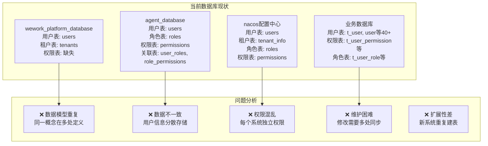
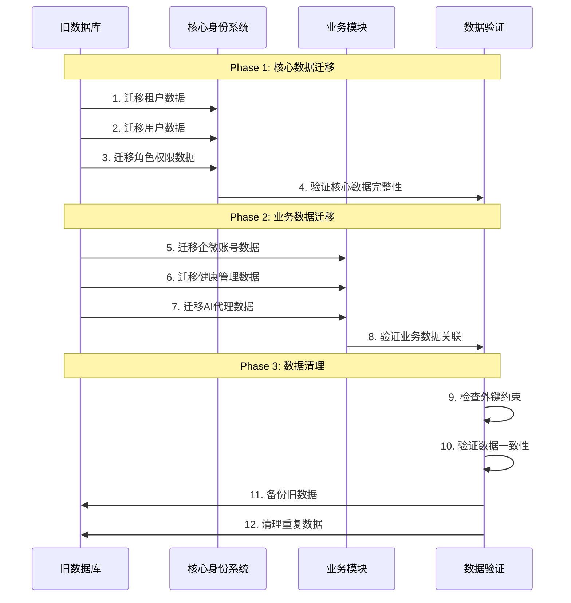
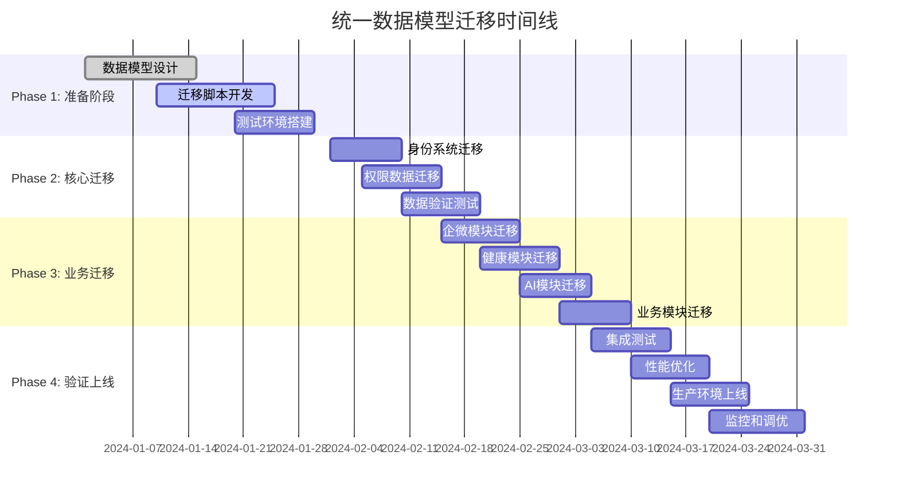

# 统一多租户SaaS数据模型设计

## 📋 文档概述

基于当前项目中存在的大量重复租户、用户、权限管理表结构问题，本文档设计了一套统一的多租户SaaS数据模型，消除数据冗余，建立清晰的数据架构边界。

---

## 🎯 一、现状问题分析

### 1.1 重复表结构统计



### 1.2 核心问题清单

| 问题类型 | 具体表现 | 影响范围 |
|----------|----------|----------|
| **数据重复** | users表在4个数据库中重复定义 | 所有系统 |
| **模型不统一** | 用户ID有string、bigint等多种类型 | 跨系统集成 |
| **权限分散** | 每个系统独立的权限体系 | 权限管理 |
| **租户概念混乱** | tenant_id字段缺失或不统一 | 多租户隔离 |
| **资源管理缺失** | 无统一的配额和计费模型 | 商业化运营 |

---

## 🏗️ 二、统一数据模型架构

### 2.1 整体架构设计

```mermaid
graph TB
    subgraph "核心身份管理系统 (CORE_IDENTITY)"
        A1[租户管理<br/>saas_tenants]
        A2[用户管理<br/>saas_users]
        A3[角色管理<br/>saas_roles]
        A4[权限管理<br/>saas_permissions]
        A5[用户角色关联<br/>saas_user_roles]
        A6[角色权限关联<br/>saas_role_permissions]
        A7[资源配额<br/>saas_tenant_quotas]
        A8[使用统计<br/>saas_usage_statistics]
    end
    
    subgraph "企微平台模块 (WEWORK_MODULE)"
        B1[企微账号<br/>wework_accounts]
        B2[消息记录<br/>wework_messages]
        B3[回调配置<br/>wework_callbacks]
        B4[联系人管理<br/>wework_contacts]
    end
    
    subgraph "健康管理模块 (HEALTH_MODULE)"
        C1[患者信息<br/>health_patients]
        C2[健康数据<br/>health_records]
        C3[医生信息<br/>health_doctors]
        C4[医疗团队<br/>health_teams]
        C5[诊疗记录<br/>health_consultations]
    end
    
    subgraph "AI代理模块 (AGENT_MODULE)"
        D1[智能体配置<br/>ai_agents]
        D2[对话记录<br/>ai_conversations]
        D3[知识库<br/>ai_knowledge_base]
        D4[模型配置<br/>ai_models]
        D5[训练数据<br/>ai_training_data]
    end
    
    subgraph "业务运营模块 (BUSINESS_MODULE)"
        E1[订单管理<br/>biz_orders]
        E2[产品管理<br/>biz_products]
        E3[营销活动<br/>biz_campaigns]
        E4[客户管理<br/>biz_customers]
        E5[财务管理<br/>biz_finance]
    end
    
    A1 --> B1
    A1 --> C1
    A1 --> D1
    A1 --> E1
    
    A2 --> B2
    A2 --> C2
    A2 --> D2
    A2 --> E2
    
    A3 --> A6
    A4 --> A6
    A5 --> A2
    A5 --> A3
```



### 2.2 架构设计原则

#### 🎯 核心原则
1. **单一数据源**：每个实体只在一个地方定义
2. **租户隔离**：所有业务表都包含tenant_id字段
3. **权限统一**：基于RBAC的统一权限模型
4. **模块分离**：业务模块通过外键关联核心系统
5. **可扩展性**：新业务模块可快速接入

#### 🔗 关联策略
- **强关联**：核心身份数据通过外键约束
- **弱关联**：业务数据通过逻辑关联，避免跨库事务
- **缓存策略**：高频访问的权限数据本地缓存

---

## 📊 三、核心身份管理系统设计

### 3.1 租户管理表

```sql
-- =====================================================
-- 核心身份管理系统 - 租户管理
-- =====================================================

-- 租户主表
CREATE TABLE saas_tenants (
    id VARCHAR(36) PRIMARY KEY COMMENT '租户ID - UUID格式',
    tenant_code VARCHAR(50) UNIQUE NOT NULL COMMENT '租户编码 - 全局唯一',
    tenant_name VARCHAR(100) NOT NULL COMMENT '租户名称',
    tenant_type ENUM('enterprise', 'individual', 'trial') DEFAULT 'enterprise' COMMENT '租户类型',
    
    -- 联系信息
    contact_name VARCHAR(50) COMMENT '联系人姓名',
    contact_email VARCHAR(100) COMMENT '联系人邮箱',
    contact_phone VARCHAR(20) COMMENT '联系人电话',
    
    -- 业务信息
    industry VARCHAR(50) COMMENT '所属行业',
    company_size ENUM('startup', 'small', 'medium', 'large', 'enterprise') COMMENT '公司规模',
    region VARCHAR(50) COMMENT '所在地区',
    
    -- 状态管理
    status ENUM('active', 'suspended', 'expired', 'deleted') DEFAULT 'active' COMMENT '租户状态',
    subscription_plan VARCHAR(50) DEFAULT 'basic' COMMENT '订阅计划',
    subscription_start_date DATE COMMENT '订阅开始日期',
    subscription_end_date DATE COMMENT '订阅结束日期',
    
    -- 配置信息
    tenant_config JSON COMMENT '租户配置信息',
    custom_domain VARCHAR(100) COMMENT '自定义域名',
    logo_url VARCHAR(500) COMMENT '租户Logo URL',
    theme_config JSON COMMENT '主题配置',
    
    -- 审计字段
    created_at TIMESTAMP DEFAULT CURRENT_TIMESTAMP COMMENT '创建时间',
    updated_at TIMESTAMP DEFAULT CURRENT_TIMESTAMP ON UPDATE CURRENT_TIMESTAMP COMMENT '更新时间',
    created_by VARCHAR(36) COMMENT '创建人ID',
    updated_by VARCHAR(36) COMMENT '更新人ID',
    
    -- 索引
    INDEX idx_tenant_code (tenant_code),
    INDEX idx_status (status),
    INDEX idx_subscription_plan (subscription_plan),
    INDEX idx_created_at (created_at)
) ENGINE=InnoDB DEFAULT CHARSET=utf8mb4 COLLATE=utf8mb4_unicode_ci COMMENT='SaaS租户主表';

-- 租户配额表
CREATE TABLE saas_tenant_quotas (
    id VARCHAR(36) PRIMARY KEY COMMENT '配额ID',
    tenant_id VARCHAR(36) NOT NULL COMMENT '租户ID',
    
    -- 基础配额
    max_users INT DEFAULT 10 COMMENT '最大用户数',
    max_storage_gb DECIMAL(10,2) DEFAULT 10.00 COMMENT '最大存储空间(GB)',
    max_api_calls_per_day BIGINT DEFAULT 10000 COMMENT '每日最大API调用次数',
    max_api_calls_per_hour BIGINT DEFAULT 1000 COMMENT '每小时最大API调用次数',
    
    -- 业务配额
    max_wework_accounts INT DEFAULT 5 COMMENT '最大企微账号数',
    max_daily_messages BIGINT DEFAULT 1000 COMMENT '每日最大消息数',
    max_health_patients INT DEFAULT 100 COMMENT '最大患者数',
    max_ai_agents INT DEFAULT 3 COMMENT '最大AI智能体数',
    max_ai_conversations_per_day BIGINT DEFAULT 100 COMMENT '每日最大AI对话数',
    
    -- 功能权限
    enable_wework_integration BOOLEAN DEFAULT TRUE COMMENT '是否启用企微集成',
    enable_health_module BOOLEAN DEFAULT FALSE COMMENT '是否启用健康模块',
    enable_ai_module BOOLEAN DEFAULT FALSE COMMENT '是否启用AI模块',
    enable_business_module BOOLEAN DEFAULT FALSE COMMENT '是否启用业务模块',
    enable_advanced_analytics BOOLEAN DEFAULT FALSE COMMENT '是否启用高级分析',
    enable_api_access BOOLEAN DEFAULT TRUE COMMENT '是否启用API访问',
    enable_webhook BOOLEAN DEFAULT TRUE COMMENT '是否启用Webhook',
    
    -- 有效期
    effective_from DATE NOT NULL COMMENT '生效开始日期',
    effective_to DATE COMMENT '生效结束日期',
    
    created_at TIMESTAMP DEFAULT CURRENT_TIMESTAMP COMMENT '创建时间',
    updated_at TIMESTAMP DEFAULT CURRENT_TIMESTAMP ON UPDATE CURRENT_TIMESTAMP COMMENT '更新时间',
    
    UNIQUE KEY uk_tenant_quota (tenant_id),
    FOREIGN KEY (tenant_id) REFERENCES saas_tenants(id) ON DELETE CASCADE,
    INDEX idx_effective_period (effective_from, effective_to)
) ENGINE=InnoDB DEFAULT CHARSET=utf8mb4 COLLATE=utf8mb4_unicode_ci COMMENT='租户配额管理表';
```

### 3.2 用户权限管理表

```sql
-- 用户主表
CREATE TABLE saas_users (
    id VARCHAR(36) PRIMARY KEY COMMENT '用户ID - UUID格式',
    tenant_id VARCHAR(36) NOT NULL COMMENT '租户ID',
    
    -- 基本信息
    username VARCHAR(50) NOT NULL COMMENT '用户名 - 租户内唯一',
    email VARCHAR(100) COMMENT '邮箱地址',
    phone VARCHAR(20) COMMENT '手机号码',
    password_hash VARCHAR(255) NOT NULL COMMENT '密码哈希',
    
    -- 个人信息
    real_name VARCHAR(50) COMMENT '真实姓名',
    display_name VARCHAR(50) COMMENT '显示名称',
    avatar_url VARCHAR(500) COMMENT '头像URL',
    gender ENUM('male', 'female', 'other') COMMENT '性别',
    birth_date DATE COMMENT '出生日期',
    
    -- 状态管理
    status ENUM('active', 'inactive', 'locked', 'deleted') DEFAULT 'active' COMMENT '用户状态',
    is_super_admin BOOLEAN DEFAULT FALSE COMMENT '是否超级管理员',
    is_tenant_admin BOOLEAN DEFAULT FALSE COMMENT '是否租户管理员',
    email_verified BOOLEAN DEFAULT FALSE COMMENT '邮箱是否已验证',
    phone_verified BOOLEAN DEFAULT FALSE COMMENT '手机是否已验证',
    
    -- 登录信息
    last_login_at TIMESTAMP NULL COMMENT '最后登录时间',
    last_login_ip VARCHAR(45) COMMENT '最后登录IP',
    login_failure_count INT DEFAULT 0 COMMENT '登录失败次数',
    locked_until TIMESTAMP NULL COMMENT '锁定到期时间',
    password_changed_at TIMESTAMP NULL COMMENT '密码修改时间',
    must_change_password BOOLEAN DEFAULT FALSE COMMENT '是否必须修改密码',
    
    -- 偏好设置
    language VARCHAR(10) DEFAULT 'zh-CN' COMMENT '语言偏好',
    timezone VARCHAR(50) DEFAULT 'Asia/Shanghai' COMMENT '时区',
    user_preferences JSON COMMENT '用户偏好设置',
    
    -- 审计字段
    created_at TIMESTAMP DEFAULT CURRENT_TIMESTAMP COMMENT '创建时间',
    updated_at TIMESTAMP DEFAULT CURRENT_TIMESTAMP ON UPDATE CURRENT_TIMESTAMP COMMENT '更新时间',
    created_by VARCHAR(36) COMMENT '创建人ID',
    updated_by VARCHAR(36) COMMENT '更新人ID',
    
    -- 唯一约束
    UNIQUE KEY uk_tenant_username (tenant_id, username),
    UNIQUE KEY uk_tenant_email (tenant_id, email),
    
    -- 外键约束
    FOREIGN KEY (tenant_id) REFERENCES saas_tenants(id) ON DELETE CASCADE,
    
    -- 索引
    INDEX idx_tenant_status (tenant_id, status),
    INDEX idx_email (email),
    INDEX idx_phone (phone),
    INDEX idx_last_login (last_login_at),
    INDEX idx_created_at (created_at)
) ENGINE=InnoDB DEFAULT CHARSET=utf8mb4 COLLATE=utf8mb4_unicode_ci COMMENT='SaaS用户主表';

-- 角色表
CREATE TABLE saas_roles (
    id VARCHAR(36) PRIMARY KEY COMMENT '角色ID',
    tenant_id VARCHAR(36) NOT NULL COMMENT '租户ID',
    
    -- 角色信息
    role_code VARCHAR(50) NOT NULL COMMENT '角色编码 - 租户内唯一',
    role_name VARCHAR(100) NOT NULL COMMENT '角色名称',
    role_description TEXT COMMENT '角色描述',
    
    -- 角色属性
    is_system_role BOOLEAN DEFAULT FALSE COMMENT '是否系统角色',
    is_default_role BOOLEAN DEFAULT FALSE COMMENT '是否默认角色',
    role_level INT DEFAULT 0 COMMENT '角色层级',
    parent_role_id VARCHAR(36) COMMENT '父角色ID',
    
    -- 状态管理
    status ENUM('active', 'inactive', 'deleted') DEFAULT 'active' COMMENT '角色状态',
    
    created_at TIMESTAMP DEFAULT CURRENT_TIMESTAMP COMMENT '创建时间',
    updated_at TIMESTAMP DEFAULT CURRENT_TIMESTAMP ON UPDATE CURRENT_TIMESTAMP COMMENT '更新时间',
    created_by VARCHAR(36) COMMENT '创建人ID',
    
    UNIQUE KEY uk_tenant_role_code (tenant_id, role_code),
    FOREIGN KEY (tenant_id) REFERENCES saas_tenants(id) ON DELETE CASCADE,
    FOREIGN KEY (parent_role_id) REFERENCES saas_roles(id) ON DELETE SET NULL,
    
    INDEX idx_tenant_status (tenant_id, status),
    INDEX idx_role_code (role_code),
    INDEX idx_is_system (is_system_role),
    INDEX idx_parent_role (parent_role_id)
) ENGINE=InnoDB DEFAULT CHARSET=utf8mb4 COLLATE=utf8mb4_unicode_ci COMMENT='角色管理表';

-- 权限表
CREATE TABLE saas_permissions (
    id VARCHAR(36) PRIMARY KEY COMMENT '权限ID',
    
    -- 权限信息
    permission_code VARCHAR(100) UNIQUE NOT NULL COMMENT '权限编码 - 全局唯一',
    permission_name VARCHAR(100) NOT NULL COMMENT '权限名称',
    permission_description TEXT COMMENT '权限描述',
    
    -- 权限分类
    module VARCHAR(50) NOT NULL COMMENT '所属模块(wework/health/ai/business)',
    resource VARCHAR(50) NOT NULL COMMENT '资源类型',
    action VARCHAR(50) NOT NULL COMMENT '操作类型(create/read/update/delete/execute)',
    
    -- 权限属性
    is_system_permission BOOLEAN DEFAULT FALSE COMMENT '是否系统权限',
    permission_level INT DEFAULT 0 COMMENT '权限层级',
    parent_permission_id VARCHAR(36) COMMENT '父权限ID',
    
    created_at TIMESTAMP DEFAULT CURRENT_TIMESTAMP COMMENT '创建时间',
    
    FOREIGN KEY (parent_permission_id) REFERENCES saas_permissions(id) ON DELETE SET NULL,
    
    INDEX idx_permission_code (permission_code),
    INDEX idx_module_resource (module, resource),
    INDEX idx_module_action (module, action),
    INDEX idx_is_system (is_system_permission),
    INDEX idx_parent_permission (parent_permission_id)
) ENGINE=InnoDB DEFAULT CHARSET=utf8mb4 COLLATE=utf8mb4_unicode_ci COMMENT='权限管理表';

-- 用户角色关联表
CREATE TABLE saas_user_roles (
    id VARCHAR(36) PRIMARY KEY COMMENT '关联ID',
    tenant_id VARCHAR(36) NOT NULL COMMENT '租户ID',
    user_id VARCHAR(36) NOT NULL COMMENT '用户ID',
    role_id VARCHAR(36) NOT NULL COMMENT '角色ID',
    
    -- 授权信息
    granted_by VARCHAR(36) COMMENT '授权人ID',
    granted_at TIMESTAMP DEFAULT CURRENT_TIMESTAMP COMMENT '授权时间',
    expires_at TIMESTAMP NULL COMMENT '过期时间',
    
    -- 授权范围
    scope_type ENUM('global', 'organization', 'department', 'custom') DEFAULT 'global' COMMENT '授权范围类型',
    scope_value JSON COMMENT '授权范围值',
    
    status ENUM('active', 'expired', 'revoked') DEFAULT 'active' COMMENT '状态',
    
    UNIQUE KEY uk_user_role_scope (user_id, role_id, scope_type),
    FOREIGN KEY (tenant_id) REFERENCES saas_tenants(id) ON DELETE CASCADE,
    FOREIGN KEY (user_id) REFERENCES saas_users(id) ON DELETE CASCADE,
    FOREIGN KEY (role_id) REFERENCES saas_roles(id) ON DELETE CASCADE,
    FOREIGN KEY (granted_by) REFERENCES saas_users(id) ON DELETE SET NULL,
    
    INDEX idx_tenant_user (tenant_id, user_id),
    INDEX idx_user_role (user_id, role_id),
    INDEX idx_expires_at (expires_at),
    INDEX idx_status (status)
) ENGINE=InnoDB DEFAULT CHARSET=utf8mb4 COLLATE=utf8mb4_unicode_ci COMMENT='用户角色关联表';

-- 角色权限关联表
CREATE TABLE saas_role_permissions (
    id VARCHAR(36) PRIMARY KEY COMMENT '关联ID',
    tenant_id VARCHAR(36) NOT NULL COMMENT '租户ID',
    role_id VARCHAR(36) NOT NULL COMMENT '角色ID',
    permission_id VARCHAR(36) NOT NULL COMMENT '权限ID',
    
    -- 权限配置
    is_granted BOOLEAN DEFAULT TRUE COMMENT '是否授予权限',
    permission_config JSON COMMENT '权限配置(如数据范围限制)',
    
    created_at TIMESTAMP DEFAULT CURRENT_TIMESTAMP COMMENT '创建时间',
    created_by VARCHAR(36) COMMENT '创建人ID',
    
    UNIQUE KEY uk_role_permission (role_id, permission_id),
    FOREIGN KEY (tenant_id) REFERENCES saas_tenants(id) ON DELETE CASCADE,
    FOREIGN KEY (role_id) REFERENCES saas_roles(id) ON DELETE CASCADE,
    FOREIGN KEY (permission_id) REFERENCES saas_permissions(id) ON DELETE CASCADE,
    
    INDEX idx_tenant_role (tenant_id, role_id),
    INDEX idx_role_permission (role_id, permission_id),
    INDEX idx_permission_id (permission_id)
) ENGINE=InnoDB DEFAULT CHARSET=utf8mb4 COLLATE=utf8mb4_unicode_ci COMMENT='角色权限关联表';
```

### 3.3 API密钥和安全管理

```sql
-- API密钥表
CREATE TABLE saas_api_keys (
    id VARCHAR(36) PRIMARY KEY COMMENT 'API密钥ID',
    tenant_id VARCHAR(36) NOT NULL COMMENT '租户ID',
    user_id VARCHAR(36) NOT NULL COMMENT '用户ID',
    
    -- 密钥信息
    key_name VARCHAR(100) NOT NULL COMMENT '密钥名称',
    access_key VARCHAR(64) UNIQUE NOT NULL COMMENT '访问密钥',
    secret_key_hash VARCHAR(255) NOT NULL COMMENT '密钥哈希',
    
    -- 权限配置
    permissions JSON COMMENT 'API权限配置',
    ip_whitelist JSON COMMENT 'IP白名单',
    rate_limit_config JSON COMMENT '限流配置',
    
    -- 状态管理
    status ENUM('active', 'inactive', 'expired', 'revoked') DEFAULT 'active' COMMENT '状态',
    expires_at TIMESTAMP NULL COMMENT '过期时间',
    last_used_at TIMESTAMP NULL COMMENT '最后使用时间',
    usage_count BIGINT DEFAULT 0 COMMENT '使用次数',
    
    created_at TIMESTAMP DEFAULT CURRENT_TIMESTAMP COMMENT '创建时间',
    updated_at TIMESTAMP DEFAULT CURRENT_TIMESTAMP ON UPDATE CURRENT_TIMESTAMP COMMENT '更新时间',
    
    FOREIGN KEY (tenant_id) REFERENCES saas_tenants(id) ON DELETE CASCADE,
    FOREIGN KEY (user_id) REFERENCES saas_users(id) ON DELETE CASCADE,
    
    INDEX idx_tenant_user (tenant_id, user_id),
    INDEX idx_access_key (access_key),
    INDEX idx_status (status),
    INDEX idx_expires_at (expires_at)
) ENGINE=InnoDB DEFAULT CHARSET=utf8mb4 COLLATE=utf8mb4_unicode_ci COMMENT='API密钥管理表';

-- 用户会话表
CREATE TABLE saas_user_sessions (
    id VARCHAR(36) PRIMARY KEY COMMENT '会话ID',
    tenant_id VARCHAR(36) NOT NULL COMMENT '租户ID',
    user_id VARCHAR(36) NOT NULL COMMENT '用户ID',
    
    -- 会话信息
    session_token VARCHAR(255) UNIQUE NOT NULL COMMENT '会话令牌',
    refresh_token VARCHAR(255) COMMENT '刷新令牌',
    device_id VARCHAR(100) COMMENT '设备ID',
    device_type ENUM('web', 'mobile', 'desktop', 'api') DEFAULT 'web' COMMENT '设备类型',
    
    -- 登录信息
    login_ip VARCHAR(45) NOT NULL COMMENT '登录IP',
    user_agent TEXT COMMENT '用户代理',
    login_location VARCHAR(100) COMMENT '登录地点',
    
    -- 会话状态
    status ENUM('active', 'expired', 'revoked') DEFAULT 'active' COMMENT '会话状态',
    created_at TIMESTAMP DEFAULT CURRENT_TIMESTAMP COMMENT '创建时间',
    expires_at TIMESTAMP NOT NULL COMMENT '过期时间',
    last_activity_at TIMESTAMP DEFAULT CURRENT_TIMESTAMP COMMENT '最后活动时间',
    
    FOREIGN KEY (tenant_id) REFERENCES saas_tenants(id) ON DELETE CASCADE,
    FOREIGN KEY (user_id) REFERENCES saas_users(id) ON DELETE CASCADE,
    
    INDEX idx_tenant_user (tenant_id, user_id),
    INDEX idx_session_token (session_token),
    INDEX idx_user_status (user_id, status),
    INDEX idx_expires_at (expires_at),
    INDEX idx_last_activity (last_activity_at)
) ENGINE=InnoDB DEFAULT CHARSET=utf8mb4 COLLATE=utf8mb4_unicode_ci COMMENT='用户会话管理表';
```

---

## 📈 四、使用统计和计费管理

### 4.1 使用统计表

```sql
-- 租户使用统计表
CREATE TABLE saas_usage_statistics (
    id VARCHAR(36) PRIMARY KEY COMMENT '统计ID',
    tenant_id VARCHAR(36) NOT NULL COMMENT '租户ID',
    stat_date DATE NOT NULL COMMENT '统计日期',
    stat_type ENUM('daily', 'weekly', 'monthly') DEFAULT 'daily' COMMENT '统计类型',
    
    -- 用户统计
    active_users INT DEFAULT 0 COMMENT '活跃用户数',
    new_users INT DEFAULT 0 COMMENT '新增用户数',
    login_count INT DEFAULT 0 COMMENT '登录次数',
    
    -- API统计
    api_calls_count BIGINT DEFAULT 0 COMMENT 'API调用次数',
    api_success_count BIGINT DEFAULT 0 COMMENT 'API成功次数',
    api_error_count BIGINT DEFAULT 0 COMMENT 'API错误次数',
    avg_response_time DECIMAL(8,2) DEFAULT 0 COMMENT '平均响应时间(ms)',
    
    -- 存储统计
    storage_used_gb DECIMAL(10,2) DEFAULT 0 COMMENT '存储使用量(GB)',
    files_count BIGINT DEFAULT 0 COMMENT '文件数量',
    
    -- 业务统计
    wework_messages_sent BIGINT DEFAULT 0 COMMENT '企微消息发送数',
    health_consultations INT DEFAULT 0 COMMENT '健康咨询次数',
    ai_conversations INT DEFAULT 0 COMMENT 'AI对话次数',
    business_orders INT DEFAULT 0 COMMENT '业务订单数',
    
    -- 费用统计
    cost_amount DECIMAL(10,2) DEFAULT 0 COMMENT '产生费用',
    billing_status ENUM('pending', 'billed', 'paid') DEFAULT 'pending' COMMENT '计费状态',
    
    created_at TIMESTAMP DEFAULT CURRENT_TIMESTAMP COMMENT '创建时间',
    updated_at TIMESTAMP DEFAULT CURRENT_TIMESTAMP ON UPDATE CURRENT_TIMESTAMP COMMENT '更新时间',
    
    UNIQUE KEY uk_tenant_date_type (tenant_id, stat_date, stat_type),
    FOREIGN KEY (tenant_id) REFERENCES saas_tenants(id) ON DELETE CASCADE,
    
    INDEX idx_tenant_date (tenant_id, stat_date),
    INDEX idx_stat_type (stat_type),
    INDEX idx_billing_status (billing_status)
) ENGINE=InnoDB DEFAULT CHARSET=utf8mb4 COLLATE=utf8mb4_unicode_ci COMMENT='租户使用统计表';

-- 配额使用实时表
CREATE TABLE saas_quota_usage (
    id VARCHAR(36) PRIMARY KEY COMMENT '使用记录ID',
    tenant_id VARCHAR(36) NOT NULL COMMENT '租户ID',
    quota_type VARCHAR(50) NOT NULL COMMENT '配额类型',
    
    -- 使用量统计
    current_usage BIGINT DEFAULT 0 COMMENT '当前使用量',
    quota_limit BIGINT NOT NULL COMMENT '配额限制',
    usage_percentage DECIMAL(5,2) DEFAULT 0 COMMENT '使用百分比',
    
    -- 时间周期
    period_type ENUM('daily', 'monthly', 'total') DEFAULT 'daily' COMMENT '周期类型',
    period_start TIMESTAMP NOT NULL COMMENT '周期开始时间',
    period_end TIMESTAMP NOT NULL COMMENT '周期结束时间',
    
    -- 状态管理
    is_exceeded BOOLEAN DEFAULT FALSE COMMENT '是否超额',
    warning_sent BOOLEAN DEFAULT FALSE COMMENT '是否已发送警告',
    last_reset_at TIMESTAMP NULL COMMENT '最后重置时间',
    
    created_at TIMESTAMP DEFAULT CURRENT_TIMESTAMP COMMENT '创建时间',
    updated_at TIMESTAMP DEFAULT CURRENT_TIMESTAMP ON UPDATE CURRENT_TIMESTAMP COMMENT '更新时间',
    
    UNIQUE KEY uk_tenant_quota_period (tenant_id, quota_type, period_type),
    FOREIGN KEY (tenant_id) REFERENCES saas_tenants(id) ON DELETE CASCADE,
    
    INDEX idx_tenant_type (tenant_id, quota_type),
    INDEX idx_period (period_start, period_end),
    INDEX idx_exceeded (is_exceeded),
    INDEX idx_usage_percentage (usage_percentage)
) ENGINE=InnoDB DEFAULT CHARSET=utf8mb4 COLLATE=utf8mb4_unicode_ci COMMENT='配额使用实时表';
```

---

## 🔗 五、业务模块数据模型

### 5.1 企微平台模块

```sql
-- =====================================================
-- 企微平台模块 - 基于统一身份系统
-- =====================================================

-- 企微账号表
CREATE TABLE wework_accounts (
    id VARCHAR(36) PRIMARY KEY COMMENT '账号ID',
    tenant_id VARCHAR(36) NOT NULL COMMENT '租户ID',
    
    -- 账号基本信息
    account_name VARCHAR(100) NOT NULL COMMENT '账号名称',
    wework_guid VARCHAR(100) UNIQUE COMMENT '企微实例GUID',
    proxy_id VARCHAR(100) COMMENT '代理ID',
    phone VARCHAR(20) COMMENT '绑定手机号',
    callback_url VARCHAR(500) COMMENT '回调地址',
    
    -- 状态管理
    status ENUM(
        'CREATED', 'INITIALIZING', 'WAITING_QR', 'WAITING_CONFIRM',
        'VERIFYING', 'ONLINE', 'OFFLINE', 'ERROR', 'RECOVERING'
    ) NOT NULL DEFAULT 'CREATED' COMMENT '账号状态',
    health_score INT DEFAULT 100 COMMENT '健康度评分 (0-100)',
    
    -- 时间记录
    last_login_time TIMESTAMP NULL COMMENT '最后登录时间',
    last_heartbeat_time TIMESTAMP NULL COMMENT '最后心跳时间',
    
    -- 配置信息
    auto_reconnect BOOLEAN DEFAULT TRUE COMMENT '是否自动重连',
    monitor_interval INT DEFAULT 30 COMMENT '监控间隔(秒)',
    max_retry_count INT DEFAULT 3 COMMENT '最大重试次数',
    retry_count INT DEFAULT 0 COMMENT '当前重试次数',
    account_config JSON COMMENT '账号配置',
    
    -- 审计字段
    created_at TIMESTAMP DEFAULT CURRENT_TIMESTAMP COMMENT '创建时间',
    updated_at TIMESTAMP DEFAULT CURRENT_TIMESTAMP ON UPDATE CURRENT_TIMESTAMP COMMENT '更新时间',
    created_by VARCHAR(36) COMMENT '创建人ID',
    
    -- 外键约束
    FOREIGN KEY (tenant_id) REFERENCES saas_tenants(id) ON DELETE CASCADE,
    FOREIGN KEY (created_by) REFERENCES saas_users(id) ON DELETE SET NULL,
    
    -- 索引设计
    INDEX idx_tenant_status (tenant_id, status),
    INDEX idx_tenant_name (tenant_id, account_name),
    INDEX idx_wework_guid (wework_guid),
    INDEX idx_health_score (health_score)
) ENGINE=InnoDB DEFAULT CHARSET=utf8mb4 COLLATE=utf8mb4_unicode_ci COMMENT='企微账号表';

-- 企微消息表
CREATE TABLE wework_messages (
    id VARCHAR(36) PRIMARY KEY COMMENT '消息ID',
    tenant_id VARCHAR(36) NOT NULL COMMENT '租户ID',
    account_id VARCHAR(36) NOT NULL COMMENT '账号ID',
    
    -- 消息基本信息
    conversation_id VARCHAR(100) NOT NULL COMMENT '会话ID',
    message_type ENUM('text', 'image', 'file', 'video', 'voice', 'miniprogram', 'card') NOT NULL COMMENT '消息类型',
    message_content JSON NOT NULL COMMENT '消息内容',
    
    -- 发送信息
    sender_type ENUM('user', 'bot', 'system') DEFAULT 'user' COMMENT '发送者类型',
    sender_id VARCHAR(100) COMMENT '发送者ID',
    receiver_id VARCHAR(100) COMMENT '接收者ID',
    
    -- 状态管理
    send_status ENUM('pending', 'sending', 'sent', 'delivered', 'failed') DEFAULT 'pending' COMMENT '发送状态',
    wework_message_id VARCHAR(100) COMMENT '企微消息ID',
    error_code VARCHAR(50) COMMENT '错误代码',
    error_message TEXT COMMENT '错误信息',
    
    -- 时间记录
    send_time TIMESTAMP NULL COMMENT '发送时间',
    delivered_time TIMESTAMP NULL COMMENT '送达时间',
    
    created_at TIMESTAMP DEFAULT CURRENT_TIMESTAMP COMMENT '创建时间',
    
    FOREIGN KEY (tenant_id) REFERENCES saas_tenants(id) ON DELETE CASCADE,
    FOREIGN KEY (account_id) REFERENCES wework_accounts(id) ON DELETE CASCADE,
    
    INDEX idx_tenant_account (tenant_id, account_id),
    INDEX idx_conversation (conversation_id, created_at),
    INDEX idx_send_status (send_status),
    INDEX idx_send_time (send_time)
) ENGINE=InnoDB DEFAULT CHARSET=utf8mb4 COLLATE=utf8mb4_unicode_ci COMMENT='企微消息表';
```

### 5.2 健康管理模块

```sql
-- =====================================================
-- 健康管理模块 - 基于统一身份系统
-- =====================================================

-- 患者信息表
CREATE TABLE health_patients (
    id VARCHAR(36) PRIMARY KEY COMMENT '患者ID',
    tenant_id VARCHAR(36) NOT NULL COMMENT '租户ID',
    
    -- 基本信息
    patient_name VARCHAR(50) NOT NULL COMMENT '患者姓名',
    id_card VARCHAR(20) COMMENT '身份证号',
    gender ENUM('male', 'female', 'other') COMMENT '性别',
    birth_date DATE COMMENT '出生日期',
    phone VARCHAR(20) COMMENT '联系电话',
    email VARCHAR(100) COMMENT '邮箱地址',
    
    -- 地址信息
    address JSON COMMENT '地址信息',
    emergency_contact JSON COMMENT '紧急联系人信息',
    
    -- 医疗信息
    blood_type VARCHAR(10) COMMENT '血型',
    allergies TEXT COMMENT '过敏史',
    medical_history TEXT COMMENT '病史',
    current_medications TEXT COMMENT '当前用药',
    
    -- 关联信息
    user_id VARCHAR(36) COMMENT '关联用户ID - 如果患者也是系统用户',
    primary_doctor_id VARCHAR(36) COMMENT '主治医生ID',
    
    -- 状态管理
    status ENUM('active', 'inactive', 'archived') DEFAULT 'active' COMMENT '患者状态',
    
    created_at TIMESTAMP DEFAULT CURRENT_TIMESTAMP COMMENT '创建时间',
    updated_at TIMESTAMP DEFAULT CURRENT_TIMESTAMP ON UPDATE CURRENT_TIMESTAMP COMMENT '更新时间',
    created_by VARCHAR(36) COMMENT '创建人ID',
    
    FOREIGN KEY (tenant_id) REFERENCES saas_tenants(id) ON DELETE CASCADE,
    FOREIGN KEY (user_id) REFERENCES saas_users(id) ON DELETE SET NULL,
    FOREIGN KEY (created_by) REFERENCES saas_users(id) ON DELETE SET NULL,
    
    INDEX idx_tenant_status (tenant_id, status),
    INDEX idx_patient_name (patient_name),
    INDEX idx_id_card (id_card),
    INDEX idx_user_id (user_id)
) ENGINE=InnoDB DEFAULT CHARSET=utf8mb4 COLLATE=utf8mb4_unicode_ci COMMENT='患者信息表';

-- 健康记录表
CREATE TABLE health_records (
    id VARCHAR(36) PRIMARY KEY COMMENT '记录ID',
    tenant_id VARCHAR(36) NOT NULL COMMENT '租户ID',
    patient_id VARCHAR(36) NOT NULL COMMENT '患者ID',
    
    -- 记录信息
    record_type ENUM('vital_signs', 'lab_result', 'diagnosis', 'treatment', 'medication', 'exercise', 'diet') NOT NULL COMMENT '记录类型',
    record_title VARCHAR(200) NOT NULL COMMENT '记录标题',
    record_content JSON NOT NULL COMMENT '记录内容',
    
    -- 医疗信息
    doctor_id VARCHAR(36) COMMENT '医生ID',
    diagnosis_code VARCHAR(50) COMMENT '诊断代码',
    severity ENUM('low', 'medium', 'high', 'critical') COMMENT '严重程度',
    
    -- 时间信息
    record_date TIMESTAMP NOT NULL COMMENT '记录日期',
    next_followup_date DATE COMMENT '下次随访日期',
    
    -- 附件信息
    attachments JSON COMMENT '附件信息',
    
    created_at TIMESTAMP DEFAULT CURRENT_TIMESTAMP COMMENT '创建时间',
    created_by VARCHAR(36) COMMENT '创建人ID',
    
    FOREIGN KEY (tenant_id) REFERENCES saas_tenants(id) ON DELETE CASCADE,
    FOREIGN KEY (patient_id) REFERENCES health_patients(id) ON DELETE CASCADE,
    FOREIGN KEY (created_by) REFERENCES saas_users(id) ON DELETE SET NULL,
    
    INDEX idx_tenant_patient (tenant_id, patient_id),
    INDEX idx_record_type (record_type),
    INDEX idx_record_date (record_date),
    INDEX idx_doctor_id (doctor_id)
) ENGINE=InnoDB DEFAULT CHARSET=utf8mb4 COLLATE=utf8mb4_unicode_ci COMMENT='健康记录表';
```

### 5.3 AI代理模块

```sql
-- =====================================================
-- AI代理模块 - 基于统一身份系统
-- =====================================================

-- AI智能体表
CREATE TABLE ai_agents (
    id VARCHAR(36) PRIMARY KEY COMMENT '智能体ID',
    tenant_id VARCHAR(36) NOT NULL COMMENT '租户ID',
    
    -- 基本信息
    agent_name VARCHAR(100) NOT NULL COMMENT '智能体名称',
    agent_description TEXT COMMENT '智能体描述',
    agent_type ENUM('chatbot', 'assistant', 'analyzer', 'recommender') NOT NULL COMMENT '智能体类型',
    
    -- 配置信息
    model_config JSON NOT NULL COMMENT '模型配置',
    prompt_template TEXT COMMENT '提示词模板',
    system_prompt TEXT COMMENT '系统提示词',
    parameters JSON COMMENT '参数配置',
    
    -- 能力配置
    capabilities JSON COMMENT '能力配置',
    knowledge_base_ids JSON COMMENT '知识库ID列表',
    tools JSON COMMENT '工具配置',
    
    -- 状态管理
    status ENUM('active', 'inactive', 'training', 'error') DEFAULT 'inactive' COMMENT '状态',
    version VARCHAR(20) DEFAULT '1.0.0' COMMENT '版本号',
    
    -- 统计信息
    total_conversations INT DEFAULT 0 COMMENT '总对话数',
    avg_satisfaction DECIMAL(3,2) DEFAULT 0 COMMENT '平均满意度',
    
    created_at TIMESTAMP DEFAULT CURRENT_TIMESTAMP COMMENT '创建时间',
    updated_at TIMESTAMP DEFAULT CURRENT_TIMESTAMP ON UPDATE CURRENT_TIMESTAMP COMMENT '更新时间',
    created_by VARCHAR(36) COMMENT '创建人ID',
    
    FOREIGN KEY (tenant_id) REFERENCES saas_tenants(id) ON DELETE CASCADE,
    FOREIGN KEY (created_by) REFERENCES saas_users(id) ON DELETE SET NULL,
    
    INDEX idx_tenant_status (tenant_id, status),
    INDEX idx_agent_type (agent_type),
    INDEX idx_created_by (created_by)
) ENGINE=InnoDB DEFAULT CHARSET=utf8mb4 COLLATE=utf8mb4_unicode_ci COMMENT='AI智能体表';

-- AI对话记录表
CREATE TABLE ai_conversations (
    id VARCHAR(36) PRIMARY KEY COMMENT '对话ID',
    tenant_id VARCHAR(36) NOT NULL COMMENT '租户ID',
    agent_id VARCHAR(36) NOT NULL COMMENT '智能体ID',
    
    -- 对话信息
    conversation_title VARCHAR(200) COMMENT '对话标题',
    user_id VARCHAR(36) COMMENT '用户ID',
    session_id VARCHAR(100) COMMENT '会话ID',
    
    -- 消息内容
    user_message TEXT NOT NULL COMMENT '用户消息',
    ai_response TEXT COMMENT 'AI回复',
    
    -- 上下文信息
    context JSON COMMENT '上下文信息',
    metadata JSON COMMENT '元数据',
    
    -- 质量评价
    satisfaction_score INT COMMENT '满意度评分(1-5)',
    feedback TEXT COMMENT '用户反馈',
    
    -- 技术信息
    model_used VARCHAR(100) COMMENT '使用的模型',
    tokens_used INT COMMENT '使用的token数',
    response_time_ms INT COMMENT '响应时间(毫秒)',
    
    created_at TIMESTAMP DEFAULT CURRENT_TIMESTAMP COMMENT '创建时间',
    
    FOREIGN KEY (tenant_id) REFERENCES saas_tenants(id) ON DELETE CASCADE,
    FOREIGN KEY (agent_id) REFERENCES ai_agents(id) ON DELETE CASCADE,
    FOREIGN KEY (user_id) REFERENCES saas_users(id) ON DELETE SET NULL,
    
    INDEX idx_tenant_agent (tenant_id, agent_id),
    INDEX idx_user_session (user_id, session_id),
    INDEX idx_created_at (created_at),
    INDEX idx_satisfaction (satisfaction_score)
) ENGINE=InnoDB DEFAULT CHARSET=utf8mb4 COLLATE=utf8mb4_unicode_ci COMMENT='AI对话记录表';
```

### 5.4 系统配置管理模块

```sql
-- =====================================================
-- 系统配置管理模块 - 统一配置中心
-- =====================================================

-- 系统配置表
CREATE TABLE saas_system_configs (
    id VARCHAR(36) PRIMARY KEY COMMENT '配置ID',
    tenant_id VARCHAR(36) COMMENT '租户ID - NULL表示全局配置',
    
    -- 配置信息
    config_key VARCHAR(100) NOT NULL COMMENT '配置键',
    config_value TEXT COMMENT '配置值',
    config_type ENUM('string', 'number', 'boolean', 'json', 'encrypted') DEFAULT 'string' COMMENT '配置类型',
    
    -- 分类信息
    config_group VARCHAR(50) NOT NULL COMMENT '配置分组',
    config_category VARCHAR(50) COMMENT '配置分类',
    config_description TEXT COMMENT '配置描述',
    
    -- 属性配置
    is_encrypted BOOLEAN DEFAULT FALSE COMMENT '是否加密存储',
    is_readonly BOOLEAN DEFAULT FALSE COMMENT '是否只读',
    is_required BOOLEAN DEFAULT FALSE COMMENT '是否必需',
    is_public BOOLEAN DEFAULT FALSE COMMENT '是否公开(前端可访问)',
    
    -- 验证规则
    validation_rule JSON COMMENT '验证规则配置',
    default_value TEXT COMMENT '默认值',
    
    -- 版本管理
    version INT DEFAULT 1 COMMENT '配置版本',
    
    -- 状态管理
    status ENUM('active', 'inactive', 'deprecated') DEFAULT 'active' COMMENT '配置状态',
    
    created_at TIMESTAMP DEFAULT CURRENT_TIMESTAMP COMMENT '创建时间',
    updated_at TIMESTAMP DEFAULT CURRENT_TIMESTAMP ON UPDATE CURRENT_TIMESTAMP COMMENT '更新时间',
    created_by VARCHAR(36) COMMENT '创建人ID',
    updated_by VARCHAR(36) COMMENT '更新人ID',
    
    -- 唯一约束
    UNIQUE KEY uk_tenant_config_key (tenant_id, config_key),
    
    -- 外键约束
    FOREIGN KEY (tenant_id) REFERENCES saas_tenants(id) ON DELETE CASCADE,
    FOREIGN KEY (created_by) REFERENCES saas_users(id) ON DELETE SET NULL,
    
    -- 索引
    INDEX idx_config_group (config_group),
    INDEX idx_config_category (config_category),
    INDEX idx_status (status),
    INDEX idx_is_public (is_public)
) ENGINE=InnoDB DEFAULT CHARSET=utf8mb4 COLLATE=utf8mb4_unicode_ci COMMENT='系统配置管理表';

-- 数据字典表
CREATE TABLE saas_data_dictionary (
    id VARCHAR(36) PRIMARY KEY COMMENT '字典ID',
    
    -- 字典信息
    dict_type VARCHAR(50) NOT NULL COMMENT '字典类型',
    dict_key VARCHAR(100) NOT NULL COMMENT '字典键',
    dict_value VARCHAR(500) NOT NULL COMMENT '字典值',
    dict_label VARCHAR(200) NOT NULL COMMENT '字典标签',
    
    -- 分类信息
    dict_category VARCHAR(50) COMMENT '字典分类',
    parent_key VARCHAR(100) COMMENT '父级字典键',
    
    -- 属性配置
    sort_order INT DEFAULT 0 COMMENT '排序序号',
    is_default BOOLEAN DEFAULT FALSE COMMENT '是否默认值',
    is_system BOOLEAN DEFAULT FALSE COMMENT '是否系统字典',
    
    -- 扩展信息
    dict_style JSON COMMENT '样式配置(颜色、图标等)',
    dict_remark TEXT COMMENT '备注说明',
    
    -- 状态管理
    status ENUM('active', 'inactive') DEFAULT 'active' COMMENT '状态',
    
    created_at TIMESTAMP DEFAULT CURRENT_TIMESTAMP COMMENT '创建时间',
    updated_at TIMESTAMP DEFAULT CURRENT_TIMESTAMP ON UPDATE CURRENT_TIMESTAMP COMMENT '更新时间',
    
    -- 唯一约束
    UNIQUE KEY uk_dict_type_key (dict_type, dict_key),
    
    -- 索引
    INDEX idx_dict_type (dict_type),
    INDEX idx_dict_category (dict_category),
    INDEX idx_parent_key (parent_key),
    INDEX idx_sort_order (sort_order)
) ENGINE=InnoDB DEFAULT CHARSET=utf8mb4 COLLATE=utf8mb4_unicode_ci COMMENT='数据字典表';

-- 多语言资源表
CREATE TABLE saas_i18n_resources (
    id VARCHAR(36) PRIMARY KEY COMMENT '资源ID',
    
    -- 多语言配置
    resource_key VARCHAR(200) NOT NULL COMMENT '资源键',
    locale VARCHAR(10) NOT NULL COMMENT '语言代码(zh-CN, en-US等)',
    resource_value TEXT NOT NULL COMMENT '资源值',
    
    -- 分类信息
    module VARCHAR(50) COMMENT '所属模块',
    category VARCHAR(50) COMMENT '资源分类',
    
    -- 状态管理
    status ENUM('active', 'inactive') DEFAULT 'active' COMMENT '状态',
    
    created_at TIMESTAMP DEFAULT CURRENT_TIMESTAMP COMMENT '创建时间',
    updated_at TIMESTAMP DEFAULT CURRENT_TIMESTAMP ON UPDATE CURRENT_TIMESTAMP COMMENT '更新时间',
    
    -- 唯一约束
    UNIQUE KEY uk_resource_locale (resource_key, locale),
    
    -- 索引
    INDEX idx_resource_key (resource_key),
    INDEX idx_locale (locale),
    INDEX idx_module (module)
) ENGINE=InnoDB DEFAULT CHARSET=utf8mb4 COLLATE=utf8mb4_unicode_ci COMMENT='多语言资源表';
```

### 5.5 文件存储管理模块

```sql
-- =====================================================
-- 文件存储管理模块
-- =====================================================

-- 文件存储表
CREATE TABLE saas_file_storage (
    id VARCHAR(36) PRIMARY KEY COMMENT '文件ID',
    tenant_id VARCHAR(36) NOT NULL COMMENT '租户ID',
    
    -- 文件基本信息
    original_name VARCHAR(255) NOT NULL COMMENT '原始文件名',
    stored_name VARCHAR(255) NOT NULL COMMENT '存储文件名',
    file_path VARCHAR(500) NOT NULL COMMENT '文件路径',
    file_url VARCHAR(1000) COMMENT '访问URL',
    
    -- 文件属性
    file_size BIGINT NOT NULL COMMENT '文件大小(字节)',
    file_type VARCHAR(50) COMMENT '文件类型',
    mime_type VARCHAR(100) COMMENT 'MIME类型',
    file_extension VARCHAR(20) COMMENT '文件扩展名',
    
    -- 存储信息
    storage_type ENUM('local', 'oss', 's3', 'minio', 'cdn') DEFAULT 'local' COMMENT '存储类型',
    storage_bucket VARCHAR(100) COMMENT '存储桶名称',
    storage_region VARCHAR(50) COMMENT '存储区域',
    
    -- 文件元数据
    file_md5 VARCHAR(32) COMMENT '文件MD5值',
    file_sha1 VARCHAR(40) COMMENT '文件SHA1值',
    image_info JSON COMMENT '图片信息(宽高、格式等)',
    
    -- 关联信息
    business_type VARCHAR(50) COMMENT '业务类型',
    business_id VARCHAR(36) COMMENT '业务ID',
    uploaded_by VARCHAR(36) COMMENT '上传用户ID',
    
    -- 访问控制
    is_public BOOLEAN DEFAULT FALSE COMMENT '是否公开访问',
    access_permissions JSON COMMENT '访问权限配置',
    download_count INT DEFAULT 0 COMMENT '下载次数',
    
    -- 状态管理
    status ENUM('uploading', 'active', 'deleted', 'expired') DEFAULT 'uploading' COMMENT '文件状态',
    expires_at TIMESTAMP NULL COMMENT '过期时间',
    
    created_at TIMESTAMP DEFAULT CURRENT_TIMESTAMP COMMENT '创建时间',
    updated_at TIMESTAMP DEFAULT CURRENT_TIMESTAMP ON UPDATE CURRENT_TIMESTAMP COMMENT '更新时间',
    
    -- 外键约束
    FOREIGN KEY (tenant_id) REFERENCES saas_tenants(id) ON DELETE CASCADE,
    FOREIGN KEY (uploaded_by) REFERENCES saas_users(id) ON DELETE SET NULL,
    
    -- 索引
    INDEX idx_tenant_business (tenant_id, business_type, business_id),
    INDEX idx_uploaded_by (uploaded_by),
    INDEX idx_file_md5 (file_md5),
    INDEX idx_status (status),
    INDEX idx_expires_at (expires_at)
) ENGINE=InnoDB DEFAULT CHARSET=utf8mb4 COLLATE=utf8mb4_unicode_ci COMMENT='文件存储表';

-- 文件分享表
CREATE TABLE saas_file_shares (
    id VARCHAR(36) PRIMARY KEY COMMENT '分享ID',
    file_id VARCHAR(36) NOT NULL COMMENT '文件ID',
    tenant_id VARCHAR(36) NOT NULL COMMENT '租户ID',
    
    -- 分享信息
    share_token VARCHAR(100) UNIQUE NOT NULL COMMENT '分享令牌',
    share_password VARCHAR(20) COMMENT '分享密码',
    share_title VARCHAR(200) COMMENT '分享标题',
    
    -- 访问控制
    max_download_count INT COMMENT '最大下载次数',
    current_download_count INT DEFAULT 0 COMMENT '当前下载次数',
    allowed_ips JSON COMMENT '允许访问的IP列表',
    
    -- 时间控制
    expires_at TIMESTAMP COMMENT '过期时间',
    
    -- 状态管理
    status ENUM('active', 'expired', 'disabled') DEFAULT 'active' COMMENT '分享状态',
    
    created_at TIMESTAMP DEFAULT CURRENT_TIMESTAMP COMMENT '创建时间',
    created_by VARCHAR(36) COMMENT '创建人ID',
    
    -- 外键约束
    FOREIGN KEY (file_id) REFERENCES saas_file_storage(id) ON DELETE CASCADE,
    FOREIGN KEY (tenant_id) REFERENCES saas_tenants(id) ON DELETE CASCADE,
    FOREIGN KEY (created_by) REFERENCES saas_users(id) ON DELETE SET NULL,
    
    -- 索引
    INDEX idx_file_id (file_id),
    INDEX idx_share_token (share_token),
    INDEX idx_status (status),
    INDEX idx_expires_at (expires_at)
) ENGINE=InnoDB DEFAULT CHARSET=utf8mb4 COLLATE=utf8mb4_unicode_ci COMMENT='文件分享表';
```

### 5.6 通知消息管理模块

```sql
-- =====================================================
-- 通知消息管理模块
-- =====================================================

-- 消息模板表
CREATE TABLE saas_message_templates (
    id VARCHAR(36) PRIMARY KEY COMMENT '模板ID',
    tenant_id VARCHAR(36) COMMENT '租户ID - NULL表示全局模板',
    
    -- 模板信息
    template_code VARCHAR(100) NOT NULL COMMENT '模板编码',
    template_name VARCHAR(200) NOT NULL COMMENT '模板名称',
    template_title VARCHAR(500) COMMENT '消息标题模板',
    template_content TEXT NOT NULL COMMENT '消息内容模板',
    
    -- 分类信息
    message_type ENUM('system', 'business', 'marketing', 'alert', 'verification') NOT NULL COMMENT '消息类型',
    channel_type ENUM('site', 'email', 'sms', 'push', 'webhook') NOT NULL COMMENT '渠道类型',
    
    -- 模板配置
    variables JSON COMMENT '模板变量定义',
    template_params JSON COMMENT '模板参数配置',
    
    -- 状态管理
    status ENUM('active', 'inactive', 'testing') DEFAULT 'active' COMMENT '模板状态',
    
    created_at TIMESTAMP DEFAULT CURRENT_TIMESTAMP COMMENT '创建时间',
    updated_at TIMESTAMP DEFAULT CURRENT_TIMESTAMP ON UPDATE CURRENT_TIMESTAMP COMMENT '更新时间',
    created_by VARCHAR(36) COMMENT '创建人ID',
    
    -- 唯一约束
    UNIQUE KEY uk_tenant_template_code (tenant_id, template_code),
    
    -- 外键约束
    FOREIGN KEY (tenant_id) REFERENCES saas_tenants(id) ON DELETE CASCADE,
    FOREIGN KEY (created_by) REFERENCES saas_users(id) ON DELETE SET NULL,
    
    -- 索引
    INDEX idx_template_code (template_code),
    INDEX idx_message_type (message_type),
    INDEX idx_channel_type (channel_type)
) ENGINE=InnoDB DEFAULT CHARSET=utf8mb4 COLLATE=utf8mb4_unicode_ci COMMENT='消息模板表';

-- 系统通知表
CREATE TABLE saas_notifications (
    id VARCHAR(36) PRIMARY KEY COMMENT '通知ID',
    tenant_id VARCHAR(36) NOT NULL COMMENT '租户ID',
    
    -- 接收者信息
    receiver_id VARCHAR(36) NOT NULL COMMENT '接收者用户ID',
    receiver_type ENUM('user', 'role', 'department', 'all') DEFAULT 'user' COMMENT '接收者类型',
    
    -- 通知内容
    notification_title VARCHAR(500) NOT NULL COMMENT '通知标题',
    notification_content TEXT NOT NULL COMMENT '通知内容',
    notification_type ENUM('info', 'success', 'warning', 'error', 'system') DEFAULT 'info' COMMENT '通知类型',
    
    -- 业务关联
    business_type VARCHAR(50) COMMENT '业务类型',
    business_id VARCHAR(36) COMMENT '业务ID',
    action_url VARCHAR(1000) COMMENT '操作链接',
    
    -- 优先级和分类
    priority ENUM('low', 'normal', 'high', 'urgent') DEFAULT 'normal' COMMENT '优先级',
    category VARCHAR(50) COMMENT '通知分类',
    tags JSON COMMENT '标签信息',
    
    -- 状态管理
    is_read BOOLEAN DEFAULT FALSE COMMENT '是否已读',
    read_at TIMESTAMP NULL COMMENT '阅读时间',
    is_deleted BOOLEAN DEFAULT FALSE COMMENT '是否已删除',
    
    -- 时间管理
    expires_at TIMESTAMP COMMENT '过期时间',
    
    created_at TIMESTAMP DEFAULT CURRENT_TIMESTAMP COMMENT '创建时间',
    created_by VARCHAR(36) COMMENT '创建人ID',
    
    -- 外键约束
    FOREIGN KEY (tenant_id) REFERENCES saas_tenants(id) ON DELETE CASCADE,
    FOREIGN KEY (receiver_id) REFERENCES saas_users(id) ON DELETE CASCADE,
    FOREIGN KEY (created_by) REFERENCES saas_users(id) ON DELETE SET NULL,
    
    -- 索引
    INDEX idx_tenant_receiver (tenant_id, receiver_id),
    INDEX idx_receiver_status (receiver_id, is_read, is_deleted),
    INDEX idx_notification_type (notification_type),
    INDEX idx_business (business_type, business_id),
    INDEX idx_created_at (created_at),
    INDEX idx_expires_at (expires_at)
) ENGINE=InnoDB DEFAULT CHARSET=utf8mb4 COLLATE=utf8mb4_unicode_ci COMMENT='系统通知表';

-- 外部消息发送记录表
CREATE TABLE saas_message_logs (
    id VARCHAR(36) PRIMARY KEY COMMENT '消息ID',
    tenant_id VARCHAR(36) NOT NULL COMMENT '租户ID',
    
    -- 发送信息
    template_id VARCHAR(36) COMMENT '模板ID',
    channel_type ENUM('email', 'sms', 'push', 'webhook') NOT NULL COMMENT '发送渠道',
    
    -- 接收者信息
    receiver_address VARCHAR(500) NOT NULL COMMENT '接收地址(邮箱/手机/设备ID)',
    receiver_name VARCHAR(100) COMMENT '接收者姓名',
    
    -- 消息内容
    message_title VARCHAR(500) COMMENT '消息标题',
    message_content TEXT NOT NULL COMMENT '消息内容',
    template_variables JSON COMMENT '模板变量值',
    
    -- 业务关联
    business_type VARCHAR(50) COMMENT '业务类型',
    business_id VARCHAR(36) COMMENT '业务ID',
    
    -- 发送状态
    send_status ENUM('pending', 'sending', 'sent', 'delivered', 'failed', 'expired') DEFAULT 'pending' COMMENT '发送状态',
    sent_at TIMESTAMP NULL COMMENT '发送时间',
    delivered_at TIMESTAMP NULL COMMENT '送达时间',
    
    -- 响应信息
    provider_response JSON COMMENT '服务商响应信息',
    error_code VARCHAR(50) COMMENT '错误代码',
    error_message TEXT COMMENT '错误信息',
    retry_count INT DEFAULT 0 COMMENT '重试次数',
    
    created_at TIMESTAMP DEFAULT CURRENT_TIMESTAMP COMMENT '创建时间',
    created_by VARCHAR(36) COMMENT '创建人ID',
    
    -- 外键约束
    FOREIGN KEY (tenant_id) REFERENCES saas_tenants(id) ON DELETE CASCADE,
    FOREIGN KEY (template_id) REFERENCES saas_message_templates(id) ON DELETE SET NULL,
    FOREIGN KEY (created_by) REFERENCES saas_users(id) ON DELETE SET NULL,
    
    -- 索引
    INDEX idx_tenant_channel (tenant_id, channel_type),
    INDEX idx_send_status (send_status),
    INDEX idx_business (business_type, business_id),
    INDEX idx_sent_at (sent_at),
    INDEX idx_receiver_address (receiver_address)
) ENGINE=InnoDB DEFAULT CHARSET=utf8mb4 COLLATE=utf8mb4_unicode_ci COMMENT='外部消息发送记录表';
```

### 5.7 操作日志和审计模块

```sql
-- =====================================================
-- 操作日志和审计模块
-- =====================================================

-- 操作日志表
CREATE TABLE saas_operation_logs (
    id VARCHAR(36) PRIMARY KEY COMMENT '日志ID',
    tenant_id VARCHAR(36) NOT NULL COMMENT '租户ID',
    
    -- 操作者信息
    operator_id VARCHAR(36) COMMENT '操作者用户ID',
    operator_name VARCHAR(100) COMMENT '操作者名称',
    operator_type ENUM('user', 'system', 'api', 'scheduled') DEFAULT 'user' COMMENT '操作者类型',
    
    -- 操作信息
    operation_type ENUM('create', 'update', 'delete', 'query', 'login', 'logout', 'export', 'import') NOT NULL COMMENT '操作类型',
    operation_module VARCHAR(50) NOT NULL COMMENT '操作模块',
    operation_function VARCHAR(100) NOT NULL COMMENT '操作功能',
    operation_description TEXT COMMENT '操作描述',
    
    -- 目标信息
    target_type VARCHAR(50) COMMENT '目标类型',
    target_id VARCHAR(36) COMMENT '目标ID',
    target_name VARCHAR(200) COMMENT '目标名称',
    
    -- 操作详情
    request_data JSON COMMENT '请求数据',
    response_data JSON COMMENT '响应数据',
    old_values JSON COMMENT '变更前数据',
    new_values JSON COMMENT '变更后数据',
    
    -- 环境信息
    ip_address VARCHAR(45) COMMENT 'IP地址',
    user_agent TEXT COMMENT '用户代理',
    request_url VARCHAR(1000) COMMENT '请求URL',
    request_method VARCHAR(10) COMMENT '请求方法',
    
    -- 执行结果
    operation_status ENUM('success', 'failure', 'partial') DEFAULT 'success' COMMENT '操作状态',
    error_code VARCHAR(50) COMMENT '错误代码',
    error_message TEXT COMMENT '错误信息',
    execution_time INT COMMENT '执行时间(毫秒)',
    
    -- 风险评估
    risk_level ENUM('low', 'medium', 'high', 'critical') DEFAULT 'low' COMMENT '风险级别',
    sensitive_data BOOLEAN DEFAULT FALSE COMMENT '是否涉及敏感数据',
    
    created_at TIMESTAMP DEFAULT CURRENT_TIMESTAMP COMMENT '创建时间',
    
    -- 外键约束
    FOREIGN KEY (tenant_id) REFERENCES saas_tenants(id) ON DELETE CASCADE,
    FOREIGN KEY (operator_id) REFERENCES saas_users(id) ON DELETE SET NULL,
    
    -- 索引
    INDEX idx_tenant_operator (tenant_id, operator_id),
    INDEX idx_operation_module (operation_module, operation_type),
    INDEX idx_target (target_type, target_id),
    INDEX idx_created_at (created_at),
    INDEX idx_ip_address (ip_address),
    INDEX idx_risk_level (risk_level)
) ENGINE=InnoDB DEFAULT CHARSET=utf8mb4 COLLATE=utf8mb4_unicode_ci COMMENT='操作日志表';

-- 安全审计表
CREATE TABLE saas_security_audits (
    id VARCHAR(36) PRIMARY KEY COMMENT '审计ID',
    tenant_id VARCHAR(36) NOT NULL COMMENT '租户ID',
    
    -- 审计事件
    event_type ENUM('login_attempt', 'permission_violation', 'data_breach', 'suspicious_activity', 'policy_violation') NOT NULL COMMENT '事件类型',
    event_category VARCHAR(50) NOT NULL COMMENT '事件分类',
    event_description TEXT NOT NULL COMMENT '事件描述',
    
    -- 涉及对象
    user_id VARCHAR(36) COMMENT '涉及用户ID',
    resource_type VARCHAR(50) COMMENT '资源类型',
    resource_id VARCHAR(36) COMMENT '资源ID',
    
    -- 事件详情
    event_data JSON COMMENT '事件详细数据',
    threat_indicators JSON COMMENT '威胁指标',
    
    -- 环境信息
    source_ip VARCHAR(45) COMMENT '来源IP',
    user_agent TEXT COMMENT '用户代理',
    geo_location JSON COMMENT '地理位置信息',
    
    -- 严重程度
    severity ENUM('info', 'low', 'medium', 'high', 'critical') NOT NULL COMMENT '严重程度',
    confidence_score DECIMAL(3,2) COMMENT '置信度分数(0-1)',
    
    -- 处理状态
    status ENUM('new', 'investigating', 'confirmed', 'resolved', 'ignored') DEFAULT 'new' COMMENT '处理状态',
    assigned_to VARCHAR(36) COMMENT '分配给(用户ID)',
    resolution_notes TEXT COMMENT '处理备注',
    resolved_at TIMESTAMP NULL COMMENT '处理时间',
    
    created_at TIMESTAMP DEFAULT CURRENT_TIMESTAMP COMMENT '创建时间',
    
    -- 外键约束
    FOREIGN KEY (tenant_id) REFERENCES saas_tenants(id) ON DELETE CASCADE,
    FOREIGN KEY (user_id) REFERENCES saas_users(id) ON DELETE SET NULL,
    FOREIGN KEY (assigned_to) REFERENCES saas_users(id) ON DELETE SET NULL,
    
    -- 索引
    INDEX idx_tenant_severity (tenant_id, severity),
    INDEX idx_event_type (event_type, created_at),
    INDEX idx_user_id (user_id),
    INDEX idx_source_ip (source_ip),
    INDEX idx_status (status),
    INDEX idx_created_at (created_at)
) ENGINE=InnoDB DEFAULT CHARSET=utf8mb4 COLLATE=utf8mb4_unicode_ci COMMENT='安全审计表';
```

### 5.8 系统监控模块

```sql
-- =====================================================
-- 系统监控模块
-- =====================================================

-- 系统性能监控表
CREATE TABLE saas_system_metrics (
    id VARCHAR(36) PRIMARY KEY COMMENT '指标ID',
    tenant_id VARCHAR(36) COMMENT '租户ID - NULL表示系统级指标',
    
    -- 指标信息
    metric_name VARCHAR(100) NOT NULL COMMENT '指标名称',
    metric_type ENUM('counter', 'gauge', 'histogram', 'summary') NOT NULL COMMENT '指标类型',
    metric_value DECIMAL(20,6) NOT NULL COMMENT '指标值',
    metric_unit VARCHAR(20) COMMENT '指标单位',
    
    -- 标签信息
    metric_labels JSON COMMENT '指标标签',
    
    -- 时间信息
    metric_timestamp TIMESTAMP NOT NULL COMMENT '指标时间戳',
    
    -- 元数据
    source VARCHAR(50) COMMENT '数据源',
    environment VARCHAR(20) COMMENT '环境(dev/test/prod)',
    
    created_at TIMESTAMP DEFAULT CURRENT_TIMESTAMP COMMENT '创建时间',
    
    -- 外键约束
    FOREIGN KEY (tenant_id) REFERENCES saas_tenants(id) ON DELETE CASCADE,
    
    -- 索引
    INDEX idx_metric_name_timestamp (metric_name, metric_timestamp),
    INDEX idx_tenant_metric (tenant_id, metric_name),
    INDEX idx_metric_timestamp (metric_timestamp),
    INDEX idx_source (source)
) ENGINE=InnoDB DEFAULT CHARSET=utf8mb4 COLLATE=utf8mb4_unicode_ci COMMENT='系统性能监控表';

-- 健康检查记录表
CREATE TABLE saas_health_checks (
    id VARCHAR(36) PRIMARY KEY COMMENT '检查记录ID',
    
    -- 检查信息
    check_name VARCHAR(100) NOT NULL COMMENT '检查名称',
    check_type ENUM('database', 'redis', 'api', 'service', 'storage', 'network') NOT NULL COMMENT '检查类型',
    check_target VARCHAR(200) NOT NULL COMMENT '检查目标',
    
    -- 检查结果
    status ENUM('healthy', 'degraded', 'unhealthy', 'unknown') NOT NULL COMMENT '健康状态',
    response_time_ms INT COMMENT '响应时间(毫秒)',
    
    -- 详细信息
    check_details JSON COMMENT '检查详情',
    error_message TEXT COMMENT '错误信息',
    
    -- 环境信息
    environment VARCHAR(20) COMMENT '环境',
    server_instance VARCHAR(100) COMMENT '服务器实例',
    
    created_at TIMESTAMP DEFAULT CURRENT_TIMESTAMP COMMENT '检查时间',
    
    -- 索引
    INDEX idx_check_name_time (check_name, created_at),
    INDEX idx_check_type (check_type),
    INDEX idx_status (status),
    INDEX idx_created_at (created_at)
) ENGINE=InnoDB DEFAULT CHARSET=utf8mb4 COLLATE=utf8mb4_unicode_ci COMMENT='健康检查记录表';

-- 告警规则表
CREATE TABLE saas_alert_rules (
    id VARCHAR(36) PRIMARY KEY COMMENT '规则ID',
    tenant_id VARCHAR(36) COMMENT '租户ID - NULL表示系统级规则',
    
    -- 规则信息
    rule_name VARCHAR(200) NOT NULL COMMENT '规则名称',
    rule_description TEXT COMMENT '规则描述',
    
    -- 监控对象
    metric_name VARCHAR(100) NOT NULL COMMENT '监控指标',
    resource_type VARCHAR(50) COMMENT '资源类型',
    resource_filters JSON COMMENT '资源过滤条件',
    
    -- 告警条件
    condition_operator ENUM('>', '>=', '<', '<=', '=', '!=', 'contains', 'not_contains') NOT NULL COMMENT '条件操作符',
    threshold_value DECIMAL(20,6) NOT NULL COMMENT '阈值',
    evaluation_period INT DEFAULT 300 COMMENT '评估周期(秒)',
    consecutive_periods INT DEFAULT 1 COMMENT '连续周期数',
    
    -- 告警级别
    severity ENUM('info', 'warning', 'error', 'critical') NOT NULL COMMENT '告警级别',
    
    -- 通知配置
    notification_channels JSON COMMENT '通知渠道配置',
    notification_template VARCHAR(36) COMMENT '通知模板ID',
    
    -- 状态管理
    is_enabled BOOLEAN DEFAULT TRUE COMMENT '是否启用',
    status ENUM('active', 'inactive', 'paused') DEFAULT 'active' COMMENT '规则状态',
    
    created_at TIMESTAMP DEFAULT CURRENT_TIMESTAMP COMMENT '创建时间',
    updated_at TIMESTAMP DEFAULT CURRENT_TIMESTAMP ON UPDATE CURRENT_TIMESTAMP COMMENT '更新时间',
    created_by VARCHAR(36) COMMENT '创建人ID',
    
    -- 外键约束
    FOREIGN KEY (tenant_id) REFERENCES saas_tenants(id) ON DELETE CASCADE,
    FOREIGN KEY (created_by) REFERENCES saas_users(id) ON DELETE SET NULL,
    
    -- 索引
    INDEX idx_tenant_metric (tenant_id, metric_name),
    INDEX idx_status (status, is_enabled),
    INDEX idx_severity (severity)
) ENGINE=InnoDB DEFAULT CHARSET=utf8mb4 COLLATE=utf8mb4_unicode_ci COMMENT='告警规则表';

-- 告警记录表
CREATE TABLE saas_alert_records (
    id VARCHAR(36) PRIMARY KEY COMMENT '告警记录ID',
    rule_id VARCHAR(36) NOT NULL COMMENT '规则ID',
    tenant_id VARCHAR(36) COMMENT '租户ID',
    
    -- 告警信息
    alert_title VARCHAR(500) NOT NULL COMMENT '告警标题',
    alert_message TEXT NOT NULL COMMENT '告警消息',
    severity ENUM('info', 'warning', 'error', 'critical') NOT NULL COMMENT '告警级别',
    
    -- 触发信息
    triggered_value DECIMAL(20,6) COMMENT '触发值',
    threshold_value DECIMAL(20,6) COMMENT '阈值',
    metric_labels JSON COMMENT '指标标签',
    
    -- 状态管理
    status ENUM('firing', 'resolved', 'acknowledged', 'suppressed') DEFAULT 'firing' COMMENT '告警状态',
    acknowledged_by VARCHAR(36) COMMENT '确认人ID',
    acknowledged_at TIMESTAMP NULL COMMENT '确认时间',
    resolved_at TIMESTAMP NULL COMMENT '解决时间',
    
    -- 通知状态
    notification_sent BOOLEAN DEFAULT FALSE COMMENT '是否已发送通知',
    notification_count INT DEFAULT 0 COMMENT '通知次数',
    last_notification_at TIMESTAMP NULL COMMENT '最后通知时间',
    
    triggered_at TIMESTAMP DEFAULT CURRENT_TIMESTAMP COMMENT '触发时间',
    
    -- 外键约束
    FOREIGN KEY (rule_id) REFERENCES saas_alert_rules(id) ON DELETE CASCADE,
    FOREIGN KEY (tenant_id) REFERENCES saas_tenants(id) ON DELETE CASCADE,
    FOREIGN KEY (acknowledged_by) REFERENCES saas_users(id) ON DELETE SET NULL,
    
    -- 索引
    INDEX idx_rule_status (rule_id, status),
    INDEX idx_tenant_severity (tenant_id, severity),
    INDEX idx_triggered_at (triggered_at),
    INDEX idx_status (status)
) ENGINE=InnoDB DEFAULT CHARSET=utf8mb4 COLLATE=utf8mb4_unicode_ci COMMENT='告警记录表';
```

---

## 🔄 六、数据迁移策略

### 6.1 迁移时序图



### 6.2 迁移脚本示例

```sql
-- =====================================================
-- 数据迁移脚本 - 分步骤执行
-- =====================================================

-- Step 1: 创建租户数据迁移映射
INSERT INTO saas_tenants (id, tenant_code, tenant_name, status, created_at)
SELECT 
    UUID() as id,
    COALESCE(tenant_code, CONCAT('tenant_', ROW_NUMBER() OVER (ORDER BY created_at))) as tenant_code,
    COALESCE(tenant_name, '默认租户') as tenant_name,
    CASE 
        WHEN status = 'active' THEN 'active'
        WHEN status = 'suspended' THEN 'suspended'
        ELSE 'active'
    END as status,
    created_at
FROM (
    -- 合并所有数据库中的租户数据
    SELECT 'default' as tenant_code, '默认租户' as tenant_name, 'active' as status, NOW() as created_at
    UNION
    SELECT tenant_id as tenant_code, tenant_name, 'active' as status, gmt_create as created_at 
    FROM nacos_config.tenant_info
    -- 添加其他数据库的租户数据...
) tenant_union;

-- Step 2: 用户数据迁移和去重
INSERT INTO saas_users (id, tenant_id, username, email, password_hash, real_name, status, created_at)
SELECT 
    UUID() as id,
    (SELECT id FROM saas_tenants WHERE tenant_code = 'default' LIMIT 1) as tenant_id,
    username,
    email,
    password_hash,
    display_name as real_name,
    CASE 
        WHEN status IN ('active', 'inactive', 'banned') THEN status
        ELSE 'active'
    END as status,
    created_at
FROM (
    -- 合并并去重用户数据
    SELECT DISTINCT
        username,
        email,
        password_hash,
        display_name,
        status,
        created_at,
        ROW_NUMBER() OVER (PARTITION BY email ORDER BY created_at) as rn
    FROM (
        -- AI平台用户
        SELECT username, email, password_hash, display_name, status, created_at 
        FROM ai_agent_platform.users
        UNION ALL
        -- 企微平台用户
        SELECT username, email, password, real_name as display_name, 'active' as status, created_at 
        FROM wework_platform.users
        -- 添加其他数据库的用户数据...
    ) all_users
) unique_users 
WHERE rn = 1;  -- 保留最早创建的记录

-- Step 3: 角色权限数据标准化迁移
-- 首先插入标准权限
INSERT INTO saas_permissions (id, permission_code, permission_name, module, resource, action) VALUES
(UUID(), 'wework.account.create', '创建企微账号', 'wework', 'account', 'create'),
(UUID(), 'wework.account.read', '查看企微账号', 'wework', 'account', 'read'),
(UUID(), 'wework.account.update', '更新企微账号', 'wework', 'account', 'update'),
(UUID(), 'wework.account.delete', '删除企微账号', 'wework', 'account', 'delete'),
(UUID(), 'wework.message.send', '发送消息', 'wework', 'message', 'create'),
(UUID(), 'health.patient.read', '查看患者信息', 'health', 'patient', 'read'),
(UUID(), 'health.record.create', '创建健康记录', 'health', 'record', 'create'),
(UUID(), 'ai.agent.manage', '管理AI智能体', 'ai', 'agent', 'manage'),
-- 更多权限...

-- 然后插入标准角色
INSERT INTO saas_roles (id, tenant_id, role_code, role_name, is_system_role) VALUES
(UUID(), (SELECT id FROM saas_tenants WHERE tenant_code = 'default'), 'super_admin', '超级管理员', TRUE),
(UUID(), (SELECT id FROM saas_tenants WHERE tenant_code = 'default'), 'tenant_admin', '租户管理员', TRUE),
(UUID(), (SELECT id FROM saas_tenants WHERE tenant_code = 'default'), 'operator', '操作员', TRUE),
(UUID(), (SELECT id FROM saas_tenants WHERE tenant_code = 'default'), 'viewer', '查看者', TRUE);

-- Step 4: 业务数据迁移
-- 企微账号数据迁移
INSERT INTO wework_accounts (id, tenant_id, account_name, wework_guid, phone, status, created_at, created_by)
SELECT 
    id,
    (SELECT id FROM saas_tenants WHERE tenant_code = 'default') as tenant_id,
    account_name,
    guid as wework_guid,
    phone,
    CASE 
        WHEN status = 'online' THEN 'ONLINE'
        WHEN status = 'offline' THEN 'OFFLINE'
        WHEN status = 'error' THEN 'ERROR'
        ELSE 'CREATED'
    END as status,
    created_at,
    (SELECT id FROM saas_users WHERE username = 'admin' LIMIT 1) as created_by
FROM wework_platform.wework_accounts;

-- 更多业务表迁移...
```

### 6.3 数据验证和清理

```sql
-- =====================================================
-- 数据迁移验证脚本
-- =====================================================

-- 验证租户数据完整性
SELECT 
    '租户数据验证' as check_type,
    COUNT(*) as total_tenants,
    COUNT(CASE WHEN status = 'active' THEN 1 END) as active_tenants,
    COUNT(CASE WHEN tenant_code IS NULL OR tenant_code = '' THEN 1 END) as invalid_codes
FROM saas_tenants;

-- 验证用户数据去重效果
SELECT 
    '用户数据验证' as check_type,
    COUNT(*) as total_users,
    COUNT(DISTINCT email) as unique_emails,
    COUNT(CASE WHEN email IS NULL THEN 1 END) as null_emails
FROM saas_users;

-- 验证外键关联完整性
SELECT 
    '外键完整性验证' as check_type,
    (SELECT COUNT(*) FROM wework_accounts WHERE tenant_id NOT IN (SELECT id FROM saas_tenants)) as orphan_accounts,
    (SELECT COUNT(*) FROM health_patients WHERE tenant_id NOT IN (SELECT id FROM saas_tenants)) as orphan_patients,
    (SELECT COUNT(*) FROM ai_agents WHERE tenant_id NOT IN (SELECT id FROM saas_tenants)) as orphan_agents;

-- 生成迁移报告
SELECT 
    table_name,
    table_rows,
    ROUND(data_length / 1024 / 1024, 2) as size_mb
FROM information_schema.tables 
WHERE table_schema = DATABASE() 
    AND table_name LIKE 'saas_%'
ORDER BY table_rows DESC;
```

---

## 🛡️ 七、权限控制实现

### 7.1 基于RBAC的权限检查

```java
// 权限检查服务实现
@Service
public class UnifiedPermissionService {
    
    @Autowired
    private RedisTemplate<String, Object> redisTemplate;
    
    // 检查用户权限
    public boolean hasPermission(String tenantId, String userId, String permissionCode) {
        // 1. 从缓存获取用户权限
        String cacheKey = String.format("tenant:%s:user:%s:permissions", tenantId, userId);
        Set<String> userPermissions = (Set<String>) redisTemplate.opsForValue().get(cacheKey);
        
        if (userPermissions == null) {
            // 2. 从数据库查询用户权限
            userPermissions = loadUserPermissions(tenantId, userId);
            // 3. 缓存权限信息
            redisTemplate.opsForValue().set(cacheKey, userPermissions, Duration.ofHours(2));
        }
        
        return userPermissions.contains(permissionCode);
    }
    
    // 从数据库加载用户权限
    private Set<String> loadUserPermissions(String tenantId, String userId) {
        String sql = """
            SELECT DISTINCT p.permission_code
            FROM saas_permissions p
            JOIN saas_role_permissions rp ON p.id = rp.permission_id
            JOIN saas_roles r ON rp.role_id = r.id
            JOIN saas_user_roles ur ON r.id = ur.role_id
            WHERE ur.tenant_id = ? 
                AND ur.user_id = ?
                AND ur.status = 'active'
                AND ur.expires_at IS NULL OR ur.expires_at > NOW()
                AND r.status = 'active'
                AND rp.is_granted = TRUE
            """;
        
        return jdbcTemplate.queryForList(sql, String.class, tenantId, userId)
                .stream()
                .collect(Collectors.toSet());
    }
    
    // 检查租户配额
    public boolean checkQuota(String tenantId, String quotaType, int requestAmount) {
        String sql = """
            SELECT 
                qu.current_usage,
                tq.max_daily_messages as quota_limit
            FROM saas_quota_usage qu
            JOIN saas_tenant_quotas tq ON qu.tenant_id = tq.tenant_id
            WHERE qu.tenant_id = ? 
                AND qu.quota_type = ?
                AND qu.period_type = 'daily'
                AND qu.period_start <= NOW() 
                AND qu.period_end > NOW()
            """;
        
        Map<String, Object> result = jdbcTemplate.queryForMap(sql, tenantId, quotaType);
        
        long currentUsage = (Long) result.get("current_usage");
        long quotaLimit = (Long) result.get("quota_limit");
        
        return (currentUsage + requestAmount) <= quotaLimit;
    }
}
```

### 7.2 权限注解实现

```java
// 权限检查注解
@Target({ElementType.METHOD, ElementType.TYPE})
@Retention(RetentionPolicy.RUNTIME)
public @interface RequirePermission {
    String value();  // 权限代码
    String message() default "权限不足";
}

// 权限检查切面
@Aspect
@Component
public class PermissionAspect {
    
    @Autowired
    private UnifiedPermissionService permissionService;
    
    @Around("@annotation(requirePermission)")
    public Object checkPermission(ProceedingJoinPoint point, RequirePermission requirePermission) throws Throwable {
        // 1. 获取当前用户信息
        UserContext userContext = getCurrentUser();
        
        // 2. 检查权限
        boolean hasPermission = permissionService.hasPermission(
            userContext.getTenantId(),
            userContext.getUserId(),
            requirePermission.value()
        );
        
        if (!hasPermission) {
            throw new PermissionDeniedException(requirePermission.message());
        }
        
        // 3. 执行原方法
        return point.proceed();
    }
}

// 使用示例
@RestController
@RequestMapping("/api/wework/accounts")
public class WeworkAccountController {
    
    @PostMapping
    @RequirePermission("wework.account.create")
    public ApiResponse<WeworkAccount> createAccount(@RequestBody CreateAccountRequest request) {
        // 创建企微账号逻辑
        return ApiResponse.success(accountService.createAccount(request));
    }
    
    @GetMapping("/{id}")
    @RequirePermission("wework.account.read")
    public ApiResponse<WeworkAccount> getAccount(@PathVariable String id) {
        // 获取账号信息逻辑
        return ApiResponse.success(accountService.getAccount(id));
    }
}
```

---

## 📋 八、实施计划和风险控制

### 8.1 分阶段实施计划



### 8.2 风险评估和缓解措施

| 风险类型 | 风险描述 | 影响程度 | 缓解措施 |
|----------|----------|----------|----------|
| **数据丢失** | 迁移过程中数据损坏 | 🔴 高 | 1. 完整数据备份<br/>2. 分步迁移验证<br/>3. 回滚机制 |
| **性能下降** | 统一查询导致性能问题 | 🟡 中 | 1. 权限数据缓存<br/>2. 读写分离<br/>3. 索引优化 |
| **系统兼容** | 旧系统API不兼容 | 🟡 中 | 1. 兼容层设计<br/>2. 逐步废弃<br/>3. 版本管理 |
| **业务中断** | 迁移期间服务不可用 | 🟠 中高 | 1. 蓝绿部署<br/>2. 灰度发布<br/>3. 快速回滚 |
| **权限混乱** | 权限映射错误 | 🟡 中 | 1. 权限映射表<br/>2. 详细测试<br/>3. 手动验证 |

### 8.3 监控和告警

```yaml
# 数据迁移监控配置
monitoring:
  metrics:
    - name: migration_progress
      description: 迁移进度百分比
      type: gauge
      
    - name: data_consistency_check
      description: 数据一致性检查结果
      type: counter
      
    - name: permission_cache_hit_rate
      description: 权限缓存命中率
      type: gauge
      
  alerts:
    - name: migration_failure
      condition: migration_progress < 100 AND time > expected_completion
      severity: critical
      
    - name: permission_error_rate_high
      condition: permission_errors_per_minute > 10
      severity: warning
      
    - name: cache_hit_rate_low
      condition: permission_cache_hit_rate < 0.8
      severity: info
```

---

## 🎯 九、总结和建议

## 📊 完整数据模型总览

### 数据表统计
- **核心身份管理表**：8张 (saas_tenants, saas_users, saas_roles, saas_permissions, saas_user_roles, saas_role_permissions, saas_tenant_quotas, saas_usage_statistics)
- **安全管理表**：3张 (saas_api_keys, saas_user_sessions, saas_quota_usage)
- **系统配置表**：3张 (saas_system_configs, saas_data_dictionary, saas_i18n_resources)
- **文件存储表**：2张 (saas_file_storage, saas_file_shares)
- **通知消息表**：3张 (saas_message_templates, saas_notifications, saas_message_logs)
- **日志审计表**：2张 (saas_operation_logs, saas_security_audits)
- **系统监控表**：4张 (saas_system_metrics, saas_health_checks, saas_alert_rules, saas_alert_records)
- **业务模块表**：6张 (wework_accounts, wework_messages, health_patients, health_records, ai_agents, ai_conversations)

**总计：31张核心表**，构建完整的企业级多租户SaaS数据架构。

### 完整数据关系图

```mermaid
graph TB
    subgraph "核心身份管理层 (Core Identity)"
        T[saas_tenants<br/>租户管理] 
        U[saas_users<br/>用户管理]
        R[saas_roles<br/>角色管理]
        P[saas_permissions<br/>权限管理]
        UR[saas_user_roles<br/>用户角色关联]
        RP[saas_role_permissions<br/>角色权限关联]
        TQ[saas_tenant_quotas<br/>租户配额]
        US[saas_usage_statistics<br/>使用统计]
    end
    
    subgraph "安全管理层 (Security)"
        AK[saas_api_keys<br/>API密钥]
        SS[saas_user_sessions<br/>用户会话]
        QU[saas_quota_usage<br/>配额使用]
    end
    
    subgraph "系统配置层 (Configuration)"
        SC[saas_system_configs<br/>系统配置]
        DD[saas_data_dictionary<br/>数据字典]
        I18N[saas_i18n_resources<br/>多语言资源]
    end
    
    subgraph "文件存储层 (File Storage)"
        FS[saas_file_storage<br/>文件存储]
        FSH[saas_file_shares<br/>文件分享]
    end
    
    subgraph "通知消息层 (Notification)"
        MT[saas_message_templates<br/>消息模板]
        N[saas_notifications<br/>系统通知]
        ML[saas_message_logs<br/>消息发送记录]
    end
    
    subgraph "日志审计层 (Audit & Logging)"
        OL[saas_operation_logs<br/>操作日志]
        SA[saas_security_audits<br/>安全审计]
    end
    
    subgraph "系统监控层 (Monitoring)"
        SM[saas_system_metrics<br/>系统指标]
        HC[saas_health_checks<br/>健康检查]
        AR[saas_alert_rules<br/>告警规则]
        ARec[saas_alert_records<br/>告警记录]
    end
    
    subgraph "业务模块层 (Business Modules)"
        WA[wework_accounts<br/>企微账号]
        WM[wework_messages<br/>企微消息]
        HP[health_patients<br/>患者信息]
        HR[health_records<br/>健康记录]
        AA[ai_agents<br/>AI智能体]
        AC[ai_conversations<br/>AI对话]
    end
    
    %% 核心关联关系
    T --> U
    T --> TQ
    T --> US
    U --> UR
    R --> UR
    R --> RP
    P --> RP
    
    %% 安全层关联
    T --> AK
    T --> SS
    T --> QU
    U --> AK
    U --> SS
    
    %% 配置层关联
    T --> SC
    
    %% 文件层关联
    T --> FS
    U --> FS
    FS --> FSH
    
    %% 通知层关联
    T --> MT
    T --> N
    T --> ML
    U --> N
    MT --> ML
    
    %% 日志层关联
    T --> OL
    T --> SA
    U --> OL
    U --> SA
    
    %% 监控层关联
    T --> SM
    T --> AR
    T --> ARec
    AR --> ARec
    
    %% 业务层关联
    T --> WA
    T --> WM
    T --> HP
    T --> HR
    T --> AA
    T --> AC
    U --> WA
    U --> HP
    U --> AA
    WA --> WM
    HP --> HR
    AA --> AC
```



### 9.1 核心收益

#### ✅ 直接收益
1. **消除数据冗余**：用户表从40+个减少到1个核心表
2. **统一权限管理**：RBAC模型覆盖所有系统
3. **完善租户隔离**：所有业务表基于tenant_id隔离
4. **资源配额控制**：统一的配额和计费体系
5. **简化系统维护**：单一数据源，统一管理
6. **完整系统支撑**：31张表覆盖企业级SaaS所有核心功能

#### 🚀 长期价值
1. **快速业务接入**：新业务模块可快速集成
2. **灵活权限控制**：细粒度、可扩展的权限体系
3. **商业化支撑**：完善的计费和运营体系
4. **数据一致性**：避免数据不同步问题
5. **运维效率提升**：统一的监控和管理

### 9.2 实施建议

#### 🎯 关键成功因素
1. **充分的测试**：确保迁移过程数据完整性
2. **详细的回滚计划**：确保可以快速恢复
3. **分阶段执行**：降低风险，便于问题定位
4. **团队培训**：确保开发团队理解新架构
5. **持续监控**：实时关注系统运行状态

#### ⚠️ 注意事项
1. **性能优化**：权限检查需要充分缓存
2. **兼容性处理**：保留旧API的兼容层
3. **数据备份**：迁移前完整备份所有数据
4. **权限映射**：仔细规划旧权限到新权限的映射
5. **用户培训**：管理员需要了解新的权限体系

这个统一数据模型设计将为您的多租户SaaS平台提供坚实的数据基础，支撑未来的业务扩展和技术演进。建议按照分阶段计划逐步实施，确保迁移过程的安全性和可控性。

---

*文档版本：v1.0*  
*最后更新：2024年*  
*文档维护：WeWork Platform Team*