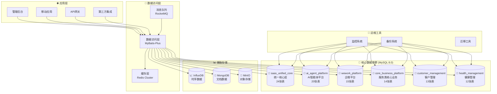

# 💾 企业级SaaS数据库架构设计
*WeWork Management Platform - Enterprise Database Design*

## 📖 文档目录

1. [设计概述](#设计概述)
2. [分库分表架构](#分库分表架构)
3. [数据库详细设计](#数据库详细设计)
4. [索引策略](#索引策略)
5. [分区表设计](#分区表设计)
6. [数据一致性](#数据一致性)
7. [性能优化](#性能优化)
8. [备份恢复](#备份恢复)
9. [运维监控](#运维监控)

---

## 🎯 设计概述

### 架构特点

我们采用现代化的分库分表架构，将单体数据库拆分为6个独立的业务数据库，共计98张表，支持海量数据存储和高并发访问。

```yaml
核心特性:
  - 分库设计: 6个独立数据库，按业务模块隔离
  - 分区表: 7张分区表支持大数据量处理
  - 多级索引: 针对查询场景的复合索引优化
  - 存储过程: 20+个存储过程封装复杂业务逻辑
  - 定时任务: 15+个定时任务自动化运维
  - 视图支持: 14+个视图简化复杂查询

架构原则:
  - 业务隔离: 按业务域进行数据库拆分
  - 水平扩展: 支持分片和读写分离
  - 数据安全: 多层加密和访问控制
  - 高可用性: 主从复制和自动故障转移
  - 性能优化: 缓存、索引、分区综合优化
```

### 技术选型

```yaml
数据库技术栈:
  关系型数据库:
    - MySQL 8.0.32+
    - InnoDB存储引擎
    - UTF8MB4字符集
    - GTID主从复制
    
  缓存系统:
    - Redis 7.0+
    - 集群模式部署
    - 持久化AOF+RDB
    - Sentinel高可用
    
  时序数据库:
    - InfluxDB 2.0+
    - 监控指标存储
    - 数据保留策略
    - 连续查询优化
    
  文档数据库:
    - MongoDB 6.0+
    - 分片集群
    - 复制集
    - GridFS文件存储
    
  对象存储:
    - MinIO
    - 分布式存储
    - 数据冗余备份
    - S3兼容接口
```

---

## 🏗️ 分库分表架构

### 总体架构图



### 数据库分布概览

| 数据库 | 表数量 | 主要功能 | 预估数据量 |
|--------|--------|----------|------------|
| **saas_unified_core** | 24张 | 统一核心层：身份管理、安全审计、配额计费、系统管理 | 10,000,000+ |
| **ai_agent_platform** | 20张 | AI智能体平台：平台管理、智能体管理、调度管理、监控分析 | 50,000,000+ |
| **wework_platform** | 15张 | 企微平台：账号管理、消息管理、联系人管理、会话管理 | 30,000,000+ |
| **core_business_platform** | 14张 | 服务类核心业务：服务管理、订单管理、营销管理 | 20,000,000+ |
| **customer_management** | 13张 | 客户管理：客户档案、标签管理、分群管理、行为分析 | 40,000,000+ |
| **health_management** | 12张 | 健康管理：患者管理、健康记录、设备管理、健康告警 | 15,000,000+ |
| **总计** | **98张** | **企业级SaaS服务平台** | **165,000,000+** |

---

## 📊 数据库详细设计

详细的数据库设计请参考我们的[数据库脚本文档](../02-系统设计/database-scripts/README.md)，其中包含：

- [📊 01-saas-unified-core.sql](../02-系统设计/database-scripts/01-saas-unified-core.sql) - 统一核心层 (24张表)
- [🤖 02-ai-agent-platform.sql](../02-系统设计/database-scripts/02-ai-agent-platform.sql) - AI智能体平台 (20张表)
- [🚀 03-wework-platform.sql](../02-系统设计/database-scripts/03-wework-platform.sql) - 企微平台 (15张表)
- [🏥 04-health-management.sql](../02-系统设计/database-scripts/04-health-management.sql) - 健康管理模块 (12张表)
- [🛒 05-core-business-platform.sql](../02-系统设计/database-scripts/05-core-business-platform.sql) - 服务类核心业务平台 (14张表)
- [👥 06-customer-management.sql](../02-系统设计/database-scripts/06-customer-management.sql) - 客户管理平台 (13张表)

### 核心设计亮点

```yaml
统一核心层特色:
  - 多租户架构: 完整的租户隔离机制
  - 细粒度权限: RBAC权限模型
  - 统一审计: 所有操作的完整审计日志
  - 配额管理: 多维度资源配额控制
  - 系统监控: 统一的监控和告警机制

AI智能体平台特色:
  - 多平台支持: dify、coze、fastgpt、自定义平台
  - 智能调度: 6种调度策略，自动故障转移
  - 知识库管理: 多类型知识库统一管理
  - 工具生态: 内置和自定义工具支持
  - 性能监控: 实时调度性能分析

企微平台特色:
  - 9状态生命周期: 完整的账号状态跟踪
  - 消息全类型: 支持所有企微消息类型
  - 实时监控: 自动状态检查和健康评分
  - 告警系统: 15种告警类型和自动处理

服务类商品特色:
  - 服务预约: 完整的时间段预约和容量控制
  - 提供商管理: 自动/手动分配服务人员
  - 多地点服务: 在线、上门、混合等交付模式
  - 分账结算: 平台与服务提供商的收益分配

客户管理特色:
  - 360度视图: 完整的客户档案和生命周期管理
  - 智能标签: 自动标签分配和规则引擎
  - 动态分群: 基于行为和属性的智能分群
  - 行为分析: 完整的客户行为路径分析

健康管理特色:
  - 患者档案: 完整的健康档案管理
  - 设备接入: 多种健康设备数据采集
  - 智能告警: 基于阈值和趋势的告警规则
  - 数据质量: 设备数据验证和质量评估
```

---

## 🔍 索引策略

### 索引设计原则

```yaml
索引策略:
  主键索引:
    - 所有表使用VARCHAR(36)作为主键
    - 分区表使用复合主键(id, partition_field)
    
  唯一索引:
    - 业务唯一键：tenant_id + business_code
    - 自然唯一键：email, phone等
    
  普通索引:
    - 外键字段必建索引
    - 查询条件字段建索引
    - 排序字段建索引
    
  复合索引:
    - 多字段查询建复合索引
    - 最左前缀原则优化
    - 覆盖索引减少回表
    
  分区索引:
    - 分区表索引包含分区键
    - 时间范围查询优化
```

### 关键索引示例

```sql
-- 租户+业务编码的复合唯一索引
CREATE UNIQUE INDEX uk_tenant_business_code ON table_name (tenant_id, business_code);

-- 多字段查询的复合索引
CREATE INDEX idx_complex_query ON customers (tenant_id, status, customer_level, created_at);

-- 覆盖索引（包含查询所需的所有字段）
CREATE INDEX idx_customer_summary ON customers (tenant_id, id, customer_name, phone, status, created_at);

-- 分区表的时间范围索引
CREATE INDEX idx_time_range ON audit_logs (tenant_id, created_at, action);

-- JSON字段的虚拟列索引
ALTER TABLE services ADD COLUMN price_range DECIMAL(10,2) 
GENERATED ALWAYS AS (JSON_UNQUOTE(JSON_EXTRACT(config, '$.price_range'))) STORED;
CREATE INDEX idx_price_range ON services (price_range);
```

---

## 📊 分区表设计

### 分区策略

我们的系统中有7张分区表，主要采用时间分区策略来处理大数据量：

```yaml
分区表列表:
  1. saas_unified_audit_logs: 统一审计日志（按月分区）
  2. ai_call_logs: AI调用日志（按月分区）
  3. ai_platform_metrics: AI平台指标（按月分区）
  4. wework_message_records: 企微消息记录（按月分区）
  5. wework_callback_logs: 企微回调日志（按月分区）
  6. customer_behavior_events: 客户行为事件（按月分区）
  7. health_device_logs: 健康设备日志（按月分区）

分区优势:
  - 查询性能: 分区裁剪提升查询速度
  - 维护便利: 按分区进行数据归档和清理
  - 并行处理: 支持分区级并行操作
  - 存储优化: 历史数据可使用不同存储策略
```

### 分区维护

```sql
-- 自动添加新分区的存储过程
DELIMITER $$
CREATE PROCEDURE sp_add_monthly_partitions()
BEGIN
    DECLARE done INT DEFAULT FALSE;
    DECLARE table_name VARCHAR(255);
    DECLARE cur CURSOR FOR 
        SELECT TABLE_NAME 
        FROM INFORMATION_SCHEMA.TABLES 
        WHERE TABLE_SCHEMA = DATABASE() 
        AND CREATE_OPTIONS LIKE '%partitioned%';
    DECLARE CONTINUE HANDLER FOR NOT FOUND SET done = TRUE;
    
    OPEN cur;
    read_loop: LOOP
        FETCH cur INTO table_name;
        IF done THEN
            LEAVE read_loop;
        END IF;
        
        -- 添加未来3个月的分区
        CALL sp_add_future_partitions(table_name, 3);
    END LOOP;
    CLOSE cur;
END$$
DELIMITER ;

-- 定时任务：每月1号执行分区维护
CREATE EVENT ev_monthly_partition_maintenance
ON SCHEDULE EVERY 1 MONTH
STARTS '2025-02-01 02:00:00'
DO
  CALL sp_add_monthly_partitions();
```

---

## 🔄 数据一致性

### 一致性策略

```yaml
一致性级别:
  强一致性:
    - 核心业务数据（订单、支付、账户）
    - 使用事务和分布式锁保证
    
  最终一致性:
    - 统计数据、报表数据
    - 使用异步消息和定时同步
    
  弱一致性:
    - 日志数据、行为数据
    - 允许短暂不一致
```

### 事务设计

```sql
-- 分布式事务示例：创建服务订单
START TRANSACTION;

-- 1. 创建订单
INSERT INTO service_orders (id, tenant_id, customer_id, service_id, ...) 
VALUES (...);

-- 2. 更新服务容量
UPDATE services 
SET booked_slots = booked_slots + 1 
WHERE id = @service_id AND available_slots > booked_slots;

-- 3. 创建支付记录
INSERT INTO service_order_payments (order_id, amount, status, ...) 
VALUES (...);

-- 4. 更新客户统计
UPDATE customers 
SET order_count = order_count + 1, total_spent = total_spent + @amount 
WHERE id = @customer_id;

-- 检查是否所有操作都成功
IF @@ERROR = 0 THEN
    COMMIT;
    -- 发送异步消息通知
    INSERT INTO message_queue (event_type, payload) 
    VALUES ('ORDER_CREATED', JSON_OBJECT('order_id', @order_id));
ELSE
    ROLLBACK;
END IF;
```

---

## ⚡ 性能优化

### 查询优化

```sql
-- 1. 使用覆盖索引避免回表
SELECT id, customer_name, phone, status 
FROM customers 
WHERE tenant_id = ? AND status = 'active'
ORDER BY created_at DESC
LIMIT 20;
-- 对应覆盖索引：idx_customer_summary (tenant_id, status, created_at, id, customer_name, phone)

-- 2. 分页查询优化
SELECT * FROM customers 
WHERE tenant_id = ? AND id > ? 
ORDER BY id LIMIT 20;
-- 使用主键偏移而非OFFSET

-- 3. JSON字段查询优化
SELECT * FROM services 
WHERE tenant_id = ? 
AND JSON_EXTRACT(config, '$.category') = 'premium';
-- 建议：为常用JSON字段创建虚拟列和索引

-- 4. 时间范围查询优化（分区表）
SELECT * FROM customer_behavior_events 
WHERE tenant_id = ? 
AND event_time >= '2025-01-01' 
AND event_time < '2025-02-01'
AND event_type = 'purchase';
-- 分区裁剪 + 复合索引
```

### 缓存策略

```yaml
多级缓存架构:
  L1缓存 (应用内存):
    - 配置数据：5分钟TTL
    - 字典数据：30分钟TTL
    - 热点数据：1分钟TTL
    
  L2缓存 (Redis):
    - 用户会话：30分钟TTL
    - 查询结果：10分钟TTL
    - 计数器：实时更新
    
  L3缓存 (数据库查询缓存):
    - MySQL Query Cache
    - InnoDB Buffer Pool
    - 操作系统页面缓存

缓存更新策略:
  - Write-Through: 同时更新缓存和数据库
  - Write-Behind: 异步回写数据库
  - Cache-Aside: 应用程序管理缓存
```

---

## 💾 备份恢复

### 备份策略

```yaml
备份类型:
  全量备份:
    - 频率：每天凌晨2点
    - 保留：30天
    - 工具：mysqldump + xtrabackup
    
  增量备份:
    - 频率：每小时
    - 保留：7天
    - 工具：binlog + xtrabackup
    
  实时备份:
    - 主从复制：实时同步
    - 延迟从库：防止误操作
    - 跨机房备份：灾难恢复

备份验证:
  - 每周恢复测试
  - 备份文件完整性校验
  - 恢复时间目标(RTO): < 4小时
  - 恢复点目标(RPO): < 1小时
```

---

## 📊 运维监控

### 监控指标

```yaml
数据库性能指标:
  连接相关:
    - 连接数：当前连接/最大连接
    - 连接使用率：连接数/最大连接数
    - 连接等待：等待连接的线程数
    
  查询性能:
    - QPS：每秒查询数
    - TPS：每秒事务数
    - 慢查询：>1秒的查询数
    - 查询缓存命中率
    
  存储相关:
    - 数据库大小：各数据库空间占用
    - 索引大小：索引空间占用
    - 临时表：临时表创建数量
    - 分区使用：各分区数据分布

业务监控指标:
  数据量监控:
    - 各表记录数：每日增长量
    - 分区数据量：各分区记录数
    - 热点数据：高频访问的数据
    
  业务指标:
    - 活跃租户数：有活动的租户
    - 新增用户数：每日新注册用户
    - 订单量：每日订单创建数
    - 消息量：每日消息发送数
```

---

## 🔗 相关文档

- [📊 数据库脚本文档](../02-系统设计/database-scripts/README.md)
- [🏗️ 系统架构设计](../02-系统设计/SYSTEM_DESIGN.md)
- [🔧 技术架构分析](../02-系统设计/TECHNICAL_ARCHITECTURE_ANALYSIS.md)
- [🔒 安全架构设计](../05-安全性能/SECURITY_ARCHITECTURE_DESIGN.md)
- [⚡ 性能优化设计](../05-安全性能/PERFORMANCE_OPTIMIZATION_DESIGN.md)

---

**📅 最后更新**: 2025年1月 | **📝 版本**: v2.0 | **🎯 状态**: 完整设计

🎉 **企业级SaaS数据库架构，支撑海量数据和高并发业务！**