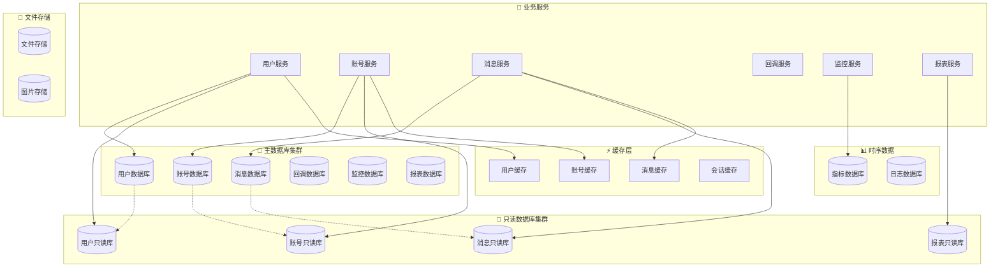

# 💾 数据库详细设计
*WeWork Management Platform - Database Design*

## 📖 目录

1. [设计概述](#设计概述)
2. [数据架构](#数据架构)
3. [核心表设计](#核心表设计)
4. [索引设计](#索引设计)
5. [分库分表策略](#分库分表策略)
6. [数据一致性](#数据一致性)
7. [性能优化](#性能优化)
8. [备份恢复](#备份恢复)

---

## 🎯 设计概述

### 设计原则
- **服务隔离**: 每个微服务独立数据库
- **读写分离**: 主库写入，从库查询
- **分库分表**: 支持水平扩展
- **数据安全**: 敏感数据加密存储
- **高可用**: 主从复制，故障自动切换

### 技术选型
```yaml
关系型数据库:
  - MySQL 8.0
  - InnoDB存储引擎
  - UTF8MB4字符集

缓存数据库:
  - Redis 7.0
  - 集群模式部署
  - 持久化配置

时序数据库:
  - InfluxDB 2.0
  - 监控指标存储
  - 自动数据清理

对象存储:
  - MinIO
  - 文件和图片存储
  - 多副本保证
```

---

## 🏗️ 数据架构

### 整体架构图



### 数据库分配策略

| 服务 | 主数据库 | 只读库 | 缓存 | 说明 |
|------|---------|--------|------|------|
| 用户服务 | user_db | user_read_db | user_cache | 用户、权限、组织架构 |
| 账号服务 | account_db | account_read_db | account_cache | 企微账号、登录状态 |
| 消息服务 | message_db | message_read_db | message_cache | 消息记录、模板 |
| 回调服务 | callback_db | - | callback_cache | 回调事件、处理记录 |
| 监控服务 | monitor_db | - | monitor_cache | 系统监控、告警 |
| 报表服务 | - | report_read_db | report_cache | 聚合数据、报表 |

---

## 📋 核心表设计

### 1. 用户管理数据库 (user_db)

#### 1.1 租户表 (tenants)
```sql
CREATE TABLE `tenants` (
  `id` varchar(36) NOT NULL COMMENT '租户ID',
  `tenant_code` varchar(50) NOT NULL COMMENT '租户编码',
  `tenant_name` varchar(100) NOT NULL COMMENT '租户名称',
  `contact_person` varchar(50) DEFAULT NULL COMMENT '联系人',
  `contact_phone` varchar(20) DEFAULT NULL COMMENT '联系电话',
  `contact_email` varchar(100) DEFAULT NULL COMMENT '联系邮箱',
  `max_accounts` int NOT NULL DEFAULT '10' COMMENT '最大账号数',
  `max_daily_messages` int NOT NULL DEFAULT '10000' COMMENT '日消息限额',
  `webhook_url` varchar(500) DEFAULT NULL COMMENT '回调地址',
  `config` json DEFAULT NULL COMMENT '租户配置',
  `status` enum('active','suspended','deleted') NOT NULL DEFAULT 'active' COMMENT '状态',
  `created_at` timestamp NOT NULL DEFAULT CURRENT_TIMESTAMP COMMENT '创建时间',
  `updated_at` timestamp NOT NULL DEFAULT CURRENT_TIMESTAMP ON UPDATE CURRENT_TIMESTAMP COMMENT '更新时间',
  PRIMARY KEY (`id`),
  UNIQUE KEY `uk_tenant_code` (`tenant_code`),
  KEY `idx_status` (`status`),
  KEY `idx_created_at` (`created_at`)
) ENGINE=InnoDB DEFAULT CHARSET=utf8mb4 COLLATE=utf8mb4_unicode_ci COMMENT='租户表';
```

#### 1.2 用户表 (users)
```sql
CREATE TABLE `users` (
  `id` varchar(36) NOT NULL COMMENT '用户ID',
  `tenant_id` varchar(36) NOT NULL COMMENT '租户ID',
  `username` varchar(50) NOT NULL COMMENT '用户名',
  `email` varchar(100) NOT NULL COMMENT '邮箱',
  `phone` varchar(20) DEFAULT NULL COMMENT '手机号',
  `real_name` varchar(50) DEFAULT NULL COMMENT '真实姓名',
  `avatar_url` varchar(500) DEFAULT NULL COMMENT '头像URL',
  `password_hash` varchar(255) NOT NULL COMMENT '密码哈希',
  `salt` varchar(32) NOT NULL COMMENT '密码盐值',
  `status` enum('active','inactive','locked','deleted') NOT NULL DEFAULT 'active' COMMENT '状态',
  `last_login_time` timestamp NULL DEFAULT NULL COMMENT '最后登录时间',
  `last_login_ip` varchar(45) DEFAULT NULL COMMENT '最后登录IP',
  `failed_login_count` int NOT NULL DEFAULT '0' COMMENT '失败登录次数',
  `locked_until` timestamp NULL DEFAULT NULL COMMENT '锁定截止时间',
  `created_at` timestamp NOT NULL DEFAULT CURRENT_TIMESTAMP COMMENT '创建时间',
  `updated_at` timestamp NOT NULL DEFAULT CURRENT_TIMESTAMP ON UPDATE CURRENT_TIMESTAMP COMMENT '更新时间',
  PRIMARY KEY (`id`),
  UNIQUE KEY `uk_tenant_username` (`tenant_id`, `username`),
  UNIQUE KEY `uk_tenant_email` (`tenant_id`, `email`),
  KEY `idx_tenant_id` (`tenant_id`),
  KEY `idx_status` (`status`),
  KEY `idx_email` (`email`),
  KEY `idx_last_login` (`last_login_time`),
  CONSTRAINT `fk_users_tenant` FOREIGN KEY (`tenant_id`) REFERENCES `tenants` (`id`)
) ENGINE=InnoDB DEFAULT CHARSET=utf8mb4 COLLATE=utf8mb4_unicode_ci COMMENT='用户表';
```

#### 1.3 角色表 (roles)
```sql
CREATE TABLE `roles` (
  `id` varchar(36) NOT NULL COMMENT '角色ID',
  `tenant_id` varchar(36) NOT NULL COMMENT '租户ID',
  `role_code` varchar(50) NOT NULL COMMENT '角色编码',
  `role_name` varchar(100) NOT NULL COMMENT '角色名称',
  `description` varchar(500) DEFAULT NULL COMMENT '角色描述',
  `permissions` json NOT NULL COMMENT '权限列表',
  `is_system` tinyint(1) NOT NULL DEFAULT '0' COMMENT '是否系统角色',
  `is_active` tinyint(1) NOT NULL DEFAULT '1' COMMENT '是否激活',
  `created_at` timestamp NOT NULL DEFAULT CURRENT_TIMESTAMP COMMENT '创建时间',
  `updated_at` timestamp NOT NULL DEFAULT CURRENT_TIMESTAMP ON UPDATE CURRENT_TIMESTAMP COMMENT '更新时间',
  PRIMARY KEY (`id`),
  UNIQUE KEY `uk_tenant_role_code` (`tenant_id`, `role_code`),
  KEY `idx_tenant_id` (`tenant_id`),
  KEY `idx_is_active` (`is_active`),
  CONSTRAINT `fk_roles_tenant` FOREIGN KEY (`tenant_id`) REFERENCES `tenants` (`id`)
) ENGINE=InnoDB DEFAULT CHARSET=utf8mb4 COLLATE=utf8mb4_unicode_ci COMMENT='角色表';
```

#### 1.4 用户角色关联表 (user_roles)
```sql
CREATE TABLE `user_roles` (
  `id` bigint NOT NULL AUTO_INCREMENT COMMENT '主键ID',
  `user_id` varchar(36) NOT NULL COMMENT '用户ID',
  `role_id` varchar(36) NOT NULL COMMENT '角色ID',
  `assigned_by` varchar(36) NOT NULL COMMENT '分配者ID',
  `assigned_at` timestamp NOT NULL DEFAULT CURRENT_TIMESTAMP COMMENT '分配时间',
  PRIMARY KEY (`id`),
  UNIQUE KEY `uk_user_role` (`user_id`, `role_id`),
  KEY `idx_user_id` (`user_id`),
  KEY `idx_role_id` (`role_id`),
  KEY `idx_assigned_at` (`assigned_at`),
  CONSTRAINT `fk_user_roles_user` FOREIGN KEY (`user_id`) REFERENCES `users` (`id`),
  CONSTRAINT `fk_user_roles_role` FOREIGN KEY (`role_id`) REFERENCES `roles` (`id`)
) ENGINE=InnoDB DEFAULT CHARSET=utf8mb4 COLLATE=utf8mb4_unicode_ci COMMENT='用户角色关联表';
```

### 2. 账号管理数据库 (account_db)

#### 2.1 企微账号表 (wework_accounts)
```sql
CREATE TABLE `wework_accounts` (
  `id` varchar(36) NOT NULL COMMENT '账号ID',
  `tenant_id` varchar(36) NOT NULL COMMENT '租户ID',
  `user_id` varchar(36) DEFAULT NULL COMMENT '绑定用户ID',
  `account_name` varchar(100) NOT NULL COMMENT '账号名称',
  `phone` varchar(20) DEFAULT NULL COMMENT '绑定手机号',
  `email` varchar(100) DEFAULT NULL COMMENT '绑定邮箱',
  `guid` varchar(100) DEFAULT NULL COMMENT '企微实例GUID',
  `qr_code_url` varchar(500) DEFAULT NULL COMMENT '登录二维码URL',
  `login_token` varchar(255) DEFAULT NULL COMMENT '登录令牌',
  `status` enum('created','logging_in','waiting_scan','waiting_confirm','need_verify','online','offline','error','recovering') NOT NULL DEFAULT 'created' COMMENT '状态',
  `config` json DEFAULT NULL COMMENT '账号配置',
  `user_info` json DEFAULT NULL COMMENT '企微用户信息',
  `last_login_time` timestamp NULL DEFAULT NULL COMMENT '最后登录时间',
  `last_heartbeat_time` timestamp NULL DEFAULT NULL COMMENT '最后心跳时间',
  `login_retry_count` int NOT NULL DEFAULT '0' COMMENT '登录重试次数',
  `error_message` text DEFAULT NULL COMMENT '错误信息',
  `created_at` timestamp NOT NULL DEFAULT CURRENT_TIMESTAMP COMMENT '创建时间',
  `updated_at` timestamp NOT NULL DEFAULT CURRENT_TIMESTAMP ON UPDATE CURRENT_TIMESTAMP COMMENT '更新时间',
  PRIMARY KEY (`id`),
  UNIQUE KEY `uk_tenant_account_name` (`tenant_id`, `account_name`),
  UNIQUE KEY `uk_guid` (`guid`),
  KEY `idx_tenant_id` (`tenant_id`),
  KEY `idx_user_id` (`user_id`),
  KEY `idx_status` (`status`),
  KEY `idx_phone` (`phone`),
  KEY `idx_last_heartbeat` (`last_heartbeat_time`),
  KEY `idx_created_at` (`created_at`)
) ENGINE=InnoDB DEFAULT CHARSET=utf8mb4 COLLATE=utf8mb4_unicode_ci COMMENT='企微账号表';
```

#### 2.2 账号状态历史表 (account_status_history)
```sql
CREATE TABLE `account_status_history` (
  `id` bigint NOT NULL AUTO_INCREMENT COMMENT '主键ID',
  `account_id` varchar(36) NOT NULL COMMENT '账号ID',
  `old_status` varchar(20) DEFAULT NULL COMMENT '原状态',
  `new_status` varchar(20) NOT NULL COMMENT '新状态',
  `reason` varchar(500) DEFAULT NULL COMMENT '变更原因',
  `error_message` text DEFAULT NULL COMMENT '错误信息',
  `extra_data` json DEFAULT NULL COMMENT '扩展数据',
  `operator_id` varchar(36) DEFAULT NULL COMMENT '操作者ID',
  `operator_type` enum('user','system','auto') NOT NULL DEFAULT 'system' COMMENT '操作类型',
  `created_at` timestamp NOT NULL DEFAULT CURRENT_TIMESTAMP COMMENT '创建时间',
  PRIMARY KEY (`id`),
  KEY `idx_account_id` (`account_id`),
  KEY `idx_account_time` (`account_id`, `created_at`),
  KEY `idx_new_status` (`new_status`),
  KEY `idx_created_at` (`created_at`)
) ENGINE=InnoDB DEFAULT CHARSET=utf8mb4 COLLATE=utf8mb4_unicode_ci COMMENT='账号状态历史表'
PARTITION BY RANGE (YEAR(created_at)) (
  PARTITION p2025 VALUES LESS THAN (2026),
  PARTITION p2026 VALUES LESS THAN (2027),
  PARTITION p2027 VALUES LESS THAN (2028),
  PARTITION p_future VALUES LESS THAN MAXVALUE
);
```

#### 2.3 会话信息表 (conversations)
```sql
CREATE TABLE `conversations` (
  `id` varchar(36) NOT NULL COMMENT '会话ID',
  `account_id` varchar(36) NOT NULL COMMENT '账号ID',
  `conversation_id` varchar(100) NOT NULL COMMENT '企微会话ID',
  `conversation_name` varchar(200) DEFAULT NULL COMMENT '会话名称',
  `conversation_type` enum('private','group') NOT NULL COMMENT '会话类型',
  `avatar_url` varchar(500) DEFAULT NULL COMMENT '头像URL',
  `member_count` int DEFAULT '0' COMMENT '成员数量',
  `last_msg_time` timestamp NULL DEFAULT NULL COMMENT '最后消息时间',
  `last_msg_content` text DEFAULT NULL COMMENT '最后消息内容',
  `unread_count` int DEFAULT '0' COMMENT '未读消息数',
  `is_active` tinyint(1) NOT NULL DEFAULT '1' COMMENT '是否活跃',
  `is_pinned` tinyint(1) NOT NULL DEFAULT '0' COMMENT '是否置顶',
  `tags` json DEFAULT NULL COMMENT '标签',
  `extra_info` json DEFAULT NULL COMMENT '扩展信息',
  `created_at` timestamp NOT NULL DEFAULT CURRENT_TIMESTAMP COMMENT '创建时间',
  `updated_at` timestamp NOT NULL DEFAULT CURRENT_TIMESTAMP ON UPDATE CURRENT_TIMESTAMP COMMENT '更新时间',
  PRIMARY KEY (`id`),
  UNIQUE KEY `uk_account_conversation` (`account_id`, `conversation_id`),
  KEY `idx_account_id` (`account_id`),
  KEY `idx_conversation_type` (`conversation_type`),
  KEY `idx_last_msg_time` (`last_msg_time`),
  KEY `idx_is_active` (`is_active`),
  KEY `idx_updated_at` (`updated_at`)
) ENGINE=InnoDB DEFAULT CHARSET=utf8mb4 COLLATE=utf8mb4_unicode_ci COMMENT='会话信息表';
```

### 3. 消息管理数据库 (message_db)

#### 3.1 消息记录表 (messages)
```sql
CREATE TABLE `messages` (
  `id` varchar(36) NOT NULL COMMENT '消息ID',
  `tenant_id` varchar(36) NOT NULL COMMENT '租户ID',
  `account_id` varchar(36) NOT NULL COMMENT '发送账号ID',
  `conversation_id` varchar(100) NOT NULL COMMENT '会话ID',
  `message_type` enum('text','image','file','link','miniprogram','at') NOT NULL COMMENT '消息类型',
  `content` json NOT NULL COMMENT '消息内容',
  `template_id` varchar(36) DEFAULT NULL COMMENT '模板ID',
  `status` enum('pending','sending','sent','delivered','failed','cancelled') NOT NULL DEFAULT 'pending' COMMENT '状态',
  `wework_msg_id` varchar(100) DEFAULT NULL COMMENT '企微消息ID',
  `send_time` timestamp NULL DEFAULT NULL COMMENT '发送时间',
  `callback_time` timestamp NULL DEFAULT NULL COMMENT '回调时间',
  `error_code` varchar(50) DEFAULT NULL COMMENT '错误码',
  `error_message` text DEFAULT NULL COMMENT '错误信息',
  `retry_count` int NOT NULL DEFAULT '0' COMMENT '重试次数',
  `batch_id` varchar(36) DEFAULT NULL COMMENT '批量任务ID',
  `priority` int NOT NULL DEFAULT '5' COMMENT '优先级(1-10)',
  `scheduled_time` timestamp NULL DEFAULT NULL COMMENT '计划发送时间',
  `created_at` timestamp NOT NULL DEFAULT CURRENT_TIMESTAMP COMMENT '创建时间',
  `updated_at` timestamp NOT NULL DEFAULT CURRENT_TIMESTAMP ON UPDATE CURRENT_TIMESTAMP COMMENT '更新时间',
  PRIMARY KEY (`id`),
  KEY `idx_tenant_account` (`tenant_id`, `account_id`),
  KEY `idx_conversation_id` (`conversation_id`),
  KEY `idx_status` (`status`),
  KEY `idx_batch_id` (`batch_id`),
  KEY `idx_template_id` (`template_id`),
  KEY `idx_send_time` (`send_time`),
  KEY `idx_created_at` (`created_at`),
  KEY `idx_scheduled_time` (`scheduled_time`)
) ENGINE=InnoDB DEFAULT CHARSET=utf8mb4 COLLATE=utf8mb4_unicode_ci COMMENT='消息记录表'
PARTITION BY RANGE (YEAR(created_at)) (
  PARTITION p2025 VALUES LESS THAN (2026),
  PARTITION p2026 VALUES LESS THAN (2027),
  PARTITION p2027 VALUES LESS THAN (2028),
  PARTITION p_future VALUES LESS THAN MAXVALUE
);
```

#### 3.2 消息模板表 (message_templates)
```sql
CREATE TABLE `message_templates` (
  `id` varchar(36) NOT NULL COMMENT '模板ID',
  `tenant_id` varchar(36) NOT NULL COMMENT '租户ID',
  `creator_id` varchar(36) NOT NULL COMMENT '创建者ID',
  `template_name` varchar(100) NOT NULL COMMENT '模板名称',
  `template_type` varchar(50) NOT NULL COMMENT '模板类型',
  `category` varchar(50) DEFAULT NULL COMMENT '模板分类',
  `description` varchar(500) DEFAULT NULL COMMENT '模板描述',
  `template_content` json NOT NULL COMMENT '模板内容',
  `variables` json DEFAULT NULL COMMENT '变量定义',
  `preview_data` json DEFAULT NULL COMMENT '预览数据',
  `usage_count` int NOT NULL DEFAULT '0' COMMENT '使用次数',
  `last_used_time` timestamp NULL DEFAULT NULL COMMENT '最后使用时间',
  `is_public` tinyint(1) NOT NULL DEFAULT '0' COMMENT '是否公开',
  `is_active` tinyint(1) NOT NULL DEFAULT '1' COMMENT '是否激活',
  `tags` json DEFAULT NULL COMMENT '标签',
  `created_at` timestamp NOT NULL DEFAULT CURRENT_TIMESTAMP COMMENT '创建时间',
  `updated_at` timestamp NOT NULL DEFAULT CURRENT_TIMESTAMP ON UPDATE CURRENT_TIMESTAMP COMMENT '更新时间',
  PRIMARY KEY (`id`),
  UNIQUE KEY `uk_tenant_template_name` (`tenant_id`, `template_name`),
  KEY `idx_tenant_id` (`tenant_id`),
  KEY `idx_creator_id` (`creator_id`),
  KEY `idx_template_type` (`template_type`),
  KEY `idx_category` (`category`),
  KEY `idx_is_active` (`is_active`),
  KEY `idx_usage_count` (`usage_count`),
  KEY `idx_created_at` (`created_at`)
) ENGINE=InnoDB DEFAULT CHARSET=utf8mb4 COLLATE=utf8mb4_unicode_ci COMMENT='消息模板表';
```

#### 3.3 批量发送任务表 (batch_send_tasks)
```sql
CREATE TABLE `batch_send_tasks` (
  `id` varchar(36) NOT NULL COMMENT '任务ID',
  `tenant_id` varchar(36) NOT NULL COMMENT '租户ID',
  `creator_id` varchar(36) NOT NULL COMMENT '创建者ID',
  `task_name` varchar(100) NOT NULL COMMENT '任务名称',
  `account_id` varchar(36) NOT NULL COMMENT '发送账号ID',
  `template_id` varchar(36) DEFAULT NULL COMMENT '模板ID',
  `message_content` json NOT NULL COMMENT '消息内容',
  `target_type` enum('manual','import','group','filter') NOT NULL COMMENT '目标类型',
  `target_config` json NOT NULL COMMENT '目标配置',
  `send_strategy` json DEFAULT NULL COMMENT '发送策略',
  `status` enum('created','running','paused','completed','failed','cancelled') NOT NULL DEFAULT 'created' COMMENT '状态',
  `total_count` int NOT NULL DEFAULT '0' COMMENT '总数量',
  `sent_count` int NOT NULL DEFAULT '0' COMMENT '已发送数量',
  `success_count` int NOT NULL DEFAULT '0' COMMENT '成功数量',
  `failed_count` int NOT NULL DEFAULT '0' COMMENT '失败数量',
  `progress_percent` decimal(5,2) NOT NULL DEFAULT '0.00' COMMENT '进度百分比',
  `start_time` timestamp NULL DEFAULT NULL COMMENT '开始时间',
  `end_time` timestamp NULL DEFAULT NULL COMMENT '结束时间',
  `estimated_duration` int DEFAULT NULL COMMENT '预估时长(秒)',
  `error_message` text DEFAULT NULL COMMENT '错误信息',
  `created_at` timestamp NOT NULL DEFAULT CURRENT_TIMESTAMP COMMENT '创建时间',
  `updated_at` timestamp NOT NULL DEFAULT CURRENT_TIMESTAMP ON UPDATE CURRENT_TIMESTAMP COMMENT '更新时间',
  PRIMARY KEY (`id`),
  KEY `idx_tenant_id` (`tenant_id`),
  KEY `idx_creator_id` (`creator_id`),
  KEY `idx_account_id` (`account_id`),
  KEY `idx_status` (`status`),
  KEY `idx_created_at` (`created_at`)
) ENGINE=InnoDB DEFAULT CHARSET=utf8mb4 COLLATE=utf8mb4_unicode_ci COMMENT='批量发送任务表';
```

### 4. 回调处理数据库 (callback_db)

#### 4.1 回调事件表 (callback_events)
```sql
CREATE TABLE `callback_events` (
  `id` varchar(36) NOT NULL COMMENT '事件ID',
  `guid` varchar(100) NOT NULL COMMENT '实例GUID',
  `notify_type` int NOT NULL COMMENT '通知类型',
  `event_type` varchar(50) NOT NULL COMMENT '事件类型',
  `raw_data` longtext NOT NULL COMMENT '原始数据',
  `parsed_data` json DEFAULT NULL COMMENT '解析后数据',
  `status` enum('received','processing','processed','failed','ignored') NOT NULL DEFAULT 'received' COMMENT '处理状态',
  `error_message` text DEFAULT NULL COMMENT '错误信息',
  `retry_count` int NOT NULL DEFAULT '0' COMMENT '重试次数',
  `process_time` timestamp NULL DEFAULT NULL COMMENT '处理时间',
  `received_time` timestamp NOT NULL DEFAULT CURRENT_TIMESTAMP COMMENT '接收时间',
  `source_ip` varchar(45) DEFAULT NULL COMMENT '来源IP',
  `user_agent` text DEFAULT NULL COMMENT '用户代理',
  PRIMARY KEY (`id`),
  KEY `idx_guid` (`guid`),
  KEY `idx_notify_type` (`notify_type`),
  KEY `idx_event_type` (`event_type`),
  KEY `idx_status` (`status`),
  KEY `idx_received_time` (`received_time`),
  KEY `idx_process_time` (`process_time`)
) ENGINE=InnoDB DEFAULT CHARSET=utf8mb4 COLLATE=utf8mb4_unicode_ci COMMENT='回调事件表'
PARTITION BY RANGE (UNIX_TIMESTAMP(received_time)) (
  PARTITION p202501 VALUES LESS THAN (UNIX_TIMESTAMP('2025-02-01')),
  PARTITION p202502 VALUES LESS THAN (UNIX_TIMESTAMP('2025-03-01')),
  PARTITION p202503 VALUES LESS THAN (UNIX_TIMESTAMP('2025-04-01')),
  PARTITION p_future VALUES LESS THAN MAXVALUE
);
```

---

## 🔍 索引设计

### 索引设计原则
```yaml
设计原则:
  - 高频查询字段建立索引
  - 复合索引覆盖常用查询
  - 避免过多索引影响写入性能
  - 定期分析索引使用情况

索引类型:
  - 主键索引: 聚簇索引，数据物理排序
  - 唯一索引: 保证数据唯一性
  - 普通索引: 加速查询
  - 复合索引: 多字段组合查询
  - 前缀索引: 长字段部分索引
```

### 核心索引设计

#### 1. 账号表索引优化
```sql
-- 租户账号查询索引
ALTER TABLE wework_accounts ADD INDEX idx_tenant_status_heartbeat (tenant_id, status, last_heartbeat_time);

-- 在线账号监控索引
ALTER TABLE wework_accounts ADD INDEX idx_online_heartbeat (status, last_heartbeat_time) WHERE status = 'online';

-- 账号名称搜索索引
ALTER TABLE wework_accounts ADD INDEX idx_account_name_search (tenant_id, account_name(20));

-- GUID快速查找索引
ALTER TABLE wework_accounts ADD UNIQUE INDEX uk_guid_active (guid) WHERE status != 'deleted';
```

#### 2. 消息表索引优化
```sql
-- 租户消息统计索引
ALTER TABLE messages ADD INDEX idx_tenant_time_status (tenant_id, created_at, status);

-- 账号发送记录索引
ALTER TABLE messages ADD INDEX idx_account_send_time (account_id, send_time DESC);

-- 会话消息历史索引
ALTER TABLE messages ADD INDEX idx_conversation_time (conversation_id, created_at DESC);

-- 批量任务消息索引
ALTER TABLE messages ADD INDEX idx_batch_status (batch_id, status);

-- 定时消息索引
ALTER TABLE messages ADD INDEX idx_scheduled_pending (scheduled_time, status) WHERE status = 'pending';
```

#### 3. 用户表索引优化
```sql
-- 租户用户查询索引
ALTER TABLE users ADD INDEX idx_tenant_status_login (tenant_id, status, last_login_time);

-- 用户名邮箱搜索索引
ALTER TABLE users ADD INDEX idx_search_fields (tenant_id, username(10), email(20));

-- 活跃用户统计索引
ALTER TABLE users ADD INDEX idx_active_users (status, last_login_time) WHERE status = 'active';
```

### 索引监控与优化
```sql
-- 慢查询日志配置
SET GLOBAL slow_query_log = 'ON';
SET GLOBAL slow_query_log_file = '/var/log/mysql/slow.log';
SET GLOBAL long_query_time = 1;
SET GLOBAL log_queries_not_using_indexes = 'ON';

-- 索引使用情况监控
SELECT 
  table_schema,
  table_name,
  index_name,
  cardinality,
  sub_part,
  packed,
  nullable,
  index_type
FROM information_schema.statistics 
WHERE table_schema = 'wework_platform'
ORDER BY table_name, seq_in_index;

-- 未使用索引检查
SELECT DISTINCT
  s.table_schema,
  s.table_name,
  s.index_name
FROM information_schema.statistics s
LEFT JOIN information_schema.index_statistics i
  ON s.table_schema = i.table_schema
  AND s.table_name = i.table_name
  AND s.index_name = i.index_name
WHERE s.table_schema = 'wework_platform'
  AND i.index_name IS NULL
  AND s.index_name != 'PRIMARY';
```

---

## 🎯 分库分表策略

### 分表策略

#### 1. 消息表按时间分表
```sql
-- 按年分表的消息表
CREATE TABLE messages_2025 LIKE messages;
CREATE TABLE messages_2026 LIKE messages;

-- 自动分区配置
ALTER TABLE messages PARTITION BY RANGE (YEAR(created_at)) (
  PARTITION p2025 VALUES LESS THAN (2026),
  PARTITION p2026 VALUES LESS THAN (2027),
  PARTITION p2027 VALUES LESS THAN (2028),
  PARTITION p_future VALUES LESS THAN MAXVALUE
);

-- 历史数据清理策略
DELIMITER $$
CREATE EVENT cleanup_old_messages
ON SCHEDULE EVERY 1 DAY
STARTS '2025-01-01 02:00:00'
DO BEGIN
  -- 删除3年前的消息数据
  DELETE FROM messages 
  WHERE created_at < DATE_SUB(NOW(), INTERVAL 3 YEAR)
  LIMIT 10000;
END$$
DELIMITER ;
```

#### 2. 日志表按月分表
```sql
-- 回调事件按月分表
CREATE TABLE callback_events_202501 (
  LIKE callback_events INCLUDING ALL
) PARTITION OF callback_events 
FOR VALUES FROM ('2025-01-01') TO ('2025-02-01');

-- 自动创建分区的存储过程
DELIMITER $$
CREATE PROCEDURE CreateMonthlyPartition(IN table_name VARCHAR(64), IN year_month VARCHAR(7))
BEGIN
  SET @sql = CONCAT(
    'ALTER TABLE ', table_name, 
    ' ADD PARTITION (PARTITION p', REPLACE(year_month, '-', ''), 
    ' VALUES FROM (''', year_month, '-01'') TO (''', 
    DATE_ADD(CONCAT(year_month, '-01'), INTERVAL 1 MONTH), '''))'
  );
  PREPARE stmt FROM @sql;
  EXECUTE stmt;
  DEALLOCATE PREPARE stmt;
END$$
DELIMITER ;
```

### 分库策略

#### 1. 租户级别分库
```yaml
分库规则:
  - 按租户ID哈希分库
  - 每个库支持1000个租户
  - 支持在线扩容

分库配置:
  database_0: 租户ID hash(tenant_id) % 8 = 0
  database_1: 租户ID hash(tenant_id) % 8 = 1
  database_2: 租户ID hash(tenant_id) % 8 = 2
  ...
  database_7: 租户ID hash(tenant_id) % 8 = 7

路由算法:
  db_index = crc32(tenant_id) % 8
  database_name = "wework_platform_" + db_index
```

#### 2. 分库中间件配置
```yaml
# ShardingSphere配置示例
spring:
  shardingsphere:
    datasource:
      names: ds0,ds1,ds2,ds3,ds4,ds5,ds6,ds7
      ds0:
        type: com.zaxxer.hikari.HikariDataSource
        driver-class-name: com.mysql.cj.jdbc.Driver
        jdbc-url: jdbc:mysql://mysql0:3306/wework_platform_0
        username: ${DB_USERNAME}
        password: ${DB_PASSWORD}
      # ... 其他数据源配置
      
    rules:
      sharding:
        tables:
          wework_accounts:
            actual-data-nodes: ds$->{0..7}.wework_accounts
            database-strategy:
              standard:
                sharding-column: tenant_id
                sharding-algorithm-name: tenant_hash
          messages:
            actual-data-nodes: ds$->{0..7}.messages_$->{2025..2027}
            database-strategy:
              standard:
                sharding-column: tenant_id
                sharding-algorithm-name: tenant_hash
            table-strategy:
              standard:
                sharding-column: created_at
                sharding-algorithm-name: year_range
                
        sharding-algorithms:
          tenant_hash:
            type: HASH_MOD
            props:
              sharding-count: 8
          year_range:
            type: INTERVAL
            props:
              datetime-pattern: yyyy-MM-dd HH:mm:ss
              datetime-lower: 2025-01-01 00:00:00
              datetime-upper: 2028-01-01 00:00:00
              sharding-seconds: 31536000  # 1年的秒数
```

---

## 🔄 数据一致性

### 事务管理

#### 1. 单库事务
```java
@Service
@Transactional
public class AccountService {
    
    @Transactional(rollbackFor = Exception.class)
    public void createAccountWithHistory(CreateAccountRequest request) {
        // 1. 创建账号
        Account account = new Account(request);
        accountRepository.save(account);
        
        // 2. 记录状态历史
        AccountStatusHistory history = new AccountStatusHistory(
            account.getId(), null, account.getStatus(), "账号创建");
        statusHistoryRepository.save(history);
        
        // 3. 发布领域事件
        eventPublisher.publish(new AccountCreatedEvent(account.getId()));
    }
}
```

#### 2. 分布式事务 (Seata)
```yaml
# Seata配置
seata:
  enabled: true
  application-id: wework-platform
  tx-service-group: wework_tx_group
  config:
    type: nacos
    nacos:
      server-addr: nacos:8848
      namespace: seata
      group: SEATA_GROUP
  registry:
    type: nacos
    nacos:
      server-addr: nacos:8848
      namespace: seata
      group: SEATA_GROUP
```

```java
@Service
public class MessageService {
    
    @GlobalTransactional(rollbackFor = Exception.class)
    public void sendMessageWithCallback(SendMessageRequest request) {
        // 1. 保存消息记录 (message_db)
        Message message = messageRepository.save(new Message(request));
        
        // 2. 更新账号统计 (account_db)
        accountStatisticService.incrementSentCount(request.getAccountId());
        
        // 3. 记录操作日志 (log_db)
        operationLogService.log("MESSAGE_SEND", request.getUserId(), message.getId());
        
        // 4. 发送到消息队列
        messageQueueService.send(message);
    }
}
```

### 数据同步

#### 1. 主从同步配置
```sql
-- 主库配置
[mysqld]
server-id = 1
log-bin = mysql-bin
binlog-format = ROW
binlog-do-db = wework_platform
sync_binlog = 1
innodb_flush_log_at_trx_commit = 1

-- 从库配置
[mysqld]
server-id = 2
relay-log = relay-bin
read-only = 1
super-read-only = 1
```

#### 2. 数据一致性检查
```sql
-- 主从延迟监控
SELECT 
  ROUND(
    (UNIX_TIMESTAMP(NOW()) - UNIX_TIMESTAMP(ts)) 
  ) AS replication_delay_seconds
FROM (
  SELECT MAX(ts) AS ts 
  FROM mysql.slave_relay_log_info
) t;

-- 数据一致性校验
DELIMITER $$
CREATE PROCEDURE CheckDataConsistency()
BEGIN
  DECLARE done INT DEFAULT FALSE;
  DECLARE table_name VARCHAR(64);
  DECLARE master_count, slave_count INT;
  
  DECLARE table_cursor CURSOR FOR 
    SELECT TABLE_NAME 
    FROM information_schema.TABLES 
    WHERE TABLE_SCHEMA = 'wework_platform';
  
  DECLARE CONTINUE HANDLER FOR NOT FOUND SET done = TRUE;
  
  OPEN table_cursor;
  
  read_loop: LOOP
    FETCH table_cursor INTO table_name;
    IF done THEN
      LEAVE read_loop;
    END IF;
    
    -- 比较主从数据行数
    SET @sql = CONCAT('SELECT COUNT(*) INTO @master_count FROM master.', table_name);
    PREPARE stmt FROM @sql;
    EXECUTE stmt;
    DEALLOCATE PREPARE stmt;
    
    SET @sql = CONCAT('SELECT COUNT(*) INTO @slave_count FROM slave.', table_name);
    PREPARE stmt FROM @sql;
    EXECUTE stmt;
    DEALLOCATE PREPARE stmt;
    
    IF @master_count != @slave_count THEN
      INSERT INTO data_consistency_log (table_name, master_count, slave_count, check_time)
      VALUES (table_name, @master_count, @slave_count, NOW());
    END IF;
    
  END LOOP;
  
  CLOSE table_cursor;
END$$
DELIMITER ;
```

---

## ⚡ 性能优化

### 查询优化

#### 1. 分页查询优化
```sql
-- 传统分页 (性能差)
SELECT * FROM messages 
WHERE tenant_id = 'tenant_123' 
ORDER BY created_at DESC 
LIMIT 10000, 20;

-- 优化后的分页 (使用游标)
SELECT * FROM messages 
WHERE tenant_id = 'tenant_123' 
  AND created_at < '2025-01-01 12:00:00'
ORDER BY created_at DESC 
LIMIT 20;

-- 分页查询封装
@Repository
public class MessageRepository {
    
    public Page<Message> findByTenantId(String tenantId, LocalDateTime cursor, int size) {
        String sql = """
            SELECT * FROM messages 
            WHERE tenant_id = ? 
              AND (? IS NULL OR created_at < ?)
            ORDER BY created_at DESC 
            LIMIT ?
            """;
        
        List<Message> messages = jdbcTemplate.query(sql, 
            new Object[]{tenantId, cursor, cursor, size + 1},
            new MessageRowMapper());
        
        boolean hasNext = messages.size() > size;
        if (hasNext) {
            messages.remove(messages.size() - 1);
        }
        
        LocalDateTime nextCursor = hasNext ? 
            messages.get(messages.size() - 1).getCreatedAt() : null;
            
        return new Page<>(messages, nextCursor, hasNext);
    }
}
```

#### 2. 统计查询优化
```sql
-- 实时统计表
CREATE TABLE message_statistics (
  `id` bigint NOT NULL AUTO_INCREMENT,
  `tenant_id` varchar(36) NOT NULL,
  `account_id` varchar(36) NOT NULL,
  `stat_date` date NOT NULL,
  `stat_hour` tinyint DEFAULT NULL,
  `total_count` int NOT NULL DEFAULT '0',
  `success_count` int NOT NULL DEFAULT '0',
  `failed_count` int NOT NULL DEFAULT '0',
  `avg_response_time` decimal(10,3) DEFAULT NULL,
  `created_at` timestamp NOT NULL DEFAULT CURRENT_TIMESTAMP,
  `updated_at` timestamp NOT NULL DEFAULT CURRENT_TIMESTAMP ON UPDATE CURRENT_TIMESTAMP,
  PRIMARY KEY (`id`),
  UNIQUE KEY `uk_tenant_account_date_hour` (`tenant_id`, `account_id`, `stat_date`, `stat_hour`),
  KEY `idx_stat_date` (`stat_date`),
  KEY `idx_tenant_date` (`tenant_id`, `stat_date`)
) COMMENT='消息统计表';

-- 统计数据更新触发器
DELIMITER $$
CREATE TRIGGER update_message_statistics 
AFTER UPDATE ON messages
FOR EACH ROW
BEGIN
  IF OLD.status != NEW.status AND NEW.status IN ('sent', 'failed') THEN
    INSERT INTO message_statistics (
      tenant_id, account_id, stat_date, stat_hour,
      total_count, success_count, failed_count
    ) VALUES (
      NEW.tenant_id, NEW.account_id, DATE(NEW.created_at), HOUR(NEW.created_at),
      1, 
      CASE WHEN NEW.status = 'sent' THEN 1 ELSE 0 END,
      CASE WHEN NEW.status = 'failed' THEN 1 ELSE 0 END
    ) ON DUPLICATE KEY UPDATE
      total_count = total_count + 1,
      success_count = success_count + CASE WHEN NEW.status = 'sent' THEN 1 ELSE 0 END,
      failed_count = failed_count + CASE WHEN NEW.status = 'failed' THEN 1 ELSE 0 END,
      updated_at = CURRENT_TIMESTAMP;
  END IF;
END$$
DELIMITER ;
```

### 缓存策略

#### 1. Redis缓存配置
```yaml
# Redis集群配置
spring:
  redis:
    cluster:
      nodes:
        - redis-node1:7000
        - redis-node2:7000
        - redis-node3:7000
        - redis-node4:7000
        - redis-node5:7000
        - redis-node6:7000
      max-redirects: 3
    timeout: 3s
    lettuce:
      pool:
        max-active: 8
        max-idle: 8
        min-idle: 0
        max-wait: -1ms
```

#### 2. 多级缓存实现
```java
@Service
public class AccountCacheService {
    
    @Autowired
    private RedisTemplate<String, Object> redisTemplate;
    
    @Autowired
    private CaffeineCache localCache;
    
    public Account getAccount(String accountId) {
        // L1: 本地缓存
        Account account = localCache.get(accountId, Account.class);
        if (account != null) {
            return account;
        }
        
        // L2: Redis缓存
        String cacheKey = "account:" + accountId;
        account = (Account) redisTemplate.opsForValue().get(cacheKey);
        if (account != null) {
            localCache.put(accountId, account, Duration.ofMinutes(5));
            return account;
        }
        
        // L3: 数据库查询
        account = accountRepository.findById(accountId);
        if (account != null) {
            // 更新缓存
            redisTemplate.opsForValue().set(cacheKey, account, Duration.ofMinutes(30));
            localCache.put(accountId, account, Duration.ofMinutes(5));
        }
        
        return account;
    }
    
    public void evictAccount(String accountId) {
        // 清除本地缓存
        localCache.invalidate(accountId);
        
        // 清除Redis缓存
        String cacheKey = "account:" + accountId;
        redisTemplate.delete(cacheKey);
        
        // 发布缓存失效事件
        eventPublisher.publish(new CacheEvictEvent("account", accountId));
    }
}
```

---

## 💾 备份恢复

### 备份策略

#### 1. 全量备份
```bash
#!/bin/bash
# 全量备份脚本

BACKUP_DATE=$(date +%Y%m%d_%H%M%S)
BACKUP_DIR="/backup/mysql/full"
DATABASES=("user_db" "account_db" "message_db" "callback_db")

for db in "${DATABASES[@]}"; do
  echo "开始备份数据库: $db"
  
  mysqldump \
    --host=mysql-master \
    --user=backup_user \
    --password=$MYSQL_BACKUP_PASSWORD \
    --single-transaction \
    --routines \
    --triggers \
    --events \
    --set-gtid-purged=OFF \
    --master-data=2 \
    $db | gzip > "$BACKUP_DIR/${db}_${BACKUP_DATE}.sql.gz"
    
  if [ $? -eq 0 ]; then
    echo "数据库 $db 备份完成"
  else
    echo "数据库 $db 备份失败"
    exit 1
  fi
done

# 备份文件清理 (保留30天)
find $BACKUP_DIR -name "*.sql.gz" -mtime +30 -delete

echo "全量备份完成: $BACKUP_DATE"
```

#### 2. 增量备份
```bash
#!/bin/bash
# 增量备份脚本 (基于binlog)

BACKUP_DATE=$(date +%Y%m%d_%H%M%S)
BACKUP_DIR="/backup/mysql/incremental"
LAST_BACKUP_FILE="/backup/mysql/last_backup_position.txt"

# 获取当前binlog位置
CURRENT_LOG_FILE=$(mysql -h mysql-master -u backup_user -p$MYSQL_BACKUP_PASSWORD -e "SHOW MASTER STATUS\G" | grep File | awk '{print $2}')
CURRENT_LOG_POS=$(mysql -h mysql-master -u backup_user -p$MYSQL_BACKUP_PASSWORD -e "SHOW MASTER STATUS\G" | grep Position | awk '{print $2}')

# 读取上次备份位置
if [ -f "$LAST_BACKUP_FILE" ]; then
  LAST_LOG_FILE=$(grep "log_file" $LAST_BACKUP_FILE | cut -d'=' -f2)
  LAST_LOG_POS=$(grep "log_pos" $LAST_BACKUP_FILE | cut -d'=' -f2)
else
  echo "未找到上次备份位置文件，请先执行全量备份"
  exit 1
fi

# 备份binlog
mysqlbinlog \
  --host=mysql-master \
  --user=backup_user \
  --password=$MYSQL_BACKUP_PASSWORD \
  --start-position=$LAST_LOG_POS \
  --stop-position=$CURRENT_LOG_POS \
  $LAST_LOG_FILE | gzip > "$BACKUP_DIR/binlog_${BACKUP_DATE}.sql.gz"

# 更新备份位置
echo "log_file=$CURRENT_LOG_FILE" > $LAST_BACKUP_FILE
echo "log_pos=$CURRENT_LOG_POS" >> $LAST_BACKUP_FILE
echo "backup_time=$BACKUP_DATE" >> $LAST_BACKUP_FILE

echo "增量备份完成: $BACKUP_DATE"
```

### 恢复策略

#### 1. 全量恢复
```bash
#!/bin/bash
# 全量恢复脚本

RESTORE_DATE=$1
BACKUP_DIR="/backup/mysql/full"

if [ -z "$RESTORE_DATE" ]; then
  echo "请指定恢复日期，格式: YYYYMMDD_HHMMSS"
  exit 1
fi

DATABASES=("user_db" "account_db" "message_db" "callback_db")

for db in "${DATABASES[@]}"; do
  BACKUP_FILE="$BACKUP_DIR/${db}_${RESTORE_DATE}.sql.gz"
  
  if [ ! -f "$BACKUP_FILE" ]; then
    echo "备份文件不存在: $BACKUP_FILE"
    exit 1
  fi
  
  echo "开始恢复数据库: $db"
  
  # 创建数据库
  mysql -h mysql-master -u restore_user -p$MYSQL_RESTORE_PASSWORD -e "CREATE DATABASE IF NOT EXISTS $db"
  
  # 恢复数据
  gunzip -c "$BACKUP_FILE" | mysql -h mysql-master -u restore_user -p$MYSQL_RESTORE_PASSWORD $db
  
  if [ $? -eq 0 ]; then
    echo "数据库 $db 恢复完成"
  else
    echo "数据库 $db 恢复失败"
    exit 1
  fi
done

echo "全量恢复完成"
```

#### 2. 灾难恢复流程
```yaml
灾难恢复SOP:
  
  第一阶段: 评估和准备 (15分钟)
    1. 确认故障范围和原因
    2. 通知相关人员和用户
    3. 启动应急响应团队
    4. 评估数据丢失程度
    
  第二阶段: 基础设施恢复 (30分钟)
    1. 启动备用数据库服务器
    2. 配置网络和安全组
    3. 安装和配置MySQL服务
    4. 配置主从复制关系
    
  第三阶段: 数据恢复 (60分钟)
    1. 恢复最近的全量备份
    2. 应用增量备份到故障时间点
    3. 验证数据完整性和一致性
    4. 更新应用配置指向新库
    
  第四阶段: 服务恢复 (30分钟)
    1. 重启应用服务
    2. 验证核心功能可用性
    3. 进行冒烟测试
    4. 通知用户服务恢复
    
  第五阶段: 后续处理 (持续)
    1. 监控系统稳定性
    2. 分析故障根因
    3. 制定改进措施
    4. 更新灾难恢复计划

RTO目标: 2小时
RPO目标: 15分钟
```

---

## 📋 总结

### 设计特点
1. **微服务数据隔离**: 每个服务独立数据库，避免数据耦合
2. **读写分离**: 主库写入，从库查询，提升性能
3. **分库分表**: 支持大数据量和高并发访问
4. **多级缓存**: 本地缓存+Redis缓存，降低数据库压力
5. **完善监控**: 慢查询、索引使用、主从延迟全面监控

### 性能指标
- **查询响应时间**: P95 < 100ms
- **写入吞吐量**: > 10000 TPS
- **主从延迟**: < 1秒
- **缓存命中率**: > 95%
- **数据可用性**: 99.99%

### 下一步工作
1. API接口详细设计
2. 消息队列详细设计
3. 缓存架构详细设计
4. 安全架构详细设计

---

**文档状态**: Phase 1 - 已完成数据库详细设计  
**下一步**: 开始API接口详细设计  
**负责人**: 数据库团队 