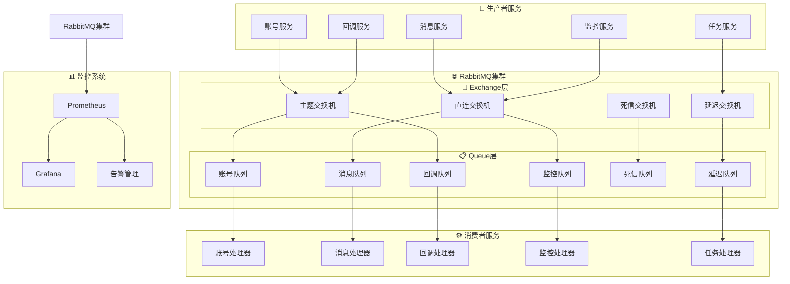

# 📨 消息队列详细设计
*WeWork Management Platform - Message Queue Design*

## 📖 目录

1. [设计概述](#设计概述)
2. [架构设计](#架构设计)
3. [消息路由设计](#消息路由设计)
4. [队列管理](#队列管理)
5. [消息处理策略](#消息处理策略)
6. [可靠性保障](#可靠性保障)
7. [性能优化](#性能优化)
8. [监控告警](#监控告警)

---

## 🎯 设计概述

### 设计原则
- **高可靠性**: 消息不丢失、不重复、有序处理
- **高性能**: 支持高并发消息处理
- **可扩展性**: 支持水平扩展和动态伸缩
- **解耦合**: 服务间异步通信，降低耦合度
- **可监控**: 完整的消息链路追踪和监控

### 技术选型
```yaml
消息中间件:
  - RabbitMQ 3.11
  - 集群模式部署
  - 镜像队列配置

管理工具:
  - RabbitMQ Management Plugin
  - Prometheus插件监控
  - 自定义管理界面

客户端:
  - Spring AMQP
  - 连接池管理
  - 自动重连机制
```

### 业务场景
```yaml
核心消息类型:
  1. 账号状态变更消息
  2. 消息发送任务队列
  3. 回调事件处理
  4. 系统监控告警
  5. 数据同步消息
  6. 定时任务调度

消息特征:
  - 消息量: 10万/分钟峰值
  - 延迟要求: P95 < 100ms
  - 可用性: 99.9%
  - 数据一致性: 最终一致性
```

---

## 🏗️ 架构设计

### 整体架构图



### 集群架构

#### 1. RabbitMQ集群配置
```yaml
# RabbitMQ集群配置
cluster_configuration:
  nodes:
    - rabbitmq-node1:
        hostname: "rabbitmq-node1"
        ip: "10.0.1.10"
        type: "disc"  # 磁盘节点
        role: "master"
    - rabbitmq-node2:
        hostname: "rabbitmq-node2" 
        ip: "10.0.1.11"
        type: "disc"  # 磁盘节点
        role: "master"
    - rabbitmq-node3:
        hostname: "rabbitmq-node3"
        ip: "10.0.1.12"
        type: "ram"   # 内存节点
        role: "slave"

  mirror_queues:
    policy_name: "ha-all"
    pattern: "^(account|message|callback)\\."
    definition:
      ha-mode: "all"
      ha-sync-mode: "automatic"
      ha-promote-on-shutdown: "always"
      ha-promote-on-failure: "always"

  load_balancer:
    type: "HAProxy"
    algorithm: "roundrobin"
    health_check: "tcp-check"
```

#### 2. Docker Compose部署
```yaml
# docker-compose.yml
version: '3.8'

services:
  rabbitmq-node1:
    image: rabbitmq:3.11-management-alpine
    hostname: rabbitmq-node1
    environment:
      RABBITMQ_ERLANG_COOKIE: "SWQOKODSQALRPCLNMEQG"
      RABBITMQ_DEFAULT_USER: "admin"
      RABBITMQ_DEFAULT_PASS: "${RABBITMQ_PASSWORD}"
      RABBITMQ_DEFAULT_VHOST: "wework"
    volumes:
      - rabbitmq1_data:/var/lib/rabbitmq
      - ./config/rabbitmq.conf:/etc/rabbitmq/rabbitmq.conf
      - ./config/definitions.json:/etc/rabbitmq/definitions.json
    ports:
      - "5672:5672"
      - "15672:15672"
    networks:
      - rabbitmq_cluster

  rabbitmq-node2:
    image: rabbitmq:3.11-management-alpine
    hostname: rabbitmq-node2
    environment:
      RABBITMQ_ERLANG_COOKIE: "SWQOKODSQALRPCLNMEQG"
      RABBITMQ_DEFAULT_USER: "admin"
      RABBITMQ_DEFAULT_PASS: "${RABBITMQ_PASSWORD}"
      RABBITMQ_DEFAULT_VHOST: "wework"
    volumes:
      - rabbitmq2_data:/var/lib/rabbitmq
      - ./config/rabbitmq.conf:/etc/rabbitmq/rabbitmq.conf
    depends_on:
      - rabbitmq-node1
    command: >
      bash -c "
        rabbitmq-server &
        sleep 30 &&
        rabbitmqctl stop_app &&
        rabbitmqctl join_cluster rabbit@rabbitmq-node1 &&
        rabbitmqctl start_app &&
        tail -f /dev/null
      "
    networks:
      - rabbitmq_cluster

  haproxy:
    image: haproxy:2.6-alpine
    ports:
      - "5673:5672"   # RabbitMQ负载均衡端口
      - "15673:15672" # Management负载均衡端口
    volumes:
      - ./config/haproxy.cfg:/usr/local/etc/haproxy/haproxy.cfg
    depends_on:
      - rabbitmq-node1
      - rabbitmq-node2
    networks:
      - rabbitmq_cluster

volumes:
  rabbitmq1_data:
  rabbitmq2_data:

networks:
  rabbitmq_cluster:
    driver: bridge
```

---

## 🎯 消息路由设计

### Exchange设计

#### 1. 主题交换机 (Topic Exchange)
```yaml
# 业务事件路由
exchange_name: "wework.events.topic"
exchange_type: "topic"
durable: true
auto_delete: false

routing_patterns:
  # 账号相关事件
  - "account.created.{tenant_id}"
  - "account.login.{status}.{tenant_id}"
  - "account.status.{old_status}.{new_status}.{tenant_id}"
  - "account.deleted.{tenant_id}"

  # 消息相关事件  
  - "message.sent.{account_id}.{tenant_id}"
  - "message.failed.{account_id}.{tenant_id}" 
  - "message.batch.{status}.{tenant_id}"

  # 回调相关事件
  - "callback.received.{notify_type}.{guid}"
  - "callback.processed.{notify_type}.{status}"

  # 系统事件
  - "system.alert.{level}.{module}"
  - "system.health.{service}.{status}"
```

#### 2. 直连交换机 (Direct Exchange)
```yaml
# 任务队列路由
exchange_name: "wework.tasks.direct"
exchange_type: "direct"
durable: true
auto_delete: false

routing_keys:
  - "send.message.single"     # 单条消息发送
  - "send.message.batch"      # 批量消息发送
  - "account.login.start"     # 启动账号登录
  - "account.recovery"        # 账号恢复
  - "callback.process"        # 回调处理
  - "report.generate"         # 报表生成
  - "monitor.collect"         # 监控数据收集
```

#### 3. 延迟交换机 (Delayed Exchange)
```yaml
# 延迟任务路由
exchange_name: "wework.delayed.exchange"
exchange_type: "x-delayed-message"
durable: true
auto_delete: false

delayed_tasks:
  - account_heartbeat_check:  # 账号心跳检查
      delay: 300000  # 5分钟
      routing_key: "account.heartbeat.check"
      
  - message_retry:            # 消息重试
      delay: 60000   # 1分钟
      routing_key: "message.retry"
      
  - login_timeout:            # 登录超时
      delay: 600000  # 10分钟  
      routing_key: "account.login.timeout"
      
  - batch_task_check:         # 批量任务检查
      delay: 30000   # 30秒
      routing_key: "batch.task.check"
```

---

## 📋 队列管理

### 队列设计

#### 1. 业务队列配置
```java
@Configuration
public class QueueConfig {
    
    /**
     * 账号处理队列
     */
    @Bean
    public Queue accountQueue() {
        Map<String, Object> args = new HashMap<>();
        args.put("x-dead-letter-exchange", "wework.dlx.exchange");
        args.put("x-dead-letter-routing-key", "account.dead");
        args.put("x-message-ttl", 300000); // 5分钟TTL
        args.put("x-max-length", 10000);   // 最大队列长度
        
        return QueueBuilder
            .durable("wework.account.queue")
            .withArguments(args)
            .build();
    }
    
    /**
     * 消息发送队列 (高优先级)
     */
    @Bean
    public Queue messageHighPriorityQueue() {
        Map<String, Object> args = new HashMap<>();
        args.put("x-dead-letter-exchange", "wework.dlx.exchange");
        args.put("x-dead-letter-routing-key", "message.high.dead");
        args.put("x-message-ttl", 600000); // 10分钟TTL
        args.put("x-max-priority", 10);    // 支持优先级
        
        return QueueBuilder
            .durable("wework.message.high.queue")
            .withArguments(args)
            .build();
    }
    
    /**
     * 消息发送队列 (普通优先级)
     */
    @Bean
    public Queue messageNormalPriorityQueue() {
        Map<String, Object> args = new HashMap<>();
        args.put("x-dead-letter-exchange", "wework.dlx.exchange");
        args.put("x-dead-letter-routing-key", "message.normal.dead");
        args.put("x-message-ttl", 300000);
        args.put("x-max-priority", 5);
        
        return QueueBuilder
            .durable("wework.message.normal.queue")
            .withArguments(args)
            .build();
    }
    
    /**
     * 回调处理队列
     */
    @Bean
    public Queue callbackQueue() {
        Map<String, Object> args = new HashMap<>();
        args.put("x-dead-letter-exchange", "wework.dlx.exchange");
        args.put("x-dead-letter-routing-key", "callback.dead");
        args.put("x-message-ttl", 180000); // 3分钟TTL
        
        return QueueBuilder
            .durable("wework.callback.queue")
            .withArguments(args)
            .build();
    }
    
    /**
     * 死信队列
     */
    @Bean
    public Queue deadLetterQueue() {
        return QueueBuilder
            .durable("wework.dead.letter.queue")
            .build();
    }
    
    // 队列绑定配置
    @Bean
    public Binding accountQueueBinding() {
        return BindingBuilder
            .bind(accountQueue())
            .to(eventsTopicExchange())
            .with("account.*.*");
    }
    
    @Bean
    public Binding messageHighPriorityBinding() {
        return BindingBuilder
            .bind(messageHighPriorityQueue())
            .to(tasksDirectExchange())
            .with("send.message.single");
    }
    
    @Bean
    public Binding messageNormalPriorityBinding() {
        return BindingBuilder
            .bind(messageNormalPriorityQueue())
            .to(tasksDirectExchange())
            .with("send.message.batch");
    }
}
```

#### 2. 动态队列管理
```java
@Service
public class QueueManagementService {
    
    @Autowired
    private RabbitTemplate rabbitTemplate;
    
    @Autowired
    private RabbitAdmin rabbitAdmin;
    
    /**
     * 动态创建租户队列
     */
    public void createTenantQueue(String tenantId) {
        String queueName = String.format("wework.tenant.%s.queue", tenantId);
        
        Map<String, Object> args = new HashMap<>();
        args.put("x-dead-letter-exchange", "wework.dlx.exchange");
        args.put("x-dead-letter-routing-key", "tenant.dead");
        args.put("x-message-ttl", 300000);
        args.put("x-max-length", 5000);
        
        Queue queue = QueueBuilder
            .durable(queueName)
            .withArguments(args)
            .build();
            
        rabbitAdmin.declareQueue(queue);
        
        // 绑定到交换机
        Binding binding = BindingBuilder
            .bind(queue)
            .to(eventsTopicExchange())
            .with(String.format("*.*.%s", tenantId));
            
        rabbitAdmin.declareBinding(binding);
        
        log.info("租户队列创建成功: {}", queueName);
    }
    
    /**
     * 删除租户队列
     */
    public void deleteTenantQueue(String tenantId) {
        String queueName = String.format("wework.tenant.%s.queue", tenantId);
        rabbitAdmin.deleteQueue(queueName);
        
        log.info("租户队列删除成功: {}", queueName);
    }
    
    /**
     * 获取队列信息
     */
    public QueueInformation getQueueInfo(String queueName) {
        Properties queueProperties = rabbitAdmin.getQueueProperties(queueName);
        
        if (queueProperties == null) {
            throw new QueueNotFoundException("队列不存在: " + queueName);
        }
        
        return QueueInformation.builder()
            .name(queueName)
            .messageCount((Integer) queueProperties.get("QUEUE_MESSAGE_COUNT"))
            .consumerCount((Integer) queueProperties.get("QUEUE_CONSUMER_COUNT"))
            .build();
    }
    
    /**
     * 清空队列
     */
    public void purgeQueue(String queueName) {
        rabbitAdmin.purgeQueue(queueName);
        log.info("队列清空成功: {}", queueName);
    }
}
```

---

## ⚙️ 消息处理策略

### 生产者设计

#### 1. 消息生产者基类
```java
@Component
public abstract class AbstractMessageProducer {
    
    @Autowired
    protected RabbitTemplate rabbitTemplate;
    
    @Autowired
    protected MessageRouter messageRouter;
    
    /**
     * 发送消息基础方法
     */
    protected void sendMessage(String exchange, String routingKey, Object payload, 
                             MessageProperties properties) {
        try {
            // 设置消息属性
            if (properties == null) {
                properties = new MessageProperties();
            }
            
            properties.setMessageId(UUID.randomUUID().toString());
            properties.setTimestamp(new Date());
            properties.setContentType("application/json");
            properties.setDeliveryMode(MessageDeliveryMode.PERSISTENT);
            
            // 构建消息
            Message message = new Message(JsonUtils.toJsonBytes(payload), properties);
            
            // 发送消息
            rabbitTemplate.send(exchange, routingKey, message);
            
            log.info("消息发送成功: exchange={}, routingKey={}, messageId={}", 
                    exchange, routingKey, properties.getMessageId());
                    
        } catch (Exception e) {
            log.error("消息发送失败: exchange={}, routingKey={}, error={}", 
                     exchange, routingKey, e.getMessage(), e);
            throw new MessageSendException("消息发送失败", e);
        }
    }
    
    /**
     * 发送高优先级消息
     */
    protected void sendHighPriorityMessage(String exchange, String routingKey, Object payload) {
        MessageProperties properties = new MessageProperties();
        properties.setPriority(10);
        sendMessage(exchange, routingKey, payload, properties);
    }
    
    /**
     * 发送带TTL的消息
     */
    protected void sendMessageWithTTL(String exchange, String routingKey, Object payload, long ttlMillis) {
        MessageProperties properties = new MessageProperties();
        properties.setExpiration(String.valueOf(ttlMillis));
        sendMessage(exchange, routingKey, payload, properties);
    }
}

// 账号事件生产者
@Component
public class AccountEventProducer extends AbstractMessageProducer {
    
    public void publishAccountCreated(String accountId, String tenantId) {
        AccountCreatedEvent event = AccountCreatedEvent.builder()
            .accountId(accountId)
            .tenantId(tenantId)
            .timestamp(Instant.now())
            .build();
            
        String routingKey = String.format("account.created.%s", tenantId);
        sendMessage("wework.events.topic", routingKey, event, null);
    }
    
    public void publishAccountStatusChanged(String accountId, String tenantId, 
                                          AccountStatus oldStatus, AccountStatus newStatus) {
        AccountStatusChangedEvent event = AccountStatusChangedEvent.builder()
            .accountId(accountId)
            .tenantId(tenantId)
            .oldStatus(oldStatus)
            .newStatus(newStatus)
            .timestamp(Instant.now())
            .build();
            
        String routingKey = String.format("account.status.%s.%s.%s", 
                                         oldStatus, newStatus, tenantId);
        sendMessage("wework.events.topic", routingKey, event, null);
    }
}

// 消息任务生产者
@Component
public class MessageTaskProducer extends AbstractMessageProducer {
    
    public void submitSingleMessageTask(SendMessageTask task) {
        // 根据优先级选择队列
        if (task.getPriority() >= 8) {
            sendHighPriorityMessage("wework.tasks.direct", "send.message.single", task);
        } else {
            sendMessage("wework.tasks.direct", "send.message.single", task, null);
        }
    }
    
    public void submitBatchMessageTask(BatchMessageTask task) {
        sendMessage("wework.tasks.direct", "send.message.batch", task, null);
    }
    
    public void scheduleMessageRetry(String messageId, int retryCount) {
        MessageRetryTask task = MessageRetryTask.builder()
            .messageId(messageId)
            .retryCount(retryCount)
            .scheduledTime(Instant.now().plusSeconds(60 * retryCount)) // 指数退避
            .build();
            
        long delay = 60000 * retryCount; // 重试延迟
        messageRouter.sendDelayedMessage("message.retry", task, delay);
    }
}
```

### 消费者设计

#### 1. 消息消费者基类
```java
@Component
public abstract class AbstractMessageConsumer {
    
    protected final Logger log = LoggerFactory.getLogger(getClass());
    
    /**
     * 处理消息的模板方法
     */
    protected void processMessage(Message message, Channel channel, long deliveryTag) {
        String messageId = message.getMessageProperties().getMessageId();
        String payload = new String(message.getBody());
        
        try {
            log.info("开始处理消息: messageId={}, payload={}", messageId, payload);
            
            // 业务处理
            boolean success = handleMessage(payload, message.getMessageProperties());
            
            if (success) {
                // 确认消息
                channel.basicAck(deliveryTag, false);
                log.info("消息处理成功: messageId={}", messageId);
            } else {
                // 拒绝消息，重新入队
                channel.basicNack(deliveryTag, false, true);
                log.warn("消息处理失败，重新入队: messageId={}", messageId);
            }
            
        } catch (Exception e) {
            log.error("消息处理异常: messageId={}, error={}", messageId, e.getMessage(), e);
            
            try {
                // 检查重试次数
                int retryCount = getRetryCount(message.getMessageProperties());
                if (retryCount < 3) {
                    // 重新入队重试
                    channel.basicNack(deliveryTag, false, true);
                } else {
                    // 发送到死信队列
                    channel.basicNack(deliveryTag, false, false);
                }
            } catch (Exception ackException) {
                log.error("消息确认失败: messageId={}", messageId, ackException);
            }
        }
    }
    
    /**
     * 业务处理抽象方法
     */
    protected abstract boolean handleMessage(String payload, MessageProperties properties);
    
    /**
     * 获取重试次数
     */
    private int getRetryCount(MessageProperties properties) {
        Object retryCount = properties.getHeaders().get("x-retry-count");
        return retryCount != null ? (Integer) retryCount : 0;
    }
}

// 账号事件消费者
@Component
public class AccountEventConsumer extends AbstractMessageConsumer {
    
    @Autowired
    private AccountService accountService;
    
    @Autowired
    private NotificationService notificationService;
    
    @RabbitListener(queues = "wework.account.queue")
    public void handleAccountEvent(Message message, Channel channel, 
                                  @Header(AmqpHeaders.DELIVERY_TAG) long deliveryTag) {
        processMessage(message, channel, deliveryTag);
    }
    
    @Override
    protected boolean handleMessage(String payload, MessageProperties properties) {
        try {
            // 解析事件类型
            String eventType = (String) properties.getHeaders().get("eventType");
            
            switch (eventType) {
                case "created":
                    handleAccountCreated(payload);
                    break;
                case "status":
                    handleAccountStatusChanged(payload);
                    break;
                case "deleted":
                    handleAccountDeleted(payload);
                    break;
                default:
                    log.warn("未知的账号事件类型: {}", eventType);
                    return false;
            }
            
            return true;
            
        } catch (Exception e) {
            log.error("账号事件处理失败: payload={}, error={}", payload, e.getMessage(), e);
            return false;
        }
    }
    
    private void handleAccountCreated(String payload) {
        AccountCreatedEvent event = JsonUtils.fromJson(payload, AccountCreatedEvent.class);
        
        // 初始化账号监控
        accountService.initializeAccountMonitoring(event.getAccountId());
        
        // 发送创建成功通知
        notificationService.sendAccountCreatedNotification(event);
        
        log.info("账号创建事件处理完成: accountId={}", event.getAccountId());
    }
    
    private void handleAccountStatusChanged(String payload) {
        AccountStatusChangedEvent event = JsonUtils.fromJson(payload, AccountStatusChangedEvent.class);
        
        // 更新监控状态
        accountService.updateMonitoringStatus(event.getAccountId(), event.getNewStatus());
        
        // 状态异常告警
        if (event.getNewStatus() == AccountStatus.ERROR) {
            notificationService.sendAccountErrorAlert(event);
        }
        
        log.info("账号状态变更事件处理完成: accountId={}, {} -> {}", 
                event.getAccountId(), event.getOldStatus(), event.getNewStatus());
    }
}

// 消息任务消费者
@Component
public class MessageTaskConsumer extends AbstractMessageConsumer {
    
    @Autowired
    private MessageSendingService messageSendingService;
    
    @RabbitListener(queues = "wework.message.high.queue", concurrency = "3-10")
    public void handleHighPriorityMessage(Message message, Channel channel,
                                        @Header(AmqpHeaders.DELIVERY_TAG) long deliveryTag) {
        processMessage(message, channel, deliveryTag);
    }
    
    @RabbitListener(queues = "wework.message.normal.queue", concurrency = "2-5")
    public void handleNormalPriorityMessage(Message message, Channel channel,
                                          @Header(AmqpHeaders.DELIVERY_TAG) long deliveryTag) {
        processMessage(message, channel, deliveryTag);
    }
    
    @Override
    protected boolean handleMessage(String payload, MessageProperties properties) {
        try {
            String taskType = (String) properties.getHeaders().get("taskType");
            
            if ("message.single".equals(taskType)) {
                SendMessageTask task = JsonUtils.fromJson(payload, SendMessageTask.class);
                return messageSendingService.sendSingleMessage(task);
            } else if ("message.batch".equals(taskType)) {
                BatchMessageTask task = JsonUtils.fromJson(payload, BatchMessageTask.class);
                return messageSendingService.sendBatchMessage(task);
            }
            
            return false;
            
        } catch (Exception e) {
            log.error("消息任务处理失败: payload={}, error={}", payload, e.getMessage(), e);
            return false;
        }
    }
}
```

---

## 🛡️ 可靠性保障

### 消息确认机制

#### 1. 生产者确认
```java
@Configuration
public class RabbitReliabilityConfig {
    
    @Bean
    public RabbitTemplate reliableRabbitTemplate(ConnectionFactory connectionFactory) {
        RabbitTemplate template = new RabbitTemplate(connectionFactory);
        
        // 开启生产者确认
        template.setConfirmCallback((correlationData, ack, cause) -> {
            if (ack) {
                log.info("消息发送确认成功: correlationData={}", correlationData);
            } else {
                log.error("消息发送确认失败: correlationData={}, cause={}", correlationData, cause);
                // 处理发送失败的消息
                handleSendFailure(correlationData, cause);
            }
        });
        
        // 开启消息返回
        template.setReturnsCallback(returned -> {
            log.error("消息被退回: exchange={}, routingKey={}, replyCode={}, replyText={}", 
                     returned.getExchange(), returned.getRoutingKey(), 
                     returned.getReplyCode(), returned.getReplyText());
            // 处理被退回的消息
            handleReturnedMessage(returned);
        });
        
        return template;
    }
    
    private void handleSendFailure(CorrelationData correlationData, String cause) {
        // 记录失败日志
        // 可能的处理：重试、告警、存储到数据库等
    }
    
    private void handleReturnedMessage(ReturnedMessage returned) {
        // 处理被退回的消息
        // 可能的处理：重新路由、存储、告警等
    }
}
```

#### 2. 事务性消息
```java
@Service
@Transactional
public class TransactionalMessageService {
    
    @Autowired
    private RabbitTemplate rabbitTemplate;
    
    @Autowired
    private MessageOutboxRepository outboxRepository;
    
    /**
     * 事务性消息发送
     */
    public void sendTransactionalMessage(String exchange, String routingKey, Object payload) {
        // 1. 在同一事务中保存消息到Outbox表
        MessageOutbox outbox = MessageOutbox.builder()
            .id(UUID.randomUUID().toString())
            .exchange(exchange)
            .routingKey(routingKey)
            .payload(JsonUtils.toJson(payload))
            .status(MessageStatus.PENDING)
            .createdAt(LocalDateTime.now())
            .build();
            
        outboxRepository.save(outbox);
        
        // 2. 事务提交后异步发送消息
        TransactionSynchronizationManager.registerSynchronization(
            new TransactionSynchronization() {
                @Override
                public void afterCommit() {
                    try {
                        rabbitTemplate.convertAndSend(exchange, routingKey, payload);
                        
                        // 更新Outbox状态
                        outbox.setStatus(MessageStatus.SENT);
                        outbox.setSentAt(LocalDateTime.now());
                        outboxRepository.save(outbox);
                        
                    } catch (Exception e) {
                        log.error("事务性消息发送失败: outboxId={}", outbox.getId(), e);
                        outbox.setStatus(MessageStatus.FAILED);
                        outbox.setErrorMessage(e.getMessage());
                        outboxRepository.save(outbox);
                    }
                }
            }
        );
    }
    
    /**
     * 重试失败的消息
     */
    @Scheduled(fixedDelay = 60000) // 每分钟执行一次
    public void retryFailedMessages() {
        List<MessageOutbox> failedMessages = outboxRepository.findByStatusAndCreatedAtAfter(
            MessageStatus.FAILED, 
            LocalDateTime.now().minusHours(24) // 24小时内的失败消息
        );
        
        for (MessageOutbox outbox : failedMessages) {
            try {
                rabbitTemplate.convertAndSend(outbox.getExchange(), outbox.getRoutingKey(), 
                                            JsonUtils.fromJson(outbox.getPayload(), Object.class));
                
                outbox.setStatus(MessageStatus.SENT);
                outbox.setSentAt(LocalDateTime.now());
                outboxRepository.save(outbox);
                
                log.info("失败消息重试成功: outboxId={}", outbox.getId());
                
            } catch (Exception e) {
                log.error("失败消息重试失败: outboxId={}", outbox.getId(), e);
                outbox.setRetryCount(outbox.getRetryCount() + 1);
                outboxRepository.save(outbox);
            }
        }
    }
}
```

### 死信队列处理

#### 1. 死信队列配置
```java
@Configuration
public class DeadLetterConfig {
    
    @Bean
    public Queue deadLetterQueue() {
        return QueueBuilder
            .durable("wework.dead.letter.queue")
            .build();
    }
    
    @Bean
    public DirectExchange deadLetterExchange() {
        return ExchangeBuilder
            .directExchange("wework.dlx.exchange")
            .durable(true)
            .build();
    }
    
    @Bean
    public Binding deadLetterBinding() {
        return BindingBuilder
            .bind(deadLetterQueue())
            .to(deadLetterExchange())
            .with("*.dead");
    }
}

// 死信消息处理器
@Component
public class DeadLetterHandler {
    
    @Autowired
    private MessageRecoveryService messageRecoveryService;
    
    @Autowired
    private AlertService alertService;
    
    @RabbitListener(queues = "wework.dead.letter.queue")
    public void handleDeadLetter(Message message, Channel channel,
                                @Header(AmqpHeaders.DELIVERY_TAG) long deliveryTag) {
        try {
            String messageId = message.getMessageProperties().getMessageId();
            String originalQueue = (String) message.getMessageProperties().getHeaders().get("x-first-death-queue");
            String deathReason = (String) message.getMessageProperties().getHeaders().get("x-first-death-reason");
            
            log.warn("处理死信消息: messageId={}, originalQueue={}, reason={}", 
                    messageId, originalQueue, deathReason);
            
            // 记录死信消息
            messageRecoveryService.recordDeadMessage(messageId, originalQueue, deathReason, 
                                                   new String(message.getBody()));
            
            // 发送告警
            alertService.sendDeadLetterAlert(messageId, originalQueue, deathReason);
            
            // 确认处理
            channel.basicAck(deliveryTag, false);
            
        } catch (Exception e) {
            log.error("死信消息处理失败", e);
            try {
                channel.basicNack(deliveryTag, false, false);
            } catch (Exception ackException) {
                log.error("死信消息确认失败", ackException);
            }
        }
    }
}
```

#### 2. 消息恢复机制
```java
@Service
public class MessageRecoveryService {
    
    @Autowired
    private DeadMessageRepository deadMessageRepository;
    
    @Autowired
    private RabbitTemplate rabbitTemplate;
    
    /**
     * 记录死信消息
     */
    public void recordDeadMessage(String messageId, String originalQueue, 
                                String deathReason, String payload) {
        DeadMessage deadMessage = DeadMessage.builder()
            .id(UUID.randomUUID().toString())
            .messageId(messageId)
            .originalQueue(originalQueue)
            .deathReason(deathReason)
            .payload(payload)
            .createdAt(LocalDateTime.now())
            .status(DeadMessageStatus.PENDING)
            .build();
            
        deadMessageRepository.save(deadMessage);
    }
    
    /**
     * 手动恢复死信消息
     */
    public void recoverDeadMessage(String deadMessageId) {
        DeadMessage deadMessage = deadMessageRepository.findById(deadMessageId)
            .orElseThrow(() -> new DeadMessageNotFoundException(deadMessageId));
            
        try {
            // 解析原始队列和路由信息
            String exchange = determineExchange(deadMessage.getOriginalQueue());
            String routingKey = determineRoutingKey(deadMessage.getOriginalQueue());
            
            // 重新发送消息
            rabbitTemplate.convertAndSend(exchange, routingKey, deadMessage.getPayload());
            
            // 更新状态
            deadMessage.setStatus(DeadMessageStatus.RECOVERED);
            deadMessage.setRecoveredAt(LocalDateTime.now());
            deadMessageRepository.save(deadMessage);
            
            log.info("死信消息恢复成功: deadMessageId={}, messageId={}", 
                    deadMessageId, deadMessage.getMessageId());
                    
        } catch (Exception e) {
            log.error("死信消息恢复失败: deadMessageId={}", deadMessageId, e);
            deadMessage.setStatus(DeadMessageStatus.FAILED);
            deadMessage.setErrorMessage(e.getMessage());
            deadMessageRepository.save(deadMessage);
            throw e;
        }
    }
    
    /**
     * 批量恢复死信消息
     */
    public void batchRecoverDeadMessages(List<String> deadMessageIds) {
        for (String deadMessageId : deadMessageIds) {
            try {
                recoverDeadMessage(deadMessageId);
            } catch (Exception e) {
                log.error("批量恢复失败: deadMessageId={}", deadMessageId, e);
            }
        }
    }
}
```

---

## ⚡ 性能优化

### 连接池配置

#### 1. 连接池优化
```yaml
# application.yml
spring:
  rabbitmq:
    host: localhost
    port: 5672
    username: ${RABBITMQ_USERNAME}
    password: ${RABBITMQ_PASSWORD}
    virtual-host: wework
    
    # 连接池配置
    cache:
      connection:
        mode: channel
        size: 50  # 连接池大小
      channel:
        size: 100 # 通道池大小
        checkout-timeout: 5000
    
    # 连接超时配置
    connection-timeout: 10000
    timeout: 60000
    
    # 生产者配置
    publisher-confirm-type: correlated
    publisher-returns: true
    
    # 消费者配置  
    listener:
      simple:
        acknowledge-mode: manual
        prefetch: 10
        concurrency: 3
        max-concurrency: 10
        retry:
          enabled: true
          max-attempts: 3
          initial-interval: 1000
          multiplier: 2
          max-interval: 10000
```

#### 2. 性能监控配置
```java
@Configuration
@EnableRabbitMetrics
public class RabbitPerformanceConfig {
    
    @Bean
    public MeterRegistry meterRegistry() {
        return new PrometheusMeterRegistry(PrometheusConfig.DEFAULT);
    }
    
    @Bean
    public RabbitMetricsCollector rabbitMetricsCollector(MeterRegistry meterRegistry) {
        return new RabbitMetricsCollector(meterRegistry);
    }
    
    // 自定义性能指标
    @EventListener
    public void handleRabbitEvent(RabbitApplicationEvent event) {
        if (event instanceof MessageSentEvent) {
            MessageSentEvent sentEvent = (MessageSentEvent) event;
            Counter.builder("rabbitmq.messages.sent")
                .tag("exchange", sentEvent.getExchange())
                .tag("routing_key", sentEvent.getRoutingKey())
                .register(meterRegistry)
                .increment();
        }
    }
}

// 性能监控服务
@Service
public class RabbitMQPerformanceService {
    
    @Autowired
    private RabbitAdmin rabbitAdmin;
    
    @Autowired
    private MeterRegistry meterRegistry;
    
    /**
     * 收集队列性能指标
     */
    @Scheduled(fixedDelay = 30000) // 每30秒收集一次
    public void collectQueueMetrics() {
        List<String> queueNames = Arrays.asList(
            "wework.account.queue",
            "wework.message.high.queue", 
            "wework.message.normal.queue",
            "wework.callback.queue"
        );
        
        for (String queueName : queueNames) {
            try {
                Properties properties = rabbitAdmin.getQueueProperties(queueName);
                if (properties != null) {
                    int messageCount = (Integer) properties.get("QUEUE_MESSAGE_COUNT");
                    int consumerCount = (Integer) properties.get("QUEUE_CONSUMER_COUNT");
                    
                    // 注册指标
                    Gauge.builder("rabbitmq.queue.messages")
                        .tag("queue", queueName)
                        .register(meterRegistry, () -> messageCount);
                        
                    Gauge.builder("rabbitmq.queue.consumers")
                        .tag("queue", queueName)
                        .register(meterRegistry, () -> consumerCount);
                }
            } catch (Exception e) {
                log.error("收集队列指标失败: queue={}", queueName, e);
            }
        }
    }
    
    /**
     * 性能告警检查
     */
    @Scheduled(fixedDelay = 60000) // 每分钟检查一次
    public void checkPerformanceAlerts() {
        // 检查队列积压
        checkQueueBacklog();
        
        // 检查消费者状态
        checkConsumerStatus();
        
        // 检查内存使用率
        checkMemoryUsage();
    }
    
    private void checkQueueBacklog() {
        // 实现队列积压检查逻辑
    }
    
    private void checkConsumerStatus() {
        // 实现消费者状态检查逻辑  
    }
    
    private void checkMemoryUsage() {
        // 实现内存使用率检查逻辑
    }
}
```

### 批量处理优化

#### 1. 批量消息处理
```java
@Component
public class BatchMessageProcessor {
    
    @Autowired
    private MessageService messageService;
    
    private final List<BatchMessageTask> batchBuffer = new ArrayList<>();
    private final Object bufferLock = new Object();
    private volatile boolean processing = false;
    
    /**
     * 添加消息到批量缓冲区
     */
    public void addToBatch(BatchMessageTask task) {
        synchronized (bufferLock) {
            batchBuffer.add(task);
            
            // 达到批量大小或超时触发处理
            if (batchBuffer.size() >= 100 || shouldFlushByTime()) {
                triggerBatchProcessing();
            }
        }
    }
    
    /**
     * 触发批量处理
     */
    private void triggerBatchProcessing() {
        if (!processing) {
            processing = true;
            CompletableFuture.runAsync(this::processBatch);
        }
    }
    
    /**
     * 处理批量消息
     */
    private void processBatch() {
        List<BatchMessageTask> currentBatch;
        
        synchronized (bufferLock) {
            currentBatch = new ArrayList<>(batchBuffer);
            batchBuffer.clear();
        }
        
        if (!currentBatch.isEmpty()) {
            try {
                // 批量处理消息
                messageService.processBatchMessages(currentBatch);
                
                log.info("批量消息处理完成: count={}", currentBatch.size());
                
            } catch (Exception e) {
                log.error("批量消息处理失败: count={}", currentBatch.size(), e);
                
                // 失败时重新入队单个处理
                for (BatchMessageTask task : currentBatch) {
                    messageService.processMessageIndividually(task);
                }
            }
        }
        
        processing = false;
    }
    
    /**
     * 定时刷新缓冲区
     */
    @Scheduled(fixedDelay = 5000) // 每5秒检查一次
    public void flushBuffer() {
        synchronized (bufferLock) {
            if (!batchBuffer.isEmpty() && !processing) {
                triggerBatchProcessing();
            }
        }
    }
}
```

---

## 📊 监控告警

### 监控指标

#### 1. 核心监控指标
```yaml
队列指标:
  - 队列消息数量 (queue.messages.count)
  - 队列消费者数量 (queue.consumers.count)  
  - 消息发布速率 (queue.messages.publish.rate)
  - 消息消费速率 (queue.messages.consume.rate)
  - 消息确认速率 (queue.messages.ack.rate)
  - 消息拒绝速率 (queue.messages.nack.rate)

连接指标:
  - 连接数量 (connections.count)
  - 通道数量 (channels.count)
  - 连接创建速率 (connections.create.rate)
  - 连接关闭速率 (connections.close.rate)

性能指标:
  - 消息处理延迟 (message.processing.latency)
  - 队列积压时间 (queue.backlog.time)
  - 死信消息数量 (dead.letter.count)
  - 错误率 (error.rate)

资源指标:
  - 内存使用率 (memory.usage.percent)
  - 磁盘使用率 (disk.usage.percent)
  - CPU使用率 (cpu.usage.percent)
  - 网络I/O (network.io.bytes)
```

#### 2. 监控配置
```java
@Component
public class RabbitMQMonitoring {
    
    @Autowired
    private MeterRegistry meterRegistry;
    
    @Autowired
    private RabbitAdmin rabbitAdmin;
    
    /**
     * 注册自定义监控指标
     */
    @PostConstruct
    public void registerMetrics() {
        // 队列消息数量指标
        Gauge.builder("rabbitmq.queue.messages.total")
            .description("Total messages in all queues")
            .register(meterRegistry, this, RabbitMQMonitoring::getTotalMessages);
            
        // 死信消息数量指标
        Gauge.builder("rabbitmq.dead.letter.messages")
            .description("Messages in dead letter queue")
            .register(meterRegistry, this, RabbitMQMonitoring::getDeadLetterMessages);
            
        // 连接数量指标
        Gauge.builder("rabbitmq.connections.total")
            .description("Total active connections")
            .register(meterRegistry, this, RabbitMQMonitoring::getTotalConnections);
    }
    
    /**
     * 消息处理计时器
     */
    public Timer.Sample startMessageProcessing(String queueName) {
        return Timer.start(meterRegistry);
    }
    
    public void stopMessageProcessing(Timer.Sample sample, String queueName, boolean success) {
        sample.stop(Timer.builder("rabbitmq.message.processing.time")
            .description("Message processing time")
            .tag("queue", queueName)
            .tag("status", success ? "success" : "failure")
            .register(meterRegistry));
    }
    
    /**
     * 记录消息处理结果
     */
    public void recordMessageProcessed(String queueName, String status) {
        Counter.builder("rabbitmq.messages.processed.total")
            .description("Total processed messages")
            .tag("queue", queueName)
            .tag("status", status)
            .register(meterRegistry)
            .increment();
    }
    
    // 私有方法实现
    private double getTotalMessages() {
        // 实现获取所有队列消息总数的逻辑
        return 0;
    }
    
    private double getDeadLetterMessages() {
        // 实现获取死信队列消息数的逻辑
        return 0;
    }
    
    private double getTotalConnections() {
        // 实现获取连接总数的逻辑
        return 0;
    }
}
```

### 告警规则

#### 1. Prometheus告警规则
```yaml
# rabbitmq-alerts.yml
groups:
  - name: rabbitmq-alerts
    rules:
      # 队列积压告警
      - alert: RabbitMQQueueBacklog
        expr: rabbitmq_queue_messages > 1000
        for: 5m
        labels:
          severity: warning
          service: rabbitmq
        annotations:
          summary: "RabbitMQ队列积压"
          description: "队列 {{ $labels.queue }} 消息积压超过1000条，当前: {{ $value }}"
          
      # 消费者下线告警  
      - alert: RabbitMQNoConsumers
        expr: rabbitmq_queue_consumers == 0 and rabbitmq_queue_messages > 0
        for: 2m
        labels:
          severity: critical
          service: rabbitmq
        annotations:
          summary: "RabbitMQ队列无消费者"
          description: "队列 {{ $labels.queue }} 有消息但无消费者处理"
          
      # 内存使用率告警
      - alert: RabbitMQHighMemoryUsage
        expr: rabbitmq_memory_usage_percent > 80
        for: 5m
        labels:
          severity: warning
          service: rabbitmq  
        annotations:
          summary: "RabbitMQ内存使用率过高"
          description: "RabbitMQ内存使用率达到 {{ $value }}%"
          
      # 死信消息告警
      - alert: RabbitMQDeadLetterMessages
        expr: increase(rabbitmq_dead_letter_messages[5m]) > 10
        for: 1m
        labels:
          severity: critical
          service: rabbitmq
        annotations:
          summary: "RabbitMQ死信消息增长"
          description: "5分钟内死信消息增长超过10条"
          
      # 连接数异常告警
      - alert: RabbitMQHighConnections
        expr: rabbitmq_connections_total > 100
        for: 10m
        labels:
          severity: warning
          service: rabbitmq
        annotations:
          summary: "RabbitMQ连接数过高"
          description: "RabbitMQ连接数达到 {{ $value }}，可能存在连接泄漏"
```

#### 2. 告警处理器
```java
@Component
public class RabbitMQAlertHandler {
    
    @Autowired
    private NotificationService notificationService;
    
    @Autowired
    private MessageRecoveryService messageRecoveryService;
    
    /**
     * 处理队列积压告警
     */
    @EventListener
    public void handleQueueBacklogAlert(QueueBacklogAlert alert) {
        log.warn("队列积压告警: queue={}, messageCount={}", 
                alert.getQueueName(), alert.getMessageCount());
        
        // 发送告警通知
        notificationService.sendAlert(
            "队列积压告警",
            String.format("队列 %s 消息积压 %d 条", alert.getQueueName(), alert.getMessageCount()),
            AlertLevel.WARNING
        );
        
        // 自动扩容消费者
        if (alert.getMessageCount() > 5000) {
            autoScaleConsumers(alert.getQueueName());
        }
    }
    
    /**
     * 处理死信消息告警
     */
    @EventListener
    public void handleDeadLetterAlert(DeadLetterAlert alert) {
        log.error("死信消息告警: count={}", alert.getCount());
        
        // 发送紧急告警
        notificationService.sendAlert(
            "死信消息告警", 
            String.format("死信队列新增 %d 条消息", alert.getCount()),
            AlertLevel.CRITICAL
        );
        
        // 触发死信消息分析
        analyzeDeadLetterPattern(alert);
    }
    
    /**
     * 自动扩容消费者
     */
    private void autoScaleConsumers(String queueName) {
        try {
            // 基于队列名称确定消费者类型并扩容
            switch (queueName) {
                case "wework.message.high.queue":
                    scaleMessageConsumers(queueName, 2); // 增加2个消费者
                    break;
                case "wework.account.queue":
                    scaleAccountConsumers(queueName, 1); // 增加1个消费者
                    break;
                default:
                    log.warn("未知队列类型，无法自动扩容: {}", queueName);
            }
        } catch (Exception e) {
            log.error("自动扩容失败: queue={}", queueName, e);
        }
    }
    
    /**
     * 分析死信消息模式
     */
    private void analyzeDeadLetterPattern(DeadLetterAlert alert) {
        // 分析死信消息的原因模式
        // 如果是特定类型的错误，可以自动修复
        CompletableFuture.runAsync(() -> {
            try {
                messageRecoveryService.analyzeDeadLetterPattern();
            } catch (Exception e) {
                log.error("死信消息分析失败", e);
            }
        });
    }
}
```

---

## 📋 总结

### 设计特点
1. **高可靠性**: 消息确认、死信队列、事务性消息保证可靠传输
2. **高性能**: 连接池、批量处理、优先级队列提升处理效率  
3. **可扩展性**: 集群部署、动态队列、自动扩容支持业务增长
4. **可监控**: 完整的指标体系、告警机制、性能分析
5. **易维护**: 标准化配置、自动化运维、故障自愈

### 技术亮点
- 🏗️ **集群架构** 镜像队列保证高可用性
- 🎯 **智能路由** Topic/Direct/Delayed多种路由策略
- ⚡ **性能优化** 连接池、批量处理、优先级队列
- 🛡️ **可靠保障** 生产者确认、死信处理、事务消息
- 📊 **全面监控** Prometheus指标、Grafana可视化、智能告警

### 性能指标
- **消息吞吐量**: > 10万条/分钟
- **处理延迟**: P95 < 100ms
- **消息可靠性**: 99.99%不丢失
- **系统可用性**: 99.9%
- **扩展能力**: 支持水平扩展

### 下一步工作
- 缓存架构详细设计
- 完成Phase 1全部设计任务

---

**文档状态**: Phase 1 - 已完成消息队列详细设计  
**下一步**: 开始缓存架构详细设计  
**负责人**: 消息队列设计团队
