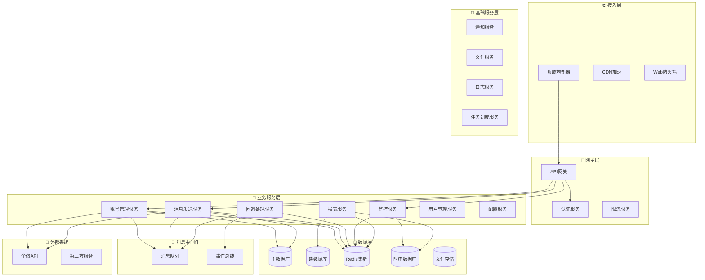

# 🏗️ 微服务架构详细设计
*WeWork Management Platform - Microservice Architecture Design*

## 📖 目录

1. [架构概述](#架构概述)
2. [服务拆分策略](#服务拆分策略)
3. [核心服务设计](#核心服务设计)
4. [服务间通信](#服务间通信)
5. [数据一致性](#数据一致性)
6. [服务治理](#服务治理)
7. [部署架构](#部署架构)

---

## 🎯 架构概述

### 整体架构图



### 架构特点

- **领域驱动**: 按业务领域拆分服务，确保高内聚
- **事件驱动**: 服务间通过事件解耦，提升可扩展性
- **数据隔离**: 每个服务拥有独立的数据存储
- **无状态设计**: 所有服务支持水平扩展
- **异步优先**: 使用消息队列处理耗时操作

---

## 🧩 服务拆分策略

### 拆分原则

#### 1. 业务边界拆分
```yaml
账号域 (Account Domain):
  - 企微账号管理
  - 登录状态管理
  - 会话信息管理

消息域 (Message Domain):
  - 消息发送处理
  - 模板管理
  - 发送结果跟踪

监控域 (Monitor Domain):
  - 系统指标收集
  - 业务指标统计
  - 告警规则处理

用户域 (User Domain):
  - 用户账号管理
  - 权限控制
  - 组织架构管理
```

#### 2. 数据边界拆分
```yaml
数据隔离策略:
  - 每个服务独立数据库
  - 通过API访问其他服务数据
  - 事件同步关键数据
  - 避免分布式事务
```

#### 3. 团队边界拆分
```yaml
团队职责对应:
  - 账号团队 → 账号管理服务
  - 消息团队 → 消息发送服务
  - 监控团队 → 监控告警服务
  - 平台团队 → 基础服务
```

### 服务清单

| 服务名称 | 职责范围 | 团队归属 | 数据库 | 依赖服务 |
|---------|---------|---------|--------|----------|
| 🚪 API网关服务 | 请求路由、认证鉴权 | 平台团队 | 无 | 认证服务 |
| 👤 用户管理服务 | 用户CRUD、权限管理 | 平台团队 | user_db | 无 |
| 📱 账号管理服务 | 企微账号管理 | 账号团队 | account_db | 用户服务 |
| 💬 消息发送服务 | 消息发送、模板管理 | 消息团队 | message_db | 账号服务 |
| 🔔 回调处理服务 | 企微回调处理 | 消息团队 | callback_db | 账号服务 |
| 📊 监控服务 | 监控指标、告警 | 监控团队 | monitor_db | 通知服务 |
| 📈 报表服务 | 数据统计、报表生成 | 数据团队 | report_db | 多个服务 |
| 🔧 配置服务 | 系统配置管理 | 平台团队 | config_db | 无 |
| 📧 通知服务 | 邮件、短信通知 | 平台团队 | notification_db | 无 |
| 📁 文件服务 | 文件上传、存储 | 平台团队 | file_db | 对象存储 |

---

## 🏢 核心服务设计

### 1. 账号管理服务 (Account Service)

#### 服务职责
```yaml
核心功能:
  - 企微账号生命周期管理
  - 登录状态监控和恢复
  - 会话信息同步和管理
  - 账号配置和设置

技术职责:
  - 企微API调用封装
  - 账号状态机管理
  - 登录流程控制
  - 异常恢复处理
```

#### 服务接口
```java
@RestController
@RequestMapping("/api/v1/accounts")
public class AccountController {
    
    // 创建企微账号
    @PostMapping
    public ResponseEntity<AccountResponse> createAccount(
        @RequestBody CreateAccountRequest request) {
        // 创建账号逻辑
    }
    
    // 启动账号登录
    @PostMapping("/{accountId}/login")
    public ResponseEntity<LoginResponse> startLogin(
        @PathVariable String accountId) {
        // 登录流程启动
    }
    
    // 获取账号状态
    @GetMapping("/{accountId}/status")
    public ResponseEntity<AccountStatusResponse> getAccountStatus(
        @PathVariable String accountId) {
        // 状态查询
    }
    
    // 获取会话列表
    @GetMapping("/{accountId}/conversations")
    public ResponseEntity<ConversationListResponse> getConversations(
        @PathVariable String accountId,
        @RequestParam(defaultValue = "0") int page,
        @RequestParam(defaultValue = "50") int size) {
        // 会话列表获取
    }
    
    // 更新账号配置
    @PutMapping("/{accountId}/config")
    public ResponseEntity<Void> updateAccountConfig(
        @PathVariable String accountId,
        @RequestBody AccountConfigRequest request) {
        // 配置更新
    }
}
```

#### 核心领域模型
```java
// 账号聚合根
@Entity
@Table(name = "accounts")
public class Account {
    @Id
    private String id;
    private String tenantId;
    private String accountName;
    private String guid;  // 企微实例ID
    private String phone;
    private AccountStatus status;
    private AccountConfig config;
    private LocalDateTime lastLoginTime;
    private LocalDateTime lastHeartbeatTime;
    
    // 业务方法
    public void startLogin() {
        // 启动登录流程
        this.status = AccountStatus.LOGGING_IN;
        // 发布领域事件
        DomainEventPublisher.publish(new AccountLoginStartedEvent(this.id));
    }
    
    public void markOnline() {
        this.status = AccountStatus.ONLINE;
        this.lastLoginTime = LocalDateTime.now();
        this.lastHeartbeatTime = LocalDateTime.now();
        DomainEventPublisher.publish(new AccountOnlineEvent(this.id));
    }
    
    public void markOffline() {
        this.status = AccountStatus.OFFLINE;
        DomainEventPublisher.publish(new AccountOfflineEvent(this.id));
    }
    
    public boolean needsRecovery() {
        return this.status == AccountStatus.ONLINE && 
               this.lastHeartbeatTime.isBefore(LocalDateTime.now().minusMinutes(5));
    }
}

// 账号状态枚举
public enum AccountStatus {
    CREATED,        // 已创建
    LOGGING_IN,     // 登录中
    WAITING_SCAN,   // 等待扫码
    WAITING_CONFIRM,// 等待确认
    NEED_VERIFY,    // 需要验证
    ONLINE,         // 在线
    OFFLINE,        // 离线
    ERROR,          // 异常
    RECOVERING      // 恢复中
}
```

#### 应用服务
```java
@Service
@Transactional
public class AccountApplicationService {
    
    private final AccountRepository accountRepository;
    private final WeWorkApiClient weWorkApiClient;
    private final EventPublisher eventPublisher;
    
    public Account createAccount(CreateAccountCommand command) {
        // 1. 验证租户权限
        validateTenantPermission(command.getTenantId());
        
        // 2. 创建企微实例
        String guid = weWorkApiClient.createInstance();
        
        // 3. 创建账号聚合
        Account account = new Account(
            command.getTenantId(),
            command.getAccountName(),
            command.getPhone(),
            guid
        );
        
        // 4. 保存到数据库
        Account savedAccount = accountRepository.save(account);
        
        // 5. 发布领域事件
        eventPublisher.publish(new AccountCreatedEvent(savedAccount.getId()));
        
        return savedAccount;
    }
    
    public void startLogin(String accountId) {
        Account account = accountRepository.findById(accountId)
            .orElseThrow(() -> new AccountNotFoundException(accountId));
            
        // 1. 启动登录流程
        account.startLogin();
        
        // 2. 调用企微API获取二维码
        QRCodeInfo qrCode = weWorkApiClient.getLoginQRCode(account.getGuid());
        
        // 3. 保存二维码信息
        account.updateQRCodeInfo(qrCode);
        
        // 4. 保存状态变更
        accountRepository.save(account);
        
        // 5. 发布事件
        eventPublisher.publish(new LoginQRCodeGeneratedEvent(
            accountId, qrCode.getUrl(), qrCode.getToken()));
    }
}
```

### 2. 消息发送服务 (Message Service)

#### 服务职责
```yaml
核心功能:
  - 单条消息发送
  - 批量消息处理
  - 消息模板管理
  - 发送结果跟踪

技术职责:
  - 消息队列管理
  - 发送策略控制
  - 失败重试机制
  - 性能优化
```

#### 服务接口
```java
@RestController
@RequestMapping("/api/v1/messages")
public class MessageController {
    
    // 发送单条消息
    @PostMapping("/send")
    public ResponseEntity<SendMessageResponse> sendMessage(
        @RequestBody SendMessageRequest request) {
        // 消息发送逻辑
    }
    
    // 批量发送消息
    @PostMapping("/batch-send")
    public ResponseEntity<BatchSendResponse> batchSendMessage(
        @RequestBody BatchSendRequest request) {
        // 批量发送逻辑
    }
    
    // 获取消息状态
    @GetMapping("/{messageId}/status")
    public ResponseEntity<MessageStatusResponse> getMessageStatus(
        @PathVariable String messageId) {
        // 状态查询
    }
    
    // 获取发送统计
    @GetMapping("/stats")
    public ResponseEntity<MessageStatsResponse> getMessageStats(
        @RequestParam String tenantId,
        @RequestParam @DateTimeFormat(iso = DateTimeFormat.ISO.DATE) LocalDate startDate,
        @RequestParam @DateTimeFormat(iso = DateTimeFormat.ISO.DATE) LocalDate endDate) {
        // 统计查询
    }
}
```

#### 消息处理领域模型
```java
// 消息聚合根
@Entity
@Table(name = "messages")
public class Message {
    @Id
    private String id;
    private String tenantId;
    private String accountId;
    private String conversationId;
    private MessageType messageType;
    private String content;
    private MessageStatus status;
    private String weWorkMessageId;
    private String errorMessage;
    private LocalDateTime sendTime;
    private LocalDateTime callbackTime;
    private int retryCount;
    
    // 业务方法
    public void markSending() {
        this.status = MessageStatus.SENDING;
        this.sendTime = LocalDateTime.now();
    }
    
    public void markSent(String weWorkMessageId) {
        this.status = MessageStatus.SENT;
        this.weWorkMessageId = weWorkMessageId;
    }
    
    public void markFailed(String errorMessage) {
        this.status = MessageStatus.FAILED;
        this.errorMessage = errorMessage;
    }
    
    public boolean canRetry() {
        return this.retryCount < 3 && 
               this.status == MessageStatus.FAILED;
    }
    
    public void incrementRetry() {
        this.retryCount++;
    }
}

// 批量发送任务
@Entity
@Table(name = "batch_send_tasks")
public class BatchSendTask {
    @Id
    private String id;
    private String tenantId;
    private String creatorId;
    private String templateId;
    private BatchSendStatus status;
    private int totalCount;
    private int successCount;
    private int failedCount;
    private LocalDateTime createdTime;
    private LocalDateTime startTime;
    private LocalDateTime endTime;
    
    @OneToMany(mappedBy = "batchTask", cascade = CascadeType.ALL)
    private List<BatchSendItem> items;
    
    public void start() {
        this.status = BatchSendStatus.RUNNING;
        this.startTime = LocalDateTime.now();
    }
    
    public void complete() {
        this.status = BatchSendStatus.COMPLETED;
        this.endTime = LocalDateTime.now();
    }
    
    public void updateProgress(int success, int failed) {
        this.successCount = success;
        this.failedCount = failed;
    }
}
```

#### 消息发送应用服务
```java
@Service
@Transactional
public class MessageApplicationService {
    
    private final MessageRepository messageRepository;
    private final AccountRepository accountRepository;
    private final MessageQueueService messageQueueService;
    private final MessageTemplateService templateService;
    
    public String sendMessage(SendMessageCommand command) {
        // 1. 验证账号状态
        Account account = validateAccount(command.getAccountId());
        
        // 2. 创建消息实体
        Message message = new Message(
            command.getTenantId(),
            command.getAccountId(),
            command.getConversationId(),
            command.getMessageType(),
            command.getContent()
        );
        
        // 3. 保存消息记录
        Message savedMessage = messageRepository.save(message);
        
        // 4. 发送到消息队列
        messageQueueService.sendMessage(new SendMessageEvent(
            savedMessage.getId(),
            account.getGuid(),
            command.getConversationId(),
            command.getContent()
        ));
        
        return savedMessage.getId();
    }
    
    public String createBatchSendTask(BatchSendCommand command) {
        // 1. 创建批量发送任务
        BatchSendTask task = new BatchSendTask(
            command.getTenantId(),
            command.getCreatorId(),
            command.getTemplateId()
        );
        
        // 2. 创建发送项目
        List<BatchSendItem> items = command.getTargets().stream()
            .map(target -> new BatchSendItem(task.getId(), target))
            .collect(Collectors.toList());
        
        task.setItems(items);
        task.setTotalCount(items.size());
        
        // 3. 保存任务
        BatchSendTask savedTask = batchSendTaskRepository.save(task);
        
        // 4. 发送到队列处理
        messageQueueService.sendBatchTask(new BatchSendTaskEvent(savedTask.getId()));
        
        return savedTask.getId();
    }
}
```

### 3. 回调处理服务 (Callback Service)

#### 服务职责
```yaml
核心功能:
  - 企微回调接收
  - 回调事件分发
  - 状态同步处理
  - 事件持久化

技术职责:
  - HTTP回调接收
  - 事件路由分发
  - 幂等性保证
  - 异常重试
```

#### 服务接口
```java
@RestController
@RequestMapping("/api/v1/callbacks")
public class CallbackController {
    
    // 接收企微回调
    @PostMapping("/wework")
    public ResponseEntity<String> handleWeWorkCallback(
        @RequestBody String callbackData,
        HttpServletRequest request) {
        // 回调处理逻辑
        return ResponseEntity.ok("success");
    }
    
    // 获取回调统计
    @GetMapping("/stats")
    public ResponseEntity<CallbackStatsResponse> getCallbackStats(
        @RequestParam String startTime,
        @RequestParam String endTime) {
        // 统计查询
    }
}
```

#### 回调处理领域模型
```java
// 回调事件
@Entity
@Table(name = "callback_events")
public class CallbackEvent {
    @Id
    private String id;
    private String guid;
    private int notifyType;
    private String rawData;
    private CallbackStatus status;
    private String errorMessage;
    private LocalDateTime receivedTime;
    private LocalDateTime processedTime;
    private int retryCount;
    
    public void markProcessing() {
        this.status = CallbackStatus.PROCESSING;
    }
    
    public void markProcessed() {
        this.status = CallbackStatus.PROCESSED;
        this.processedTime = LocalDateTime.now();
    }
    
    public void markFailed(String errorMessage) {
        this.status = CallbackStatus.FAILED;
        this.errorMessage = errorMessage;
    }
}

// 回调处理器接口
public interface CallbackHandler {
    boolean canHandle(int notifyType);
    void handle(CallbackEvent event);
}

// 登录状态回调处理器
@Component
public class LoginCallbackHandler implements CallbackHandler {
    
    private final AccountRepository accountRepository;
    private final EventPublisher eventPublisher;
    
    @Override
    public boolean canHandle(int notifyType) {
        return notifyType == 11003; // 登录成功回调
    }
    
    @Override
    public void handle(CallbackEvent event) {
        // 解析回调数据
        LoginCallbackData data = parseCallbackData(event.getRawData());
        
        // 更新账号状态
        Account account = accountRepository.findByGuid(event.getGuid())
            .orElseThrow(() -> new AccountNotFoundException(event.getGuid()));
            
        account.markOnline();
        accountRepository.save(account);
        
        // 发布事件
        eventPublisher.publish(new AccountLoginSuccessEvent(
            account.getId(), data.getUserInfo()));
    }
}
```

---

## 🔗 服务间通信

### 通信模式

#### 1. 同步通信 (REST API)
```yaml
使用场景:
  - 实时查询操作
  - 用户交互操作
  - 数据一致性要求高的操作

技术选型:
  - HTTP/REST + JSON
  - OpenFeign客户端
  - 熔断降级 (Hystrix/Sentinel)
  - 负载均衡 (Ribbon)

示例:
  消息服务 → 账号服务 (查询账号状态)
  报表服务 → 多个服务 (数据聚合查询)
```

#### 2. 异步通信 (事件驱动)
```yaml
使用场景:
  - 状态变更通知
  - 数据同步
  - 业务流程触发

技术选型:
  - RabbitMQ + Spring AMQP
  - 事件总线模式
  - 消息确认机制
  - 死信队列处理

示例:
  账号服务 → 监控服务 (状态变更事件)
  消息服务 → 报表服务 (发送结果事件)
```

### 接口设计规范

#### REST API规范
```yaml
URL设计:
  - GET /api/v1/accounts/{id}          # 获取单个资源
  - GET /api/v1/accounts               # 获取资源列表
  - POST /api/v1/accounts              # 创建资源
  - PUT /api/v1/accounts/{id}          # 更新整个资源
  - PATCH /api/v1/accounts/{id}        # 部分更新资源
  - DELETE /api/v1/accounts/{id}       # 删除资源

HTTP状态码:
  - 200 OK                            # 操作成功
  - 201 Created                       # 创建成功
  - 204 No Content                    # 删除成功
  - 400 Bad Request                   # 请求参数错误
  - 401 Unauthorized                  # 未授权
  - 403 Forbidden                     # 禁止访问
  - 404 Not Found                     # 资源不存在
  - 500 Internal Server Error        # 服务器内部错误

响应格式:
  成功响应:
    {
      "code": 0,
      "message": "success",
      "data": { ... },
      "timestamp": "2025-01-01T12:00:00Z"
    }
    
  错误响应:
    {
      "code": 40001,
      "message": "参数验证失败",
      "details": ["账号名称不能为空"],
      "timestamp": "2025-01-01T12:00:00Z"
    }
```

#### 事件设计规范
```java
// 基础事件接口
public interface DomainEvent {
    String getEventId();
    String getEventType();
    LocalDateTime getOccurredOn();
    String getAggregateId();
}

// 账号状态变更事件
@Data
public class AccountStatusChangedEvent implements DomainEvent {
    private String eventId;
    private String eventType = "AccountStatusChanged";
    private LocalDateTime occurredOn;
    private String accountId;
    private AccountStatus oldStatus;
    private AccountStatus newStatus;
    private String reason;
    
    // 构造函数和方法
}

// 消息发送完成事件
@Data
public class MessageSentEvent implements DomainEvent {
    private String eventId;
    private String eventType = "MessageSent";
    private LocalDateTime occurredOn;
    private String messageId;
    private String accountId;
    private String conversationId;
    private boolean success;
    private String errorMessage;
}
```

### 服务发现与治理

#### 服务注册发现
```yaml
技术选型: Nacos

配置示例:
  spring:
    application:
      name: account-service
    cloud:
      nacos:
        discovery:
          server-addr: nacos-server:8848
          namespace: production
          group: wework-platform
        config:
          server-addr: nacos-server:8848
          file-extension: yaml
          namespace: production
          group: wework-platform
```

#### 服务间调用
```java
// Feign客户端定义
@FeignClient(name = "account-service", fallback = AccountServiceFallback.class)
public interface AccountServiceClient {
    
    @GetMapping("/api/v1/accounts/{accountId}")
    ResponseEntity<AccountResponse> getAccount(@PathVariable String accountId);
    
    @GetMapping("/api/v1/accounts/{accountId}/status")
    ResponseEntity<AccountStatusResponse> getAccountStatus(@PathVariable String accountId);
}

// 熔断降级实现
@Component
public class AccountServiceFallback implements AccountServiceClient {
    
    @Override
    public ResponseEntity<AccountResponse> getAccount(String accountId) {
        // 返回默认值或缓存数据
        return ResponseEntity.ok(AccountResponse.defaultAccount(accountId));
    }
    
    @Override
    public ResponseEntity<AccountStatusResponse> getAccountStatus(String accountId) {
        // 返回未知状态
        return ResponseEntity.ok(AccountStatusResponse.unknown(accountId));
    }
}
```

---

## 📊 数据一致性

### 一致性策略

#### 1. 强一致性场景
```yaml
适用场景:
  - 用户认证授权
  - 关键配置变更
  - 财务相关数据

实现方式:
  - 同步API调用
  - 分布式锁
  - 数据库事务
```

#### 2. 最终一致性场景
```yaml
适用场景:
  - 状态同步
  - 数据统计
  - 日志记录

实现方式:
  - 事件驱动架构
  - 消息队列
  - 重试机制
  - 补偿机制
```

### 事件溯源实现
```java
// 事件存储接口
public interface EventStore {
    void saveEvent(DomainEvent event);
    List<DomainEvent> getEvents(String aggregateId);
    List<DomainEvent> getEvents(String aggregateId, long version);
}

// 事件存储实现
@Repository
public class DatabaseEventStore implements EventStore {
    
    @Autowired
    private EventRepository eventRepository;
    
    @Override
    public void saveEvent(DomainEvent event) {
        EventRecord record = new EventRecord(
            event.getEventId(),
            event.getEventType(),
            event.getAggregateId(),
            JsonUtils.toJson(event),
            event.getOccurredOn()
        );
        eventRepository.save(record);
    }
    
    @Override
    public List<DomainEvent> getEvents(String aggregateId) {
        List<EventRecord> records = eventRepository.findByAggregateIdOrderByVersion(aggregateId);
        return records.stream()
            .map(this::deserializeEvent)
            .collect(Collectors.toList());
    }
}

// 事件发布器
@Component
public class EventPublisher {
    
    private final RabbitTemplate rabbitTemplate;
    private final EventStore eventStore;
    
    @Transactional
    public void publish(DomainEvent event) {
        // 1. 保存事件到事件存储
        eventStore.saveEvent(event);
        
        // 2. 发布到消息队列
        rabbitTemplate.convertAndSend(
            "domain.events.exchange",
            event.getEventType(),
            event
        );
    }
}
```

---

## 🛡️ 服务治理

### 限流熔断
```java
// Sentinel配置
@Configuration
public class SentinelConfig {
    
    @PostConstruct
    public void initRules() {
        // 限流规则
        List<FlowRule> flowRules = Arrays.asList(
            createFlowRule("account-create", 10),  // 账号创建QPS限制
            createFlowRule("message-send", 1000),  // 消息发送QPS限制
            createFlowRule("callback-handle", 500) // 回调处理QPS限制
        );
        FlowRuleManager.loadRules(flowRules);
        
        // 熔断规则
        List<DegradeRule> degradeRules = Arrays.asList(
            createDegradeRule("wework-api", 0.5, 10), // 企微API调用熔断
            createDegradeRule("database", 0.1, 5)     // 数据库访问熔断
        );
        DegradeRuleManager.loadRules(degradeRules);
    }
}

// 服务调用保护
@Service
public class WeWorkApiService {
    
    @SentinelResource(value = "wework-api", fallback = "handleFallback")
    public ApiResponse callWeWorkApi(String endpoint, Object params) {
        // 调用企微API
        return weWorkApiClient.call(endpoint, params);
    }
    
    public ApiResponse handleFallback(String endpoint, Object params) {
        // 降级处理逻辑
        return ApiResponse.fallback("服务暂时不可用");
    }
}
```

### 链路追踪
```yaml
技术选型: SkyWalking

配置示例:
  # JVM启动参数
  -javaagent:/path/to/skywalking-agent.jar
  -Dskywalking.agent.service_name=account-service
  -Dskywalking.collector.backend_service=skywalking-oap:11800

功能特性:
  - 分布式链路追踪
  - 性能指标监控
  - 错误率统计
  - 服务拓扑图
  - SQL执行监控
```

### 健康检查
```java
// Spring Boot Actuator配置
@Configuration
public class HealthConfig {
    
    @Bean
    public HealthIndicator customHealthIndicator() {
        return new CompositeHealthIndicator(
            Arrays.asList(
                new DatabaseHealthIndicator(),
                new CacheHealthIndicator(),
                new MessageQueueHealthIndicator(),
                new ExternalApiHealthIndicator()
            )
        );
    }
}

// 自定义健康检查
@Component
public class WeWorkApiHealthIndicator implements HealthIndicator {
    
    private final WeWorkApiClient weWorkApiClient;
    
    @Override
    public Health health() {
        try {
            // 调用企微API健康检查接口
            ApiResponse response = weWorkApiClient.healthCheck();
            if (response.isSuccess()) {
                return Health.up()
                    .withDetail("api", "WeWork API is accessible")
                    .withDetail("latency", response.getLatency())
                    .build();
            } else {
                return Health.down()
                    .withDetail("api", "WeWork API is not accessible")
                    .withDetail("error", response.getErrorMessage())
                    .build();
            }
        } catch (Exception e) {
            return Health.down()
                .withDetail("api", "WeWork API health check failed")
                .withDetail("error", e.getMessage())
                .build();
        }
    }
}
```

---

## 🚀 部署架构

### 容器化部署
```dockerfile
# 账号管理服务 Dockerfile
FROM openjdk:17-jre-slim

# 添加应用用户
RUN groupadd -r appuser && useradd -r -g appuser appuser

# 创建应用目录
WORKDIR /app

# 复制应用文件
COPY target/account-service.jar app.jar
COPY entrypoint.sh entrypoint.sh

# 设置权限
RUN chmod +x entrypoint.sh && chown -R appuser:appuser /app

# 切换到应用用户
USER appuser

# 健康检查
HEALTHCHECK --interval=30s --timeout=3s --start-period=60s --retries=3 \
  CMD curl -f http://localhost:8080/actuator/health || exit 1

# 启动应用
ENTRYPOINT ["./entrypoint.sh"]
```

### Kubernetes部署
```yaml
# 账号管理服务部署配置
apiVersion: apps/v1
kind: Deployment
metadata:
  name: account-service
  namespace: wework-platform
spec:
  replicas: 3
  selector:
    matchLabels:
      app: account-service
  template:
    metadata:
      labels:
        app: account-service
    spec:
      containers:
      - name: account-service
        image: wework/account-service:latest
        ports:
        - containerPort: 8080
        env:
        - name: SPRING_PROFILES_ACTIVE
          value: "k8s"
        - name: NACOS_SERVER
          value: "nacos-service:8848"
        resources:
          requests:
            memory: "1Gi"
            cpu: "500m"
          limits:
            memory: "2Gi"
            cpu: "1000m"
        livenessProbe:
          httpGet:
            path: /actuator/health
            port: 8080
          initialDelaySeconds: 60
          periodSeconds: 30
        readinessProbe:
          httpGet:
            path: /actuator/health
            port: 8080
          initialDelaySeconds: 30
          periodSeconds: 10

---
# 服务暴露配置
apiVersion: v1
kind: Service
metadata:
  name: account-service
  namespace: wework-platform
spec:
  selector:
    app: account-service
  ports:
  - port: 8080
    targetPort: 8080
  type: ClusterIP
```

---

## 📋 总结

### 设计要点
1. **领域驱动**: 按业务领域拆分服务，确保高内聚低耦合
2. **事件驱动**: 使用事件实现服务解耦和数据一致性
3. **API优先**: 接口先行，确保服务间通信规范
4. **容错设计**: 熔断降级、重试机制、优雅降级
5. **可观测性**: 链路追踪、指标监控、日志聚合

### 技术亮点
- 🎯 **DDD领域建模** 确保业务逻辑清晰
- 🔄 **事件溯源** 保证数据一致性和可追溯性
- 🛡️ **熔断限流** 保护系统稳定性
- 📊 **链路追踪** 提供完整的可观测性
- 🚀 **云原生** 支持容器化和K8S部署

### 下一步工作
1. 数据库详细设计
2. API接口详细设计  
3. 消息队列详细设计
4. 缓存架构详细设计

---

**文档状态**: Phase 1 - 已完成微服务架构设计  
**下一步**: 开始数据库详细设计  
**负责人**: 架构团队 