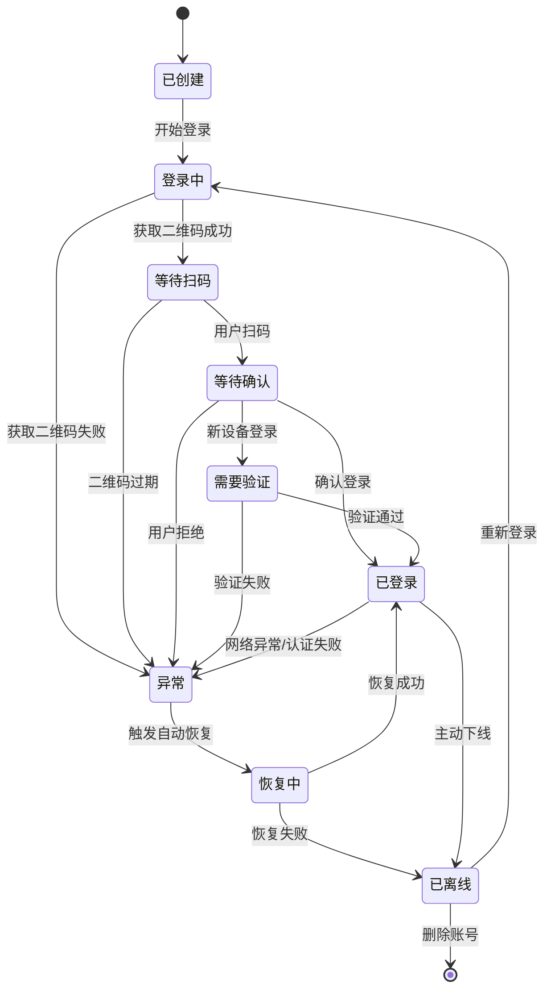
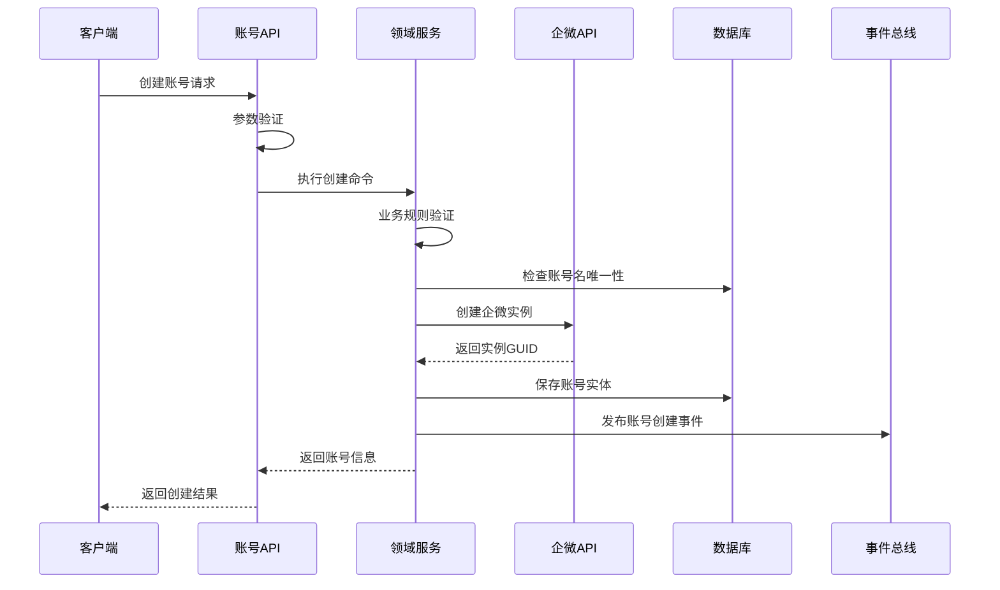

# 🏢 账号管理模块详细设计
*WeWork Management Platform - Account Management Module Design*

## 📖 文档目录

1. [模块概述](#模块概述)
2. [业务建模](#业务建模)
3. [状态机设计](#状态机设计)
4. [业务流程设计](#业务流程设计)
5. [核心算法设计](#核心算法设计)
6. [数据流设计](#数据流设计)
7. [异常处理机制](#异常处理机制)
8. [性能优化方案](#性能优化方案)
9. [安全设计](#安全设计)
10. [监控和日志](#监控和日志)

---

## 🎯 模块概述

### 业务职责
账号管理模块负责企业微信账号的完整生命周期管理，是整个平台的核心基础模块。

```yaml
核心职责:
  - 企微账号创建与配置
  - 账号登录状态管理
  - 实时状态监控与恢复
  - 账号资源调度优化
  - 生命周期事件处理

业务价值:
  - 自动化管理: 减少人工干预，提升运营效率
  - 稳定性保障: 故障自愈，确保账号高可用
  - 资源优化: 智能调度，最大化账号利用率
  - 数据洞察: 状态分析，支持业务决策
```

### 技术架构
```yaml
架构模式:
  - 领域驱动设计(DDD): 核心业务建模
  - 事件驱动架构: 状态变更事件化
  - CQRS模式: 读写分离优化性能
  - 状态机模式: 状态转换规范化

核心组件:
  - AccountDomainService: 领域服务层
  - AccountRepository: 数据访问层
  - AccountStateMachine: 状态机引擎
  - AccountEventPublisher: 事件发布器
  - AccountMonitor: 监控组件
```

---

## 🏗️ 业务建模

### 领域实体设计

#### 1. 账号聚合根(Account Aggregate)
```java
@Entity
@Table(name = "wework_accounts")
@AggregateRoot
public class WeWorkAccount {
    
    // 唯一标识
    @Id
    private AccountId accountId;
    
    // 基本信息
    private AccountName accountName;
    private TenantId tenantId;
    private UserId bindUserId;
    private PhoneNumber phone;
    private EmailAddress email;
    
    // 企微相关
    private WeWorkInstanceGuid guid;
    private WeWorkUserInfo userInfo;
    
    // 状态管理
    private AccountStatus status;
    private AccountHealth health;
    private LastHeartbeat lastHeartbeat;
    
    // 配置信息
    private AccountConfiguration configuration;
    
    // 统计信息
    private AccountStatistics statistics;
    
    // 时间信息
    private CreatedAt createdAt;
    private UpdatedAt updatedAt;
    private LastLoginTime lastLoginTime;
    
    // 业务方法
    public void login(LoginContext context) {
        this.validateLoginPreconditions();
        this.transitionToLoggingIn();
        this.publishLoginStartedEvent(context);
    }
    
    public void markOnline(WeWorkUserInfo userInfo) {
        this.userInfo = userInfo;
        this.status = AccountStatus.ONLINE;
        this.lastLoginTime = LastLoginTime.now();
        this.updateHeartbeat();
        this.publishAccountOnlineEvent();
    }
    
    public boolean isOnline() {
        return this.status == AccountStatus.ONLINE && 
               this.lastHeartbeat.isRecent(Duration.ofMinutes(5));
    }
    
    public boolean canSendMessage() {
        return this.isOnline() && 
               this.health.isGood() && 
               !this.configuration.isInMaintenanceMode();
    }
}
```

#### 2. 账号健康状态值对象
```java
@ValueObject
public class AccountHealth {
    private final HealthLevel level;
    private final double score;
    private final List<HealthIndicator> indicators;
    
    public static AccountHealth calculate(HeartbeatData data, AccountStatistics stats) {
        double score = 0.0;
        List<HealthIndicator> indicators = new ArrayList<>();
        
        // 连通性检查 (40%)
        if (data.isConnected()) {
            score += 0.4;
        } else {
            indicators.add(HealthIndicator.CONNECTION_FAILED);
        }
        
        // 响应时间 (30%)
        if (data.getResponseTime() < Duration.ofSeconds(2)) {
            score += 0.3;
        } else if (data.getResponseTime() < Duration.ofSeconds(5)) {
            score += 0.15;
            indicators.add(HealthIndicator.SLOW_RESPONSE);
        }
        
        // 错误率 (20%)
        double errorRate = stats.getErrorRate();
        if (errorRate < 0.01) {
            score += 0.2;
        } else if (errorRate < 0.05) {
            score += 0.1;
            indicators.add(HealthIndicator.HIGH_ERROR_RATE);
        }
        
        // 资源使用 (10%)
        if (data.getCpuUsage() < 0.7 && data.getMemoryUsage() < 0.8) {
            score += 0.1;
        } else {
            indicators.add(HealthIndicator.HIGH_RESOURCE_USAGE);
        }
        
        return new AccountHealth(HealthLevel.fromScore(score), score, indicators);
    }
    
    public boolean isGood() {
        return level == HealthLevel.EXCELLENT || level == HealthLevel.GOOD;
    }
}
```

---

## 🔄 状态机设计

### 账号状态定义
```java
public enum AccountStatus {
    // 初始状态
    CREATED("已创建", "账号已创建，等待初始化"),
    
    // 登录流程状态
    LOGGING_IN("登录中", "正在执行登录流程"),
    WAITING_FOR_QRCODE_SCAN("等待扫码", "等待用户扫描二维码"),
    WAITING_FOR_CONFIRMATION("等待确认", "等待用户确认登录"),
    WAITING_FOR_VERIFICATION("等待验证", "等待短信或其他验证"),
    
    // 在线状态
    ONLINE("在线", "账号正常在线"),
    
    // 异常状态
    ERROR("异常", "账号出现异常"),
    NETWORK_ERROR("网络异常", "网络连接异常"),
    AUTH_ERROR("认证异常", "认证信息过期或无效"),
    RATE_LIMITED("限流中", "触发企微限流"),
    
    // 恢复状态
    RECOVERING("恢复中", "正在尝试自动恢复"),
    
    // 离线状态
    OFFLINE("离线", "账号已离线"),
    LOGGED_OUT("已登出", "用户主动登出"),
    
    // 终止状态
    DISABLED("已禁用", "账号已被禁用"),
    DELETED("已删除", "账号已被删除");
}
```

### 状态转换图


---

## 🔄 业务流程设计

### 1. 账号创建流程


### 2. 自动恢复流程
```java
@Service
@Slf4j
public class AccountRecoveryService {
    
    @Async("recoveryExecutor")
    public CompletableFuture<RecoveryResult> executeRecovery(AccountId accountId) {
        WeWorkAccount account = accountRepository.findById(accountId)
            .orElseThrow(() -> new AccountNotFoundException(accountId));
        
        log.info("开始自动恢复账号: {}", accountId);
        
        // 1. 分析故障原因
        FailureAnalysis analysis = analyzeFailure(account);
        
        // 2. 选择恢复策略
        RecoveryStrategy strategy = strategySelector.selectStrategy(analysis);
        
        // 3. 执行恢复操作
        RecoveryResult result = executeRecoveryStrategy(account, strategy, analysis);
        
        // 4. 记录恢复结果
        recordRecoveryResult(account, strategy, result);
        
        return CompletableFuture.completedFuture(result);
    }
    
    private RecoveryResult executeSimpleReconnect(WeWorkAccount account) {
        log.info("执行简单重连: {}", account.getAccountId());
        
        boolean heartbeatSuccess = weWorkApiClient.sendHeartbeat(account.getGuid());
        if (heartbeatSuccess) {
            account.markOnline();
            return RecoveryResult.success(RecoveryStrategy.SIMPLE_RECONNECT, "心跳恢复成功");
        }
        
        boolean reconnectSuccess = weWorkApiClient.reconnect(account.getGuid());
        if (reconnectSuccess) {
            account.markOnline();
            return RecoveryResult.success(RecoveryStrategy.SIMPLE_RECONNECT, "重连成功");
        }
        
        return RecoveryResult.failed(RecoveryStrategy.SIMPLE_RECONNECT, "重连失败");
    }
}
```

---

## 🧮 核心算法设计

### 智能负载均衡算法
```java
@Component
public class AccountLoadBalancer {
    
    /**
     * 选择最优账号发送消息
     */
    public Optional<WeWorkAccount> selectOptimalAccount(MessageSendRequest request) {
        List<WeWorkAccount> availableAccounts = getAvailableAccounts(request.getTenantId());
        
        if (availableAccounts.isEmpty()) {
            return Optional.empty();
        }
        
        return availableAccounts.stream()
            .filter(this::isAccountHealthy)
            .max(Comparator.comparing(this::calculateCompositeScore));
    }
    
    private double calculateCompositeScore(WeWorkAccount account) {
        AccountMetrics metrics = metricsCollector.getAccountMetrics(account.getAccountId());
        
        // 健康分数 (40%)
        double healthScore = account.getHealth().getScore() * 0.4;
        
        // 负载分数 (30%)
        double loadScore = calculateLoadScore(metrics) * 0.3;
        
        // 性能分数 (20%)
        double performanceScore = calculatePerformanceScore(metrics) * 0.2;
        
        // 可用性分数 (10%)
        double availabilityScore = calculateAvailabilityScore(metrics) * 0.1;
        
        return healthScore + loadScore + performanceScore + availabilityScore;
    }
}
```

---

## 🚨 异常处理机制

### 1. 分层异常处理
```java
@Component
public class AccountExceptionHandler {
    
    public void handleAccountException(AccountId accountId, Exception exception) {
        try {
            // 1. 异常分类
            AccountExceptionType exceptionType = classifyException(exception);
            
            // 2. 选择处理策略
            ExceptionHandlingStrategy strategy = selectHandlingStrategy(exceptionType, account);
            
            // 3. 执行处理策略
            executeHandlingStrategy(account, strategy, exception);
            
        } catch (Exception e) {
            log.error("异常处理失败: " + accountId, e);
            escalateToManualIntervention(account, exception);
        }
    }
    
    private AccountExceptionType classifyException(Exception exception) {
        if (exception instanceof NetworkTimeoutException) {
            return AccountExceptionType.NETWORK_TIMEOUT;
        } else if (exception instanceof AuthenticationFailedException) {
            return AccountExceptionType.AUTH_FAILED;
        } else if (exception instanceof RateLimitedException) {
            return AccountExceptionType.RATE_LIMITED;
        }
        return AccountExceptionType.UNKNOWN;
    }
}
```

### 2. 降级策略
```java
@Component
public class AccountDegradationService {
    
    public void degradeAccount(AccountId accountId, DegradationLevel level) {
        WeWorkAccount account = accountRepository.findById(accountId)
            .orElseThrow(() -> new AccountNotFoundException(accountId));
        
        switch (level) {
            case PARTIAL_DEGRADATION:
                applyPartialDegradation(account);
                break;
            case FULL_DEGRADATION:
                applyFullDegradation(account);
                break;
            case EMERGENCY_SHUTDOWN:
                applyEmergencyShutdown(account);
                break;
        }
    }
    
    private void applyPartialDegradation(WeWorkAccount account) {
        // 降低发送频率限制
        AccountConfiguration config = account.getConfiguration().toBuilder()
            .sendInterval(config.getSendInterval() * 2)  // 发送间隔加倍
            .dailyLimit(config.getDailyLimit() / 2)      // 每日限制减半
            .autoReplyEnabled(false)                     // 关闭自动回复
            .build();
        
        account.updateConfiguration(config);
        log.info("应用部分降级策略: {}", account.getAccountId());
    }
}
```

---

## ⚡ 性能优化方案

### 1. 缓存优化
```java
@Component
public class AccountPerformanceOptimizer {
    
    private final LoadingCache<String, WeWorkAccount> accountCache;
    
    @PostConstruct
    public void initializeCache() {
        this.accountCache = Caffeine.newBuilder()
            .maximumSize(10000)
            .expireAfterWrite(Duration.ofMinutes(30))
            .expireAfterAccess(Duration.ofMinutes(10))
            .recordStats()
            .refreshAfterWrite(Duration.ofMinutes(5))
            .buildAsync(this::loadAccountFromDatabase)
            .synchronous();
    }
    
    /**
     * 智能预取策略
     */
    @Scheduled(fixedDelay = 60000)
    public void intelligentPrefetch() {
        AccessPatternAnalysis analysis = analyzeAccessPatterns();
        List<AccountId> predictedAccounts = predictNextAccess(analysis);
        
        CompletableFuture.runAsync(() -> {
            for (AccountId accountId : predictedAccounts) {
                if (!accountCache.asMap().containsKey(accountId.getValue())) {
                    accountCache.get(accountId.getValue());
                }
            }
        });
    }
}
```

### 2. 数据库优化
```java
@Repository
public class OptimizedAccountRepository {
    
    /**
     * 游标分页避免深分页性能问题
     */
    @Query("""
        SELECT a FROM WeWorkAccount a 
        WHERE (:cursor IS NULL OR a.id > :cursor)
        AND (:tenantId IS NULL OR a.tenantId = :tenantId)
        ORDER BY a.id ASC
        """)
    List<WeWorkAccount> findAccountsWithCursor(
        @Param("cursor") String cursor,
        @Param("tenantId") String tenantId,
        Pageable pageable
    );
    
    /**
     * 批量状态更新优化
     */
    @Modifying
    @Query("UPDATE WeWorkAccount a SET a.status = :status WHERE a.id IN :ids")
    int batchUpdateStatus(@Param("ids") List<String> accountIds, @Param("status") AccountStatus status);
}
```

---

## 🔒 安全设计

### 1. 数据加密
```java
@Component
public class AccountDataProtection {
    
    private final AESUtil encryptionUtil;
    
    /**
     * 敏感信息加密存储
     */
    public void encryptSensitiveData(WeWorkAccount account) {
        if (account.getPhone() != null) {
            String encryptedPhone = encryptionUtil.encrypt(account.getPhone().getValue());
            account.setEncryptedPhone(encryptedPhone);
        }
        
        if (account.getEmail() != null) {
            String encryptedEmail = encryptionUtil.encrypt(account.getEmail().getValue());
            account.setEncryptedEmail(encryptedEmail);
        }
    }
    
    /**
     * 访问日志记录
     */
    @EventListener
    public void recordAccessLog(AccountAccessEvent event) {
        AccessLog log = AccessLog.builder()
            .accountId(event.getAccountId())
            .userId(event.getUserId())
            .operation(event.getOperation())
            .ipAddress(event.getIpAddress())
            .userAgent(event.getUserAgent())
            .timestamp(LocalDateTime.now())
            .build();
        
        accessLogRepository.save(log);
    }
}
```

---

## 📊 监控和日志

### 1. 指标收集
```java
@Component
public class AccountMetricsCollector {
    
    private final MeterRegistry meterRegistry;
    private final Timer accountOperationTimer;
    private final Counter accountCreationCounter;
    private final Gauge onlineAccountsGauge;
    
    @PostConstruct
    public void initializeMetrics() {
        this.accountOperationTimer = Timer.builder("account.operation.duration")
            .description("账号操作耗时")
            .register(meterRegistry);
            
        this.accountCreationCounter = Counter.builder("account.creation.total")
            .description("账号创建总数")
            .register(meterRegistry);
            
        this.onlineAccountsGauge = Gauge.builder("account.online.count")
            .description("在线账号数量")
            .register(meterRegistry, this, AccountMetricsCollector::getOnlineAccountCount);
    }
    
    public void recordAccountOperation(String operation, Duration duration, boolean success) {
        accountOperationTimer.record(duration);
        
        Counter.builder("account.operation.total")
            .tag("operation", operation)
            .tag("status", success ? "success" : "failure")
            .register(meterRegistry)
            .increment();
    }
    
    private double getOnlineAccountCount() {
        return accountRepository.countByStatus(AccountStatus.ONLINE);
    }
}
```

### 2. 结构化日志
```java
@Component
@Slf4j
public class AccountLogger {
    
    public void logAccountCreated(WeWorkAccount account) {
        log.info("账号创建成功 - accountId: {}, tenantId: {}, accountName: {}", 
            account.getAccountId(), 
            account.getTenantId(), 
            account.getAccountName());
    }
    
    public void logAccountStatusChanged(AccountId accountId, AccountStatus oldStatus, AccountStatus newStatus) {
        log.info("账号状态变更 - accountId: {}, oldStatus: {}, newStatus: {}", 
            accountId, oldStatus, newStatus);
    }
    
    public void logAccountException(AccountId accountId, Exception exception) {
        log.error("账号异常 - accountId: {}, exceptionType: {}, message: {}", 
            accountId, 
            exception.getClass().getSimpleName(), 
            exception.getMessage(), 
            exception);
    }
}
```

---

## 📋 设计总结

### 核心特性
1. **完整生命周期管理**: 从创建到删除的全流程管理
2. **智能状态机**: 规范化的状态转换和事件处理
3. **自动故障恢复**: 多策略自动恢复机制
4. **性能优化**: 多级缓存和数据库优化
5. **安全可靠**: 数据加密和访问控制

### 技术亮点
- 🏗️ **DDD设计**: 领域驱动的业务建模
- 🔄 **状态机**: 清晰的状态管理
- 🚀 **高性能**: 缓存和异步处理优化
- 🛡️ **高可用**: 自动恢复和降级机制
- 📊 **可观测**: 完整的监控和日志

### 下一步
- 消息发送模块详细设计
- 监控告警模块详细设计
- 模块间集成设计

---

**文档版本**: v1.0  
**创建日期**: 2025-01-27  
**负责人**: 账号管理团队
