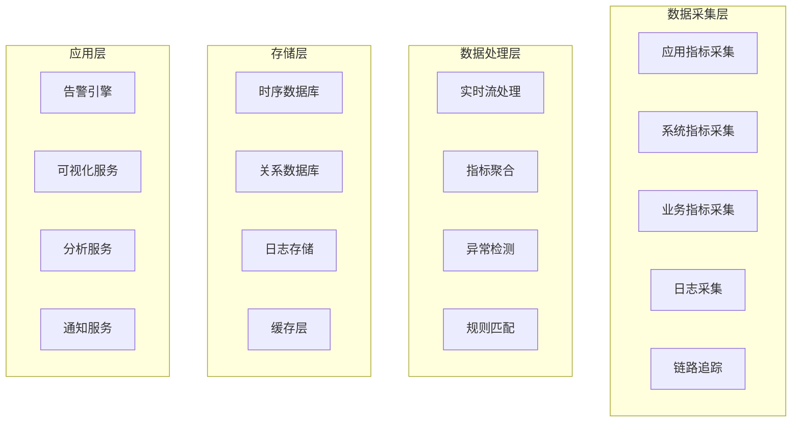

# 📊 监控告警模块详细设计
*WeWork Management Platform - Monitor & Alert Module Design*

## 📖 文档目录

1. [模块概述](#模块概述)
2. [监控架构设计](#监控架构设计)
3. [指标体系设计](#指标体系设计)
4. [告警规则引擎](#告警规则引擎)
5. [通知渠道管理](#通知渠道管理)
6. [数据存储方案](#数据存储方案)
7. [可视化设计](#可视化设计)
8. [性能优化方案](#性能优化方案)
9. [扩展性设计](#扩展性设计)

---

## 🎯 模块概述

### 业务职责
监控告警模块负责系统全链路监控、智能告警、数据可视化等功能，确保系统稳定运行。

```yaml
核心职责:
  - 全链路性能监控
  - 业务指标采集分析
  - 智能告警处理
  - 多渠道通知分发
  - 数据可视化展示
  - 故障根因分析

业务价值:
  - 实时监控: 全方位系统状态监控
  - 预警机制: 提前发现潜在问题
  - 故障定位: 快速故障诊断和恢复
  - 数据洞察: 支持业务决策优化
```

### 技术架构
```yaml
架构模式:
  - 事件驱动架构: 实时数据流处理
  - 时序数据库: 高效存储监控数据
  - 流式计算: 实时指标聚合计算
  - 规则引擎: 灵活的告警规则配置

核心组件:
  - MetricsCollector: 指标收集器
  - AlertEngine: 告警引擎
  - NotificationService: 通知服务
  - DashboardService: 看板服务
  - AnalyticsEngine: 分析引擎
  - StorageManager: 存储管理器
```

---

## 🏗️ 监控架构设计

### 1. 分层监控架构


### 2. 指标收集器设计
```java
@Component
public class ComprehensiveMetricsCollector {
    
    private final MeterRegistry meterRegistry;
    private final SystemMetricsCollector systemCollector;
    private final BusinessMetricsCollector businessCollector;
    
    /**
     * 应用性能指标收集
     */
    @Scheduled(fixedRate = 30000) // 每30秒
    public void collectApplicationMetrics() {
        ApplicationMetrics metrics = ApplicationMetrics.builder()
            .timestamp(Instant.now())
            .httpRequests(collectHttpRequestMetrics())
            .database(collectDatabaseMetrics())
            .cache(collectCacheMetrics())
            .messageQueue(collectMessageQueueMetrics())
            .build();
        
        publishMetrics(MetricType.APPLICATION, metrics);
    }
    
    /**
     * 业务指标收集
     */
    @Scheduled(fixedRate = 60000) // 每1分钟
    public void collectBusinessMetrics() {
        BusinessMetrics metrics = BusinessMetrics.builder()
            .timestamp(Instant.now())
            .accounts(collectAccountMetrics())
            .messages(collectMessageMetrics())
            .tenants(collectTenantMetrics())
            .errors(collectErrorMetrics())
            .build();
        
        publishMetrics(MetricType.BUSINESS, metrics);
    }
    
    private AccountMetrics collectAccountMetrics() {
        return AccountMetrics.builder()
            .totalAccounts(accountRepository.count())
            .onlineAccounts(accountRepository.countByStatus(AccountStatus.ONLINE))
            .offlineAccounts(accountRepository.countByStatus(AccountStatus.OFFLINE))
            .errorAccounts(accountRepository.countByStatus(AccountStatus.ERROR))
            .averageLoginTime(calculateAverageLoginTime())
            .accountHealthScore(calculateAverageHealthScore())
            .build();
    }
    
    private MessageMetrics collectMessageMetrics() {
        LocalDateTime oneHourAgo = LocalDateTime.now().minusHours(1);
        
        return MessageMetrics.builder()
            .totalMessages(messageRepository.countSince(oneHourAgo))
            .successMessages(messageRepository.countByStatusSince(MessageStatus.SENT, oneHourAgo))
            .failedMessages(messageRepository.countByStatusSince(MessageStatus.FAILED, oneHourAgo))
            .pendingMessages(messageRepository.countByStatus(MessageStatus.PENDING))
            .averageSendTime(calculateAverageSendTime(oneHourAgo))
            .messageSuccessRate(calculateMessageSuccessRate(oneHourAgo))
            .queueDepth(messageQueueManager.getTotalQueueDepth())
            .build();
    }
}
```

---

## 📈 指标体系设计

### 1. 分层指标体系
```java
@Component
public class MetricsHierarchy {
    
    /**
     * 系统级指标
     */
    public enum SystemMetricType {
        // 基础资源指标
        CPU_USAGE("cpu.usage", "CPU使用率", "%"),
        MEMORY_USAGE("memory.usage", "内存使用率", "%"),
        DISK_USAGE("disk.usage", "磁盘使用率", "%"),
        NETWORK_IO("network.io", "网络IO", "bytes/s"),
        
        // JVM指标
        JVM_HEAP_USED("jvm.heap.used", "JVM堆内存使用", "bytes"),
        JVM_GC_TIME("jvm.gc.time", "GC耗时", "ms"),
        JVM_THREAD_COUNT("jvm.thread.count", "线程数", "count"),
        
        // 数据库指标
        DB_CONNECTION_POOL("db.connection.pool", "数据库连接池", "count"),
        DB_QUERY_TIME("db.query.time", "数据库查询时间", "ms"),
        DB_SLOW_QUERY("db.slow.query", "慢查询数量", "count");
    }
    
    /**
     * 应用级指标
     */
    public enum ApplicationMetricType {
        // HTTP指标
        HTTP_REQUEST_TOTAL("http.request.total", "HTTP请求总数", "count"),
        HTTP_REQUEST_DURATION("http.request.duration", "HTTP请求耗时", "ms"),
        HTTP_ERROR_RATE("http.error.rate", "HTTP错误率", "%"),
        
        // 缓存指标
        CACHE_HIT_RATE("cache.hit.rate", "缓存命中率", "%"),
        CACHE_MISS_COUNT("cache.miss.count", "缓存未命中数", "count"),
        
        // 消息队列指标
        MQ_QUEUE_DEPTH("mq.queue.depth", "消息队列深度", "count"),
        MQ_CONSUME_RATE("mq.consume.rate", "消息消费速率", "msg/s");
    }
    
    /**
     * 业务级指标
     */
    public enum BusinessMetricType {
        // 账号指标
        ACCOUNT_TOTAL("account.total", "账号总数", "count"),
        ACCOUNT_ONLINE_RATE("account.online.rate", "账号在线率", "%"),
        ACCOUNT_LOGIN_SUCCESS_RATE("account.login.success.rate", "账号登录成功率", "%"),
        ACCOUNT_HEALTH_SCORE("account.health.score", "账号健康评分", "score"),
        
        // 消息指标
        MESSAGE_SEND_TOTAL("message.send.total", "消息发送总数", "count"),
        MESSAGE_SUCCESS_RATE("message.success.rate", "消息发送成功率", "%"),
        MESSAGE_SEND_DURATION("message.send.duration", "消息发送耗时", "ms"),
        MESSAGE_RETRY_RATE("message.retry.rate", "消息重试率", "%");
    }
}
```

### 2. 指标聚合计算
```java
@Component
public class MetricsAggregationEngine {
    
    /**
     * 实时聚合计算
     */
    public void startRealTimeAggregation() {
        streamProcessor.createStream("metrics-aggregation")
            .groupBy(this::getAggregationKey)
            .window(Duration.ofMinutes(1))
            .aggregate(this::aggregateMetrics)
            .forEach(this::storeAggregatedMetrics);
    }
    
    /**
     * 历史数据聚合
     */
    @Scheduled(fixedRate = 300000) // 每5分钟
    public void aggregateHistoricalData() {
        Instant now = Instant.now();
        Instant fiveMinutesAgo = now.minus(Duration.ofMinutes(5));
        
        // 5分钟聚合
        aggregateMetricsInWindow(fiveMinutesAgo, now, Duration.ofMinutes(5));
        
        // 每小时聚合
        if (now.getEpochSecond() % 3600 == 0) {
            Instant oneHourAgo = now.minus(Duration.ofHours(1));
            aggregateMetricsInWindow(oneHourAgo, now, Duration.ofHours(1));
        }
    }
    
    private AggregatedMetric calculateAggregation(List<MetricDataPoint> dataPoints, Duration window) {
        DoubleSummaryStatistics stats = dataPoints.stream()
            .mapToDouble(MetricDataPoint::getValue)
            .summaryStatistics();
        
        return AggregatedMetric.builder()
            .metricName(dataPoints.get(0).getMetricName())
            .window(window.toString())
            .sampleCount(stats.getCount())
            .min(stats.getMin())
            .max(stats.getMax())
            .avg(stats.getAverage())
            .sum(stats.getSum())
            .build();
    }
}
```

---

## 🚨 告警规则引擎

### 1. 规则引擎架构
```java
@Component
public class AlertRuleEngine {
    
    private final RuleRepository ruleRepository;
    private final AlertEvaluator alertEvaluator;
    private final NotificationService notificationService;
    
    /**
     * 告警规则定义
     */
    @Entity
    public static class AlertRule {
        @Id
        private String id;
        private String name;
        private String description;
        private String metricName;
        private String condition;           // 告警条件表达式
        private AlertSeverity severity;     // 告警级别
        private Duration evaluationWindow; // 评估窗口
        private Duration cooldownPeriod;   // 冷却期
        private boolean enabled;
        private List<String> notificationChannels;
    }
    
    /**
     * 定时评估告警规则
     */
    @Scheduled(fixedRate = 30000) // 每30秒评估一次
    public void evaluateAlertRules() {
        Instant now = Instant.now();
        List<AlertRule> activeRules = ruleRepository.findByEnabled(true);
        
        for (AlertRule rule : activeRules) {
            try {
                evaluateRule(rule, now);
            } catch (Exception e) {
                log.error("评估告警规则失败: " + rule.getId(), e);
            }
        }
    }
    
    private void evaluateRule(AlertRule rule, Instant timestamp) {
        // 1. 检查冷却期
        if (stateManager.isInCooldown(rule.getId(), timestamp)) {
            return;
        }
        
        // 2. 评估规则
        EvaluationResult result = alertEvaluator.evaluate(rule, timestamp);
        
        // 3. 更新告警状态
        AlertState newState = stateManager.updateState(rule.getId(), result);
        
        // 4. 处理状态变化
        if (shouldTriggerAlert(newState, result)) {
            triggerAlert(rule, result, newState);
        }
    }
    
    private void triggerAlert(AlertRule rule, EvaluationResult result, AlertState state) {
        Alert alert = Alert.builder()
            .ruleId(rule.getId())
            .ruleName(rule.getName())
            .severity(rule.getSeverity())
            .status(AlertStatus.FIRING)
            .message(generateAlertMessage(rule, result))
            .triggerTime(result.getTimestamp())
            .value(result.getAggregatedValue())
            .build();
        
        // 发送通知
        notificationService.sendAlert(alert, rule.getNotificationChannels());
        
        log.info("触发告警: {} - {}", rule.getName(), alert.getMessage());
    }
}
```

### 2. 智能告警策略
```java
@Component
public class IntelligentAlertStrategy {
    
    /**
     * 动态阈值计算
     */
    public Double calculateDynamicThreshold(String metricName, Duration timeRange) {
        Instant now = Instant.now();
        Instant start = now.minus(timeRange);
        
        // 获取历史数据
        List<MetricDataPoint> historicalData = metricsQueryService.query(metricName, start, now);
        
        if (historicalData.size() < 50) {
            return getStaticThreshold(metricName);
        }
        
        // 计算统计特征
        DoubleSummaryStatistics stats = historicalData.stream()
            .mapToDouble(MetricDataPoint::getValue)
            .summaryStatistics();
        
        double mean = stats.getAverage();
        double stdDev = calculateStandardDeviation(historicalData, mean);
        
        // 基于3σ原则计算阈值
        return mean + 3 * stdDev;
    }
    
    /**
     * 异常检测算法
     */
    public boolean detectAnomaly(String metricName, List<MetricDataPoint> recentData) {
        if (recentData.size() < 10) {
            return false;
        }
        
        // 使用滑动窗口Z-Score检测
        double windowMean = recentData.subList(0, recentData.size() - 1).stream()
            .mapToDouble(MetricDataPoint::getValue)
            .average()
            .orElse(0.0);
        
        double windowStdDev = calculateStandardDeviation(
            recentData.subList(0, recentData.size() - 1), 
            windowMean
        );
        
        double currentValue = recentData.get(recentData.size() - 1).getValue();
        double zScore = Math.abs((currentValue - windowMean) / windowStdDev);
        
        return zScore > 3.0;
    }
    
    /**
     * 告警抑制策略
     */
    public boolean shouldSuppressAlert(String ruleId, Instant timestamp) {
        // 检查重复告警抑制
        List<AlertHistory> recentAlerts = alertHistoryRepository
            .findByRuleIdAndTimestampAfter(ruleId, timestamp.minus(Duration.ofMinutes(15)));
        
        if (recentAlerts.size() >= 3) {
            return true;
        }
        
        // 检查维护窗口
        if (isInMaintenanceWindow(timestamp)) {
            return true;
        }
        
        return false;
    }
}
```

---

## 📢 通知渠道管理

### 1. 多渠道通知服务
```java
@Component
public class NotificationService {
    
    private final Map<String, NotificationChannel> channels;
    private final NotificationTemplate templateService;
    
    @PostConstruct
    public void initializeChannels() {
        channels.put("email", new EmailNotificationChannel());
        channels.put("sms", new SmsNotificationChannel());
        channels.put("wework", new WeWorkNotificationChannel());
        channels.put("webhook", new WebhookNotificationChannel());
    }
    
    /**
     * 发送告警通知
     */
    public void sendAlert(Alert alert, List<String> channelNames) {
        for (String channelName : channelNames) {
            try {
                sendToChannel(alert, channelName);
            } catch (Exception e) {
                log.error("发送告警通知失败: {} - {}", channelName, alert.getId(), e);
            }
        }
    }
    
    private void sendToChannel(Alert alert, String channelName) {
        NotificationChannel channel = channels.get(channelName);
        if (channel == null) {
            log.warn("未知的通知渠道: {}", channelName);
            return;
        }
        
        // 生成通知内容
        NotificationContent content = generateNotificationContent(alert, channelName);
        
        // 发送通知
        NotificationResult result = channel.send(content);
        
        log.info("告警通知已发送: {} - {} - {}", alert.getId(), channelName, result.isSuccess());
    }
    
    /**
     * 企微通知渠道
     */
    @Component
    public static class WeWorkNotificationChannel implements NotificationChannel {
        
        private final WeWorkApiClient weWorkApiClient;
        
        @Override
        public NotificationResult send(NotificationContent content) {
            try {
                WeWorkMessage message = WeWorkMessage.builder()
                    .messageType("text")
                    .text(content.getText())
                    .mentioned_list(content.getMentionedUsers())
                    .build();
                
                WeWorkSendResult result = weWorkApiClient.sendGroupMessage(
                    content.getTarget(), 
                    message
                );
                
                return NotificationResult.success(result.getMessageId());
                
            } catch (Exception e) {
                return NotificationResult.failure(e.getMessage());
            }
        }
    }
}
```

### 2. 通知模板管理
```java
@Component
public class NotificationTemplateService {
    
    /**
     * 预定义模板
     */
    @PostConstruct
    public void createDefaultTemplates() {
        // 企微告警模板
        createTemplate("wework_critical", 
            "🔴 【严重告警】[(${alert.ruleName})]",
            """
            🚨 **严重告警**
            
            **告警名称**: ${alert.ruleName}
            **告警级别**: ${alert.severity}
            **当前值**: ${alert.value}
            **触发时间**: ${#temporals.format(alert.triggerTime, 'yyyy-MM-dd HH:mm:ss')}
            
            📊 [查看详情](${dashboard_url})
            """);
        
        // 邮件告警模板
        createEmailTemplate("email_critical",
            "🔴 严重告警: ${alert.ruleName}",
            """
            <html>
            <body style="font-family: Arial, sans-serif;">
                <div style="border-left: 4px solid #dc3545; padding: 15px;">
                    <h2 style="color: #dc3545;">🚨 严重告警</h2>
                    <table style="width: 100%;">
                        <tr>
                            <td><strong>告警名称</strong></td>
                            <td>${alert.ruleName}</td>
                        </tr>
                        <tr>
                            <td><strong>当前值</strong></td>
                            <td>${alert.value}</td>
                        </tr>
                        <tr>
                            <td><strong>触发时间</strong></td>
                            <td>${#temporals.format(alert.triggerTime, 'yyyy-MM-dd HH:mm:ss')}</td>
                        </tr>
                    </table>
                    <p><a href="${dashboard_url}">查看详情</a></p>
                </div>
            </body>
            </html>
            """);
    }
}
```

---

## 💾 数据存储方案

### 1. 时序数据库设计
```java
@Component
public class InfluxDBTimeSeriesStorage implements TimeSeriesStorage {
    
    private final InfluxDBClient influxDBClient;
    private final WriteApiBlocking writeApi;
    private final QueryApi queryApi;
    
    /**
     * 存储单个指标数据点
     */
    @Override
    public void store(MetricDataPoint dataPoint) {
        Point point = Point.measurement(dataPoint.getMetricName())
            .time(dataPoint.getTimestamp(), WritePrecision.MS)
            .addField("value", dataPoint.getValue());
        
        // 添加标签
        if (dataPoint.getTags() != null) {
            dataPoint.getTags().forEach(point::addTag);
        }
        
        writeApi.writePoint(point);
    }
    
    /**
     * 查询指标数据
     */
    @Override
    public List<MetricDataPoint> query(String metricName, Instant start, Instant end) {
        String flux = String.format("""
            from(bucket: "monitoring_bucket")
            |> range(start: %s, stop: %s)
            |> filter(fn: (r) => r._measurement == "%s")
            |> filter(fn: (r) => r._field == "value")
            """, start, end, metricName);
        
        List<FluxTable> tables = queryApi.query(flux);
        
        return tables.stream()
            .flatMap(table -> table.getRecords().stream())
            .map(this::convertToMetricDataPoint)
            .collect(Collectors.toList());
    }
}
```

### 2. 数据压缩与清理
```java
@Component
public class DataCompressionService {
    
    /**
     * 数据压缩任务
     */
    @Scheduled(cron = "0 0 2 * * ?") // 每天凌晨2点执行
    public void compressData() {
        log.info("开始执行数据压缩任务");
        
        Instant now = Instant.now();
        
        // 压缩昨天的数据到5分钟聚合
        compressToFiveMinuteAggregation(now.minus(Duration.ofDays(1)), now);
        
        // 压缩7天前的数据到1小时聚合
        compressToHourlyAggregation(now.minus(Duration.ofDays(7)), now.minus(Duration.ofDays(6)));
        
        log.info("数据压缩任务完成");
    }
    
    /**
     * 数据清理任务
     */
    @Scheduled(cron = "0 0 3 * * ?") // 每天凌晨3点执行
    public void cleanupData() {
        log.info("开始执行数据清理任务");
        
        Instant now = Instant.now();
        
        // 清理超过保留期的原始数据
        deleteRawDataBefore(now.minus(Duration.ofDays(7)));
        
        // 清理超过保留期的告警历史
        deleteAlertHistoryBefore(now.minus(Duration.ofDays(90)));
        
        log.info("数据清理任务完成");
    }
}
```

---

## 📊 可视化设计

### 1. 仪表板配置
```java
@Component
public class DashboardService {
    
    /**
     * 创建系统概览仪表板
     */
    public Dashboard createSystemOverviewDashboard() {
        return Dashboard.builder()
            .id("system-overview")
            .title("系统概览")
            .description("系统整体运行状态监控")
            .panels(Arrays.asList(
                // CPU使用率面板
                Panel.builder()
                    .id("cpu-usage")
                    .title("CPU使用率")
                    .type(PanelType.GAUGE)
                    .query("SELECT mean(value) FROM cpu_usage WHERE time >= now() - 1h GROUP BY time(1m)")
                    .thresholds(Arrays.asList(
                        Threshold.of(70, "yellow"),
                        Threshold.of(85, "red")
                    ))
                    .build(),
                
                // 内存使用率面板
                Panel.builder()
                    .id("memory-usage")
                    .title("内存使用率")
                    .type(PanelType.GAUGE)
                    .query("SELECT mean(value) FROM memory_usage WHERE time >= now() - 1h GROUP BY time(1m)")
                    .build(),
                
                // HTTP请求量面板
                Panel.builder()
                    .id("http-requests")
                    .title("HTTP请求量")
                    .type(PanelType.GRAPH)
                    .query("SELECT sum(value) FROM http_request_total WHERE time >= now() - 1h GROUP BY time(1m)")
                    .build(),
                
                // 错误率面板
                Panel.builder()
                    .id("error-rate")
                    .title("错误率")
                    .type(PanelType.STAT)
                    .query("SELECT mean(value) FROM http_error_rate WHERE time >= now() - 1h")
                    .build()
            ))
            .layout(DashboardLayout.builder()
                .rows(2)
                .columns(2)
                .build())
            .build();
    }
    
    /**
     * 创建业务监控仪表板
     */
    public Dashboard createBusinessDashboard() {
        return Dashboard.builder()
            .id("business-overview")
            .title("业务监控")
            .description("业务指标监控")
            .panels(Arrays.asList(
                // 账号在线率
                Panel.builder()
                    .id("account-online-rate")
                    .title("账号在线率")
                    .type(PanelType.GAUGE)
                    .query("SELECT mean(value) FROM account_online_rate WHERE time >= now() - 1h")
                    .build(),
                
                // 消息发送成功率
                Panel.builder()
                    .id("message-success-rate")
                    .title("消息发送成功率")
                    .type(PanelType.GAUGE)
                    .query("SELECT mean(value) FROM message_success_rate WHERE time >= now() - 1h")
                    .build(),
                
                // 消息发送量趋势
                Panel.builder()
                    .id("message-send-trend")
                    .title("消息发送量趋势")
                    .type(PanelType.GRAPH)
                    .query("SELECT sum(value) FROM message_send_total WHERE time >= now() - 24h GROUP BY time(1h)")
                    .build()
            ))
            .build();
    }
}
```

---

## 📋 设计总结

### 核心特性
1. **全链路监控**: 从基础设施到业务的完整监控
2. **智能告警**: 动态阈值和异常检测
3. **多渠道通知**: 支持多种通知方式
4. **数据可视化**: 丰富的图表和仪表板
5. **高性能存储**: 时序数据库优化存储

### 技术亮点
- 📊 **实时监控**: 秒级数据采集和处理
- 🚨 **智能告警**: AI驱动的异常检测
- 📢 **多渠道通知**: 企微、邮件、短信等
- 💾 **高效存储**: 时序数据库和数据压缩
- 📈 **可视化**: 丰富的图表和仪表板

### 性能指标
- **监控延迟**: 数据采集到展示延迟 < 10秒
- **告警响应**: 异常检测到通知发送 < 30秒
- **数据保留**: 原始数据7天，聚合数据1年+
- **并发处理**: 支持每秒万级指标点处理

---

**文档版本**: v1.0  
**创建日期**: 2025-01-27  
**负责人**: 监控告警团队
