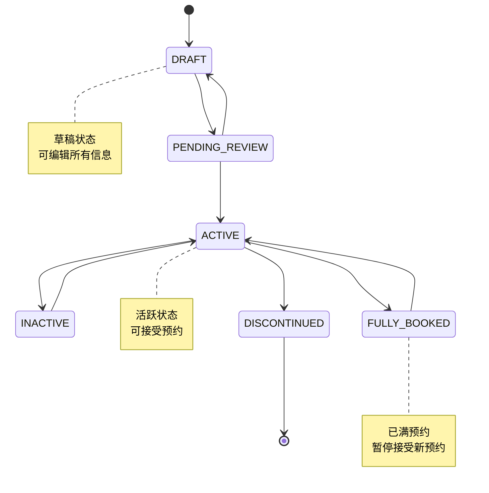

# 🛒 服务类商品模块详细设计
*WeWork Management Platform - Service Product Module Design*

## 📖 文档目录

1. [模块概述](#模块概述)
2. [业务建模](#业务建模)
3. [服务生命周期设计](#服务生命周期设计)
4. [预约调度系统](#预约调度系统)
5. [定价策略引擎](#定价策略引擎)
6. [服务提供商管理](#服务提供商管理)
7. [订单管理系统](#订单管理系统)
8. [结算分账体系](#结算分账体系)
9. [质量评估体系](#质量评估体系)
10. [性能优化方案](#性能优化方案)

---

## 🎯 模块概述

### 业务职责
服务类商品模块是专为服务行业设计的核心业务模块，支持服务商品的全生命周期管理，包括服务定义、预约调度、订单管理、结算分账等核心功能。

```yaml
核心职责:
  - 服务商品定义与管理
  - 服务预约与调度
  - 服务提供商管理
  - 订单全流程管理
  - 结算分账处理

业务价值:
  - 数字化转型: 传统服务业务数字化
  - 效率提升: 自动化调度和管理
  - 体验优化: 用户预约体验提升
  - 收益优化: 智能定价和分账
```

### 技术架构
```yaml
架构模式:
  - 领域驱动设计(DDD): 服务业务建模
  - 事件驱动架构: 订单状态事件化
  - 策略模式: 定价策略可插拔
  - 工厂模式: 服务实例创建

核心组件:
  - ServiceProductDomainService: 服务商品领域服务
  - BookingScheduleEngine: 预约调度引擎
  - PricingStrategyEngine: 定价策略引擎
  - ProviderManagementService: 提供商管理服务
  - OrderProcessingService: 订单处理服务
  - SettlementEngine: 结算引擎
```

---

## 🎪 业务建模

### 服务商品核心领域模型

```java
@Entity
@Table(name = "services")
public class ServiceProduct {
    private String id;
    private String tenantId;
    private String serviceCode;
    private String serviceName;
    private ServiceCategory category;
    private ServiceType serviceType;
    private DeliveryMode deliveryMode;
    
    // 定价信息
    private BigDecimal basePrice;
    private BigDecimal salePrice;
    private PricingModel pricingModel;
    
    // 容量管理
    private Integer maxConcurrentBookings;
    private Integer availableSlots;
    private Integer bookedSlots;
    
    // 时间配置
    private Integer durationMinutes;
    private Integer preparationTimeMinutes;
    private Integer cleanupTimeMinutes;
    
    // 预约配置
    private Integer advanceBookingHours;
    private Integer cancellationHours;
    private Boolean rescheduleAllowed;
    
    // 服务提供商
    private String defaultProviderId;
    private List<String> availableProviders;
    private Boolean autoAssignProvider;
    
    // 业务逻辑方法
    public boolean isAvailableForBooking(LocalDateTime requestTime) {
        return status == ServiceStatus.ACTIVE 
               && availableSlots > 0 
               && isWithinBookingWindow(requestTime);
    }
    
    public ServiceBooking createBooking(BookingRequest request) {
        validateBookingRequest(request);
        return ServiceBooking.builder()
            .serviceId(this.id)
            .customerId(request.getCustomerId())
            .bookingTime(request.getBookingTime())
            .duration(this.durationMinutes)
            .price(calculatePrice(request))
            .build();
    }
}
```

### 服务分类体系

```java
@Entity
@Table(name = "service_categories")
public class ServiceCategory {
    private String id;
    private String categoryCode;
    private String categoryName;
    private String parentId;
    private Integer level;
    private String categoryPath;
    
    // 分类属性
    private Map<String, Object> attributes;
    private List<CategoryAttribute> requiredAttributes;
    
    // 分类配置
    private Boolean requiresAppointment;
    private Boolean supportsGroupBooking;
    private Integer maxGroupSize;
    
    public List<ServiceCategory> getSubCategories() {
        // 获取子分类
    }
    
    public boolean validateServiceAttributes(Map<String, Object> serviceAttrs) {
        // 验证服务属性是否符合分类要求
    }
}
```

---

## 🔄 服务生命周期设计

### 服务状态机



### 服务生命周期管理

```java
@Service
public class ServiceLifecycleManager {
    
    @EventListener
    public void handleServiceStatusChange(ServiceStatusChangeEvent event) {
        ServiceProduct service = event.getService();
        ServiceStatus oldStatus = event.getOldStatus();
        ServiceStatus newStatus = event.getNewStatus();
        
        switch (newStatus) {
            case ACTIVE:
                activateService(service);
                break;
            case INACTIVE:
                deactivateService(service);
                break;
            case FULLY_BOOKED:
                handleFullyBookedService(service);
                break;
            case DISCONTINUED:
                discontinueService(service);
                break;
        }
        
        // 记录状态变更历史
        recordStatusHistory(service, oldStatus, newStatus);
        
        // 发布状态变更事件
        eventPublisher.publishEvent(new ServiceLifecycleEvent(service, newStatus));
    }
    
    private void activateService(ServiceProduct service) {
        // 验证服务配置
        validateServiceConfiguration(service);
        
        // 初始化容量管理
        initializeCapacityManagement(service);
        
        // 启用预约接受
        enableBookingAcceptance(service);
        
        // 通知相关系统
        notifyServiceActivation(service);
    }
}
```

---

## 📅 预约调度系统

### 时段管理

```java
@Entity
@Table(name = "service_time_slots")
public class ServiceTimeSlot {
    private String id;
    private String serviceId;
    private String providerId;
    private LocalDateTime startTime;
    private LocalDateTime endTime;
    private Integer capacity;
    private Integer bookedCount;
    private SlotStatus status;
    
    // 动态属性
    private BigDecimal surgeMultiplier = BigDecimal.ONE;
    private Map<String, Object> slotAttributes;
    
    public boolean isAvailable() {
        return status == SlotStatus.AVAILABLE 
               && bookedCount < capacity
               && startTime.isAfter(LocalDateTime.now());
    }
    
    public boolean canAcceptBooking(int requestedCount) {
        return isAvailable() && (bookedCount + requestedCount) <= capacity;
    }
    
    public BookingResult bookSlot(BookingRequest request) {
        if (!canAcceptBooking(request.getParticipantCount())) {
            return BookingResult.failed("时段容量不足");
        }
        
        this.bookedCount += request.getParticipantCount();
        
        if (this.bookedCount >= this.capacity) {
            this.status = SlotStatus.FULL;
        }
        
        return BookingResult.success();
    }
}
```

### 智能调度引擎

```java
@Component
public class BookingScheduleEngine {
    
    public BookingScheduleResult scheduleBooking(BookingRequest request) {
        // 1. 查找可用时段
        List<ServiceTimeSlot> availableSlots = findAvailableSlots(request);
        
        if (availableSlots.isEmpty()) {
            return BookingScheduleResult.noSlotsAvailable();
        }
        
        // 2. 智能排序（考虑价格、距离、评分等）
        List<ServiceTimeSlot> rankedSlots = rankSlots(availableSlots, request);
        
        // 3. 服务提供商分配
        for (ServiceTimeSlot slot : rankedSlots) {
            ServiceProvider provider = assignProvider(slot, request);
            if (provider != null) {
                // 4. 创建预约
                ServiceBooking booking = createBooking(slot, provider, request);
                
                // 5. 更新容量
                updateSlotCapacity(slot, request.getParticipantCount());
                
                return BookingScheduleResult.success(booking);
            }
        }
        
        return BookingScheduleResult.noProviderAvailable();
    }
    
    private List<ServiceTimeSlot> rankSlots(List<ServiceTimeSlot> slots, BookingRequest request) {
        return slots.stream()
            .sorted((slot1, slot2) -> {
                double score1 = calculateSlotScore(slot1, request);
                double score2 = calculateSlotScore(slot2, request);
                return Double.compare(score2, score1); // 降序
            })
            .collect(Collectors.toList());
    }
    
    private double calculateSlotScore(ServiceTimeSlot slot, BookingRequest request) {
        double score = 0.0;
        
        // 时间偏好评分（30%权重）
        score += calculateTimePreferenceScore(slot, request) * 0.3;
        
        // 价格评分（25%权重）
        score += calculatePriceScore(slot, request) * 0.25;
        
        // 提供商评分（25%权重）
        score += calculateProviderScore(slot) * 0.25;
        
        // 容量评分（20%权重）
        score += calculateCapacityScore(slot) * 0.2;
        
        return score;
    }
}
```

---

## 💰 定价策略引擎

### 动态定价模型

```java
public interface PricingStrategy {
    BigDecimal calculatePrice(PricingContext context);
    boolean isApplicable(PricingContext context);
}

@Component
public class SurgePricingStrategy implements PricingStrategy {
    
    @Override
    public BigDecimal calculatePrice(PricingContext context) {
        ServiceTimeSlot slot = context.getTimeSlot();
        ServiceProduct service = context.getService();
        
        // 基础价格
        BigDecimal basePrice = service.getBasePrice();
        
        // 需求系数
        BigDecimal demandMultiplier = calculateDemandMultiplier(slot);
        
        // 时间系数
        BigDecimal timeMultiplier = calculateTimeMultiplier(slot.getStartTime());
        
        // 服务提供商系数
        BigDecimal providerMultiplier = calculateProviderMultiplier(context.getProvider());
        
        return basePrice
            .multiply(demandMultiplier)
            .multiply(timeMultiplier)
            .multiply(providerMultiplier);
    }
    
    private BigDecimal calculateDemandMultiplier(ServiceTimeSlot slot) {
        double occupancyRate = (double) slot.getBookedCount() / slot.getCapacity();
        
        if (occupancyRate >= 0.9) {
            return BigDecimal.valueOf(1.5); // 50%溢价
        } else if (occupancyRate >= 0.7) {
            return BigDecimal.valueOf(1.3); // 30%溢价
        } else if (occupancyRate >= 0.5) {
            return BigDecimal.valueOf(1.1); // 10%溢价
        }
        
        return BigDecimal.ONE; // 无溢价
    }
}

@Service
public class PricingEngine {
    private List<PricingStrategy> strategies;
    
    public PriceCalculationResult calculatePrice(PricingContext context) {
        // 选择适用的定价策略
        PricingStrategy strategy = selectStrategy(context);
        
        // 计算价格
        BigDecimal price = strategy.calculatePrice(context);
        
        // 应用优惠券和折扣
        BigDecimal finalPrice = applyDiscounts(price, context);
        
        return PriceCalculationResult.builder()
            .basePrice(context.getService().getBasePrice())
            .calculatedPrice(price)
            .finalPrice(finalPrice)
            .appliedStrategy(strategy.getClass().getSimpleName())
            .discounts(context.getAppliedDiscounts())
            .build();
    }
}
```

---

## 👨‍💼 服务提供商管理

### 服务提供商模型

```java
@Entity
@Table(name = "service_providers")
public class ServiceProvider {
    private String id;
    private String tenantId;
    private String providerCode;
    private String providerName;
    private ProviderType providerType;
    
    // 基本信息
    private String contactPerson;
    private String phoneNumber;
    private String email;
    private Address serviceAddress;
    
    // 业务能力
    private List<String> serviceCategories;
    private Map<String, Object> capabilities;
    private Integer maxConcurrentServices;
    
    // 评分和统计
    private BigDecimal averageRating;
    private Integer totalServices;
    private Integer completedServices;
    private BigDecimal completionRate;
    
    // 工作时间
    private List<WorkingTime> workingTimes;
    private List<ServiceException> serviceExceptions;
    
    // 结算信息
    private SettlementConfig settlementConfig;
    private BigDecimal commissionRate;
    
    public boolean isAvailableAt(LocalDateTime dateTime) {
        return workingTimes.stream()
            .anyMatch(wt -> wt.covers(dateTime))
            && serviceExceptions.stream()
            .noneMatch(ex -> ex.conflicts(dateTime));
    }
    
    public boolean canProvideService(String serviceId) {
        return status == ProviderStatus.ACTIVE
            && serviceCategories.contains(getServiceCategory(serviceId))
            && getCurrentConcurrentServices() < maxConcurrentServices;
    }
}
```

### 服务提供商调度

```java
@Service
public class ProviderSchedulingService {
    
    public ProviderAssignmentResult assignProvider(ServiceTimeSlot slot, BookingRequest request) {
        List<ServiceProvider> availableProviders = findAvailableProviders(slot, request);
        
        if (availableProviders.isEmpty()) {
            return ProviderAssignmentResult.noProviderAvailable();
        }
        
        // 智能匹配算法
        ServiceProvider bestProvider = selectBestProvider(availableProviders, request);
        
        // 分配服务
        assignServiceToProvider(bestProvider, slot, request);
        
        return ProviderAssignmentResult.success(bestProvider);
    }
    
    private ServiceProvider selectBestProvider(List<ServiceProvider> providers, BookingRequest request) {
        return providers.stream()
            .max((p1, p2) -> {
                double score1 = calculateProviderScore(p1, request);
                double score2 = calculateProviderScore(p2, request);
                return Double.compare(score1, score2);
            })
            .orElse(null);
    }
    
    private double calculateProviderScore(ServiceProvider provider, BookingRequest request) {
        double score = 0.0;
        
        // 评分权重 (40%)
        score += provider.getAverageRating().doubleValue() / 5.0 * 0.4;
        
        // 完成率权重 (30%)
        score += provider.getCompletionRate().doubleValue() * 0.3;
        
        // 距离权重 (20%)
        score += calculateDistanceScore(provider, request) * 0.2;
        
        // 专业能力权重 (10%)
        score += calculateCapabilityScore(provider, request) * 0.1;
        
        return score;
    }
}
```

---

## 📦 订单管理系统

### 服务订单模型

```java
@Entity
@Table(name = "service_orders")
public class ServiceOrder {
    private String id;
    private String tenantId;
    private String orderNumber;
    private String customerId;
    private String serviceId;
    private String providerId;
    
    // 预约信息
    private LocalDateTime scheduledStartTime;
    private LocalDateTime scheduledEndTime;
    private Integer participantCount;
    private String specialRequirements;
    
    // 实际执行信息
    private LocalDateTime actualStartTime;
    private LocalDateTime actualEndTime;
    private ServiceQuality serviceQuality;
    
    // 订单状态
    private OrderStatus status;
    private List<OrderStatusHistory> statusHistory;
    
    // 价格信息
    private BigDecimal originalPrice;
    private BigDecimal finalPrice;
    private List<OrderDiscount> appliedDiscounts;
    
    // 支付信息
    private PaymentStatus paymentStatus;
    private List<OrderPayment> payments;
    
    public void updateStatus(OrderStatus newStatus, String reason) {
        OrderStatus oldStatus = this.status;
        this.status = newStatus;
        
        // 记录状态变更历史
        OrderStatusHistory history = OrderStatusHistory.builder()
            .orderId(this.id)
            .oldStatus(oldStatus)
            .newStatus(newStatus)
            .reason(reason)
            .changedAt(LocalDateTime.now())
            .build();
        
        this.statusHistory.add(history);
        
        // 发布状态变更事件
        DomainEventPublisher.publish(new OrderStatusChangedEvent(this, oldStatus, newStatus));
    }
}
```

### 订单状态机

```java
@Component
public class OrderStateMachine {
    
    @EventListener
    public void handleOrderStatusChange(OrderStatusChangedEvent event) {
        ServiceOrder order = event.getOrder();
        OrderStatus newStatus = event.getNewStatus();
        
        switch (newStatus) {
            case CONFIRMED:
                handleOrderConfirmed(order);
                break;
            case IN_PROGRESS:
                handleOrderInProgress(order);
                break;
            case COMPLETED:
                handleOrderCompleted(order);
                break;
            case CANCELLED:
                handleOrderCancelled(order);
                break;
        }
    }
    
    private void handleOrderConfirmed(ServiceOrder order) {
        // 锁定服务时段
        lockServiceSlot(order.getServiceId(), order.getScheduledStartTime());
        
        // 通知服务提供商
        notifyProviderOrderConfirmed(order);
        
        // 发送确认通知给客户
        sendConfirmationToCustomer(order);
        
        // 设置提醒任务
        scheduleReminders(order);
    }
    
    private void handleOrderCompleted(ServiceOrder order) {
        // 释放服务时段
        releaseServiceSlot(order.getServiceId(), order.getScheduledStartTime());
        
        // 更新统计数据
        updateServiceStatistics(order);
        
        // 触发结算流程
        triggerSettlement(order);
        
        // 请求服务评价
        requestServiceRating(order);
    }
}
```

---

## 💳 结算分账体系

### 结算引擎

```java
@Service
public class SettlementEngine {
    
    public SettlementResult processOrderSettlement(ServiceOrder order) {
        SettlementContext context = buildSettlementContext(order);
        
        // 计算各方收益
        SettlementCalculation calculation = calculateSettlement(context);
        
        // 创建结算记录
        SettlementRecord settlementRecord = createSettlementRecord(order, calculation);
        
        // 执行分账
        SettlementExecutionResult executionResult = executeSettlement(settlementRecord);
        
        // 更新订单结算状态
        updateOrderSettlementStatus(order, executionResult);
        
        return SettlementResult.builder()
            .settlementRecord(settlementRecord)
            .executionResult(executionResult)
            .build();
    }
    
    private SettlementCalculation calculateSettlement(SettlementContext context) {
        ServiceOrder order = context.getOrder();
        ServiceProvider provider = context.getProvider();
        
        BigDecimal totalAmount = order.getFinalPrice();
        
        // 平台佣金
        BigDecimal platformCommission = totalAmount.multiply(provider.getCommissionRate());
        
        // 服务提供商收益
        BigDecimal providerRevenue = totalAmount.subtract(platformCommission);
        
        // 推广分佣（如果有）
        BigDecimal promotionCommission = calculatePromotionCommission(context);
        if (promotionCommission.compareTo(BigDecimal.ZERO) > 0) {
            platformCommission = platformCommission.subtract(promotionCommission);
        }
        
        return SettlementCalculation.builder()
            .totalAmount(totalAmount)
            .platformCommission(platformCommission)
            .providerRevenue(providerRevenue)
            .promotionCommission(promotionCommission)
            .build();
    }
}
```

---

## 📊 质量评估体系

### 服务质量模型

```java
@Entity
@Table(name = "service_quality_assessments")
public class ServiceQualityAssessment {
    private String id;
    private String orderId;
    private String customerId;
    private String serviceId;
    private String providerId;
    
    // 评分维度
    private Integer overallRating;        // 总体评分 (1-5)
    private Integer serviceQualityRating; // 服务质量 (1-5)
    private Integer timelinessRating;     // 准时性 (1-5)
    private Integer professionalismRating; // 专业性 (1-5)
    private Integer valueForMoneyRating;  // 性价比 (1-5)
    
    // 文本评价
    private String comments;
    private List<String> tags;           // 标签化评价
    
    // 质量指标
    private Boolean serviceOnTime;       // 是否准时
    private Boolean serviceCompleted;    // 是否完成
    private Integer serviceDuration;     // 实际服务时长
    
    public double calculateOverallScore() {
        return (serviceQualityRating + timelinessRating + 
                professionalismRating + valueForMoneyRating) / 4.0;
    }
}
```

### 质量监控

```java
@Service
public class ServiceQualityMonitor {
    
    @Scheduled(fixedRate = 300000) // 每5分钟执行
    public void monitorServiceQuality() {
        // 检查正在进行的服务
        List<ServiceOrder> inProgressOrders = orderRepository.findByStatus(OrderStatus.IN_PROGRESS);
        
        for (ServiceOrder order : inProgressOrders) {
            checkServiceProgress(order);
        }
    }
    
    private void checkServiceProgress(ServiceOrder order) {
        LocalDateTime now = LocalDateTime.now();
        
        // 检查是否准时开始
        if (order.getScheduledStartTime().isBefore(now) && order.getActualStartTime() == null) {
            handleDelayedService(order);
        }
        
        // 检查是否超时
        if (order.getScheduledEndTime().isBefore(now) && order.getStatus() == OrderStatus.IN_PROGRESS) {
            handleOvertimeService(order);
        }
    }
    
    public ServiceQualityReport generateQualityReport(String serviceId, LocalDate fromDate, LocalDate toDate) {
        List<ServiceQualityAssessment> assessments = qualityRepository
            .findByServiceIdAndDateRange(serviceId, fromDate, toDate);
        
        return ServiceQualityReport.builder()
            .serviceId(serviceId)
            .reportPeriod(DateRange.of(fromDate, toDate))
            .averageRating(calculateAverageRating(assessments))
            .ratingDistribution(calculateRatingDistribution(assessments))
            .commonIssues(identifyCommonIssues(assessments))
            .improvementSuggestions(generateImprovementSuggestions(assessments))
            .build();
    }
}
```

---

## ⚡ 性能优化方案

### 容量管理优化

```java
@Service
public class CapacityOptimizationService {
    
    @Cacheable(value = "serviceCapacity", key = "#serviceId")
    public ServiceCapacityInfo getServiceCapacity(String serviceId) {
        return serviceCapacityRepository.findByServiceId(serviceId);
    }
    
    @Async
    public void updateCapacityRealtime(String serviceId, CapacityChangeEvent event) {
        // 实时更新容量信息
        ServiceCapacityInfo capacity = getServiceCapacity(serviceId);
        capacity.updateCapacity(event);
        
        // 更新缓存
        cacheManager.getCache("serviceCapacity").put(serviceId, capacity);
        
        // 检查容量预警
        checkCapacityThreshold(capacity);
    }
    
    private void checkCapacityThreshold(ServiceCapacityInfo capacity) {
        double utilizationRate = capacity.getUtilizationRate();
        
        if (utilizationRate >= 0.8) {
            // 发送容量预警
            eventPublisher.publishEvent(new CapacityAlertEvent(capacity, utilizationRate));
        }
        
        if (utilizationRate >= 0.95) {
            // 触发自动扩容
            triggerAutoScaling(capacity);
        }
    }
}
```

### 查询优化

```java
@Repository
public class ServiceQueryOptimizer {
    
    public Page<ServiceProduct> findAvailableServices(ServiceSearchCriteria criteria) {
        // 使用复合索引优化查询
        StringBuilder sql = new StringBuilder("""
            SELECT s.* FROM services s 
            INNER JOIN service_categories sc ON s.category_id = sc.id
            WHERE s.status = 'ACTIVE' 
            AND s.available_slots > 0
        """);
        
        List<Object> params = new ArrayList<>();
        
        // 动态构建查询条件
        if (criteria.getCategoryId() != null) {
            sql.append(" AND (sc.id = ? OR sc.category_path LIKE ?)");
            params.add(criteria.getCategoryId());
            params.add("%" + criteria.getCategoryId() + "%");
        }
        
        if (criteria.getServiceType() != null) {
            sql.append(" AND s.service_type = ?");
            params.add(criteria.getServiceType());
        }
        
        if (criteria.getDeliveryMode() != null) {
            sql.append(" AND s.delivery_mode = ?");
            params.add(criteria.getDeliveryMode());
        }
        
        // 价格范围过滤
        if (criteria.getMinPrice() != null) {
            sql.append(" AND s.sale_price >= ?");
            params.add(criteria.getMinPrice());
        }
        
        if (criteria.getMaxPrice() != null) {
            sql.append(" AND s.sale_price <= ?");
            params.add(criteria.getMaxPrice());
        }
        
        // 地理位置过滤 (使用空间索引)
        if (criteria.getLocation() != null && criteria.getRadius() != null) {
            sql.append(" AND ST_Distance_Sphere(s.location_point, POINT(?, ?)) <= ?");
            params.add(criteria.getLocation().getLongitude());
            params.add(criteria.getLocation().getLatitude());
            params.add(criteria.getRadius() * 1000); // 转换为米
        }
        
        // 排序
        sql.append(" ORDER BY ");
        switch (criteria.getSortBy()) {
            case PRICE_ASC:
                sql.append("s.sale_price ASC");
                break;
            case PRICE_DESC:
                sql.append("s.sale_price DESC");
                break;
            case RATING:
                sql.append("s.rating_average DESC");
                break;
            case DISTANCE:
                if (criteria.getLocation() != null) {
                    sql.append("ST_Distance_Sphere(s.location_point, POINT(?, ?)) ASC");
                    params.add(criteria.getLocation().getLongitude());
                    params.add(criteria.getLocation().getLatitude());
                }
                break;
            default:
                sql.append("s.created_at DESC");
        }
        
        return executePagedQuery(sql.toString(), params, criteria.getPageable());
    }
}
```

---

## 📈 监控指标

### 关键业务指标

```yaml
业务指标:
  预约转化率:
    - 浏览转预约率
    - 预约确认率
    - 订单完成率
    
  服务质量指标:
    - 平均服务评分
    - 准时率
    - 完成率
    - 客户满意度
    
  运营效率指标:
    - 容量利用率
    - 提供商响应时间
    - 平均调度时间
    - 自动化率

技术指标:
  性能指标:
    - API响应时间 (P95 < 500ms)
    - 数据库查询时间 (P95 < 100ms)
    - 缓存命中率 (> 90%)
    - 并发处理能力
    
  可用性指标:
    - 系统可用率 (> 99.9%)
    - 服务健康状态
    - 错误率 (< 0.1%)
    - 故障恢复时间
```

---

## 🔧 配置管理

### 服务配置

```yaml
service-product:
  booking:
    default-advance-hours: 24
    max-advance-days: 30
    default-cancellation-hours: 2
    auto-confirmation: true
    
  pricing:
    surge-pricing-enabled: true
    max-surge-multiplier: 2.0
    min-surge-multiplier: 0.8
    dynamic-pricing-window: 7
    
  capacity:
    auto-scaling-enabled: true
    capacity-threshold: 0.8
    scale-up-factor: 1.2
    scale-down-factor: 0.8
    
  provider:
    auto-assignment: true
    assignment-algorithm: "score-based"
    max-assignment-retries: 3
    assignment-timeout: 30
```

---

**📅 最后更新**: 2025年1月 | **📝 版本**: v1.0 | **🎯 状态**: 设计完成

🎉 **服务类商品模块，专为服务行业数字化转型而设计！**