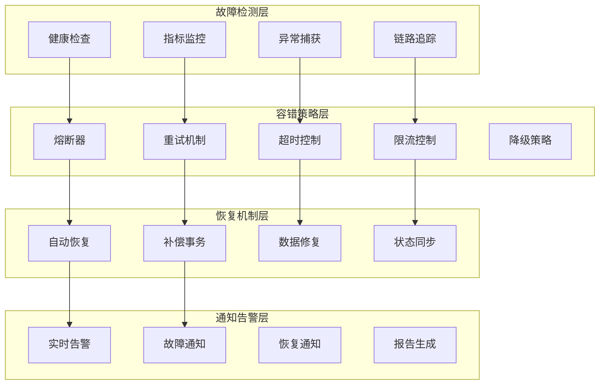
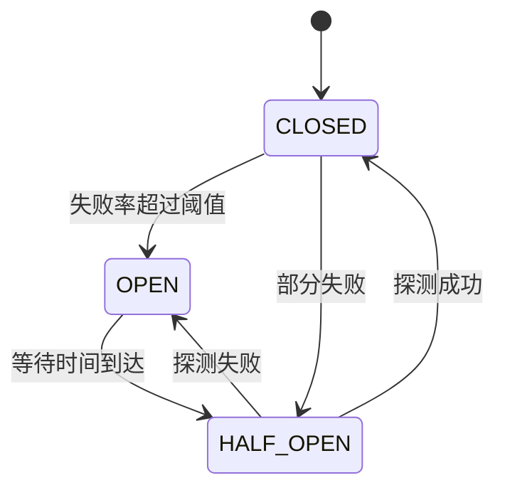

# 🛡️ 容错机制详细设计
*WeWork Management Platform - Fault Tolerance Design*

## 📋 容错机制概览

### 🎯 容错设计目标
- **高可用性**: 系统可用性 > 99.9%
- **快速恢复**: 故障恢复时间 < 30秒
- **优雅降级**: 关键功能在故障时仍可用
- **数据一致性**: 确保数据完整性和一致性
- **用户体验**: 最小化故障对用户的影响

### 🏗️ 容错架构设计



## ⚡ 熔断器模式设计

### 断路器状态机


### 熔断器实现
```java
@Component
public class CircuitBreaker {
    
    private volatile CircuitBreakerState state = CircuitBreakerState.CLOSED;
    private final AtomicInteger failureCount = new AtomicInteger(0);
    private final AtomicInteger successCount = new AtomicInteger(0);
    private final AtomicLong lastFailureTime = new AtomicLong(0);
    
    // 配置参数
    private final int failureThreshold;
    private final int successThreshold;
    private final long timeout;
    private final double failureRateThreshold;
    
    public CircuitBreaker(CircuitBreakerConfig config) {
        this.failureThreshold = config.getFailureThreshold();
        this.successThreshold = config.getSuccessThreshold();
        this.timeout = config.getTimeout();
        this.failureRateThreshold = config.getFailureRateThreshold();
    }
    
    public <T> T execute(Supplier<T> operation, Supplier<T> fallback) {
        if (state == CircuitBreakerState.OPEN) {
            if (System.currentTimeMillis() - lastFailureTime.get() > timeout) {
                state = CircuitBreakerState.HALF_OPEN;
                return executeInHalfOpenState(operation, fallback);
            } else {
                return fallback.get();
            }
        }
        
        if (state == CircuitBreakerState.HALF_OPEN) {
            return executeInHalfOpenState(operation, fallback);
        }
        
        return executeInClosedState(operation, fallback);
    }
    
    private <T> T executeInClosedState(Supplier<T> operation, Supplier<T> fallback) {
        try {
            T result = operation.get();
            onSuccess();
            return result;
        } catch (Exception e) {
            onFailure();
            
            if (shouldOpenCircuit()) {
                state = CircuitBreakerState.OPEN;
                lastFailureTime.set(System.currentTimeMillis());
                return fallback.get();
            }
            
            throw e;
        }
    }
    
    private <T> T executeInHalfOpenState(Supplier<T> operation, Supplier<T> fallback) {
        try {
            T result = operation.get();
            onSuccess();
            
            if (successCount.get() >= successThreshold) {
                state = CircuitBreakerState.CLOSED;
                resetCounters();
            }
            
            return result;
        } catch (Exception e) {
            state = CircuitBreakerState.OPEN;
            lastFailureTime.set(System.currentTimeMillis());
            onFailure();
            return fallback.get();
        }
    }
    
    private void onSuccess() {
        successCount.incrementAndGet();
        failureCount.set(0);
    }
    
    private void onFailure() {
        failureCount.incrementAndGet();
        successCount.set(0);
    }
    
    private boolean shouldOpenCircuit() {
        int totalRequests = failureCount.get() + successCount.get();
        if (totalRequests < failureThreshold) {
            return false;
        }
        
        double failureRate = (double) failureCount.get() / totalRequests;
        return failureRate >= failureRateThreshold;
    }
    
    private void resetCounters() {
        failureCount.set(0);
        successCount.set(0);
    }
}

// 熔断器管理器
@Component
public class CircuitBreakerManager {
    
    private final Map<String, CircuitBreaker> circuitBreakers = new ConcurrentHashMap<>();
    private final CircuitBreakerConfigurationService configService;
    private final CircuitBreakerMetricsCollector metricsCollector;
    
    public CircuitBreaker getCircuitBreaker(String name) {
        return circuitBreakers.computeIfAbsent(name, key -> {
            CircuitBreakerConfig config = configService.getConfig(key);
            CircuitBreaker circuitBreaker = new CircuitBreaker(config);
            
            // 注册监听器
            circuitBreaker.addStateChangeListener(this::onStateChange);
            
            return circuitBreaker;
        });
    }
    
    private void onStateChange(String name, CircuitBreakerState oldState, CircuitBreakerState newState) {
        log.info("Circuit breaker [{}] state changed from {} to {}", name, oldState, newState);
        
        // 发送告警
        if (newState == CircuitBreakerState.OPEN) {
            alertService.sendCircuitBreakerOpenAlert(name);
        } else if (newState == CircuitBreakerState.CLOSED && oldState == CircuitBreakerState.HALF_OPEN) {
            alertService.sendCircuitBreakerRecoveredAlert(name);
        }
        
        // 记录指标
        metricsCollector.recordStateChange(name, newState);
    }
}

// 熔断器注解
@Target(ElementType.METHOD)
@Retention(RetentionPolicy.RUNTIME)
public @interface CircuitBreakerProtected {
    String value() default "default";
    String fallbackMethod() default "";
}

// 熔断器切面
@Aspect
@Component
public class CircuitBreakerAspect {
    
    private final CircuitBreakerManager circuitBreakerManager;
    
    @Around("@annotation(circuitBreakerProtected)")
    public Object applyCircuitBreaker(ProceedingJoinPoint joinPoint, 
                                    CircuitBreakerProtected circuitBreakerProtected) throws Throwable {
        
        String circuitBreakerName = circuitBreakerProtected.value();
        CircuitBreaker circuitBreaker = circuitBreakerManager.getCircuitBreaker(circuitBreakerName);
        
        String fallbackMethodName = circuitBreakerProtected.fallbackMethod();
        
        return circuitBreaker.execute(
            () -> {
                try {
                    return joinPoint.proceed();
                } catch (Throwable e) {
                    throw new RuntimeException(e);
                }
            },
            () -> executeFallbackMethod(joinPoint, fallbackMethodName)
        );
    }
    
    private Object executeFallbackMethod(ProceedingJoinPoint joinPoint, String fallbackMethodName) {
        if (StringUtils.isEmpty(fallbackMethodName)) {
            throw new CircuitBreakerOpenException("Circuit breaker is open and no fallback method specified");
        }
        
        try {
            Object target = joinPoint.getTarget();
            Method fallbackMethod = target.getClass().getMethod(fallbackMethodName, 
                getParameterTypes(joinPoint.getArgs()));
            
            return fallbackMethod.invoke(target, joinPoint.getArgs());
        } catch (Exception e) {
            log.error("Failed to execute fallback method: " + fallbackMethodName, e);
            throw new FallbackExecutionException("Fallback method execution failed", e);
        }
    }
}
```

## 🔄 重试机制设计

### 智能重试策略
```java
@Component
public class RetryMechanism {
    
    private final RetryTemplate retryTemplate;
    private final MeterRegistry meterRegistry;
    
    public RetryMechanism(MeterRegistry meterRegistry) {
        this.meterRegistry = meterRegistry;
        this.retryTemplate = createRetryTemplate();
    }
    
    private RetryTemplate createRetryTemplate() {
        RetryTemplate template = new RetryTemplate();
        
        // 重试策略：指数退避
        ExponentialBackOffPolicy backOffPolicy = new ExponentialBackOffPolicy();
        backOffPolicy.setInitialInterval(1000L);
        backOffPolicy.setMaxInterval(10000L);
        backOffPolicy.setMultiplier(2.0);
        template.setBackOffPolicy(backOffPolicy);
        
        // 重试条件
        SimpleRetryPolicy retryPolicy = new SimpleRetryPolicy();
        retryPolicy.setMaxAttempts(3);
        
        Map<Class<? extends Throwable>, Boolean> retryableExceptions = new HashMap<>();
        retryableExceptions.put(ConnectException.class, true);
        retryableExceptions.put(SocketTimeoutException.class, true);
        retryableExceptions.put(HttpRetryException.class, true);
        retryableExceptions.put(TransientDataAccessException.class, true);
        
        // 不重试的异常
        retryableExceptions.put(IllegalArgumentException.class, false);
        retryableExceptions.put(SecurityException.class, false);
        retryableExceptions.put(AuthenticationException.class, false);
        
        retryPolicy.setRetryableExceptions(retryableExceptions);
        template.setRetryPolicy(retryPolicy);
        
        // 重试监听器
        template.registerListener(new RetryListenerSupport() {
            @Override
            public <T, E extends Throwable> void onError(RetryContext context, 
                                                        RetryCallback<T, E> callback, 
                                                        Throwable throwable) {
                String methodName = context.getAttribute("method_name").toString();
                int attemptCount = context.getRetryCount();
                
                log.warn("Retry attempt {} failed for method {}: {}", 
                        attemptCount, methodName, throwable.getMessage());
                
                // 记录重试指标
                meterRegistry.counter("retry.attempts",
                    "method", methodName,
                    "attempt", String.valueOf(attemptCount),
                    "exception", throwable.getClass().getSimpleName())
                    .increment();
            }
        });
        
        return template;
    }
    
    public <T> T executeWithRetry(String methodName, RetryCallback<T, Exception> callback) {
        return retryTemplate.execute(context -> {
            context.setAttribute("method_name", methodName);
            return callback.doWithRetry(context);
        });
    }
}

// 自适应重试策略
@Component
public class AdaptiveRetryPolicy {
    
    private final Map<String, RetryStatistics> retryStats = new ConcurrentHashMap<>();
    
    public RetryPolicy createAdaptivePolicy(String serviceName) {
        RetryStatistics stats = retryStats.computeIfAbsent(serviceName, 
            k -> new RetryStatistics());
        
        // 根据历史成功率调整重试次数
        int maxAttempts = calculateMaxAttempts(stats);
        long baseInterval = calculateBaseInterval(stats);
        
        return RetryPolicy.builder()
            .maxAttempts(maxAttempts)
            .baseInterval(baseInterval)
            .backoffStrategy(BackoffStrategy.EXPONENTIAL_JITTER)
            .retryableExceptions(getRetryableExceptions())
            .onRetry(this::onRetry)
            .build();
    }
    
    private int calculateMaxAttempts(RetryStatistics stats) {
        double successRate = stats.getSuccessRate();
        
        if (successRate > 0.9) {
            return 2; // 高成功率，少重试
        } else if (successRate > 0.7) {
            return 3; // 中等成功率，正常重试
        } else {
            return 5; // 低成功率，多重试
        }
    }
    
    private long calculateBaseInterval(RetryStatistics stats) {
        double averageResponseTime = stats.getAverageResponseTime();
        
        // 基于平均响应时间调整重试间隔
        return Math.max(500L, (long) (averageResponseTime * 1.5));
    }
    
    private void onRetry(RetryEvent event) {
        String serviceName = event.getServiceName();
        RetryStatistics stats = retryStats.get(serviceName);
        
        if (stats != null) {
            stats.recordRetry(event.getException());
        }
    }
    
    // 重试统计
    public static class RetryStatistics {
        private final AtomicLong totalRequests = new AtomicLong(0);
        private final AtomicLong successfulRequests = new AtomicLong(0);
        private final AtomicLong totalResponseTime = new AtomicLong(0);
        private final Map<Class<? extends Exception>, AtomicLong> exceptionCounts = new ConcurrentHashMap<>();
        
        public void recordSuccess(long responseTime) {
            totalRequests.incrementAndGet();
            successfulRequests.incrementAndGet();
            totalResponseTime.addAndGet(responseTime);
        }
        
        public void recordFailure(Exception exception, long responseTime) {
            totalRequests.incrementAndGet();
            totalResponseTime.addAndGet(responseTime);
            exceptionCounts.computeIfAbsent(exception.getClass(), k -> new AtomicLong(0))
                .incrementAndGet();
        }
        
        public void recordRetry(Exception exception) {
            exceptionCounts.computeIfAbsent(exception.getClass(), k -> new AtomicLong(0))
                .incrementAndGet();
        }
        
        public double getSuccessRate() {
            long total = totalRequests.get();
            return total > 0 ? (double) successfulRequests.get() / total : 0.0;
        }
        
        public double getAverageResponseTime() {
            long total = totalRequests.get();
            return total > 0 ? (double) totalResponseTime.get() / total : 0.0;
        }
    }
}

// 重试注解
@Target(ElementType.METHOD)
@Retention(RetentionPolicy.RUNTIME)
public @interface Retryable {
    String value() default "default";
    int maxAttempts() default 3;
    long delay() default 1000L;
    double multiplier() default 2.0;
    Class<? extends Exception>[] include() default {};
    Class<? extends Exception>[] exclude() default {};
    boolean adaptive() default false;
}

// 重试切面
@Aspect
@Component
public class RetryAspect {
    
    private final AdaptiveRetryPolicy adaptiveRetryPolicy;
    private final RetryMechanism retryMechanism;
    
    @Around("@annotation(retryable)")
    public Object applyRetry(ProceedingJoinPoint joinPoint, Retryable retryable) throws Throwable {
        String methodName = joinPoint.getSignature().getName();
        
        if (retryable.adaptive()) {
            return executeWithAdaptiveRetry(joinPoint, methodName, retryable);
        } else {
            return executeWithFixedRetry(joinPoint, methodName, retryable);
        }
    }
    
    private Object executeWithAdaptiveRetry(ProceedingJoinPoint joinPoint, 
                                          String methodName, 
                                          Retryable retryable) throws Throwable {
        String serviceName = retryable.value();
        RetryPolicy policy = adaptiveRetryPolicy.createAdaptivePolicy(serviceName);
        
        return policy.execute(() -> {
            try {
                return joinPoint.proceed();
            } catch (Throwable e) {
                throw new RuntimeException(e);
            }
        });
    }
    
    private Object executeWithFixedRetry(ProceedingJoinPoint joinPoint, 
                                       String methodName, 
                                       Retryable retryable) throws Throwable {
        return retryMechanism.executeWithRetry(methodName, context -> {
            try {
                return joinPoint.proceed();
            } catch (Throwable e) {
                if (shouldRetry(e, retryable)) {
                    throw new RuntimeException(e);
                } else {
                    throw e;
                }
            }
        });
    }
    
    private boolean shouldRetry(Throwable exception, Retryable retryable) {
        Class<? extends Exception>[] includeExceptions = retryable.include();
        Class<? extends Exception>[] excludeExceptions = retryable.exclude();
        
        // 检查排除列表
        for (Class<? extends Exception> excludeException : excludeExceptions) {
            if (excludeException.isAssignableFrom(exception.getClass())) {
                return false;
            }
        }
        
        // 检查包含列表
        if (includeExceptions.length > 0) {
            for (Class<? extends Exception> includeException : includeExceptions) {
                if (includeException.isAssignableFrom(exception.getClass())) {
                    return true;
                }
            }
            return false;
        }
        
        return true;
    }
}
```

## 📉 降级策略设计

### 多级降级机制
```java
@Component
public class DegradationManager {
    
    private final Map<String, DegradationLevel> currentLevels = new ConcurrentHashMap<>();
    private final DegradationConfigService configService;
    private final PerformanceMonitor performanceMonitor;
    
    public enum DegradationLevel {
        NORMAL(0, "正常服务"),
        LIGHT(1, "轻度降级"),
        MODERATE(2, "中度降级"),
        HEAVY(3, "重度降级"),
        EMERGENCY(4, "紧急降级");
        
        private final int level;
        private final String description;
        
        DegradationLevel(int level, String description) {
            this.level = level;
            this.description = description;
        }
    }
    
    // 自动降级检测
    @Scheduled(fixedRate = 30000) // 每30秒检测一次
    public void evaluateDegradation() {
        for (String serviceName : configService.getMonitoredServices()) {
            DegradationLevel currentLevel = getCurrentLevel(serviceName);
            DegradationLevel requiredLevel = calculateRequiredLevel(serviceName);
            
            if (requiredLevel != currentLevel) {
                adjustDegradationLevel(serviceName, requiredLevel);
            }
        }
    }
    
    private DegradationLevel calculateRequiredLevel(String serviceName) {
        PerformanceMetrics metrics = performanceMonitor.getMetrics(serviceName);
        
        double errorRate = metrics.getErrorRate();
        double responseTime = metrics.getAverageResponseTime();
        double cpuUsage = metrics.getCpuUsage();
        double memoryUsage = metrics.getMemoryUsage();
        
        // 多维度评估降级等级
        int score = 0;
        
        if (errorRate > 0.1) score += 2;
        else if (errorRate > 0.05) score += 1;
        
        if (responseTime > 5000) score += 2;
        else if (responseTime > 2000) score += 1;
        
        if (cpuUsage > 0.8) score += 2;
        else if (cpuUsage > 0.7) score += 1;
        
        if (memoryUsage > 0.8) score += 2;
        else if (memoryUsage > 0.7) score += 1;
        
        return DegradationLevel.values()[Math.min(score, 4)];
    }
    
    private void adjustDegradationLevel(String serviceName, DegradationLevel newLevel) {
        DegradationLevel oldLevel = currentLevels.get(serviceName);
        currentLevels.put(serviceName, newLevel);
        
        log.info("Service [{}] degradation level changed from {} to {}", 
                serviceName, oldLevel, newLevel);
        
        // 应用降级策略
        applyDegradationStrategies(serviceName, newLevel);
        
        // 发送告警
        if (newLevel.level > DegradationLevel.NORMAL.level) {
            alertService.sendDegradationAlert(serviceName, oldLevel, newLevel);
        } else if (oldLevel != null && oldLevel.level > DegradationLevel.NORMAL.level) {
            alertService.sendRecoveryAlert(serviceName, oldLevel, newLevel);
        }
        
        // 记录指标
        meterRegistry.gauge("service.degradation.level", 
            Tags.of("service", serviceName), newLevel.level);
    }
    
    private void applyDegradationStrategies(String serviceName, DegradationLevel level) {
        List<DegradationStrategy> strategies = configService.getStrategies(serviceName, level);
        
        for (DegradationStrategy strategy : strategies) {
            try {
                strategy.apply(serviceName, level);
            } catch (Exception e) {
                log.error("Failed to apply degradation strategy: " + strategy.getName(), e);
            }
        }
    }
    
    public DegradationLevel getCurrentLevel(String serviceName) {
        return currentLevels.getOrDefault(serviceName, DegradationLevel.NORMAL);
    }
}

// 降级策略接口
public interface DegradationStrategy {
    String getName();
    void apply(String serviceName, DegradationLevel level);
    void recover(String serviceName);
}

// 功能降级策略
@Component
public class FeatureDegradationStrategy implements DegradationStrategy {
    
    private final FeatureToggleService featureToggleService;
    
    @Override
    public String getName() {
        return "feature_degradation";
    }
    
    @Override
    public void apply(String serviceName, DegradationLevel level) {
        switch (level) {
            case LIGHT:
                // 轻度降级：关闭非核心功能
                featureToggleService.disable("advanced_analytics");
                featureToggleService.disable("real_time_notifications");
                break;
                
            case MODERATE:
                // 中度降级：关闭更多功能
                featureToggleService.disable("file_upload");
                featureToggleService.disable("export_functionality");
                featureToggleService.disable("batch_operations");
                break;
                
            case HEAVY:
                // 重度降级：只保留核心功能
                featureToggleService.disableAllExcept(Arrays.asList(
                    "message_sending", "basic_query", "user_auth"
                ));
                break;
                
            case EMERGENCY:
                // 紧急降级：只读模式
                featureToggleService.enableReadOnlyMode();
                break;
        }
    }
    
    @Override
    public void recover(String serviceName) {
        featureToggleService.enableAll();
        featureToggleService.disableReadOnlyMode();
    }
}

// 数据降级策略
@Component
public class DataDegradationStrategy implements DegradationStrategy {
    
    private final CacheManager cacheManager;
    private final DatabaseService databaseService;
    
    @Override
    public String getName() {
        return "data_degradation";
    }
    
    @Override
    public void apply(String serviceName, DegradationLevel level) {
        switch (level) {
            case LIGHT:
                // 增加缓存时间，减少数据库压力
                cacheManager.extendCacheTtl("user_data", Duration.ofHours(2));
                cacheManager.extendCacheTtl("message_templates", Duration.ofHours(4));
                break;
                
            case MODERATE:
                // 返回缓存数据，即使过期
                cacheManager.enableStaleDataReturn("user_data");
                // 减少数据精度
                databaseService.enableSamplingMode(0.1); // 10%采样
                break;
                
            case HEAVY:
                // 返回默认数据
                cacheManager.enableDefaultDataReturn();
                // 停止非关键数据更新
                databaseService.suspendNonCriticalUpdates();
                break;
                
            case EMERGENCY:
                // 最小化数据集
                databaseService.enableMinimalDataMode();
                break;
        }
    }
    
    @Override
    public void recover(String serviceName) {
        cacheManager.restoreNormalTtl();
        cacheManager.disableStaleDataReturn();
        databaseService.disableSamplingMode();
        databaseService.resumeAllUpdates();
        databaseService.disableMinimalDataMode();
    }
}

// 降级注解
@Target(ElementType.METHOD)
@Retention(RetentionPolicy.RUNTIME)
public @interface Degradable {
    String service() default "default";
    DegradationLevel requiredLevel() default DegradationLevel.NORMAL;
    String fallbackMethod() default "";
    String message() default "Service temporarily unavailable";
}

// 降级切面
@Aspect
@Component
public class DegradationAspect {
    
    private final DegradationManager degradationManager;
    
    @Around("@annotation(degradable)")
    public Object applyDegradation(ProceedingJoinPoint joinPoint, Degradable degradable) throws Throwable {
        String serviceName = degradable.service();
        DegradationLevel currentLevel = degradationManager.getCurrentLevel(serviceName);
        DegradationLevel requiredLevel = degradable.requiredLevel();
        
        // 如果当前降级等级高于所需等级，执行降级逻辑
        if (currentLevel.level > requiredLevel.level) {
            return handleDegradation(joinPoint, degradable, currentLevel);
        }
        
        return joinPoint.proceed();
    }
    
    private Object handleDegradation(ProceedingJoinPoint joinPoint, 
                                   Degradable degradable, 
                                   DegradationLevel currentLevel) throws Throwable {
        String fallbackMethod = degradable.fallbackMethod();
        
        if (StringUtils.isNotEmpty(fallbackMethod)) {
            return executeFallbackMethod(joinPoint, fallbackMethod);
        } else {
            throw new ServiceDegradedException(degradable.message() + 
                " (Current level: " + currentLevel.description + ")");
        }
    }
}
```

## ⏱️ 超时控制机制

### 层级超时设计
```java
@Component
public class TimeoutManager {
    
    private final Map<String, TimeoutConfig> timeoutConfigs = new ConcurrentHashMap<>();
    private final ScheduledExecutorService timeoutExecutor;
    
    public TimeoutManager() {
        this.timeoutExecutor = Executors.newScheduledThreadPool(10, 
            new ThreadFactoryBuilder().setNameFormat("timeout-manager-%d").build());
    }
    
    public <T> CompletableFuture<T> executeWithTimeout(String operationName,
                                                     Supplier<T> operation,
                                                     Duration timeout) {
        TimeoutConfig config = getTimeoutConfig(operationName);
        Duration effectiveTimeout = timeout != null ? timeout : config.getDefaultTimeout();
        
        CompletableFuture<T> future = CompletableFuture.supplyAsync(operation);
        
        // 设置超时
        ScheduledFuture<?> timeoutFuture = timeoutExecutor.schedule(() -> {
            if (!future.isDone()) {
                future.completeExceptionally(new TimeoutException(
                    "Operation [" + operationName + "] timed out after " + effectiveTimeout));
            }
        }, effectiveTimeout.toMillis(), TimeUnit.MILLISECONDS);
        
        // 操作完成后取消超时任务
        future.whenComplete((result, throwable) -> {
            timeoutFuture.cancel(false);
            
            if (throwable instanceof TimeoutException) {
                handleTimeout(operationName, effectiveTimeout);
            }
        });
        
        return future;
    }
    
    private void handleTimeout(String operationName, Duration timeout) {
        log.warn("Operation [{}] timed out after {}", operationName, timeout);
        
        // 记录超时指标
        meterRegistry.counter("operation.timeout",
            "operation", operationName,
            "timeout", timeout.toString())
            .increment();
        
        // 触发超时告警
        if (isTimeoutRateHigh(operationName)) {
            alertService.sendTimeoutAlert(operationName, timeout);
        }
    }
    
    private boolean isTimeoutRateHigh(String operationName) {
        // 检查超时率是否过高
        Timer timer = meterRegistry.timer("operation.duration", "operation", operationName);
        long totalCount = timer.count();
        
        Counter timeoutCounter = meterRegistry.counter("operation.timeout", "operation", operationName);
        double timeoutCount = timeoutCounter.count();
        
        return totalCount > 100 && (timeoutCount / totalCount) > 0.1; // 超时率 > 10%
    }
    
    private TimeoutConfig getTimeoutConfig(String operationName) {
        return timeoutConfigs.computeIfAbsent(operationName, key -> {
            // 从配置中心获取或使用默认配置
            return TimeoutConfig.builder()
                .defaultTimeout(Duration.ofSeconds(30))
                .maxTimeout(Duration.ofMinutes(5))
                .warningThreshold(Duration.ofSeconds(20))
                .build();
        });
    }
}

// 级联超时处理
@Component
public class CascadingTimeoutHandler {
    
    private final TimeoutManager timeoutManager;
    
    // HTTP调用超时
    public <T> CompletableFuture<T> executeHttpCall(String serviceName, 
                                                  Supplier<T> httpCall) {
        Duration timeout = calculateHttpTimeout(serviceName);
        return timeoutManager.executeWithTimeout("http_call_" + serviceName, httpCall, timeout);
    }
    
    // 数据库查询超时
    public <T> CompletableFuture<T> executeDbQuery(String queryName, 
                                                 Supplier<T> dbQuery) {
        Duration timeout = calculateDbTimeout(queryName);
        return timeoutManager.executeWithTimeout("db_query_" + queryName, dbQuery, timeout);
    }
    
    // 缓存操作超时
    public <T> CompletableFuture<T> executeCacheOperation(String operationName,
                                                        Supplier<T> cacheOperation) {
        Duration timeout = Duration.ofMillis(500); // 缓存操作通常很快
        return timeoutManager.executeWithTimeout("cache_" + operationName, cacheOperation, timeout);
    }
    
    private Duration calculateHttpTimeout(String serviceName) {
        // 根据服务的历史响应时间动态计算超时时间
        Timer timer = meterRegistry.timer("http.request.duration", "service", serviceName);
        
        if (timer.count() > 10) {
            double p95 = timer.percentile(0.95, TimeUnit.MILLISECONDS);
            return Duration.ofMillis((long) (p95 * 2)); // P95的2倍作为超时时间
        } else {
            return Duration.ofSeconds(10); // 默认10秒
        }
    }
    
    private Duration calculateDbTimeout(String queryName) {
        // 根据查询复杂度和历史数据计算超时时间
        Timer timer = meterRegistry.timer("db.query.duration", "query", queryName);
        
        if (timer.count() > 5) {
            double p90 = timer.percentile(0.90, TimeUnit.MILLISECONDS);
            return Duration.ofMillis((long) (p90 * 1.5)); // P90的1.5倍
        } else {
            return Duration.ofSeconds(30); // 默认30秒
        }
    }
}

// 超时注解
@Target(ElementType.METHOD)
@Retention(RetentionPolicy.RUNTIME)
public @interface WithTimeout {
    long value() default 30; // 默认30秒
    TimeUnit unit() default TimeUnit.SECONDS;
    String operationName() default "";
    boolean adaptive() default false;
    String timeoutHandler() default "";
}

// 超时切面
@Aspect
@Component
public class TimeoutAspect {
    
    private final TimeoutManager timeoutManager;
    
    @Around("@annotation(withTimeout)")
    public Object applyTimeout(ProceedingJoinPoint joinPoint, WithTimeout withTimeout) throws Throwable {
        String operationName = StringUtils.isNotEmpty(withTimeout.operationName()) 
            ? withTimeout.operationName() 
            : joinPoint.getSignature().getName();
        
        Duration timeout = Duration.of(withTimeout.value(), withTimeout.unit().toChronoUnit());
        
        CompletableFuture<Object> future = timeoutManager.executeWithTimeout(
            operationName,
            () -> {
                try {
                    return joinPoint.proceed();
                } catch (Throwable e) {
                    throw new RuntimeException(e);
                }
            },
            timeout
        );
        
        try {
            return future.get();
        } catch (ExecutionException e) {
            if (e.getCause() instanceof RuntimeException) {
                RuntimeException re = (RuntimeException) e.getCause();
                if (re.getCause() instanceof Throwable) {
                    throw (Throwable) re.getCause();
                }
                throw re;
            }
            throw e.getCause();
        } catch (java.util.concurrent.TimeoutException e) {
            return handleTimeout(joinPoint, withTimeout, operationName);
        }
    }
    
    private Object handleTimeout(ProceedingJoinPoint joinPoint, 
                               WithTimeout withTimeout, 
                               String operationName) throws Throwable {
        String timeoutHandler = withTimeout.timeoutHandler();
        
        if (StringUtils.isNotEmpty(timeoutHandler)) {
            return executeTimeoutHandler(joinPoint, timeoutHandler);
        } else {
            throw new OperationTimeoutException("Operation [" + operationName + "] timed out");
        }
    }
}
```

## 🚦 限流和背压处理

### 多维度限流器
```java
@Component
public class MultiDimensionalRateLimiter {
    
    private final Map<String, RateLimiter> rateLimiters = new ConcurrentHashMap<>();
    private final RedisTemplate<String, String> redisTemplate;
    
    // 基于令牌桶的限流
    public boolean tryAcquire(String key, int permits, RateLimitConfig config) {
        String limitKey = "rate_limit:" + key;
        
        // 使用Lua脚本实现原子性令牌桶
        String luaScript = """
            local key = KEYS[1]
            local capacity = tonumber(ARGV[1])
            local tokens = tonumber(ARGV[2])
            local interval = tonumber(ARGV[3])
            local requested = tonumber(ARGV[4])
            local now = tonumber(ARGV[5])
            
            local bucket = redis.call('HMGET', key, 'tokens', 'last_refill')
            local current_tokens = tonumber(bucket[1]) or capacity
            local last_refill = tonumber(bucket[2]) or now
            
            -- 计算需要添加的令牌数
            local elapsed = math.max(0, now - last_refill)
            local tokens_to_add = math.floor(elapsed / interval * tokens)
            current_tokens = math.min(capacity, current_tokens + tokens_to_add)
            
            if current_tokens >= requested then
                current_tokens = current_tokens - requested
                redis.call('HMSET', key, 
                    'tokens', current_tokens, 
                    'last_refill', now)
                redis.call('EXPIRE', key, 3600)
                return 1
            else
                redis.call('HMSET', key, 
                    'tokens', current_tokens, 
                    'last_refill', now)
                redis.call('EXPIRE', key, 3600)
                return 0
            end
            """;
        
        List<String> keys = Collections.singletonList(limitKey);
        List<String> args = Arrays.asList(
            String.valueOf(config.getCapacity()),
            String.valueOf(config.getRefillTokens()),
            String.valueOf(config.getRefillInterval().toMillis()),
            String.valueOf(permits),
            String.valueOf(System.currentTimeMillis())
        );
        
        Long result = redisTemplate.execute((RedisCallback<Long>) connection ->
            connection.eval(luaScript.getBytes(), ReturnType.INTEGER, 
                          keys.size(), keys.toArray(new String[0]), 
                          args.toArray(new String[0])));
        
        boolean acquired = result != null && result == 1;
        
        // 记录限流指标
        meterRegistry.counter("rate_limiter.requests",
            "key", key,
            "result", acquired ? "allowed" : "rejected")
            .increment();
        
        if (!acquired) {
            log.warn("Rate limit exceeded for key: {}", key);
        }
        
        return acquired;
    }
    
    // 滑动窗口限流
    public boolean tryAcquireWithSlidingWindow(String key, int limit, Duration window) {
        String windowKey = "sliding_window:" + key;
        long windowStart = System.currentTimeMillis() - window.toMillis();
        long now = System.currentTimeMillis();
        
        String luaScript = """
            local key = KEYS[1]
            local window_start = ARGV[1]
            local now = ARGV[2]
            local limit = tonumber(ARGV[3])
            
            -- 移除过期的请求
            redis.call('ZREMRANGEBYSCORE', key, '-inf', window_start)
            
            -- 获取当前窗口内的请求数
            local current = redis.call('ZCARD', key)
            
            if current < limit then
                -- 添加当前请求
                redis.call('ZADD', key, now, now)
                redis.call('EXPIRE', key, 3600)
                return 1
            else
                return 0
            end
            """;
        
        List<String> keys = Collections.singletonList(windowKey);
        List<String> args = Arrays.asList(
            String.valueOf(windowStart),
            String.valueOf(now),
            String.valueOf(limit)
        );
        
        Long result = redisTemplate.execute((RedisCallback<Long>) connection ->
            connection.eval(luaScript.getBytes(), ReturnType.INTEGER,
                          keys.size(), keys.toArray(new String[0]),
                          args.toArray(new String[0])));
        
        return result != null && result == 1;
    }
}

// 背压处理机制
@Component
public class BackpressureHandler {
    
    private final Queue<PendingRequest> pendingRequests = new LinkedBlockingQueue<>();
    private final ScheduledExecutorService scheduler = Executors.newScheduledThreadPool(5);
    private final AtomicBoolean backpressureActive = new AtomicBoolean(false);
    
    public <T> CompletableFuture<T> handleWithBackpressure(String operation,
                                                         Supplier<T> task,
                                                         BackpressureConfig config) {
        // 检查是否需要启用背压
        if (shouldActivateBackpressure(operation, config)) {
            return handleWithQueue(operation, task, config);
        } else {
            return CompletableFuture.supplyAsync(task);
        }
    }
    
    private <T> CompletableFuture<T> handleWithQueue(String operation,
                                                   Supplier<T> task,
                                                   BackpressureConfig config) {
        CompletableFuture<T> future = new CompletableFuture<>();
        PendingRequest<T> request = new PendingRequest<>(operation, task, future, config.getPriority());
        
        // 检查队列容量
        if (pendingRequests.size() >= config.getMaxQueueSize()) {
            // 队列满，执行拒绝策略
            return handleQueueOverflow(operation, task, config);
        }
        
        pendingRequests.offer(request);
        
        // 启动处理器（如果还没启动）
        startProcessorIfNeeded();
        
        return future;
    }
    
    private <T> CompletableFuture<T> handleQueueOverflow(String operation,
                                                       Supplier<T> task,
                                                       BackpressureConfig config) {
        switch (config.getOverflowStrategy()) {
            case DROP_OLDEST:
                // 丢弃最老的请求
                PendingRequest<?> oldest = pendingRequests.poll();
                if (oldest != null) {
                    oldest.getFuture().completeExceptionally(
                        new BackpressureException("Request dropped due to queue overflow"));
                }
                return handleWithQueue(operation, task, config);
                
            case DROP_LATEST:
                // 丢弃当前请求
                CompletableFuture<T> future = new CompletableFuture<>();
                future.completeExceptionally(
                    new BackpressureException("Request dropped due to queue overflow"));
                return future;
                
            case BLOCK:
                // 阻塞等待
                return CompletableFuture.supplyAsync(() -> {
                    try {
                        Thread.sleep(config.getBlockTimeout().toMillis());
                        return handleWithQueue(operation, task, config).get();
                    } catch (Exception e) {
                        throw new RuntimeException(e);
                    }
                });
                
            default:
                throw new UnsupportedOperationException("Unknown overflow strategy: " + 
                    config.getOverflowStrategy());
        }
    }
    
    private boolean shouldActivateBackpressure(String operation, BackpressureConfig config) {
        // 检查系统负载指标
        PerformanceMetrics metrics = performanceMonitor.getMetrics(operation);
        
        return metrics.getCpuUsage() > config.getCpuThreshold() ||
               metrics.getMemoryUsage() > config.getMemoryThreshold() ||
               metrics.getQueueSize() > config.getQueueThreshold();
    }
    
    private void startProcessorIfNeeded() {
        if (backpressureActive.compareAndSet(false, true)) {
            scheduler.scheduleWithFixedDelay(this::processRequests, 0, 100, TimeUnit.MILLISECONDS);
        }
    }
    
    private void processRequests() {
        try {
            List<PendingRequest<?>> batch = new ArrayList<>();
            PendingRequest<?> request;
            
            // 批量处理请求
            while ((request = pendingRequests.poll()) != null && batch.size() < 10) {
                batch.add(request);
            }
            
            if (batch.isEmpty()) {
                // 没有待处理请求，停止处理器
                backpressureActive.set(false);
                return;
            }
            
            // 按优先级排序
            batch.sort(Comparator.comparing(PendingRequest::getPriority).reversed());
            
            // 并行处理
            batch.parallelStream().forEach(this::executeRequest);
            
        } catch (Exception e) {
            log.error("Error processing backpressure requests", e);
        }
    }
    
    private void executeRequest(PendingRequest<?> request) {
        try {
            Object result = request.getTask().get();
            request.getFuture().complete(result);
        } catch (Exception e) {
            request.getFuture().completeExceptionally(e);
        }
    }
    
    // 待处理请求
    private static class PendingRequest<T> {
        private final String operation;
        private final Supplier<T> task;
        private final CompletableFuture<T> future;
        private final int priority;
        private final long timestamp;
        
        public PendingRequest(String operation, Supplier<T> task, 
                            CompletableFuture<T> future, int priority) {
            this.operation = operation;
            this.task = task;
            this.future = future;
            this.priority = priority;
            this.timestamp = System.currentTimeMillis();
        }
        
        // getters...
    }
}

// 限流注解
@Target(ElementType.METHOD)
@Retention(RetentionPolicy.RUNTIME)
public @interface RateLimited {
    String key() default "";
    int permits() default 1;
    int capacity() default 100;
    int refillTokens() default 10;
    long refillInterval() default 1000; // milliseconds
    String errorMessage() default "Rate limit exceeded";
}

// 限流切面
@Aspect
@Component
public class RateLimitAspect {
    
    private final MultiDimensionalRateLimiter rateLimiter;
    
    @Around("@annotation(rateLimited)")
    public Object applyRateLimit(ProceedingJoinPoint joinPoint, RateLimited rateLimited) throws Throwable {
        String key = generateKey(joinPoint, rateLimited);
        RateLimitConfig config = createConfig(rateLimited);
        
        if (rateLimiter.tryAcquire(key, rateLimited.permits(), config)) {
            return joinPoint.proceed();
        } else {
            throw new RateLimitExceededException(rateLimited.errorMessage());
        }
    }
    
    private String generateKey(ProceedingJoinPoint joinPoint, RateLimited rateLimited) {
        if (StringUtils.isNotEmpty(rateLimited.key())) {
            return rateLimited.key();
        }
        
        // 使用方法名 + 用户ID作为key
        String methodName = joinPoint.getSignature().getName();
        String userId = getCurrentUserId();
        
        return methodName + ":" + userId;
    }
}
```

## 🔧 故障恢复机制

### 自动恢复系统
```java
@Component
public class AutoRecoverySystem {
    
    private final Map<String, RecoveryStrategy> recoveryStrategies = new HashMap<>();
    private final ScheduledExecutorService recoveryExecutor = Executors.newScheduledThreadPool(5);
    private final Map<String, RecoveryAttempt> ongoingRecoveries = new ConcurrentHashMap<>();
    
    @PostConstruct
    public void initializeStrategies() {
        recoveryStrategies.put("database_connection", new DatabaseRecoveryStrategy());
        recoveryStrategies.put("external_service", new ExternalServiceRecoveryStrategy());
        recoveryStrategies.put("cache_service", new CacheRecoveryStrategy());
        recoveryStrategies.put("message_queue", new MessageQueueRecoveryStrategy());
    }
    
    public void triggerRecovery(String componentName, FailureInfo failureInfo) {
        // 避免重复恢复
        if (ongoingRecoveries.containsKey(componentName)) {
            log.info("Recovery already in progress for component: {}", componentName);
            return;
        }
        
        RecoveryStrategy strategy = getRecoveryStrategy(componentName, failureInfo);
        if (strategy == null) {
            log.warn("No recovery strategy found for component: {}", componentName);
            return;
        }
        
        RecoveryAttempt attempt = new RecoveryAttempt(componentName, strategy, failureInfo);
        ongoingRecoveries.put(componentName, attempt);
        
        // 异步执行恢复
        CompletableFuture.runAsync(() -> executeRecovery(attempt), recoveryExecutor);
    }
    
    private void executeRecovery(RecoveryAttempt attempt) {
        String componentName = attempt.getComponentName();
        RecoveryStrategy strategy = attempt.getStrategy();
        
        try {
            log.info("Starting recovery for component: {}", componentName);
            
            RecoveryResult result = strategy.recover(attempt.getFailureInfo());
            
            if (result.isSuccess()) {
                log.info("Recovery successful for component: {}", componentName);
                onRecoverySuccess(componentName, result);
            } else {
                log.warn("Recovery failed for component: {}, will retry", componentName);
                scheduleRetry(attempt, result.getNextRetryDelay());
            }
            
        } catch (Exception e) {
            log.error("Recovery execution failed for component: " + componentName, e);
            scheduleRetry(attempt, Duration.ofMinutes(1));
        }
    }
    
    private void scheduleRetry(RecoveryAttempt attempt, Duration delay) {
        String componentName = attempt.getComponentName();
        
        if (attempt.incrementAttemptCount() >= 5) {
            log.error("Max recovery attempts reached for component: {}", componentName);
            onRecoveryFailure(componentName, attempt);
            return;
        }
        
        log.info("Scheduling recovery retry for component: {} in {}", componentName, delay);
        
        recoveryExecutor.schedule(() -> executeRecovery(attempt), 
                                delay.toMillis(), TimeUnit.MILLISECONDS);
    }
    
    private void onRecoverySuccess(String componentName, RecoveryResult result) {
        ongoingRecoveries.remove(componentName);
        
        // 发送恢复成功通知
        alertService.sendRecoverySuccessAlert(componentName, result);
        
        // 记录恢复指标
        meterRegistry.counter("recovery.success", "component", componentName).increment();
        
        // 恢复后验证
        scheduleHealthCheck(componentName, Duration.ofMinutes(1));
    }
    
    private void onRecoveryFailure(String componentName, RecoveryAttempt attempt) {
        ongoingRecoveries.remove(componentName);
        
        // 发送恢复失败通知
        alertService.sendRecoveryFailureAlert(componentName, attempt);
        
        // 记录失败指标
        meterRegistry.counter("recovery.failure", "component", componentName).increment();
        
        // 标记组件为不可用
        componentStatusService.markAsUnavailable(componentName);
    }
    
    private RecoveryStrategy getRecoveryStrategy(String componentName, FailureInfo failureInfo) {
        // 根据组件类型和故障类型选择恢复策略
        String strategyKey = determineStrategyKey(componentName, failureInfo);
        return recoveryStrategies.get(strategyKey);
    }
}

// 数据库恢复策略
@Component
public class DatabaseRecoveryStrategy implements RecoveryStrategy {
    
    private final DataSourceHealthIndicator healthIndicator;
    private final DatabaseConnectionPool connectionPool;
    
    @Override
    public RecoveryResult recover(FailureInfo failureInfo) {
        try {
            // 1. 检查连接池状态
            if (!connectionPool.isHealthy()) {
                connectionPool.reset();
                Thread.sleep(5000); // 等待连接池重置
            }
            
            // 2. 测试数据库连接
            boolean isConnected = testDatabaseConnection();
            if (!isConnected) {
                return RecoveryResult.failure("Database connection test failed", 
                                           Duration.ofMinutes(2));
            }
            
            // 3. 验证数据完整性
            boolean isDataIntact = verifyDataIntegrity();
            if (!isDataIntact) {
                return RecoveryResult.failure("Data integrity verification failed", 
                                           Duration.ofMinutes(5));
            }
            
            // 4. 恢复正常服务
            enableDatabaseService();
            
            return RecoveryResult.success("Database service recovered successfully");
            
        } catch (Exception e) {
            return RecoveryResult.failure("Recovery failed: " + e.getMessage(), 
                                       Duration.ofMinutes(3));
        }
    }
    
    private boolean testDatabaseConnection() {
        try {
            return healthIndicator.health().getStatus() == Status.UP;
        } catch (Exception e) {
            log.error("Database connection test failed", e);
            return false;
        }
    }
    
    private boolean verifyDataIntegrity() {
        try {
            // 执行数据完整性检查查询
            jdbcTemplate.queryForObject("SELECT COUNT(*) FROM information_schema.tables", Integer.class);
            return true;
        } catch (Exception e) {
            log.error("Data integrity verification failed", e);
            return false;
        }
    }
    
    private void enableDatabaseService() {
        // 重新启用数据库相关服务
        serviceRegistry.enableService("database");
        circuitBreakerManager.getCircuitBreaker("database").reset();
    }
}

// 补偿事务机制
@Component
public class CompensationTransactionManager {
    
    private final Map<String, List<CompensationAction>> pendingCompensations = new ConcurrentHashMap<>();
    private final CompensationLogRepository compensationLogRepository;
    
    @Transactional
    public void executeWithCompensation(String transactionId, BusinessOperation operation) {
        List<CompensationAction> compensationActions = new ArrayList<>();
        
        try {
            // 注册补偿上下文
            CompensationContext.register(transactionId, compensationActions);
            
            // 执行业务操作
            operation.execute();
            
            // 操作成功，清除补偿动作
            compensationActions.clear();
            
        } catch (Exception e) {
            // 操作失败，执行补偿
            executeCompensation(transactionId, compensationActions, e);
            throw e;
        } finally {
            CompensationContext.clear();
        }
    }
    
    private void executeCompensation(String transactionId, 
                                   List<CompensationAction> actions, 
                                   Exception originalException) {
        log.info("Executing compensation for transaction: {}", transactionId);
        
        // 记录补偿开始
        CompensationLog compensationLog = CompensationLog.builder()
            .transactionId(transactionId)
            .originalException(originalException.getMessage())
            .startTime(LocalDateTime.now())
            .status(CompensationStatus.IN_PROGRESS)
            .build();
        
        compensationLogRepository.save(compensationLog);
        
        // 逆序执行补偿动作
        Collections.reverse(actions);
        
        List<String> compensationErrors = new ArrayList<>();
        
        for (CompensationAction action : actions) {
            try {
                action.compensate();
                log.info("Compensation action executed: {}", action.getDescription());
            } catch (Exception e) {
                String error = "Compensation action failed: " + action.getDescription() + ", error: " + e.getMessage();
                log.error(error, e);
                compensationErrors.add(error);
            }
        }
        
        // 更新补偿日志
        compensationLog.setEndTime(LocalDateTime.now());
        compensationLog.setStatus(compensationErrors.isEmpty() ? 
            CompensationStatus.COMPLETED : CompensationStatus.PARTIAL_FAILURE);
        compensationLog.setErrors(String.join("; ", compensationErrors));
        
        compensationLogRepository.save(compensationLog);
        
        if (!compensationErrors.isEmpty()) {
            alertService.sendCompensationFailureAlert(transactionId, compensationErrors);
        }
    }
    
    // 延迟补偿处理
    @Scheduled(fixedDelay = 60000) // 每分钟检查一次
    public void processDelayedCompensations() {
        List<CompensationLog> failedCompensations = compensationLogRepository
            .findByStatusAndCreatedAtBefore(
                CompensationStatus.PARTIAL_FAILURE, 
                LocalDateTime.now().minusMinutes(5)
            );
        
        for (CompensationLog log : failedCompensations) {
            retryCompensation(log);
        }
    }
    
    private void retryCompensation(CompensationLog log) {
        try {
            // 重新尝试失败的补偿动作
            log.info("Retrying compensation for transaction: {}", log.getTransactionId());
            
            // 这里可以实现更复杂的重试逻辑
            // 例如只重试失败的动作，或者使用不同的补偿策略
            
        } catch (Exception e) {
            log.error("Compensation retry failed for transaction: " + log.getTransactionId(), e);
        }
    }
}

// 健康检查系统
@Component
public class HealthCheckSystem {
    
    private final Map<String, HealthCheck> healthChecks = new HashMap<>();
    private final ScheduledExecutorService healthCheckExecutor = Executors.newScheduledThreadPool(10);
    
    @PostConstruct
    public void initializeHealthChecks() {
        // 注册各种健康检查
        registerHealthCheck("database", new DatabaseHealthCheck());
        registerHealthCheck("redis", new RedisHealthCheck());
        registerHealthCheck("external_api", new ExternalApiHealthCheck());
        registerHealthCheck("message_queue", new MessageQueueHealthCheck());
        
        // 启动定期健康检查
        startPeriodicHealthChecks();
    }
    
    public void registerHealthCheck(String name, HealthCheck healthCheck) {
        healthChecks.put(name, healthCheck);
    }
    
    private void startPeriodicHealthChecks() {
        for (Map.Entry<String, HealthCheck> entry : healthChecks.entrySet()) {
            String componentName = entry.getKey();
            HealthCheck healthCheck = entry.getValue();
            
            healthCheckExecutor.scheduleWithFixedDelay(
                () -> performHealthCheck(componentName, healthCheck),
                0,
                healthCheck.getCheckInterval().toSeconds(),
                TimeUnit.SECONDS
            );
        }
    }
    
    private void performHealthCheck(String componentName, HealthCheck healthCheck) {
        try {
            HealthCheckResult result = healthCheck.check();
            
            // 记录健康状态
            componentStatusService.updateStatus(componentName, result);
            
            // 记录健康检查指标
            meterRegistry.gauge("health.check.status",
                Tags.of("component", componentName),
                result.isHealthy() ? 1 : 0);
            
            if (!result.isHealthy()) {
                handleUnhealthyComponent(componentName, result);
            }
            
        } catch (Exception e) {
            log.error("Health check failed for component: " + componentName, e);
            handleHealthCheckFailure(componentName, e);
        }
    }
    
    private void handleUnhealthyComponent(String componentName, HealthCheckResult result) {
        log.warn("Component [{}] is unhealthy: {}", componentName, result.getMessage());
        
        // 触发自动恢复
        autoRecoverySystem.triggerRecovery(componentName, 
            new FailureInfo(result.getException(), result.getMessage()));
        
        // 发送告警
        alertService.sendHealthCheckFailureAlert(componentName, result);
    }
}
```

## 🎯 容错机制总结

### 核心容错策略
1. **熔断器模式**: 防止故障传播，快速失败和恢复
2. **重试机制**: 智能重试和自适应退避策略
3. **降级策略**: 多级降级确保核心功能可用
4. **超时控制**: 防止资源耗尽和级联故障
5. **限流背压**: 保护系统免受流量冲击
6. **自动恢复**: 智能故障检测和自动恢复

### 容错指标
- **MTBF**: 平均故障间隔时间 > 720小时
- **MTTR**: 平均恢复时间 < 30秒
- **可用性**: 系统可用性 > 99.9%
- **恢复成功率**: > 95%
- **降级响应时间**: < 100ms

### 监控体系
- **实时健康检查**: 组件状态实时监控
- **故障检测**: 多维度故障检测和预警
- **恢复跟踪**: 完整的故障恢复过程记录
- **性能指标**: 容错机制性能监控
- **告警通知**: 及时的故障和恢复通知
