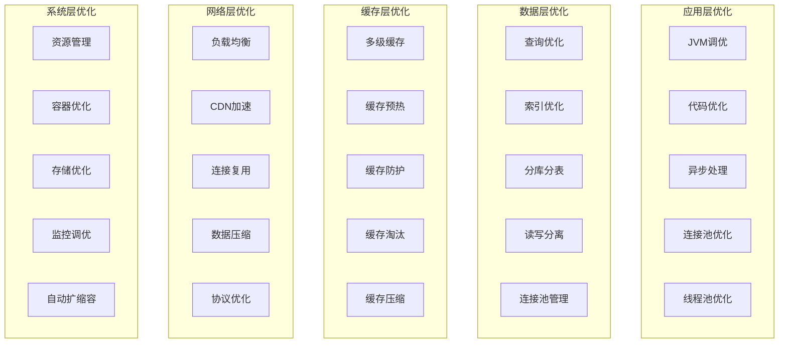

# ⚡ 性能优化详细设计
*WeWork Management Platform - Performance Optimization Design*

## 📋 性能优化概览

### 🎯 性能优化目标
- **响应时间**: API响应时间 < 200ms (P99)
- **吞吐量**: 支持10000+ QPS并发请求
- **资源利用率**: CPU使用率 < 70%, 内存使用率 < 80%
- **可用性**: 系统可用性 > 99.9%
- **扩展性**: 支持水平扩展到100+节点

### 🏗️ 性能优化架构



## 🚀 应用层性能优化

### JVM性能调优
```bash
# 生产环境JVM参数配置
JAVA_OPTS="
# 堆内存配置
-Xms4g -Xmx4g
-XX:NewRatio=1
-XX:SurvivorRatio=8

# 垃圾回收器配置 (G1GC)
-XX:+UseG1GC
-XX:MaxGCPauseMillis=100
-XX:G1HeapRegionSize=16m
-XX:G1MixedGCCountTarget=8
-XX:InitiatingHeapOccupancyPercent=45

# 元空间配置
-XX:MetaspaceSize=256m
-XX:MaxMetaspaceSize=512m

# 直接内存配置
-XX:MaxDirectMemorySize=1g

# GC日志配置
-XX:+PrintGC
-XX:+PrintGCDetails
-XX:+PrintGCTimeStamps
-XX:+PrintGCApplicationStoppedTime
-Xloggc:/var/log/gc/gc.log
-XX:+UseGCLogFileRotation
-XX:NumberOfGCLogFiles=5
-XX:GCLogFileSize=100M

# 内存溢出处理
-XX:+HeapDumpOnOutOfMemoryError
-XX:HeapDumpPath=/var/log/heapdump/

# 性能监控
-XX:+PrintGCApplicationConcurrentTime
-XX:+PrintStringDeduplicationStatistics

# JIT编译优化
-XX:CompileThreshold=10000
-XX:+UseCompressedOops
-XX:+UseCompressedClassPointers
"
```

### Spring Boot应用优化配置
```yaml
# application-prod.yml
server:
  port: 8080
  tomcat:
    threads:
      max: 200
      min-spare: 50
    connection-timeout: 20000
    keep-alive-timeout: 60000
    max-connections: 8192
    accept-count: 100
    max-http-form-post-size: 2MB
    max-swallow-size: 2MB

spring:
  # 数据源配置优化
  datasource:
    hikari:
      minimum-idle: 10
      maximum-pool-size: 50
      connection-timeout: 30000
      idle-timeout: 600000
      max-lifetime: 1800000
      validation-timeout: 5000
      pool-name: HikariCP
      register-mbeans: true
      
  # JPA优化配置
  jpa:
    hibernate:
      ddl-auto: none
    properties:
      hibernate:
        # 批处理优化
        jdbc.batch_size: 50
        order_inserts: true
        order_updates: true
        # 查询优化
        default_batch_fetch_size: 16
        max_fetch_depth: 3
        # 二级缓存
        cache.use_second_level_cache: true
        cache.use_query_cache: true
        cache.region.factory_class: org.hibernate.cache.jcache.JCacheRegionFactory
        
  # Redis配置优化
  redis:
    jedis:
      pool:
        max-active: 50
        max-idle: 20
        min-idle: 5
        max-wait: 3000ms
    timeout: 3000ms
    
  # 异步配置
  task:
    execution:
      pool:
        core-size: 8
        max-size: 50
        queue-capacity: 1000
        keep-alive: 60s
      thread-name-prefix: async-task-
    scheduling:
      pool:
        size: 5
      thread-name-prefix: scheduled-task-
```

### 异步处理优化
```java
@Configuration
@EnableAsync
public class AsyncConfiguration {
    
    // 业务异步线程池
    @Bean("businessExecutor")
    public Executor businessExecutor() {
        ThreadPoolTaskExecutor executor = new ThreadPoolTaskExecutor();
        
        // 核心线程数：CPU核心数
        executor.setCorePoolSize(Runtime.getRuntime().availableProcessors());
        
        // 最大线程数：CPU核心数 * 2
        executor.setMaxPoolSize(Runtime.getRuntime().availableProcessors() * 2);
        
        // 队列容量
        executor.setQueueCapacity(1000);
        
        // 线程存活时间
        executor.setKeepAliveSeconds(60);
        
        // 线程名前缀
        executor.setThreadNamePrefix("business-");
        
        // 拒绝策略：调用者执行
        executor.setRejectedExecutionHandler(new ThreadPoolExecutor.CallerRunsPolicy());
        
        // 等待任务完成
        executor.setWaitForTasksToCompleteOnShutdown(true);
        executor.setAwaitTerminationSeconds(60);
        
        executor.initialize();
        return executor;
    }
    
    // IO密集型线程池
    @Bean("ioExecutor")
    public Executor ioExecutor() {
        ThreadPoolTaskExecutor executor = new ThreadPoolTaskExecutor();
        
        // IO密集型：线程数可以设置更高
        executor.setCorePoolSize(20);
        executor.setMaxPoolSize(100);
        executor.setQueueCapacity(2000);
        executor.setKeepAliveSeconds(300);
        executor.setThreadNamePrefix("io-");
        executor.setRejectedExecutionHandler(new ThreadPoolExecutor.CallerRunsPolicy());
        
        executor.initialize();
        return executor;
    }
}

// 异步服务示例
@Service
public class AsyncMessageService {
    
    @Async("businessExecutor")
    @Retryable(value = {Exception.class}, maxAttempts = 3, backoff = @Backoff(delay = 1000))
    public CompletableFuture<Void> sendMessageAsync(MessageRequest request) {
        try {
            // 异步发送消息
            messageService.sendMessage(request);
            return CompletableFuture.completedFuture(null);
        } catch (Exception e) {
            log.error("Failed to send message async", e);
            return CompletableFuture.failedFuture(e);
        }
    }
    
    @Async("ioExecutor")
    public CompletableFuture<List<MessageResult>> batchProcessMessages(List<MessageRequest> requests) {
        List<CompletableFuture<MessageResult>> futures = requests.stream()
            .map(request -> CompletableFuture.supplyAsync(() -> {
                return processMessage(request);
            }, ioExecutor))
            .collect(Collectors.toList());
        
        return CompletableFuture.allOf(futures.toArray(new CompletableFuture[0]))
            .thenApply(v -> futures.stream()
                .map(CompletableFuture::join)
                .collect(Collectors.toList()));
    }
}
```

### 代码层面优化
```java
// 对象池优化
@Component
public class ObjectPoolOptimization {
    
    // StringBuilder对象池
    private final ObjectPool<StringBuilder> stringBuilderPool = 
        new GenericObjectPool<>(new StringBuilderPoolFactory());
    
    // 使用对象池避免频繁创建对象
    public String buildString(List<String> parts) {
        StringBuilder sb = null;
        try {
            sb = stringBuilderPool.borrowObject();
            sb.setLength(0); // 重置
            
            for (String part : parts) {
                sb.append(part);
            }
            
            return sb.toString();
        } catch (Exception e) {
            throw new RuntimeException("Failed to build string", e);
        } finally {
            if (sb != null) {
                try {
                    stringBuilderPool.returnObject(sb);
                } catch (Exception e) {
                    log.warn("Failed to return StringBuilder to pool", e);
                }
            }
        }
    }
    
    // 批量处理优化
    public void batchProcess(List<MessageRecord> records) {
        int batchSize = 100;
        
        for (int i = 0; i < records.size(); i += batchSize) {
            int endIndex = Math.min(i + batchSize, records.size());
            List<MessageRecord> batch = records.subList(i, endIndex);
            
            // 批量处理
            processBatch(batch);
        }
    }
    
    // 流式处理优化
    public List<ProcessedMessage> processMessagesStream(Stream<MessageRecord> messageStream) {
        return messageStream
            .parallel() // 并行处理
            .filter(this::isValidMessage)
            .map(this::processMessage)
            .collect(Collectors.toList());
    }
}

// 序列化优化
@Component
public class SerializationOptimization {
    
    private final ObjectMapper objectMapper;
    
    public SerializationOptimization() {
        this.objectMapper = new ObjectMapper();
        
        // 优化配置
        objectMapper.configure(DeserializationFeature.FAIL_ON_UNKNOWN_PROPERTIES, false);
        objectMapper.configure(SerializationFeature.FAIL_ON_EMPTY_BEANS, false);
        objectMapper.setDefaultPropertyInclusion(JsonInclude.Include.NON_NULL);
        
        // 注册模块
        objectMapper.registerModule(new JavaTimeModule());
        
        // 禁用时间戳
        objectMapper.disable(SerializationFeature.WRITE_DATES_AS_TIMESTAMPS);
    }
    
    // 使用字节码级序列化（Kryo）
    private final Kryo kryo = new Kryo();
    
    public byte[] serializeWithKryo(Object obj) {
        try (ByteArrayOutputStream baos = new ByteArrayOutputStream();
             Output output = new Output(baos)) {
            
            kryo.writeObject(output, obj);
            output.flush();
            return baos.toByteArray();
        } catch (IOException e) {
            throw new RuntimeException("Kryo serialization failed", e);
        }
    }
    
    public <T> T deserializeWithKryo(byte[] data, Class<T> clazz) {
        try (Input input = new Input(data)) {
            return kryo.readObject(input, clazz);
        }
    }
}
```

## 🗄️ 数据库性能优化

### 查询优化策略
```java
@Repository
public class OptimizedMessageRepository {
    
    @PersistenceContext
    private EntityManager entityManager;
    
    // 使用原生SQL优化复杂查询
    @Query(value = """
        SELECT m.message_id, m.content, m.status, a.account_name, a.phone
        FROM message_records m
        INNER JOIN wework_accounts a ON m.account_id = a.account_id
        WHERE m.created_at >= :startDate 
        AND m.status IN :statuses
        AND a.status = 'ONLINE'
        ORDER BY m.created_at DESC
        LIMIT :limit OFFSET :offset
        """, nativeQuery = true)
    List<Object[]> findMessagesWithAccountInfo(
        @Param("startDate") LocalDateTime startDate,
        @Param("statuses") List<String> statuses,
        @Param("limit") int limit,
        @Param("offset") int offset
    );
    
    // 批量插入优化
    @Transactional
    public void batchInsertMessages(List<MessageRecord> messages) {
        int batchSize = 100;
        
        for (int i = 0; i < messages.size(); i++) {
            entityManager.persist(messages.get(i));
            
            if (i % batchSize == 0 && i > 0) {
                entityManager.flush();
                entityManager.clear();
            }
        }
        
        entityManager.flush();
        entityManager.clear();
    }
    
    // 游标分页查询（大数据量）
    public Page<MessageRecord> findWithCursorPagination(String lastId, int pageSize) {
        CriteriaBuilder cb = entityManager.getCriteriaBuilder();
        CriteriaQuery<MessageRecord> query = cb.createQuery(MessageRecord.class);
        Root<MessageRecord> root = query.from(MessageRecord.class);
        
        List<Predicate> predicates = new ArrayList<>();
        
        if (lastId != null) {
            predicates.add(cb.greaterThan(root.get("messageId"), lastId));
        }
        
        query.where(predicates.toArray(new Predicate[0]));
        query.orderBy(cb.asc(root.get("messageId")));
        
        TypedQuery<MessageRecord> typedQuery = entityManager.createQuery(query);
        typedQuery.setMaxResults(pageSize + 1); // +1 判断是否有下一页
        
        List<MessageRecord> results = typedQuery.getResultList();
        boolean hasNext = results.size() > pageSize;
        
        if (hasNext) {
            results = results.subList(0, pageSize);
        }
        
        return new PageImpl<>(results, PageRequest.of(0, pageSize), hasNext ? -1 : results.size());
    }
}
```

### 索引优化设计
```sql
-- 消息记录表索引优化
CREATE TABLE message_records (
    message_id VARCHAR(32) PRIMARY KEY,
    account_id VARCHAR(32) NOT NULL,
    content TEXT,
    message_type VARCHAR(20) NOT NULL,
    status VARCHAR(20) NOT NULL DEFAULT 'PENDING',
    created_at TIMESTAMP NOT NULL DEFAULT CURRENT_TIMESTAMP,
    updated_at TIMESTAMP NOT NULL DEFAULT CURRENT_TIMESTAMP ON UPDATE CURRENT_TIMESTAMP,
    sent_at TIMESTAMP NULL,
    target_user VARCHAR(100),
    
    -- 复合索引：基于查询模式设计
    INDEX idx_account_status_created (account_id, status, created_at DESC),
    INDEX idx_status_created (status, created_at DESC),
    INDEX idx_created_status (created_at DESC, status),
    INDEX idx_target_user_created (target_user, created_at DESC),
    
    -- 覆盖索引：避免回表查询
    INDEX idx_cover_list (account_id, status, created_at DESC, message_type, target_user),
    
    -- 前缀索引：节省空间
    INDEX idx_content_prefix (content(100)),
    
    -- 函数索引：支持特殊查询
    INDEX idx_date_part ((DATE(created_at))),
    
    -- 外键约束
    FOREIGN KEY (account_id) REFERENCES wework_accounts(account_id)
) ENGINE=InnoDB 
  DEFAULT CHARSET=utf8mb4 
  COLLATE=utf8mb4_unicode_ci
  ROW_FORMAT=DYNAMIC
  PARTITION BY RANGE (TO_DAYS(created_at)) (
    PARTITION p202401 VALUES LESS THAN (TO_DAYS('2024-02-01')),
    PARTITION p202402 VALUES LESS THAN (TO_DAYS('2024-03-01')),
    PARTITION p202403 VALUES LESS THAN (TO_DAYS('2024-04-01')),
    -- ... 其他分区
    PARTITION pmax VALUES LESS THAN MAXVALUE
  );

-- 索引使用分析
EXPLAIN SELECT 
    message_id, content, status, created_at 
FROM message_records 
WHERE account_id = 'acc123' 
  AND status IN ('SENT', 'DELIVERED') 
  AND created_at >= '2024-01-01' 
ORDER BY created_at DESC 
LIMIT 20;

-- 索引监控查询
SELECT 
    schema_name,
    table_name,
    index_name,
    cardinality,
    pages,
    size
FROM information_schema.statistics 
WHERE table_schema = 'wework_platform'
ORDER BY cardinality DESC;
```

### 分库分表策略
```java
@Configuration
public class ShardingConfiguration {
    
    // 数据源配置
    @Bean
    public DataSource createShardingDataSource() {
        // 分库策略：按租户ID分库
        DatabaseShardingStrategyConfiguration databaseShardingStrategy = 
            new DatabaseShardingStrategyConfiguration(
                "tenant_id", 
                new TenantDatabaseShardingAlgorithm()
            );
        
        // 分表策略：按创建时间分表（月表）
        TableShardingStrategyConfiguration tableShardingStrategy = 
            new TableShardingStrategyConfiguration(
                "created_at", 
                new DateBasedTableShardingAlgorithm()
            );
        
        // 分片规则配置
        ShardingRuleConfiguration shardingRule = new ShardingRuleConfiguration();
        
        // 消息记录表分片配置
        TableRuleConfiguration messageTableRule = new TableRuleConfiguration("message_records");
        messageTableRule.setActualDataNodes("ds${0..3}.message_records_${202401..202412}");
        messageTableRule.setDatabaseShardingStrategyConfig(databaseShardingStrategy);
        messageTableRule.setTableShardingStrategyConfig(tableShardingStrategy);
        
        shardingRule.getTableRuleConfigs().add(messageTableRule);
        
        // 创建数据源
        return ShardingDataSourceFactory.createDataSource(createDataSourceMap(), shardingRule, new Properties());
    }
    
    private Map<String, DataSource> createDataSourceMap() {
        Map<String, DataSource> dataSourceMap = new HashMap<>();
        
        // 创建4个分库
        for (int i = 0; i < 4; i++) {
            HikariDataSource dataSource = new HikariDataSource();
            dataSource.setJdbcUrl("jdbc:mysql://db" + i + ":3306/wework_shard_" + i);
            dataSource.setUsername("root");
            dataSource.setPassword("password");
            dataSource.setMaximumPoolSize(20);
            dataSource.setMinimumIdle(5);
            
            dataSourceMap.put("ds" + i, dataSource);
        }
        
        return dataSourceMap;
    }
}

// 分片算法实现
public class TenantDatabaseShardingAlgorithm implements PreciseShardingAlgorithm<String> {
    
    @Override
    public String doSharding(Collection<String> availableTargetNames, 
                           PreciseShardingValue<String> shardingValue) {
        String tenantId = shardingValue.getValue();
        
        // 使用租户ID的哈希值分库
        int shardIndex = Math.abs(tenantId.hashCode()) % availableTargetNames.size();
        
        return "ds" + shardIndex;
    }
}

public class DateBasedTableShardingAlgorithm implements PreciseShardingAlgorithm<LocalDateTime> {
    
    @Override
    public String doSharding(Collection<String> availableTargetNames, 
                           PreciseShardingValue<LocalDateTime> shardingValue) {
        LocalDateTime createTime = shardingValue.getValue();
        
        // 按年月分表
        String suffix = createTime.format(DateTimeFormatter.ofPattern("yyyyMM"));
        String tableName = shardingValue.getLogicTableName() + "_" + suffix;
        
        return tableName;
    }
}
```

### 读写分离配置
```java
@Configuration
public class ReadWriteSplitConfiguration {
    
    @Bean
    @Primary
    public DataSource readWriteSplitDataSource() {
        // 主库配置
        HikariDataSource masterDataSource = createDataSource("master", "jdbc:mysql://master-db:3306/wework");
        
        // 从库配置
        HikariDataSource slave1DataSource = createDataSource("slave1", "jdbc:mysql://slave1-db:3306/wework");
        HikariDataSource slave2DataSource = createDataSource("slave2", "jdbc:mysql://slave2-db:3306/wework");
        
        Map<String, DataSource> dataSourceMap = new HashMap<>();
        dataSourceMap.put("master", masterDataSource);
        dataSourceMap.put("slave1", slave1DataSource);
        dataSourceMap.put("slave2", slave2DataSource);
        
        // 读写分离规则
        ReadWriteSplitRuleConfiguration readWriteSplitRule = new ReadWriteSplitRuleConfiguration(
            "readWriteSplit",
            "master",
            Arrays.asList("slave1", "slave2"),
            new RandomReplicaLoadBalanceAlgorithm()
        );
        
        return ReadWriteSplitDataSourceFactory.createDataSource(dataSourceMap, readWriteSplitRule, new Properties());
    }
    
    private HikariDataSource createDataSource(String name, String jdbcUrl) {
        HikariDataSource dataSource = new HikariDataSource();
        dataSource.setPoolName(name + "-pool");
        dataSource.setJdbcUrl(jdbcUrl);
        dataSource.setUsername("root");
        dataSource.setPassword("password");
        dataSource.setMaximumPoolSize(50);
        dataSource.setMinimumIdle(10);
        dataSource.setConnectionTimeout(30000);
        dataSource.setIdleTimeout(600000);
        dataSource.setMaxLifetime(1800000);
        dataSource.setLeakDetectionThreshold(60000);
        
        return dataSource;
    }
}

// 强制读主库注解
@Target({ElementType.METHOD, ElementType.TYPE})
@Retention(RetentionPolicy.RUNTIME)
public @interface ForceMaster {
}

// 读写分离切面
@Aspect
@Component
public class ReadWriteSplitAspect {
    
    @Around("@annotation(ForceMaster)")
    public Object forceMaster(ProceedingJoinPoint joinPoint) throws Throwable {
        try {
            // 强制使用主库
            HintManager.getInstance().setMasterRouteOnly();
            return joinPoint.proceed();
        } finally {
            HintManager.clear();
        }
    }
    
    @Around("@annotation(org.springframework.transaction.annotation.Transactional)")
    public Object transactional(ProceedingJoinPoint joinPoint) throws Throwable {
        try {
            // 事务方法强制使用主库
            HintManager.getInstance().setMasterRouteOnly();
            return joinPoint.proceed();
        } finally {
            HintManager.clear();
        }
    }
}
```

## 🚀 缓存优化策略

### 多级缓存架构
```java
@Configuration
@EnableCaching
public class MultiLevelCacheConfiguration {
    
    // L1缓存：本地缓存（Caffeine）
    @Bean
    public CacheManager l1CacheManager() {
        CaffeineCacheManager cacheManager = new CaffeineCacheManager();
        cacheManager.setCaffeine(Caffeine.newBuilder()
            .maximumSize(10000)
            .expireAfterWrite(Duration.ofMinutes(5))
            .expireAfterAccess(Duration.ofMinutes(2))
            .recordStats()
            .build());
        return cacheManager;
    }
    
    // L2缓存：Redis分布式缓存
    @Bean
    public CacheManager l2CacheManager(RedisConnectionFactory connectionFactory) {
        RedisCacheConfiguration config = RedisCacheConfiguration.defaultCacheConfig()
            .entryTtl(Duration.ofMinutes(30))
            .serializeKeysWith(RedisSerializationContext.SerializationPair.fromSerializer(new StringRedisSerializer()))
            .serializeValuesWith(RedisSerializationContext.SerializationPair.fromSerializer(new GenericJackson2JsonRedisSerializer()))
            .disableCachingNullValues();
        
        return RedisCacheManager.builder(connectionFactory)
            .cacheDefaults(config)
            .transactionAware()
            .build();
    }
    
    // 复合缓存管理器
    @Bean
    @Primary
    public CacheManager compositeCacheManager() {
        CompositeCacheManager cacheManager = new CompositeCacheManager();
        cacheManager.setCacheManagers(Arrays.asList(l1CacheManager(), l2CacheManager(null)));
        cacheManager.setFallbackToNoOpCache(false);
        return cacheManager;
    }
}

@Component
public class MultiLevelCacheService {
    
    private final Cache<String, Object> l1Cache;
    private final RedisTemplate<String, Object> redisTemplate;
    
    public MultiLevelCacheService(CacheManager l1CacheManager, RedisTemplate<String, Object> redisTemplate) {
        this.l1Cache = l1CacheManager.getCache("default").getNativeCache();
        this.redisTemplate = redisTemplate;
    }
    
    public <T> T get(String key, Class<T> type) {
        // 1. 尝试从L1缓存获取
        T value = (T) l1Cache.getIfPresent(key);
        if (value != null) {
            return value;
        }
        
        // 2. 尝试从L2缓存获取
        value = (T) redisTemplate.opsForValue().get(key);
        if (value != null) {
            // 回填L1缓存
            l1Cache.put(key, value);
            return value;
        }
        
        return null;
    }
    
    public void put(String key, Object value, Duration ttl) {
        // 同时更新L1和L2缓存
        l1Cache.put(key, value);
        redisTemplate.opsForValue().set(key, value, ttl);
    }
    
    public void evict(String key) {
        // 同时清除L1和L2缓存
        l1Cache.invalidate(key);
        redisTemplate.delete(key);
    }
}
```

### 缓存防护机制
```java
@Component
public class CacheProtectionService {
    
    private final RedisTemplate<String, Object> redisTemplate;
    private final BloomFilter<String> bloomFilter;
    private final LoadingCache<String, Object> localCache;
    
    public CacheProtectionService(RedisTemplate<String, Object> redisTemplate) {
        this.redisTemplate = redisTemplate;
        
        // 布隆过滤器防止缓存穿透
        this.bloomFilter = BloomFilter.create(
            Funnels.stringFunnel(StandardCharsets.UTF_8),
            1000000,  // 预期插入数量
            0.01      // 误判率
        );
        
        // 本地缓存防止缓存击穿
        this.localCache = Caffeine.newBuilder()
            .maximumSize(1000)
            .expireAfterWrite(Duration.ofMinutes(5))
            .build(this::loadFromDatabase);
    }
    
    // 防止缓存穿透
    public <T> T getWithBloomFilter(String key, Class<T> type, Supplier<T> dataLoader) {
        // 1. 检查布隆过滤器
        if (!bloomFilter.mightContain(key)) {
            return null; // 数据肯定不存在
        }
        
        // 2. 尝试从缓存获取
        T value = (T) redisTemplate.opsForValue().get(key);
        if (value != null) {
            return value;
        }
        
        // 3. 从数据源加载
        value = dataLoader.get();
        if (value != null) {
            // 加入缓存和布隆过滤器
            redisTemplate.opsForValue().set(key, value, Duration.ofMinutes(30));
            bloomFilter.put(key);
        } else {
            // 缓存空值，防止缓存穿透
            redisTemplate.opsForValue().set(key, "NULL", Duration.ofMinutes(5));
        }
        
        return value;
    }
    
    // 防止缓存击穿（热点数据）
    public <T> T getWithHotspotProtection(String key, Class<T> type, Supplier<T> dataLoader) {
        try {
            // 使用本地缓存的加载机制，自带互斥锁
            return (T) localCache.get(key);
        } catch (Exception e) {
            log.error("Failed to load data for key: " + key, e);
            return null;
        }
    }
    
    // 防止缓存雪崩
    public void preloadCache(List<String> keys) {
        keys.parallelStream().forEach(key -> {
            try {
                // 随机延迟，避免同时过期
                Thread.sleep(ThreadLocalRandom.current().nextInt(1000));
                
                Object value = loadFromDatabase(key);
                if (value != null) {
                    // 随机TTL，避免同时过期
                    Duration ttl = Duration.ofMinutes(30 + ThreadLocalRandom.current().nextInt(10));
                    redisTemplate.opsForValue().set(key, value, ttl);
                }
            } catch (Exception e) {
                log.warn("Failed to preload cache for key: " + key, e);
            }
        });
    }
    
    private Object loadFromDatabase(String key) {
        // 实际的数据库加载逻辑
        return databaseService.findByKey(key);
    }
}

// 缓存更新策略
@Component
public class CacheUpdateService {
    
    private final RedisTemplate<String, Object> redisTemplate;
    private final MessageProducer messageProducer;
    
    // Cache-Aside模式：先更新数据库，再删除缓存
    @Transactional
    public void updateDataWithCacheAside(String id, Object newData) {
        try {
            // 1. 更新数据库
            databaseService.update(id, newData);
            
            // 2. 删除缓存
            redisTemplate.delete("data:" + id);
            
            // 3. 发送缓存失效消息
            messageProducer.sendCacheInvalidationMessage(id);
            
        } catch (Exception e) {
            log.error("Failed to update data with cache aside", e);
            throw new RuntimeException("Update failed", e);
        }
    }
    
    // Write-Through模式：同时更新数据库和缓存
    @Transactional
    public void updateDataWithWriteThrough(String id, Object newData) {
        try {
            // 1. 更新数据库
            databaseService.update(id, newData);
            
            // 2. 更新缓存
            redisTemplate.opsForValue().set("data:" + id, newData, Duration.ofMinutes(30));
            
        } catch (Exception e) {
            // 回滚操作
            log.error("Failed to update data with write through", e);
            throw new RuntimeException("Update failed", e);
        }
    }
    
    // Write-Behind模式：先更新缓存，异步更新数据库
    public void updateDataWithWriteBehind(String id, Object newData) {
        try {
            // 1. 立即更新缓存
            redisTemplate.opsForValue().set("data:" + id, newData, Duration.ofMinutes(30));
            
            // 2. 异步更新数据库
            CompletableFuture.runAsync(() -> {
                try {
                    databaseService.update(id, newData);
                } catch (Exception e) {
                    log.error("Failed to update database asynchronously", e);
                    // 可以考虑重试或者回滚缓存
                }
            });
            
        } catch (Exception e) {
            log.error("Failed to update data with write behind", e);
            throw new RuntimeException("Update failed", e);
        }
    }
}
```

## 🌐 网络与IO优化

### HTTP连接优化
```java
@Configuration
public class HttpClientOptimization {
    
    @Bean
    public RestTemplate optimizedRestTemplate() {
        // 连接池配置
        PoolingHttpClientConnectionManager connectionManager = new PoolingHttpClientConnectionManager();
        connectionManager.setMaxTotal(200);                    // 最大连接数
        connectionManager.setDefaultMaxPerRoute(50);           // 每个路由最大连接数
        connectionManager.setValidateAfterInactivity(2000);    // 连接检查间隔
        
        // HTTP客户端配置
        CloseableHttpClient httpClient = HttpClients.custom()
            .setConnectionManager(connectionManager)
            .setConnectionTimeToLive(30, TimeUnit.SECONDS)     // 连接存活时间
            .setDefaultRequestConfig(RequestConfig.custom()
                .setConnectTimeout(5000)                       // 连接超时
                .setSocketTimeout(10000)                       // 读取超时
                .setConnectionRequestTimeout(3000)             // 从连接池获取连接超时
                .build())
            .setRetryHandler(new DefaultHttpRequestRetryHandler(3, true))  // 重试策略
            .build();
        
        HttpComponentsClientHttpRequestFactory factory = new HttpComponentsClientHttpRequestFactory(httpClient);
        
        RestTemplate restTemplate = new RestTemplate(factory);
        
        // 添加拦截器
        restTemplate.getInterceptors().add(new LoggingClientHttpRequestInterceptor());
        restTemplate.getInterceptors().add(new RetryInterceptor());
        
        return restTemplate;
    }
    
    @Bean
    public WebClient optimizedWebClient() {
        ConnectionProvider connectionProvider = ConnectionProvider.builder("optimized")
            .maxConnections(500)                    // 最大连接数
            .maxIdleTime(Duration.ofSeconds(20))    // 连接空闲时间
            .maxLifeTime(Duration.ofSeconds(60))    // 连接最大存活时间
            .pendingAcquireTimeout(Duration.ofSeconds(60))  // 获取连接超时
            .evictInBackground(Duration.ofSeconds(120))     // 后台清理间隔
            .build();
        
        HttpClient httpClient = HttpClient.create(connectionProvider)
            .option(ChannelOption.CONNECT_TIMEOUT_MILLIS, 5000)     // 连接超时
            .option(ChannelOption.SO_KEEPALIVE, true)               // 启用TCP Keep-Alive
            .option(ChannelOption.TCP_NODELAY, true)                // 禁用Nagle算法
            .responseTimeout(Duration.ofSeconds(10))                // 响应超时
            .compress(true);                                        // 启用压缩
        
        return WebClient.builder()
            .clientConnector(new ReactorClientHttpConnector(httpClient))
            .codecs(configurer -> configurer.defaultCodecs().maxInMemorySize(10 * 1024 * 1024)) // 10MB
            .build();
    }
}

// 批量HTTP请求优化
@Component
public class BatchHttpService {
    
    private final WebClient webClient;
    
    public BatchHttpService(WebClient optimizedWebClient) {
        this.webClient = optimizedWebClient;
    }
    
    public List<ResponseEntity<String>> batchRequest(List<String> urls) {
        List<Mono<ResponseEntity<String>>> requests = urls.stream()
            .map(url -> webClient.get()
                .uri(url)
                .retrieve()
                .toEntity(String.class)
                .timeout(Duration.ofSeconds(10))
                .onErrorReturn(ResponseEntity.status(HttpStatus.REQUEST_TIMEOUT).build()))
            .collect(Collectors.toList());
        
        // 并行执行所有请求
        return Flux.merge(requests)
            .collectList()
            .block(Duration.ofSeconds(30));
    }
    
    // 限流批量请求
    public Flux<ResponseEntity<String>> batchRequestWithRateLimit(List<String> urls, int maxConcurrency) {
        return Flux.fromIterable(urls)
            .flatMap(url -> webClient.get()
                .uri(url)
                .retrieve()
                .toEntity(String.class)
                .timeout(Duration.ofSeconds(10))
                .onErrorReturn(ResponseEntity.status(HttpStatus.REQUEST_TIMEOUT).build()),
                maxConcurrency); // 限制并发数
    }
}
```

### 文件IO优化
```java
@Component
public class FileIOOptimization {
    
    // NIO文件操作优化
    public void writeFileWithNIO(Path filePath, List<String> lines) throws IOException {
        try (BufferedWriter writer = Files.newBufferedWriter(filePath, 
                StandardCharsets.UTF_8, 
                StandardOpenOption.CREATE, 
                StandardOpenOption.WRITE,
                StandardOpenOption.TRUNCATE_EXISTING)) {
            
            for (String line : lines) {
                writer.write(line);
                writer.newLine();
            }
            
            writer.flush();
        }
    }
    
    public List<String> readFileWithNIO(Path filePath) throws IOException {
        return Files.readAllLines(filePath, StandardCharsets.UTF_8);
    }
    
    // 大文件流式处理
    public void processLargeFile(Path filePath, Consumer<String> lineProcessor) throws IOException {
        try (Stream<String> lines = Files.lines(filePath, StandardCharsets.UTF_8)) {
            lines.parallel()
                .filter(line -> !line.trim().isEmpty())
                .forEach(lineProcessor);
        }
    }
    
    // 内存映射文件操作
    public void processFileWithMemoryMapping(Path filePath) throws IOException {
        try (RandomAccessFile file = new RandomAccessFile(filePath.toFile(), "r");
             FileChannel channel = file.getChannel()) {
            
            long fileSize = channel.size();
            MappedByteBuffer buffer = channel.map(FileChannel.MapMode.READ_ONLY, 0, fileSize);
            
            // 处理映射的缓冲区
            processBuffer(buffer);
        }
    }
    
    // 零拷贝文件传输
    public void transferFile(Path source, Path target) throws IOException {
        try (FileChannel sourceChannel = FileChannel.open(source, StandardOpenOption.READ);
             FileChannel targetChannel = FileChannel.open(target, 
                 StandardOpenOption.CREATE, 
                 StandardOpenOption.WRITE,
                 StandardOpenOption.TRUNCATE_EXISTING)) {
            
            long position = 0;
            long size = sourceChannel.size();
            
            while (position < size) {
                long transferred = sourceChannel.transferTo(position, size - position, targetChannel);
                position += transferred;
            }
        }
    }
    
    // 异步文件操作
    @Async("ioExecutor")
    public CompletableFuture<String> readFileAsync(Path filePath) {
        return CompletableFuture.supplyAsync(() -> {
            try {
                return Files.readString(filePath, StandardCharsets.UTF_8);
            } catch (IOException e) {
                throw new RuntimeException("Failed to read file", e);
            }
        });
    }
    
    @Async("ioExecutor")
    public CompletableFuture<Void> writeFileAsync(Path filePath, String content) {
        return CompletableFuture.runAsync(() -> {
            try {
                Files.writeString(filePath, content, StandardCharsets.UTF_8,
                    StandardOpenOption.CREATE,
                    StandardOpenOption.WRITE,
                    StandardOpenOption.TRUNCATE_EXISTING);
            } catch (IOException e) {
                throw new RuntimeException("Failed to write file", e);
            }
        });
    }
}
```

## 📊 消息队列性能优化

### Redis消息队列优化
```java
@Configuration
public class RedisMessageQueueOptimization {
    
    @Bean
    public RedisTemplate<String, Object> optimizedRedisTemplate(RedisConnectionFactory connectionFactory) {
        RedisTemplate<String, Object> template = new RedisTemplate<>();
        template.setConnectionFactory(connectionFactory);
        
        // 使用更高效的序列化器
        template.setKeySerializer(new StringRedisSerializer());
        template.setHashKeySerializer(new StringRedisSerializer());
        template.setValueSerializer(new GenericFastJsonRedisSerializer());
        template.setHashValueSerializer(new GenericFastJsonRedisSerializer());
        
        template.setDefaultSerializer(new GenericFastJsonRedisSerializer());
        template.afterPropertiesSet();
        
        return template;
    }
    
    @Bean
    public RedissonClient redissonClient() {
        Config config = new Config();
        config.useSingleServer()
            .setAddress("redis://localhost:6379")
            .setConnectionMinimumIdleSize(10)
            .setConnectionPoolSize(50)
            .setDnsMonitoringInterval(5000)
            .setSubscriptionConnectionMinimumIdleSize(1)
            .setSubscriptionConnectionPoolSize(25)
            .setSubscriptionsPerConnection(5)
            .setIdleConnectionTimeout(10000)
            .setConnectTimeout(10000)
            .setTimeout(3000)
            .setRetryAttempts(3)
            .setRetryInterval(1500);
        
        return Redisson.create(config);
    }
}

@Component
public class OptimizedRedisMessageQueue {
    
    private final RedisTemplate<String, Object> redisTemplate;
    private final RedissonClient redissonClient;
    
    // 批量消息发送
    public void sendMessagesBatch(String queueName, List<Object> messages) {
        redisTemplate.executePipelined((RedisCallback<Object>) connection -> {
            for (Object message : messages) {
                byte[] key = queueName.getBytes(StandardCharsets.UTF_8);
                byte[] value = serialize(message);
                connection.lPush(key, value);
            }
            return null;
        });
    }
    
    // 优化的消息消费
    public List<Object> consumeMessagesBatch(String queueName, int batchSize, Duration timeout) {
        List<Object> messages = new ArrayList<>();
        
        // 使用阻塞弹出获取消息
        List<Object> result = redisTemplate.opsForList().rightPop(queueName, batchSize, timeout);
        
        if (result != null) {
            messages.addAll(result);
        }
        
        return messages;
    }
    
    // 延时消息队列（基于ZSet）
    public void sendDelayedMessage(String queueName, Object message, Duration delay) {
        long score = System.currentTimeMillis() + delay.toMillis();
        redisTemplate.opsForZSet().add(queueName + ":delayed", serialize(message), score);
    }
    
    // 延时消息消费
    @Scheduled(fixedDelay = 1000)
    public void processDelayedMessages() {
        String delayedQueueName = "message_queue:delayed";
        long now = System.currentTimeMillis();
        
        // 获取到期的消息
        Set<ZSetOperations.TypedTuple<Object>> expiredMessages = 
            redisTemplate.opsForZSet().rangeByScoreWithScores(delayedQueueName, 0, now);
        
        if (!expiredMessages.isEmpty()) {
            // 批量移除已处理的消息
            Object[] values = expiredMessages.stream()
                .map(ZSetOperations.TypedTuple::getValue)
                .toArray();
            
            redisTemplate.opsForZSet().remove(delayedQueueName, values);
            
            // 处理消息
            expiredMessages.forEach(message -> {
                processMessage(message.getValue());
            });
        }
    }
    
    // 优先级队列实现
    public void sendPriorityMessage(String queueName, Object message, int priority) {
        String priorityQueue = queueName + ":priority:" + priority;
        redisTemplate.opsForList().leftPush(priorityQueue, message);
    }
    
    public Object consumePriorityMessage(String queueName) {
        // 按优先级从高到低消费
        for (int priority = 10; priority >= 1; priority--) {
            String priorityQueue = queueName + ":priority:" + priority;
            Object message = redisTemplate.opsForList().rightPop(priorityQueue, Duration.ofSeconds(1));
            if (message != null) {
                return message;
            }
        }
        return null;
    }
    
    // 消息压缩
    public void sendCompressedMessage(String queueName, Object message) {
        try {
            byte[] data = serialize(message);
            byte[] compressed = compress(data);
            
            redisTemplate.opsForList().leftPush(queueName + ":compressed", compressed);
        } catch (Exception e) {
            log.error("Failed to send compressed message", e);
        }
    }
    
    private byte[] compress(byte[] data) throws IOException {
        ByteArrayOutputStream baos = new ByteArrayOutputStream();
        try (GZIPOutputStream gzipOut = new GZIPOutputStream(baos)) {
            gzipOut.write(data);
        }
        return baos.toByteArray();
    }
    
    private byte[] decompress(byte[] compressed) throws IOException {
        ByteArrayInputStream bais = new ByteArrayInputStream(compressed);
        ByteArrayOutputStream baos = new ByteArrayOutputStream();
        
        try (GZIPInputStream gzipIn = new GZIPInputStream(bais)) {
            byte[] buffer = new byte[1024];
            int len;
            while ((len = gzipIn.read(buffer)) != -1) {
                baos.write(buffer, 0, len);
            }
        }
        
        return baos.toByteArray();
    }
}
```

## 🔧 系统级性能优化

### 容器资源优化
```dockerfile
# 多阶段构建优化镜像大小
FROM openjdk:17-jdk-slim as builder
WORKDIR /app
COPY . .
RUN ./mvnw clean package -DskipTests

FROM openjdk:17-jre-slim
WORKDIR /app

# 创建非root用户
RUN groupadd -r appuser && useradd -r -g appuser appuser

# 优化JVM参数
ENV JAVA_OPTS="-server \
    -XX:+UseG1GC \
    -XX:MaxGCPauseMillis=100 \
    -XX:+UseStringDeduplication \
    -XX:+OptimizeStringConcat \
    -Djava.security.egd=file:/dev/./urandom \
    -Dspring.backgroundpreinitializer.ignore=true"

# 复制应用
COPY --from=builder /app/target/*.jar app.jar

# 切换到非root用户
USER appuser

# 健康检查
HEALTHCHECK --interval=30s --timeout=3s --start-period=5s --retries=3 \
    CMD curl -f http://localhost:8080/actuator/health || exit 1

EXPOSE 8080

ENTRYPOINT ["sh", "-c", "java $JAVA_OPTS -jar app.jar"]
```

```yaml
# Kubernetes部署优化
apiVersion: apps/v1
kind: Deployment
metadata:
  name: wework-api
spec:
  replicas: 3
  strategy:
    type: RollingUpdate
    rollingUpdate:
      maxSurge: 1
      maxUnavailable: 0
  selector:
    matchLabels:
      app: wework-api
  template:
    metadata:
      labels:
        app: wework-api
    spec:
      # 亲和性配置
      affinity:
        podAntiAffinity:
          preferredDuringSchedulingIgnoredDuringExecution:
          - weight: 100
            podAffinityTerm:
              labelSelector:
                matchExpressions:
                - key: app
                  operator: In
                  values:
                  - wework-api
              topologyKey: kubernetes.io/hostname
      
      containers:
      - name: wework-api
        image: wework-api:latest
        resources:
          requests:
            memory: "2Gi"
            cpu: "1000m"
          limits:
            memory: "4Gi"
            cpu: "2000m"
        
        # 环境变量优化
        env:
        - name: SPRING_PROFILES_ACTIVE
          value: "prod"
        - name: JAVA_OPTS
          value: "-Xms2g -Xmx3g -XX:+UseG1GC"
        
        # 探针配置
        livenessProbe:
          httpGet:
            path: /actuator/health/liveness
            port: 8080
          initialDelaySeconds: 60
          periodSeconds: 30
          timeoutSeconds: 5
          failureThreshold: 3
        
        readinessProbe:
          httpGet:
            path: /actuator/health/readiness
            port: 8080
          initialDelaySeconds: 30
          periodSeconds: 10
          timeoutSeconds: 3
          failureThreshold: 3
        
        # 启动探针
        startupProbe:
          httpGet:
            path: /actuator/health
            port: 8080
          initialDelaySeconds: 30
          periodSeconds: 10
          timeoutSeconds: 3
          failureThreshold: 10
        
        ports:
        - containerPort: 8080
          name: http
        
        # 挂载卷
        volumeMounts:
        - name: logs
          mountPath: /app/logs
        - name: config
          mountPath: /app/config
          readOnly: true
      
      volumes:
      - name: logs
        emptyDir: {}
      - name: config
        configMap:
          name: wework-api-config

---
# HPA自动扩缩容
apiVersion: autoscaling/v2
kind: HorizontalPodAutoscaler
metadata:
  name: wework-api-hpa
spec:
  scaleTargetRef:
    apiVersion: apps/v1
    kind: Deployment
    name: wework-api
  minReplicas: 3
  maxReplicas: 20
  metrics:
  - type: Resource
    resource:
      name: cpu
      target:
        type: Utilization
        averageUtilization: 70
  - type: Resource
    resource:
      name: memory
      target:
        type: Utilization
        averageUtilization: 80
  behavior:
    scaleDown:
      stabilizationWindowSeconds: 300
      policies:
      - type: Percent
        value: 10
        periodSeconds: 60
    scaleUp:
      stabilizationWindowSeconds: 60
      policies:
      - type: Percent
        value: 50
        periodSeconds: 60
```

### 监控和调优工具集成
```java
@Configuration
@EnableScheduling
public class PerformanceMonitoringConfiguration {
    
    @Bean
    public MeterRegistry meterRegistry() {
        return new PrometheusMeterRegistry(PrometheusConfig.DEFAULT);
    }
    
    @Bean
    public TimedAspect timedAspect(MeterRegistry registry) {
        return new TimedAspect(registry);
    }
    
    @Bean
    public CountedAspect countedAspect(MeterRegistry registry) {
        return new CountedAspect(registry);
    }
}

@Component
public class PerformanceMonitor {
    
    private final MeterRegistry meterRegistry;
    private final MemoryMXBean memoryMXBean;
    private final GarbageCollectorMXBean[] gcMXBeans;
    
    public PerformanceMonitor(MeterRegistry meterRegistry) {
        this.meterRegistry = meterRegistry;
        this.memoryMXBean = ManagementFactory.getMemoryMXBean();
        this.gcMXBeans = ManagementFactory.getGarbageCollectorMXBeans().toArray(new GarbageCollectorMXBean[0]);
        
        setupMetrics();
    }
    
    private void setupMetrics() {
        // JVM内存监控
        Gauge.builder("jvm.memory.heap.used")
            .register(meterRegistry, memoryMXBean, bean -> bean.getHeapMemoryUsage().getUsed());
        
        Gauge.builder("jvm.memory.heap.max")
            .register(meterRegistry, memoryMXBean, bean -> bean.getHeapMemoryUsage().getMax());
        
        Gauge.builder("jvm.memory.nonheap.used")
            .register(meterRegistry, memoryMXBean, bean -> bean.getNonHeapMemoryUsage().getUsed());
        
        // GC监控
        for (GarbageCollectorMXBean gcBean : gcMXBeans) {
            Gauge.builder("jvm.gc.collection.count")
                .tag("gc", gcBean.getName())
                .register(meterRegistry, gcBean, GarbageCollectorMXBean::getCollectionCount);
            
            Gauge.builder("jvm.gc.collection.time")
                .tag("gc", gcBean.getName())
                .register(meterRegistry, gcBean, GarbageCollectorMXBean::getCollectionTime);
        }
        
        // 线程监控
        ThreadMXBean threadBean = ManagementFactory.getThreadMXBean();
        Gauge.builder("jvm.threads.count")
            .register(meterRegistry, threadBean, ThreadMXBean::getThreadCount);
        
        Gauge.builder("jvm.threads.daemon.count")
            .register(meterRegistry, threadBean, ThreadMXBean::getDaemonThreadCount);
    }
    
    // 定期性能检查
    @Scheduled(fixedRate = 60000) // 每分钟检查一次
    public void performanceCheck() {
        MemoryUsage heapUsage = memoryMXBean.getHeapMemoryUsage();
        double heapUsedPercentage = (double) heapUsage.getUsed() / heapUsage.getMax() * 100;
        
        if (heapUsedPercentage > 85) {
            log.warn("High heap memory usage: {}%", String.format("%.2f", heapUsedPercentage));
            
            // 触发告警
            alertService.sendPerformanceAlert("HIGH_MEMORY_USAGE", heapUsedPercentage);
        }
        
        // 检查GC频率
        for (GarbageCollectorMXBean gcBean : gcMXBeans) {
            long gcCount = gcBean.getCollectionCount();
            long gcTime = gcBean.getCollectionTime();
            
            // 记录GC指标
            meterRegistry.counter("gc.collections", "gc", gcBean.getName()).increment(gcCount);
            meterRegistry.timer("gc.time", "gc", gcBean.getName()).record(gcTime, TimeUnit.MILLISECONDS);
        }
    }
    
    // 性能指标收集
    @EventListener
    public void handleApiRequest(ApiRequestEvent event) {
        Timer.Sample sample = Timer.start(meterRegistry);
        
        // 请求完成后记录
        sample.stop(Timer.builder("api.request.duration")
            .tag("endpoint", event.getEndpoint())
            .tag("method", event.getMethod())
            .tag("status", String.valueOf(event.getStatus()))
            .register(meterRegistry));
        
        // 记录请求量
        meterRegistry.counter("api.requests.total",
            "endpoint", event.getEndpoint(),
            "method", event.getMethod(),
            "status", String.valueOf(event.getStatus()))
            .increment();
    }
}

// 性能分析切面
@Aspect
@Component
public class PerformanceAnalysisAspect {
    
    private final MeterRegistry meterRegistry;
    
    @Around("@annotation(Timed)")
    public Object measureExecutionTime(ProceedingJoinPoint joinPoint) throws Throwable {
        Timer.Sample sample = Timer.start(meterRegistry);
        
        try {
            return joinPoint.proceed();
        } finally {
            String methodName = joinPoint.getSignature().getName();
            String className = joinPoint.getTarget().getClass().getSimpleName();
            
            sample.stop(Timer.builder("method.execution.time")
                .tag("class", className)
                .tag("method", methodName)
                .register(meterRegistry));
        }
    }
    
    @Around("execution(* com.wework.service.*.*(..))")
    public Object monitorServiceMethods(ProceedingJoinPoint joinPoint) throws Throwable {
        long startTime = System.nanoTime();
        String methodName = joinPoint.getSignature().getName();
        
        try {
            Object result = joinPoint.proceed();
            
            // 记录成功执行
            long duration = System.nanoTime() - startTime;
            meterRegistry.timer("service.method.duration",
                "method", methodName,
                "status", "success")
                .record(duration, TimeUnit.NANOSECONDS);
            
            return result;
        } catch (Exception e) {
            // 记录异常
            long duration = System.nanoTime() - startTime;
            meterRegistry.timer("service.method.duration",
                "method", methodName,
                "status", "error")
                .record(duration, TimeUnit.NANOSECONDS);
            
            meterRegistry.counter("service.method.errors",
                "method", methodName,
                "exception", e.getClass().getSimpleName())
                .increment();
            
            throw e;
        }
    }
}
```

## 🎯 性能优化总结

### 核心优化策略
1. **应用层优化**: JVM调优、异步处理、连接池优化
2. **数据库优化**: 查询优化、索引设计、分库分表、读写分离
3. **缓存优化**: 多级缓存、缓存防护、智能淘汰策略
4. **网络优化**: 连接复用、批量处理、数据压缩
5. **系统优化**: 资源管理、容器化、自动扩缩容

### 性能指标
- **响应时间**: P99 < 200ms, P95 < 100ms
- **吞吐量**: > 10,000 QPS
- **资源利用率**: CPU < 70%, Memory < 80%
- **可用性**: > 99.9%
- **扩展性**: 支持100+节点水平扩展

### 监控体系
- **JVM监控**: 内存、GC、线程监控
- **应用监控**: API响应时间、错误率、业务指标
- **系统监控**: CPU、内存、网络、磁盘IO
- **告警机制**: 智能阈值、多渠道通知
- **性能分析**: 热点分析、瓶颈识别、优化建议
