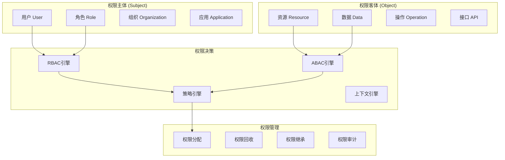

# 🔐 权限控制详细设计
*WeWork Management Platform - Permission Control Design*

## 📋 权限控制概览

### 🎯 权限控制目标
- **最小权限原则**: 用户只拥有完成工作所需的最少权限
- **职责分离**: 敏感操作需要多人协作完成
- **动态权限**: 支持权限的动态分配和回收
- **细粒度控制**: 支持到字段级别的权限控制
- **审计追踪**: 完整的权限变更历史记录

### 🏗️ 权限模型架构



## 🎭 混合权限模型设计

### RBAC + ABAC 混合模型
```java
@Entity
@Table(name = "permission_policies")
public class PermissionPolicy {
    @Id
    private String policyId;
    
    private String policyName;
    private String description;
    
    // 策略类型
    @Enumerated(EnumType.STRING)
    private PolicyType policyType; // RBAC, ABAC, HYBRID
    
    // RBAC配置
    @OneToMany(mappedBy = "policy", cascade = CascadeType.ALL)
    private Set<RbacRule> rbacRules = new HashSet<>();
    
    // ABAC配置
    @OneToMany(mappedBy = "policy", cascade = CascadeType.ALL)
    private Set<AbacRule> abacRules = new HashSet<>();
    
    // 策略状态
    private Boolean enabled = true;
    private Integer priority = 0;
    private LocalDateTime effectiveFrom;
    private LocalDateTime effectiveTo;
    
    // 策略条件
    @Column(columnDefinition = "JSON")
    private String conditions;
    
    // 决策结果
    @Enumerated(EnumType.STRING)
    private PolicyEffect effect; // PERMIT, DENY
}

// RBAC规则
@Entity
@Table(name = "rbac_rules")
public class RbacRule {
    @Id
    private String ruleId;
    
    @ManyToOne(fetch = FetchType.LAZY)
    @JoinColumn(name = "policy_id")
    private PermissionPolicy policy;
    
    // 角色配置
    private String rolePattern; // 支持通配符
    private String resourcePattern;
    private String operationPattern;
    
    // 条件配置
    private String timeRestriction; // 时间限制
    private String ipRestriction; // IP限制
    private String locationRestriction; // 地理位置限制
    
    private Boolean enabled = true;
    private Integer priority = 0;
}

// ABAC规则
@Entity
@Table(name = "abac_rules")
public class AbacRule {
    @Id
    private String ruleId;
    
    @ManyToOne(fetch = FetchType.LAZY)
    @JoinColumn(name = "policy_id")
    private PermissionPolicy policy;
    
    // 主体属性
    @Column(columnDefinition = "JSON")
    private String subjectAttributes;
    
    // 客体属性
    @Column(columnDefinition = "JSON")
    private String objectAttributes;
    
    // 环境属性
    @Column(columnDefinition = "JSON")
    private String environmentAttributes;
    
    // 动作属性
    @Column(columnDefinition = "JSON")
    private String actionAttributes;
    
    // 规则表达式
    private String ruleExpression;
    
    private Boolean enabled = true;
    private Integer priority = 0;
}
```

### 权限决策引擎
```java
@Component
public class PermissionDecisionEngine {
    
    private final RbacEngine rbacEngine;
    private final AbacEngine abacEngine;
    private final PolicyRepository policyRepository;
    private final PermissionCacheService cacheService;
    
    public PermissionDecision evaluate(PermissionRequest request) {
        // 1. 检查缓存
        PermissionDecision cached = cacheService.getCachedDecision(request);
        if (cached != null && !cached.isExpired()) {
            return cached;
        }
        
        // 2. 获取适用的策略
        List<PermissionPolicy> applicablePolicies = 
            policyRepository.findApplicablePolicies(request);
        
        // 3. 按优先级排序
        applicablePolicies.sort(
            Comparator.comparing(PermissionPolicy::getPriority).reversed()
        );
        
        // 4. 逐个评估策略
        for (PermissionPolicy policy : applicablePolicies) {
            PermissionDecision decision = evaluatePolicy(policy, request);
            
            if (decision.isDecisive()) {
                // 缓存决策结果
                cacheService.cacheDecision(request, decision);
                return decision;
            }
        }
        
        // 5. 默认拒绝
        PermissionDecision defaultDeny = PermissionDecision.deny("No applicable policy found");
        cacheService.cacheDecision(request, defaultDeny);
        return defaultDeny;
    }
    
    private PermissionDecision evaluatePolicy(PermissionPolicy policy, PermissionRequest request) {
        try {
            // 检查策略有效期
            if (!isPolicyEffective(policy)) {
                return PermissionDecision.notApplicable("Policy not effective");
            }
            
            // 根据策略类型进行评估
            return switch (policy.getPolicyType()) {
                case RBAC -> rbacEngine.evaluate(policy.getRbacRules(), request);
                case ABAC -> abacEngine.evaluate(policy.getAbacRules(), request);
                case HYBRID -> evaluateHybridPolicy(policy, request);
            };
            
        } catch (Exception e) {
            log.error("Error evaluating policy: " + policy.getPolicyId(), e);
            return PermissionDecision.error("Policy evaluation failed");
        }
    }
    
    private PermissionDecision evaluateHybridPolicy(PermissionPolicy policy, PermissionRequest request) {
        // 混合策略：RBAC && ABAC
        PermissionDecision rbacResult = rbacEngine.evaluate(policy.getRbacRules(), request);
        if (rbacResult.isPermit()) {
            // RBAC通过，检查ABAC
            PermissionDecision abacResult = abacEngine.evaluate(policy.getAbacRules(), request);
            return abacResult;
        }
        
        return rbacResult;
    }
}

// 权限请求
@Data
@Builder
public class PermissionRequest {
    // 主体信息
    private String userId;
    private String sessionId;
    private Set<String> userRoles;
    private Map<String, Object> userAttributes;
    
    // 资源信息
    private String resource;
    private String resourceType;
    private String resourceId;
    private Map<String, Object> resourceAttributes;
    
    // 操作信息
    private String operation;
    private Map<String, Object> operationAttributes;
    
    // 环境信息
    private String sourceIp;
    private String userAgent;
    private LocalDateTime requestTime;
    private String geolocation;
    private Map<String, Object> environmentAttributes;
    
    // 上下文信息
    private String tenantId;
    private String organizationId;
    private String departmentId;
}

// 权限决策结果
@Data
@Builder
public class PermissionDecision {
    @Enumerated(EnumType.STRING)
    private DecisionResult result; // PERMIT, DENY, NOT_APPLICABLE, ERROR
    
    private String reason;
    private String policyId;
    private String ruleId;
    
    // 额外的约束条件
    private Set<String> obligations; // 必须执行的操作
    private Set<String> advices; // 建议执行的操作
    
    private LocalDateTime decidedAt;
    private Duration cacheTtl;
    
    public boolean isPermit() {
        return result == DecisionResult.PERMIT;
    }
    
    public boolean isDecisive() {
        return result == DecisionResult.PERMIT || result == DecisionResult.DENY;
    }
    
    public static PermissionDecision permit(String reason) {
        return PermissionDecision.builder()
            .result(DecisionResult.PERMIT)
            .reason(reason)
            .decidedAt(LocalDateTime.now())
            .cacheTtl(Duration.ofMinutes(30))
            .build();
    }
    
    public static PermissionDecision deny(String reason) {
        return PermissionDecision.builder()
            .result(DecisionResult.DENY)
            .reason(reason)
            .decidedAt(LocalDateTime.now())
            .cacheTtl(Duration.ofMinutes(5))
            .build();
    }
}
```

## 🎯 资源权限管理

### 细粒度资源权限
```java
@Entity
@Table(name = "resource_permissions")
public class ResourcePermission {
    @Id
    private String permissionId;
    
    // 资源标识
    private String resourceType; // account, message, report, etc.
    private String resourceId; // 具体资源ID
    private String resourcePath; // 资源路径
    
    // 权限主体
    private String subjectType; // USER, ROLE, GROUP
    private String subjectId;
    
    // 权限操作
    @Enumerated(EnumType.STRING)
    private PermissionAction action; // READ, WRITE, DELETE, EXECUTE, etc.
    
    // 权限范围
    @Enumerated(EnumType.STRING)
    private PermissionScope scope; // OWNER, DEPARTMENT, ORGANIZATION, ALL
    
    // 字段级权限
    @ElementCollection
    @CollectionTable(name = "resource_field_permissions")
    private Set<String> allowedFields = new HashSet<>();
    
    @ElementCollection
    @CollectionTable(name = "resource_field_restrictions")
    private Set<String> restrictedFields = new HashSet<>();
    
    // 条件权限
    @Column(columnDefinition = "JSON")
    private String conditions;
    
    // 权限状态
    private Boolean enabled = true;
    private LocalDateTime grantedAt;
    private LocalDateTime expiresAt;
    private String grantedBy;
    private String reason;
}

@Component
public class ResourcePermissionService {
    
    private final ResourcePermissionRepository permissionRepository;
    private final PermissionDecisionEngine decisionEngine;
    private final PermissionAuditService auditService;
    
    public boolean hasPermission(String userId, String resource, String action) {
        PermissionRequest request = PermissionRequest.builder()
            .userId(userId)
            .resource(resource)
            .operation(action)
            .requestTime(LocalDateTime.now())
            .build();
        
        PermissionDecision decision = decisionEngine.evaluate(request);
        
        // 记录权限检查
        auditService.logPermissionCheck(request, decision);
        
        return decision.isPermit();
    }
    
    public Set<String> getAllowedFields(String userId, String resourceType) {
        List<ResourcePermission> permissions = permissionRepository
            .findBySubjectIdAndResourceType(userId, resourceType);
        
        Set<String> allowedFields = new HashSet<>();
        for (ResourcePermission permission : permissions) {
            if (permission.isEnabled() && !permission.isExpired()) {
                allowedFields.addAll(permission.getAllowedFields());
            }
        }
        
        return allowedFields;
    }
    
    public <T> T filterSensitiveFields(T data, String userId, String resourceType) {
        Set<String> allowedFields = getAllowedFields(userId, resourceType);
        return FieldFilterUtil.filterFields(data, allowedFields);
    }
    
    // 批量权限检查
    public Map<String, Boolean> batchCheckPermissions(
            String userId, 
            List<String> resources, 
            String action) {
        
        Map<String, Boolean> results = new HashMap<>();
        
        for (String resource : resources) {
            results.put(resource, hasPermission(userId, resource, action));
        }
        
        return results;
    }
}
```

### 数据权限过滤器
```java
@Component
public class DataPermissionFilter {
    
    private final PermissionDecisionEngine decisionEngine;
    private final UserContextService userContextService;
    
    public <T> Specification<T> createPermissionFilter(Class<T> entityClass) {
        return (root, query, criteriaBuilder) -> {
            UserContext userContext = userContextService.getCurrentUserContext();
            
            // 构建权限过滤条件
            List<Predicate> predicates = new ArrayList<>();
            
            // 1. 基于用户角色的数据权限
            Predicate roleFilter = createRoleBasedFilter(root, criteriaBuilder, userContext);
            if (roleFilter != null) {
                predicates.add(roleFilter);
            }
            
            // 2. 基于组织架构的数据权限
            Predicate orgFilter = createOrganizationFilter(root, criteriaBuilder, userContext);
            if (orgFilter != null) {
                predicates.add(orgFilter);
            }
            
            // 3. 基于数据归属的权限
            Predicate ownerFilter = createOwnershipFilter(root, criteriaBuilder, userContext);
            if (ownerFilter != null) {
                predicates.add(ownerFilter);
            }
            
            // 4. 基于数据状态的权限
            Predicate statusFilter = createStatusFilter(root, criteriaBuilder, userContext);
            if (statusFilter != null) {
                predicates.add(statusFilter);
            }
            
            return criteriaBuilder.and(predicates.toArray(new Predicate[0]));
        };
    }
    
    private Predicate createRoleBasedFilter(Root<?> root, CriteriaBuilder cb, UserContext userContext) {
        Set<String> userRoles = userContext.getRoles();
        
        if (userRoles.contains("ADMIN") || userRoles.contains("SUPER_ADMIN")) {
            return null; // 管理员可以看到所有数据
        }
        
        if (userRoles.contains("DEPARTMENT_MANAGER")) {
            // 部门经理可以看到本部门的数据
            return cb.equal(root.get("departmentId"), userContext.getDepartmentId());
        }
        
        if (userRoles.contains("TEAM_LEADER")) {
            // 团队领导可以看到团队数据
            return cb.equal(root.get("teamId"), userContext.getTeamId());
        }
        
        // 普通用户只能看到自己的数据
        return cb.equal(root.get("createdBy"), userContext.getUserId());
    }
    
    private Predicate createOrganizationFilter(Root<?> root, CriteriaBuilder cb, UserContext userContext) {
        // 确保用户只能访问本组织的数据
        return cb.equal(root.get("organizationId"), userContext.getOrganizationId());
    }
    
    private Predicate createOwnershipFilter(Root<?> root, CriteriaBuilder cb, UserContext userContext) {
        // 检查数据归属权限
        List<Predicate> ownershipPredicates = new ArrayList<>();
        
        // 创建者权限
        ownershipPredicates.add(cb.equal(root.get("createdBy"), userContext.getUserId()));
        
        // 分配者权限
        if (root.getModel().getAttribute("assignedTo") != null) {
            ownershipPredicates.add(cb.equal(root.get("assignedTo"), userContext.getUserId()));
        }
        
        // 参与者权限
        if (root.getModel().getAttribute("participants") != null) {
            ownershipPredicates.add(cb.isMember(userContext.getUserId(), root.get("participants")));
        }
        
        return cb.or(ownershipPredicates.toArray(new Predicate[0]));
    }
}

// 使用示例
@Service
public class WeWorkAccountService {
    
    private final WeWorkAccountRepository accountRepository;
    private final DataPermissionFilter permissionFilter;
    
    public Page<WeWorkAccount> findAccountsWithPermission(Pageable pageable) {
        Specification<WeWorkAccount> spec = permissionFilter.createPermissionFilter(WeWorkAccount.class);
        return accountRepository.findAll(spec, pageable);
    }
    
    public Optional<WeWorkAccount> findAccountByIdWithPermission(String accountId) {
        Specification<WeWorkAccount> spec = Specification
            .where(permissionFilter.createPermissionFilter(WeWorkAccount.class))
            .and((root, query, cb) -> cb.equal(root.get("accountId"), accountId));
        
        return accountRepository.findOne(spec);
    }
}
```

## 🔄 动态权限分配

### 权限生命周期管理
```java
@Entity
@Table(name = "permission_grants")
public class PermissionGrant {
    @Id
    private String grantId;
    
    // 权限主体
    private String subjectType; // USER, ROLE
    private String subjectId;
    
    // 权限内容
    private String permissionId;
    private String resourcePattern;
    private String operationPattern;
    
    // 授权信息
    private String grantedBy;
    private LocalDateTime grantedAt;
    private String grantReason;
    
    // 权限状态
    @Enumerated(EnumType.STRING)
    private GrantStatus status; // ACTIVE, SUSPENDED, REVOKED, EXPIRED
    
    // 时效性
    private LocalDateTime effectiveFrom;
    private LocalDateTime expiresAt;
    private Boolean autoRenew = false;
    private Duration renewalPeriod;
    
    // 使用限制
    private Integer maxUsageCount;
    private Integer currentUsageCount = 0;
    
    // 条件限制
    @Column(columnDefinition = "JSON")
    private String conditions;
    
    // 审批流程
    private String approvalWorkflowId;
    private String approvalStatus;
    private String approvedBy;
    private LocalDateTime approvedAt;
}

@Service
@Transactional
public class DynamicPermissionService {
    
    private final PermissionGrantRepository grantRepository;
    private final PermissionAuditService auditService;
    private final PermissionNotificationService notificationService;
    private final WorkflowService workflowService;
    
    // 申请权限
    public String requestPermission(PermissionRequest request) {
        // 1. 验证申请合法性
        validatePermissionRequest(request);
        
        // 2. 检查是否需要审批
        boolean requiresApproval = determineApprovalRequirement(request);
        
        // 3. 创建权限授权记录
        PermissionGrant grant = createPermissionGrant(request);
        
        if (requiresApproval) {
            // 启动审批流程
            String workflowId = workflowService.startApprovalWorkflow(grant);
            grant.setApprovalWorkflowId(workflowId);
            grant.setApprovalStatus("PENDING");
        } else {
            // 直接授权
            grant.setStatus(GrantStatus.ACTIVE);
            grant.setApprovalStatus("AUTO_APPROVED");
        }
        
        grant = grantRepository.save(grant);
        
        // 4. 记录审计日志
        auditService.logPermissionRequest(request, grant);
        
        // 5. 发送通知
        notificationService.notifyPermissionRequest(grant);
        
        return grant.getGrantId();
    }
    
    // 批准权限
    public void approvePermission(String grantId, String approverId, String approvalReason) {
        PermissionGrant grant = grantRepository.findById(grantId)
            .orElseThrow(() -> new EntityNotFoundException("Permission grant not found"));
        
        // 验证审批权限
        validateApprovalPermission(approverId, grant);
        
        // 更新授权状态
        grant.setStatus(GrantStatus.ACTIVE);
        grant.setApprovalStatus("APPROVED");
        grant.setApprovedBy(approverId);
        grant.setApprovedAt(LocalDateTime.now());
        
        grantRepository.save(grant);
        
        // 清除权限缓存
        clearPermissionCache(grant.getSubjectId());
        
        // 记录审计日志
        auditService.logPermissionApproval(grant, approverId, approvalReason);
        
        // 发送通知
        notificationService.notifyPermissionApproved(grant);
    }
    
    // 撤销权限
    public void revokePermission(String grantId, String revokedBy, String revokeReason) {
        PermissionGrant grant = grantRepository.findById(grantId)
            .orElseThrow(() -> new EntityNotFoundException("Permission grant not found"));
        
        // 验证撤销权限
        validateRevokePermission(revokedBy, grant);
        
        // 更新状态
        grant.setStatus(GrantStatus.REVOKED);
        grant = grantRepository.save(grant);
        
        // 清除权限缓存
        clearPermissionCache(grant.getSubjectId());
        
        // 记录审计日志
        auditService.logPermissionRevoke(grant, revokedBy, revokeReason);
        
        // 发送通知
        notificationService.notifyPermissionRevoked(grant);
    }
    
    // 权限自动续期
    @Scheduled(fixedRate = 3600000) // 每小时检查一次
    public void autoRenewPermissions() {
        LocalDateTime renewalThreshold = LocalDateTime.now().plusDays(1);
        
        List<PermissionGrant> expiringGrants = grantRepository
            .findByStatusAndAutoRenewAndExpiresAtBefore(
                GrantStatus.ACTIVE, 
                true, 
                renewalThreshold
            );
        
        for (PermissionGrant grant : expiringGrants) {
            try {
                if (shouldAutoRenew(grant)) {
                    renewPermission(grant);
                }
            } catch (Exception e) {
                log.error("Failed to auto-renew permission: " + grant.getGrantId(), e);
            }
        }
    }
    
    private void renewPermission(PermissionGrant grant) {
        LocalDateTime newExpiryTime = grant.getExpiresAt().plus(grant.getRenewalPeriod());
        grant.setExpiresAt(newExpiryTime);
        
        grantRepository.save(grant);
        
        // 记录续期操作
        auditService.logPermissionRenewal(grant);
        
        // 发送续期通知
        notificationService.notifyPermissionRenewed(grant);
    }
}
```

### 临时权限管理
```java
@Entity
@Table(name = "temporary_permissions")
public class TemporaryPermission {
    @Id
    private String tempPermissionId;
    
    // 原始权限主体
    private String originalUserId;
    
    // 临时权限接受者
    private String temporaryUserId;
    
    // 权限内容
    @ElementCollection
    @CollectionTable(name = "temp_permission_scopes")
    private Set<String> permissionScopes = new HashSet<>();
    
    // 临时权限类型
    @Enumerated(EnumType.STRING)
    private TempPermissionType type; // DELEGATION, EMERGENCY, SUBSTITUTE
    
    // 时效性
    private LocalDateTime startTime;
    private LocalDateTime endTime;
    private Boolean autoExpire = true;
    
    // 使用条件
    private String ipRestriction;
    private String locationRestriction;
    private Set<String> allowedOperations;
    
    // 审批信息
    private String approvedBy;
    private LocalDateTime approvedAt;
    private String approvalReason;
    
    // 状态
    @Enumerated(EnumType.STRING)
    private TempPermissionStatus status; // PENDING, ACTIVE, EXPIRED, REVOKED
}

@Service
public class TemporaryPermissionService {
    
    private final TemporaryPermissionRepository tempPermissionRepository;
    private final PermissionAuditService auditService;
    
    // 创建委托权限
    public String createDelegationPermission(String delegatorId, String delegateeId, 
                                           Set<String> scopes, Duration duration) {
        // 验证委托权限
        validateDelegationPermission(delegatorId, scopes);
        
        TemporaryPermission tempPermission = TemporaryPermission.builder()
            .originalUserId(delegatorId)
            .temporaryUserId(delegateeId)
            .permissionScopes(scopes)
            .type(TempPermissionType.DELEGATION)
            .startTime(LocalDateTime.now())
            .endTime(LocalDateTime.now().plus(duration))
            .status(TempPermissionStatus.ACTIVE)
            .build();
        
        tempPermission = tempPermissionRepository.save(tempPermission);
        
        // 记录审计日志
        auditService.logTemporaryPermissionCreated(tempPermission);
        
        return tempPermission.getTempPermissionId();
    }
    
    // 创建紧急权限
    public String createEmergencyPermission(String userId, Set<String> scopes, 
                                          String emergencyReason) {
        TemporaryPermission tempPermission = TemporaryPermission.builder()
            .temporaryUserId(userId)
            .permissionScopes(scopes)
            .type(TempPermissionType.EMERGENCY)
            .startTime(LocalDateTime.now())
            .endTime(LocalDateTime.now().plusHours(4)) // 紧急权限默认4小时
            .status(TempPermissionStatus.PENDING)
            .approvalReason(emergencyReason)
            .build();
        
        tempPermission = tempPermissionRepository.save(tempPermission);
        
        // 发送紧急权限申请通知
        notificationService.notifyEmergencyPermissionRequest(tempPermission);
        
        return tempPermission.getTempPermissionId();
    }
    
    // 检查临时权限
    public boolean hasTemporaryPermission(String userId, String scope) {
        LocalDateTime now = LocalDateTime.now();
        
        return tempPermissionRepository.existsByTemporaryUserIdAndPermissionScopesContainingAndStatusAndStartTimeBeforeAndEndTimeAfter(
            userId, scope, TempPermissionStatus.ACTIVE, now, now
        );
    }
    
    // 清理过期权限
    @Scheduled(fixedRate = 300000) // 每5分钟清理一次
    public void cleanupExpiredPermissions() {
        LocalDateTime now = LocalDateTime.now();
        
        List<TemporaryPermission> expiredPermissions = tempPermissionRepository
            .findByStatusAndEndTimeBefore(TempPermissionStatus.ACTIVE, now);
        
        for (TemporaryPermission permission : expiredPermissions) {
            permission.setStatus(TempPermissionStatus.EXPIRED);
            tempPermissionRepository.save(permission);
            
            // 记录过期日志
            auditService.logTemporaryPermissionExpired(permission);
        }
    }
}
```

## 🏢 权限继承机制

### 组织架构权限继承
```java
@Entity
@Table(name = "organization_hierarchy")
public class OrganizationHierarchy {
    @Id
    private String hierarchyId;
    
    // 组织节点信息
    private String organizationId;
    private String organizationName;
    private String organizationType; // COMPANY, DEPARTMENT, TEAM, GROUP
    
    // 层级关系
    private String parentId;
    private String path; // 层级路径，如: /company/dept1/team1
    private Integer level; // 层级深度
    
    // 权限继承配置
    private Boolean inheritFromParent = true;
    private Boolean allowChildInherit = true;
    
    // 权限覆盖规则
    @ElementCollection
    @CollectionTable(name = "org_permission_overrides")
    private Set<String> permissionOverrides = new HashSet<>();
}

@Component
public class PermissionInheritanceEngine {
    
    private final OrganizationHierarchyRepository hierarchyRepository;
    private final PermissionRepository permissionRepository;
    
    public Set<String> getInheritedPermissions(String organizationId, String userId) {
        Set<String> allPermissions = new HashSet<>();
        
        // 1. 获取组织层级路径
        OrganizationHierarchy organization = hierarchyRepository.findByOrganizationId(organizationId);
        if (organization == null) {
            return allPermissions;
        }
        
        // 2. 从根节点到当前节点的路径
        List<String> hierarchyPath = parseHierarchyPath(organization.getPath());
        
        // 3. 从上级继承权限
        for (String ancestorId : hierarchyPath) {
            OrganizationHierarchy ancestor = hierarchyRepository.findByOrganizationId(ancestorId);
            if (ancestor != null && ancestor.getAllowChildInherit()) {
                Set<String> ancestorPermissions = getDirectPermissions(ancestorId, userId);
                allPermissions.addAll(ancestorPermissions);
            }
        }
        
        // 4. 添加当前组织的直接权限
        Set<String> directPermissions = getDirectPermissions(organizationId, userId);
        allPermissions.addAll(directPermissions);
        
        // 5. 应用权限覆盖规则
        allPermissions = applyPermissionOverrides(organization, allPermissions);
        
        return allPermissions;
    }
    
    private Set<String> applyPermissionOverrides(OrganizationHierarchy organization, 
                                               Set<String> permissions) {
        Set<String> result = new HashSet<>(permissions);
        
        for (String override : organization.getPermissionOverrides()) {
            if (override.startsWith("-")) {
                // 移除权限
                String permissionToRemove = override.substring(1);
                result.remove(permissionToRemove);
            } else if (override.startsWith("+")) {
                // 添加权限
                String permissionToAdd = override.substring(1);
                result.add(permissionToAdd);
            }
        }
        
        return result;
    }
    
    // 计算有效权限（包含继承）
    public Set<String> calculateEffectivePermissions(String userId) {
        Set<String> effectivePermissions = new HashSet<>();
        
        // 1. 获取用户的直接权限
        Set<String> directPermissions = getDirectUserPermissions(userId);
        effectivePermissions.addAll(directPermissions);
        
        // 2. 获取用户角色的权限
        Set<String> rolePermissions = getRolePermissions(userId);
        effectivePermissions.addAll(rolePermissions);
        
        // 3. 获取组织继承的权限
        String userOrganizationId = getUserOrganizationId(userId);
        if (userOrganizationId != null) {
            Set<String> inheritedPermissions = getInheritedPermissions(userOrganizationId, userId);
            effectivePermissions.addAll(inheritedPermissions);
        }
        
        // 4. 获取临时权限
        Set<String> temporaryPermissions = getTemporaryPermissions(userId);
        effectivePermissions.addAll(temporaryPermissions);
        
        return effectivePermissions;
    }
}
```

### 角色权限继承
```java
@Entity
@Table(name = "role_hierarchy")
public class RoleHierarchy {
    @Id
    private String hierarchyId;
    
    private String parentRoleId;
    private String childRoleId;
    
    // 继承规则
    private Boolean inheritAllPermissions = true;
    private Boolean allowPermissionOverride = false;
    
    // 继承过滤器
    @ElementCollection
    @CollectionTable(name = "role_inheritance_filters")
    private Set<String> inheritanceFilters = new HashSet<>();
    
    private Integer inheritanceLevel; // 继承层级
    private LocalDateTime createdAt;
    private String createdBy;
}

@Component
public class RoleInheritanceService {
    
    private final RoleHierarchyRepository roleHierarchyRepository;
    private final RoleRepository roleRepository;
    
    public Set<String> calculateInheritedRolePermissions(String roleId) {
        Set<String> allPermissions = new HashSet<>();
        Set<String> visitedRoles = new HashSet<>(); // 防止循环继承
        
        calculateInheritedPermissionsRecursive(roleId, allPermissions, visitedRoles);
        
        return allPermissions;
    }
    
    private void calculateInheritedPermissionsRecursive(String roleId, 
                                                       Set<String> allPermissions, 
                                                       Set<String> visitedRoles) {
        if (visitedRoles.contains(roleId)) {
            log.warn("Circular role inheritance detected for role: " + roleId);
            return;
        }
        
        visitedRoles.add(roleId);
        
        // 1. 获取当前角色的直接权限
        Set<String> directPermissions = getDirectRolePermissions(roleId);
        allPermissions.addAll(directPermissions);
        
        // 2. 获取父角色列表
        List<RoleHierarchy> parentHierarchies = roleHierarchyRepository
            .findByChildRoleId(roleId);
        
        // 3. 递归获取父角色权限
        for (RoleHierarchy hierarchy : parentHierarchies) {
            if (hierarchy.getInheritAllPermissions()) {
                calculateInheritedPermissionsRecursive(
                    hierarchy.getParentRoleId(), 
                    allPermissions, 
                    visitedRoles
                );
            } else {
                // 部分继承，需要应用过滤器
                Set<String> parentPermissions = new HashSet<>();
                calculateInheritedPermissionsRecursive(
                    hierarchy.getParentRoleId(), 
                    parentPermissions, 
                    visitedRoles
                );
                
                Set<String> filteredPermissions = applyInheritanceFilters(
                    parentPermissions, 
                    hierarchy.getInheritanceFilters()
                );
                allPermissions.addAll(filteredPermissions);
            }
        }
        
        visitedRoles.remove(roleId);
    }
    
    private Set<String> applyInheritanceFilters(Set<String> permissions, Set<String> filters) {
        if (filters.isEmpty()) {
            return permissions;
        }
        
        Set<String> filteredPermissions = new HashSet<>();
        
        for (String permission : permissions) {
            boolean shouldInclude = false;
            
            for (String filter : filters) {
                if (filter.startsWith("+") && permission.matches(filter.substring(1))) {
                    shouldInclude = true;
                } else if (filter.startsWith("-") && permission.matches(filter.substring(1))) {
                    shouldInclude = false;
                    break;
                } else if (!filter.startsWith("+") && !filter.startsWith("-") && 
                          permission.matches(filter)) {
                    shouldInclude = true;
                }
            }
            
            if (shouldInclude) {
                filteredPermissions.add(permission);
            }
        }
        
        return filteredPermissions;
    }
}
```

## 💾 权限缓存策略

### 多级权限缓存
```java
@Component
public class PermissionCacheService {
    
    private final Cache<String, Set<String>> localCache;
    private final RedisTemplate<String, Object> redisTemplate;
    private final PermissionRepository permissionRepository;
    
    // L1缓存：本地缓存（Caffeine）
    private static final Duration LOCAL_CACHE_TTL = Duration.ofMinutes(5);
    // L2缓存：Redis缓存
    private static final Duration REDIS_CACHE_TTL = Duration.ofMinutes(30);
    
    public PermissionCacheService(RedisTemplate<String, Object> redisTemplate) {
        this.redisTemplate = redisTemplate;
        this.localCache = Caffeine.newBuilder()
            .maximumSize(10000)
            .expireAfterWrite(LOCAL_CACHE_TTL)
            .recordStats()
            .build();
    }
    
    public Set<String> getUserPermissions(String userId) {
        String cacheKey = "user:permissions:" + userId;
        
        // 1. 尝试从本地缓存获取
        Set<String> permissions = localCache.getIfPresent(cacheKey);
        if (permissions != null) {
            return permissions;
        }
        
        // 2. 尝试从Redis缓存获取
        permissions = getFromRedisCache(cacheKey);
        if (permissions != null) {
            // 回填本地缓存
            localCache.put(cacheKey, permissions);
            return permissions;
        }
        
        // 3. 从数据库加载
        permissions = loadUserPermissionsFromDatabase(userId);
        
        // 4. 更新缓存
        updateCache(cacheKey, permissions);
        
        return permissions;
    }
    
    @SuppressWarnings("unchecked")
    private Set<String> getFromRedisCache(String cacheKey) {
        try {
            Object cached = redisTemplate.opsForValue().get(cacheKey);
            if (cached instanceof Set) {
                return (Set<String>) cached;
            }
        } catch (Exception e) {
            log.warn("Failed to get permissions from Redis cache", e);
        }
        return null;
    }
    
    private void updateCache(String cacheKey, Set<String> permissions) {
        // 更新本地缓存
        localCache.put(cacheKey, permissions);
        
        // 更新Redis缓存
        try {
            redisTemplate.opsForValue().set(cacheKey, permissions, REDIS_CACHE_TTL);
        } catch (Exception e) {
            log.warn("Failed to update Redis cache", e);
        }
    }
    
    private Set<String> loadUserPermissionsFromDatabase(String userId) {
        // 实际的数据库查询逻辑
        return permissionRepository.findEffectivePermissionsByUserId(userId);
    }
    
    // 清除用户权限缓存
    public void evictUserPermissions(String userId) {
        String cacheKey = "user:permissions:" + userId;
        
        // 清除本地缓存
        localCache.invalidate(cacheKey);
        
        // 清除Redis缓存
        try {
            redisTemplate.delete(cacheKey);
        } catch (Exception e) {
            log.warn("Failed to evict Redis cache", e);
        }
        
        // 发布缓存失效事件
        publishCacheEvictionEvent(userId);
    }
    
    // 批量清除权限缓存
    public void evictPermissionsForRole(String roleId) {
        Set<String> userIds = getUsersByRole(roleId);
        
        for (String userId : userIds) {
            evictUserPermissions(userId);
        }
    }
    
    // 权限缓存预热
    @EventListener
    public void preloadPermissions(UserLoginEvent event) {
        String userId = event.getUserId();
        
        // 异步预加载用户权限
        CompletableFuture.runAsync(() -> {
            try {
                getUserPermissions(userId);
                log.debug("Preloaded permissions for user: " + userId);
            } catch (Exception e) {
                log.warn("Failed to preload permissions for user: " + userId, e);
            }
        });
    }
    
    // 缓存性能监控
    @Scheduled(fixedRate = 60000) // 每分钟输出一次缓存统计
    public void logCacheStats() {
        CacheStats stats = localCache.stats();
        log.info("Permission cache stats - Hit rate: {}, Eviction count: {}, Load count: {}",
                stats.hitRate(), stats.evictionCount(), stats.loadCount());
    }
}
```

### 智能缓存失效策略
```java
@Component
public class PermissionCacheInvalidationService {
    
    private final PermissionCacheService cacheService;
    private final RedisTemplate<String, Object> redisTemplate;
    
    // 权限变更事件监听
    @EventListener
    public void handlePermissionGranted(PermissionGrantedEvent event) {
        invalidateRelatedCaches(event.getUserId(), event.getPermissionScope());
    }
    
    @EventListener
    public void handlePermissionRevoked(PermissionRevokedEvent event) {
        invalidateRelatedCaches(event.getUserId(), event.getPermissionScope());
    }
    
    @EventListener
    public void handleRoleChanged(UserRoleChangedEvent event) {
        // 用户角色变更，清除用户权限缓存
        cacheService.evictUserPermissions(event.getUserId());
        
        // 如果是角色权限变更，需要清除所有拥有该角色的用户缓存
        if (event.isRolePermissionChanged()) {
            cacheService.evictPermissionsForRole(event.getRoleId());
        }
    }
    
    @EventListener
    public void handleOrganizationChanged(OrganizationChangedEvent event) {
        // 组织架构变更，清除相关用户的权限缓存
        Set<String> affectedUsers = getUsersByOrganization(event.getOrganizationId());
        
        for (String userId : affectedUsers) {
            cacheService.evictUserPermissions(userId);
        }
    }
    
    private void invalidateRelatedCaches(String userId, String permissionScope) {
        // 1. 清除直接用户缓存
        cacheService.evictUserPermissions(userId);
        
        // 2. 清除相关联的缓存
        if (permissionScope.contains("role:")) {
            // 角色权限变更，清除所有拥有该角色的用户
            String roleId = extractRoleId(permissionScope);
            cacheService.evictPermissionsForRole(roleId);
        }
        
        if (permissionScope.contains("org:")) {
            // 组织权限变更，清除组织内所有用户
            String orgId = extractOrgId(permissionScope);
            Set<String> orgUsers = getUsersByOrganization(orgId);
            orgUsers.forEach(cacheService::evictUserPermissions);
        }
    }
    
    // 智能缓存预热
    public void intelligentCacheWarmup() {
        // 1. 预热活跃用户的权限
        Set<String> activeUsers = getActiveUsers(Duration.ofDays(7));
        
        activeUsers.parallelStream().forEach(userId -> {
            try {
                cacheService.getUserPermissions(userId);
            } catch (Exception e) {
                log.warn("Failed to warmup cache for user: " + userId, e);
            }
        });
        
        // 2. 预热核心角色的权限
        Set<String> coreRoles = getCoreRoles();
        
        coreRoles.forEach(roleId -> {
            Set<String> roleUsers = getUsersByRole(roleId);
            roleUsers.forEach(cacheService::getUserPermissions);
        });
    }
    
    // 分布式缓存失效通知
    public void notifyDistributedCacheInvalidation(String userId) {
        try {
            CacheInvalidationMessage message = CacheInvalidationMessage.builder()
                .type("USER_PERMISSION")
                .targetId(userId)
                .timestamp(LocalDateTime.now())
                .source(getInstanceId())
                .build();
            
            // 发布到Redis频道
            redisTemplate.convertAndSend("cache:invalidation", message);
            
        } catch (Exception e) {
            log.error("Failed to notify distributed cache invalidation", e);
        }
    }
    
    // 监听分布式缓存失效消息
    @RedisListener("cache:invalidation")
    public void handleDistributedCacheInvalidation(CacheInvalidationMessage message) {
        // 避免处理自己发出的消息
        if (message.getSource().equals(getInstanceId())) {
            return;
        }
        
        switch (message.getType()) {
            case "USER_PERMISSION":
                cacheService.evictUserPermissions(message.getTargetId());
                break;
            case "ROLE_PERMISSION":
                cacheService.evictPermissionsForRole(message.getTargetId());
                break;
            default:
                log.warn("Unknown cache invalidation type: " + message.getType());
        }
    }
}
```

## 📊 权限审计与监控

### 权限审计日志
```java
@Entity
@Table(name = "permission_audit_logs")
public class PermissionAuditLog {
    @Id
    private String logId;
    
    // 审计类型
    @Enumerated(EnumType.STRING)
    private AuditType auditType; // PERMISSION_CHECK, PERMISSION_GRANT, PERMISSION_REVOKE, etc.
    
    // 用户信息
    private String userId;
    private String userName;
    private String sessionId;
    
    // 权限信息
    private String permissionId;
    private String resource;
    private String operation;
    private String permissionScope;
    
    // 审计结果
    @Enumerated(EnumType.STRING)
    private AuditResult result; // GRANTED, DENIED, ERROR
    
    private String resultReason;
    
    // 上下文信息
    private String sourceIp;
    private String userAgent;
    private String requestPath;
    private String geolocation;
    
    // 时间信息
    private LocalDateTime auditTime;
    private Long processingTimeMs;
    
    // 附加信息
    @Column(columnDefinition = "JSON")
    private String additionalInfo;
    
    // 风险评分
    private Integer riskScore;
    
    // 分区字段
    private String datePartition; // YYYY-MM格式
}

@Service
public class PermissionAuditService {
    
    private final PermissionAuditLogRepository auditLogRepository;
    private final RiskEvaluationService riskEvaluationService;
    private final AlertService alertService;
    
    // 记录权限检查
    public void logPermissionCheck(PermissionRequest request, PermissionDecision decision) {
        try {
            PermissionAuditLog auditLog = PermissionAuditLog.builder()
                .logId(UUID.randomUUID().toString())
                .auditType(AuditType.PERMISSION_CHECK)
                .userId(request.getUserId())
                .resource(request.getResource())
                .operation(request.getOperation())
                .result(decision.isPermit() ? AuditResult.GRANTED : AuditResult.DENIED)
                .resultReason(decision.getReason())
                .sourceIp(request.getSourceIp())
                .userAgent(request.getUserAgent())
                .auditTime(LocalDateTime.now())
                .processingTimeMs(calculateProcessingTime(request))
                .datePartition(LocalDateTime.now().format(DateTimeFormatter.ofPattern("yyyy-MM")))
                .build();
            
            // 计算风险评分
            int riskScore = riskEvaluationService.calculateRiskScore(request, decision);
            auditLog.setRiskScore(riskScore);
            
            // 异步保存审计日志
            CompletableFuture.runAsync(() -> {
                auditLogRepository.save(auditLog);
            });
            
            // 高风险操作告警
            if (riskScore > 80) {
                alertService.sendHighRiskPermissionAlert(auditLog);
            }
            
        } catch (Exception e) {
            log.error("Failed to log permission check", e);
        }
    }
    
    // 记录权限授予
    public void logPermissionGrant(PermissionGrant grant) {
        PermissionAuditLog auditLog = PermissionAuditLog.builder()
            .logId(UUID.randomUUID().toString())
            .auditType(AuditType.PERMISSION_GRANT)
            .userId(grant.getSubjectId())
            .permissionId(grant.getPermissionId())
            .permissionScope(grant.getResourcePattern())
            .result(AuditResult.GRANTED)
            .resultReason(grant.getGrantReason())
            .auditTime(LocalDateTime.now())
            .additionalInfo(createGrantAuditInfo(grant))
            .datePartition(LocalDateTime.now().format(DateTimeFormatter.ofPattern("yyyy-MM")))
            .build();
        
        auditLogRepository.save(auditLog);
    }
    
    // 权限使用分析
    public PermissionUsageReport generateUsageReport(String userId, LocalDate startDate, LocalDate endDate) {
        List<PermissionAuditLog> logs = auditLogRepository
            .findByUserIdAndAuditTimeBetween(
                userId, 
                startDate.atStartOfDay(), 
                endDate.atTime(23, 59, 59)
            );
        
        PermissionUsageReport report = new PermissionUsageReport();
        report.setUserId(userId);
        report.setReportPeriod(startDate, endDate);
        
        // 统计权限使用情况
        Map<String, Long> resourceUsage = logs.stream()
            .filter(log -> log.getResult() == AuditResult.GRANTED)
            .collect(Collectors.groupingBy(
                PermissionAuditLog::getResource,
                Collectors.counting()
            ));
        
        report.setResourceUsageStats(resourceUsage);
        
        // 统计被拒绝的权限请求
        Map<String, Long> deniedRequests = logs.stream()
            .filter(log -> log.getResult() == AuditResult.DENIED)
            .collect(Collectors.groupingBy(
                PermissionAuditLog::getResource,
                Collectors.counting()
            ));
        
        report.setDeniedRequestStats(deniedRequests);
        
        // 计算权限使用趋势
        Map<LocalDate, Long> dailyUsage = logs.stream()
            .collect(Collectors.groupingBy(
                log -> log.getAuditTime().toLocalDate(),
                Collectors.counting()
            ));
        
        report.setDailyUsageTrend(dailyUsage);
        
        return report;
    }
    
    // 异常权限使用检测
    public List<AnomalousPermissionUsage> detectAnomalousUsage(String userId, Duration period) {
        LocalDateTime startTime = LocalDateTime.now().minus(period);
        
        List<PermissionAuditLog> recentLogs = auditLogRepository
            .findByUserIdAndAuditTimeAfter(userId, startTime);
        
        List<AnomalousPermissionUsage> anomalies = new ArrayList<>();
        
        // 1. 检测异常访问频率
        Map<String, Long> resourceCounts = recentLogs.stream()
            .collect(Collectors.groupingBy(
                PermissionAuditLog::getResource,
                Collectors.counting()
            ));
        
        UserBehaviorProfile profile = getUserBehaviorProfile(userId);
        
        for (Map.Entry<String, Long> entry : resourceCounts.entrySet()) {
            String resource = entry.getKey();
            Long count = entry.getValue();
            
            Long normalCount = profile.getTypicalResourceUsage().get(resource);
            if (normalCount != null && count > normalCount * 3) {
                anomalies.add(AnomalousPermissionUsage.builder()
                    .type("EXCESSIVE_ACCESS")
                    .resource(resource)
                    .actualCount(count)
                    .expectedCount(normalCount)
                    .anomalyScore(calculateAnomalyScore(count, normalCount))
                    .build());
            }
        }
        
        // 2. 检测异常访问时间
        List<PermissionAuditLog> offHourLogs = recentLogs.stream()
            .filter(this::isOffHourAccess)
            .collect(Collectors.toList());
        
        if (!offHourLogs.isEmpty()) {
            anomalies.add(AnomalousPermissionUsage.builder()
                .type("OFF_HOUR_ACCESS")
                .actualCount((long) offHourLogs.size())
                .anomalyScore(offHourLogs.size() * 10)
                .details(offHourLogs.stream()
                    .map(log -> log.getResource() + " at " + log.getAuditTime())
                    .collect(Collectors.toList()))
                .build());
        }
        
        return anomalies;
    }
}
```

## 🎯 权限控制总结

### 核心特性
1. **混合权限模型**: RBAC + ABAC智能结合
2. **细粒度控制**: 支持字段级权限控制
3. **动态权限**: 实时权限分配和回收
4. **智能继承**: 组织架构和角色权限继承
5. **高性能缓存**: 多级缓存提升性能
6. **全面审计**: 完整的权限操作追踪

### 技术栈
- **权限模型**: RBAC + ABAC + 策略引擎
- **缓存技术**: Caffeine + Redis多级缓存
- **数据过滤**: JPA Specification动态查询
- **审计日志**: 异步日志 + 时序数据分析
- **风险评估**: 机器学习 + 规则引擎

### 应用场景
- **企业级权限管理**: 复杂组织架构权限控制
- **多租户系统**: 租户间数据隔离
- **敏感数据保护**: 字段级权限和数据脱敏
- **临时授权**: 委托权限和紧急权限
- **合规审计**: 完整的权限变更追踪
