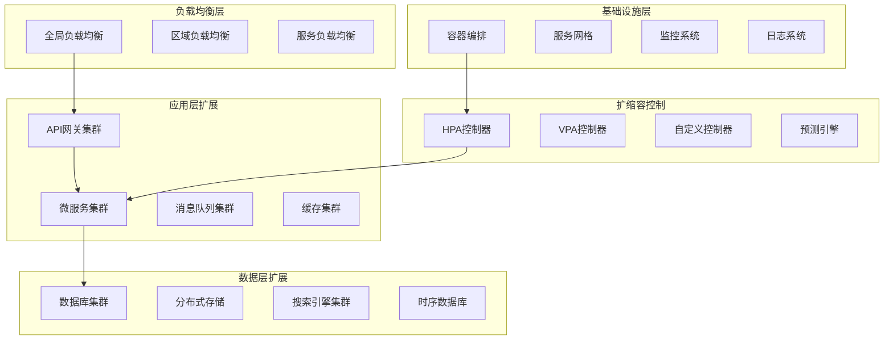

# 📈 扩展性详细设计
*WeWork Management Platform - Scalability Design*

## 📋 扩展性设计概览

### 🎯 扩展性目标
- **水平扩展**: 支持线性扩展到1000+节点
- **弹性伸缩**: 自动根据负载调整资源
- **高可用性**: 多地域部署，可用性 > 99.95%
- **性能保证**: 扩展过程中性能不降级
- **成本优化**: 智能资源分配，降低运营成本

### 🏗️ 扩展性架构设计



## 🔧 微服务扩展性设计

### 服务拆分和组合策略
```java
@Component
public class ServiceScalabilityManager {
    
    private final ServiceRegistry serviceRegistry;
    private final LoadBalancer loadBalancer;
    private final ServiceMesh serviceMesh;
    
    // 动态服务发现和注册
    public void registerService(ServiceInstance instance) {
        // 健康检查
        if (performHealthCheck(instance)) {
            serviceRegistry.register(instance);
            loadBalancer.addInstance(instance);
            
            // 更新服务网格配置
            serviceMesh.updateRouting(instance.getServiceName(), 
                serviceRegistry.getInstances(instance.getServiceName()));
            
            log.info("Service instance registered: {}", instance);
        }
    }
    
    // 智能服务分片
    public void enableServiceSharding(String serviceName, ShardingStrategy strategy) {
        List<ServiceInstance> instances = serviceRegistry.getInstances(serviceName);
        
        switch (strategy.getType()) {
            case TENANT_BASED:
                enableTenantBasedSharding(serviceName, instances);
                break;
            case REGION_BASED:
                enableRegionBasedSharding(serviceName, instances);
                break;
            case FEATURE_BASED:
                enableFeatureBasedSharding(serviceName, instances);
                break;
        }
    }
    
    private void enableTenantBasedSharding(String serviceName, List<ServiceInstance> instances) {
        // 按租户分片，每个租户路由到特定的服务实例
        Map<String, List<ServiceInstance>> tenantShards = groupInstancesByTenant(instances);
        
        for (Map.Entry<String, List<ServiceInstance>> entry : tenantShards.entrySet()) {
            String tenantId = entry.getKey();
            List<ServiceInstance> tenantInstances = entry.getValue();
            
            // 配置路由规则
            RoutingRule rule = RoutingRule.builder()
                .serviceName(serviceName)
                .condition("headers['tenant-id'] == '" + tenantId + "'")
                .targets(tenantInstances)
                .build();
            
            serviceMesh.addRoutingRule(rule);
        }
    }
    
    // 服务实例预热
    public void warmupServiceInstance(ServiceInstance instance) {
        CompletableFuture.runAsync(() -> {
            try {
                // 预加载缓存
                preloadCache(instance);
                
                // 预热JVM
                warmupJVM(instance);
                
                // 预连接数据库
                preconnectDatabase(instance);
                
                // 标记为可用
                markInstanceReady(instance);
                
            } catch (Exception e) {
                log.error("Failed to warmup service instance: " + instance, e);
            }
        });
    }
    
    private void preloadCache(ServiceInstance instance) {
        // 预加载常用数据到缓存
        List<String> hotDataKeys = getHotDataKeys(instance.getServiceName());
        
        for (String key : hotDataKeys) {
            try {
                cacheService.preload(key);
            } catch (Exception e) {
                log.warn("Failed to preload cache key: " + key, e);
            }
        }
    }
    
    private void warmupJVM(ServiceInstance instance) {
        // 发送预热请求，触发JIT编译
        List<String> warmupEndpoints = getWarmupEndpoints(instance.getServiceName());
        
        for (String endpoint : warmupEndpoints) {
            for (int i = 0; i < 100; i++) {
                try {
                    httpClient.get(instance.getUrl() + endpoint).execute();
                } catch (Exception e) {
                    // 忽略预热请求的错误
                }
            }
        }
    }
}

// 智能负载均衡
@Component
public class IntelligentLoadBalancer {
    
    private final Map<String, LoadBalancingStrategy> strategies = new HashMap<>();
    private final PerformanceMonitor performanceMonitor;
    
    @PostConstruct
    public void initializeStrategies() {
        strategies.put("round_robin", new RoundRobinStrategy());
        strategies.put("weighted_round_robin", new WeightedRoundRobinStrategy());
        strategies.put("least_connections", new LeastConnectionsStrategy());
        strategies.put("response_time", new ResponseTimeBasedStrategy());
        strategies.put("adaptive", new AdaptiveStrategy());
    }
    
    public ServiceInstance selectInstance(String serviceName, LoadBalancingRequest request) {
        List<ServiceInstance> availableInstances = getAvailableInstances(serviceName);
        
        if (availableInstances.isEmpty()) {
            throw new NoAvailableInstanceException("No available instances for service: " + serviceName);
        }
        
        LoadBalancingStrategy strategy = determineStrategy(serviceName, request);
        return strategy.select(availableInstances, request);
    }
    
    private LoadBalancingStrategy determineStrategy(String serviceName, LoadBalancingRequest request) {
        // 根据服务特性和请求特性选择策略
        if (request.isLatencySensitive()) {
            return strategies.get("response_time");
        }
        
        if (request.isStateful()) {
            return strategies.get("least_connections");
        }
        
        // 默认使用自适应策略
        return strategies.get("adaptive");
    }
}

// 自适应负载均衡策略
public class AdaptiveStrategy implements LoadBalancingStrategy {
    
    private final PerformanceMonitor performanceMonitor;
    
    @Override
    public ServiceInstance select(List<ServiceInstance> instances, LoadBalancingRequest request) {
        Map<ServiceInstance, Double> scores = new HashMap<>();
        
        for (ServiceInstance instance : instances) {
            double score = calculateInstanceScore(instance);
            scores.put(instance, score);
        }
        
        // 选择得分最高的实例
        return scores.entrySet().stream()
            .max(Map.Entry.comparingByValue())
            .map(Map.Entry::getKey)
            .orElse(instances.get(0));
    }
    
    private double calculateInstanceScore(ServiceInstance instance) {
        PerformanceMetrics metrics = performanceMonitor.getMetrics(instance.getId());
        
        // 综合考虑多个因素
        double cpuScore = 1.0 - metrics.getCpuUsage();           // CPU使用率越低越好
        double memoryScore = 1.0 - metrics.getMemoryUsage();     // 内存使用率越低越好
        double responseScore = 1.0 / metrics.getAverageResponseTime(); // 响应时间越短越好
        double errorScore = 1.0 - metrics.getErrorRate();        // 错误率越低越好
        double connectionScore = 1.0 - (metrics.getActiveConnections() / metrics.getMaxConnections());
        
        // 加权计算总分
        return (cpuScore * 0.2 + 
                memoryScore * 0.2 + 
                responseScore * 0.3 + 
                errorScore * 0.2 + 
                connectionScore * 0.1);
    }
}
```

### 服务网格集成
```yaml
# Istio服务网格配置
apiVersion: networking.istio.io/v1beta1
kind: VirtualService
metadata:
  name: wework-api-virtual-service
spec:
  hosts:
  - wework-api
  http:
  - match:
    - headers:
        tenant-id:
          exact: "tenant-a"
    route:
    - destination:
        host: wework-api
        subset: tenant-a
      weight: 100
  - match:
    - headers:
        tenant-id:
          exact: "tenant-b"
    route:
    - destination:
        host: wework-api
        subset: tenant-b
      weight: 100
  - route:
    - destination:
        host: wework-api
        subset: default
      weight: 100

---
apiVersion: networking.istio.io/v1beta1
kind: DestinationRule
metadata:
  name: wework-api-destination-rule
spec:
  host: wework-api
  trafficPolicy:
    connectionPool:
      tcp:
        maxConnections: 100
      http:
        http1MaxPendingRequests: 100
        maxRequestsPerConnection: 10
    loadBalancer:
      consistentHash:
        httpHeaderName: "tenant-id"
  subsets:
  - name: tenant-a
    labels:
      tenant: tenant-a
    trafficPolicy:
      connectionPool:
        tcp:
          maxConnections: 50
  - name: tenant-b
    labels:
      tenant: tenant-b
    trafficPolicy:
      connectionPool:
        tcp:
          maxConnections: 50
  - name: default
    labels:
      version: v1
```

## 🗄️ 数据存储扩展性

### 分布式数据库集群
```java
@Configuration
public class DistributedDatabaseConfiguration {
    
    // 分片数据源配置
    @Bean
    public DataSource createShardingDataSource() {
        // 4个主库，每个主库2个从库
        Map<String, DataSource> dataSourceMap = createDataSourceMap();
        
        // 分片规则
        ShardingRuleConfiguration shardingRule = createShardingRules();
        
        // 读写分离规则
        ReadWriteSplitRuleConfiguration readWriteSplitRule = createReadWriteSplitRules();
        
        // 广播表配置
        shardingRule.getBroadcastTables().addAll(Arrays.asList(
            "sys_configs", "sys_dictionaries", "sys_permissions"
        ));
        
        Properties properties = new Properties();
        properties.setProperty("sql.show", "false");
        properties.setProperty("check.table.metadata.enabled", "false");
        
        return ShardingDataSourceFactory.createDataSource(
            dataSourceMap, 
            Arrays.asList(shardingRule, readWriteSplitRule), 
            properties
        );
    }
    
    private Map<String, DataSource> createDataSourceMap() {
        Map<String, DataSource> dataSourceMap = new HashMap<>();
        
        // 创建分片数据源
        for (int i = 0; i < 4; i++) {
            // 主库
            HikariDataSource masterDs = createMasterDataSource(i);
            dataSourceMap.put("ds" + i + "_master", masterDs);
            
            // 从库
            for (int j = 0; j < 2; j++) {
                HikariDataSource slaveDs = createSlaveDataSource(i, j);
                dataSourceMap.put("ds" + i + "_slave" + j, slaveDs);
            }
        }
        
        return dataSourceMap;
    }
    
    private ShardingRuleConfiguration createShardingRules() {
        ShardingRuleConfiguration config = new ShardingRuleConfiguration();
        
        // 用户表分片
        TableRuleConfiguration userTableRule = new TableRuleConfiguration("users");
        userTableRule.setActualDataNodes("ds${0..3}_master.users_${0..15}");
        userTableRule.setDatabaseShardingStrategyConfig(
            new StandardShardingStrategyConfiguration("user_id", new UserDatabaseShardingAlgorithm())
        );
        userTableRule.setTableShardingStrategyConfig(
            new StandardShardingStrategyConfiguration("user_id", new UserTableShardingAlgorithm())
        );
        userTableRule.setKeyGenerateStrategyConfig(
            new KeyGenerateStrategyConfiguration("user_id", "snowflake")
        );
        
        // 消息表分片
        TableRuleConfiguration messageTableRule = new TableRuleConfiguration("message_records");
        messageTableRule.setActualDataNodes("ds${0..3}_master.message_records_${202401..202412}");
        messageTableRule.setDatabaseShardingStrategyConfig(
            new StandardShardingStrategyConfiguration("tenant_id", new TenantDatabaseShardingAlgorithm())
        );
        messageTableRule.setTableShardingStrategyConfig(
            new StandardShardingStrategyConfiguration("created_at", new DateTableShardingAlgorithm())
        );
        
        config.getTableRuleConfigs().addAll(Arrays.asList(userTableRule, messageTableRule));
        
        return config;
    }
}

// 动态分片扩容
@Component
public class ShardingExpansionService {
    
    private final ShardingDataSource shardingDataSource;
    private final MetadataManager metadataManager;
    
    // 在线扩容分片
    public void expandShards(String tableName, int newShardCount) {
        try {
            // 1. 创建新的分片表
            createNewShardTables(tableName, newShardCount);
            
            // 2. 更新分片规则
            updateShardingRules(tableName, newShardCount);
            
            // 3. 数据迁移
            migrateDataToNewShards(tableName, newShardCount);
            
            // 4. 验证数据一致性
            validateDataConsistency(tableName);
            
            // 5. 切换流量
            switchTrafficToNewShards(tableName);
            
            log.info("Successfully expanded shards for table: {}", tableName);
            
        } catch (Exception e) {
            log.error("Failed to expand shards for table: " + tableName, e);
            rollbackExpansion(tableName);
            throw e;
        }
    }
    
    private void migrateDataToNewShards(String tableName, int newShardCount) {
        String migrationJobId = "migration_" + tableName + "_" + System.currentTimeMillis();
        
        // 创建数据迁移任务
        DataMigrationJob job = DataMigrationJob.builder()
            .jobId(migrationJobId)
            .sourceTable(tableName)
            .newShardCount(newShardCount)
            .batchSize(1000)
            .parallelism(4)
            .build();
        
        dataMigrationService.submitJob(job);
        
        // 监控迁移进度
        while (!job.isCompleted()) {
            DataMigrationProgress progress = job.getProgress();
            log.info("Migration progress: {}%, migrated: {}, total: {}", 
                    progress.getPercentage(), progress.getMigrated(), progress.getTotal());
            
            try {
                Thread.sleep(10000); // 每10秒检查一次
            } catch (InterruptedException e) {
                Thread.currentThread().interrupt();
                break;
            }
        }
        
        if (job.isFailed()) {
            throw new DataMigrationException("Data migration failed: " + job.getFailureReason());
        }
    }
}
```

### 数据库连接池扩展
```java
@Component
public class DynamicDataSourceManager {
    
    private final Map<String, HikariDataSource> dataSources = new ConcurrentHashMap<>();
    private final DataSourceConfig config;
    
    // 动态创建数据源
    public DataSource getOrCreateDataSource(String dataSourceKey) {
        return dataSources.computeIfAbsent(dataSourceKey, key -> {
            HikariConfig hikariConfig = new HikariConfig();
            
            // 从配置中心获取数据库连接信息
            DatabaseConnectionInfo connInfo = config.getConnectionInfo(key);
            
            hikariConfig.setJdbcUrl(connInfo.getJdbcUrl());
            hikariConfig.setUsername(connInfo.getUsername());
            hikariConfig.setPassword(connInfo.getPassword());
            
            // 动态调整连接池大小
            int poolSize = calculateOptimalPoolSize(key);
            hikariConfig.setMaximumPoolSize(poolSize);
            hikariConfig.setMinimumIdle(poolSize / 4);
            
            // 连接池监控
            hikariConfig.setRegisterMbeans(true);
            hikariConfig.setPoolName(key + "-pool");
            
            // 连接有效性检查
            hikariConfig.setConnectionTestQuery("SELECT 1");
            hikariConfig.setValidationTimeout(5000);
            
            HikariDataSource dataSource = new HikariDataSource(hikariConfig);
            
            // 注册数据源监控
            registerDataSourceMonitoring(key, dataSource);
            
            return dataSource;
        });
    }
    
    private int calculateOptimalPoolSize(String dataSourceKey) {
        // 基于历史负载数据计算最佳连接池大小
        ConnectionUsageStats stats = connectionMonitor.getUsageStats(dataSourceKey);
        
        if (stats == null) {
            return 20; // 默认大小
        }
        
        double avgUsage = stats.getAverageUsage();
        double peakUsage = stats.getPeakUsage();
        
        // 基于峰值使用量的120%设置池大小
        int calculatedSize = (int) Math.ceil(peakUsage * 1.2);
        
        // 限制在合理范围内
        return Math.max(10, Math.min(100, calculatedSize));
    }
    
    // 动态调整连接池
    @Scheduled(fixedRate = 300000) // 每5分钟执行一次
    public void adjustConnectionPools() {
        for (Map.Entry<String, HikariDataSource> entry : dataSources.entrySet()) {
            String key = entry.getKey();
            HikariDataSource dataSource = entry.getValue();
            
            int currentSize = dataSource.getMaximumPoolSize();
            int optimalSize = calculateOptimalPoolSize(key);
            
            if (Math.abs(currentSize - optimalSize) > 5) {
                log.info("Adjusting connection pool size for {}: {} -> {}", 
                        key, currentSize, optimalSize);
                
                dataSource.setMaximumPoolSize(optimalSize);
                dataSource.setMinimumIdle(optimalSize / 4);
            }
        }
    }
    
    // 数据源健康检查
    @Scheduled(fixedRate = 60000) // 每分钟执行一次
    public void performHealthCheck() {
        for (Map.Entry<String, HikariDataSource> entry : dataSources.entrySet()) {
            String key = entry.getKey();
            HikariDataSource dataSource = entry.getValue();
            
            try {
                // 检查连接池状态
                HikariPoolMXBean poolMXBean = dataSource.getHikariPoolMXBean();
                
                if (poolMXBean.getActiveConnections() > poolMXBean.getMaxPoolSize() * 0.9) {
                    alertService.sendConnectionPoolAlert(key, "High connection usage");
                }
                
                // 测试连接
                try (Connection conn = dataSource.getConnection()) {
                    conn.isValid(5);
                }
                
            } catch (Exception e) {
                log.error("Health check failed for data source: " + key, e);
                alertService.sendDataSourceAlert(key, "Health check failed");
            }
        }
    }
}
```

## 🚀 缓存扩展性设计

### 分布式缓存集群
```java
@Configuration
public class DistributedCacheConfiguration {
    
    @Bean
    public RedisClusterConfiguration redisClusterConfiguration() {
        RedisClusterConfiguration config = new RedisClusterConfiguration();
        
        // 集群节点配置
        Set<RedisNode> nodes = new HashSet<>();
        for (int i = 0; i < 6; i++) {
            nodes.add(new RedisNode("redis-cluster-" + i, 6379));
        }
        config.setClusterNodes(nodes);
        
        // 集群配置
        config.setMaxRedirects(3);
        
        return config;
    }
    
    @Bean
    public LettuceConnectionFactory redisConnectionFactory() {
        LettuceClientConfiguration clientConfig = LettuceClientConfiguration.builder()
            .commandTimeout(Duration.ofSeconds(5))
            .shutdownTimeout(Duration.ofSeconds(10))
            .clientResources(DefaultClientResources.builder()
                .ioThreadPoolSize(8)
                .computationThreadPoolSize(8)
                .build())
            .build();
        
        return new LettuceConnectionFactory(redisClusterConfiguration(), clientConfig);
    }
    
    @Bean
    public RedisTemplate<String, Object> redisTemplate() {
        RedisTemplate<String, Object> template = new RedisTemplate<>();
        template.setConnectionFactory(redisConnectionFactory());
        
        // 使用一致性哈希序列化器
        template.setKeySerializer(new StringRedisSerializer());
        template.setValueSerializer(new GenericJackson2JsonRedisSerializer());
        template.setHashKeySerializer(new StringRedisSerializer());
        template.setHashValueSerializer(new GenericJackson2JsonRedisSerializer());
        
        return template;
    }
}

// 缓存分片管理
@Component
public class CacheShardingManager {
    
    private final ConsistentHash<CacheNode> consistentHash;
    private final Set<CacheNode> cacheNodes;
    private final ReplicationFactor replicationFactor = new ReplicationFactor(3);
    
    public CacheShardingManager() {
        this.cacheNodes = initializeCacheNodes();
        this.consistentHash = new ConsistentHash<>(cacheNodes, 160); // 160个虚拟节点
    }
    
    // 获取缓存节点
    public List<CacheNode> getCacheNodes(String key) {
        // 主节点
        CacheNode primaryNode = consistentHash.get(key);
        
        // 副本节点
        List<CacheNode> replicaNodes = consistentHash.getReplicaNodes(key, replicationFactor.getValue());
        
        List<CacheNode> allNodes = new ArrayList<>();
        allNodes.add(primaryNode);
        allNodes.addAll(replicaNodes);
        
        return allNodes;
    }
    
    // 动态添加缓存节点
    public void addCacheNode(CacheNode newNode) {
        synchronized (this) {
            cacheNodes.add(newNode);
            consistentHash.add(newNode);
            
            // 数据迁移
            migrateDataToNewNode(newNode);
            
            log.info("Added new cache node: {}", newNode);
        }
    }
    
    // 移除缓存节点
    public void removeCacheNode(CacheNode nodeToRemove) {
        synchronized (this) {
            // 数据迁移到其他节点
            migrateDataFromRemovedNode(nodeToRemove);
            
            cacheNodes.remove(nodeToRemove);
            consistentHash.remove(nodeToRemove);
            
            log.info("Removed cache node: {}", nodeToRemove);
        }
    }
    
    private void migrateDataToNewNode(CacheNode newNode) {
        // 异步数据迁移
        CompletableFuture.runAsync(() -> {
            try {
                Set<String> keysToMigrate = findKeysToMigrate(newNode);
                
                for (String key : keysToMigrate) {
                    migrateKey(key, newNode);
                }
                
                log.info("Data migration completed for node: {}", newNode);
                
            } catch (Exception e) {
                log.error("Data migration failed for node: " + newNode, e);
            }
        });
    }
    
    private void migrateKey(String key, CacheNode targetNode) {
        try {
            // 从源节点获取数据
            Object value = getFromSourceNode(key);
            
            if (value != null) {
                // 写入目标节点
                writeToTargetNode(targetNode, key, value);
                
                // 验证数据一致性
                if (verifyMigration(key, targetNode, value)) {
                    // 从源节点删除（可选，基于策略）
                    deleteFromSourceNode(key);
                }
            }
            
        } catch (Exception e) {
            log.warn("Failed to migrate key: " + key, e);
        }
    }
}

// 缓存预热和淘汰策略
@Component
public class CacheWarmupAndEvictionService {
    
    private final RedisTemplate<String, Object> redisTemplate;
    private final ScheduledExecutorService warmupExecutor = Executors.newScheduledThreadPool(5);
    
    // 智能缓存预热
    @PostConstruct
    public void scheduleWarmupTasks() {
        // 每天凌晨2点执行全量预热
        warmupExecutor.scheduleAtFixedRate(this::performFullWarmup, 
                calculateInitialDelay(2, 0), 
                Duration.ofDays(1).toSeconds(), 
                TimeUnit.SECONDS);
        
        // 每小时执行增量预热
        warmupExecutor.scheduleAtFixedRate(this::performIncrementalWarmup, 
                0, 3600, TimeUnit.SECONDS);
    }
    
    public void performFullWarmup() {
        log.info("Starting full cache warmup");
        
        try {
            // 预热用户数据
            warmupUserData();
            
            // 预热配置数据
            warmupConfigData();
            
            // 预热热点数据
            warmupHotData();
            
            log.info("Full cache warmup completed");
            
        } catch (Exception e) {
            log.error("Full cache warmup failed", e);
        }
    }
    
    public void performIncrementalWarmup() {
        try {
            // 基于访问模式预热
            List<String> hotKeys = getHotKeysFromAccessLog();
            
            for (String key : hotKeys) {
                if (!redisTemplate.hasKey(key)) {
                    Object value = loadFromDatabase(key);
                    if (value != null) {
                        redisTemplate.opsForValue().set(key, value, Duration.ofHours(2));
                    }
                }
            }
            
        } catch (Exception e) {
            log.warn("Incremental cache warmup failed", e);
        }
    }
    
    // 智能淘汰策略
    public void performIntelligentEviction() {
        MemoryInfo memoryInfo = getRedisMemoryInfo();
        
        if (memoryInfo.getUsagePercentage() > 80) {
            // 内存使用率超过80%，开始淘汰
            List<String> candidateKeys = findEvictionCandidates();
            
            // 按优先级淘汰
            candidateKeys.sort((k1, k2) -> {
                EvictionScore score1 = calculateEvictionScore(k1);
                EvictionScore score2 = calculateEvictionScore(k2);
                return Double.compare(score1.getScore(), score2.getScore());
            });
            
            int targetEvictionCount = (int) (candidateKeys.size() * 0.1); // 淘汰10%
            
            for (int i = 0; i < targetEvictionCount && i < candidateKeys.size(); i++) {
                String key = candidateKeys.get(i);
                redisTemplate.delete(key);
                
                log.debug("Evicted cache key: {}", key);
            }
            
            log.info("Evicted {} cache entries to free memory", targetEvictionCount);
        }
    }
    
    private EvictionScore calculateEvictionScore(String key) {
        // 综合考虑多个因素计算淘汰分数
        long ttl = redisTemplate.getExpire(key, TimeUnit.SECONDS);
        long accessCount = getAccessCount(key);
        long lastAccessTime = getLastAccessTime(key);
        long keySize = getKeySize(key);
        
        // TTL权重：TTL越短，越容易被淘汰
        double ttlScore = ttl > 0 ? 1.0 / ttl : 0;
        
        // 访问频率权重：访问次数越少，越容易被淘汰
        double accessScore = 1.0 / Math.max(1, accessCount);
        
        // 最近访问权重：最近访问时间越远，越容易被淘汰
        double recentScore = 1.0 / Math.max(1, System.currentTimeMillis() - lastAccessTime);
        
        // 大小权重：越大的key越容易被淘汰
        double sizeScore = Math.log(Math.max(1, keySize));
        
        double totalScore = ttlScore * 0.3 + accessScore * 0.3 + recentScore * 0.3 + sizeScore * 0.1;
        
        return new EvictionScore(key, totalScore);
    }
}
```

## ⚖️ 自动扩缩容机制

### 基于指标的扩缩容
```yaml
# HPA配置 - 基于多指标
apiVersion: autoscaling/v2
kind: HorizontalPodAutoscaler
metadata:
  name: wework-api-hpa
spec:
  scaleTargetRef:
    apiVersion: apps/v1
    kind: Deployment
    name: wework-api
  minReplicas: 3
  maxReplicas: 100
  metrics:
  # CPU指标
  - type: Resource
    resource:
      name: cpu
      target:
        type: Utilization
        averageUtilization: 70
  # 内存指标
  - type: Resource
    resource:
      name: memory
      target:
        type: Utilization
        averageUtilization: 80
  # 自定义指标 - QPS
  - type: Pods
    pods:
      metric:
        name: requests_per_second
      target:
        type: AverageValue
        averageValue: "100"
  # 自定义指标 - 响应时间
  - type: Pods
    pods:
      metric:
        name: average_response_time
      target:
        type: AverageValue
        averageValue: "200m"
  # 自定义指标 - 队列长度
  - type: Pods
    pods:
      metric:
        name: queue_length
      target:
        type: AverageValue
        averageValue: "50"
  behavior:
    scaleDown:
      stabilizationWindowSeconds: 300
      policies:
      - type: Percent
        value: 10
        periodSeconds: 60
      - type: Pods
        value: 5
        periodSeconds: 60
    scaleUp:
      stabilizationWindowSeconds: 60
      policies:
      - type: Percent
        value: 50
        periodSeconds: 30
      - type: Pods
        value: 10
        periodSeconds: 30

---
# VPA配置 - 垂直扩缩容
apiVersion: autoscaling.k8s.io/v1
kind: VerticalPodAutoscaler
metadata:
  name: wework-api-vpa
spec:
  targetRef:
    apiVersion: apps/v1
    kind: Deployment
    name: wework-api
  updatePolicy:
    updateMode: "Auto"
  resourcePolicy:
    containerPolicies:
    - containerName: wework-api
      minAllowed:
        cpu: 100m
        memory: 128Mi
      maxAllowed:
        cpu: 4
        memory: 8Gi
      controlledResources: ["cpu", "memory"]
      controlledValues: RequestsAndLimits
```

### 预测性扩容
```java
@Component
public class PredictiveScalingService {
    
    private final MetricsCollector metricsCollector;
    private final MachineLearningPredictor predictor;
    private final AutoScalingController autoScalingController;
    
    // 负载预测模型
    @Scheduled(fixedRate = 300000) // 每5分钟执行一次
    public void predictAndScale() {
        try {
            // 收集历史指标数据
            List<MetricData> historicalData = metricsCollector.getHistoricalData(
                Duration.ofDays(7), // 过去7天的数据
                Duration.ofMinutes(5) // 5分钟间隔
            );
            
            // 预测未来1小时的负载
            LoadPrediction prediction = predictor.predictLoad(historicalData, Duration.ofHours(1));
            
            // 基于预测结果决定是否需要预扩容
            ScalingDecision decision = makeScalingDecision(prediction);
            
            if (decision.shouldScale()) {
                executePreemptiveScaling(decision);
            }
            
        } catch (Exception e) {
            log.error("Predictive scaling failed", e);
        }
    }
    
    private ScalingDecision makeScalingDecision(LoadPrediction prediction) {
        ScalingDecision.Builder builder = ScalingDecision.builder();
        
        // 获取当前资源状态
        ResourceStatus currentStatus = getCurrentResourceStatus();
        
        // 预测负载分析
        double predictedCpuUsage = prediction.getCpuUsage();
        double predictedMemoryUsage = prediction.getMemoryUsage();
        double predictedQps = prediction.getQps();
        
        // 当前容量
        int currentReplicas = currentStatus.getCurrentReplicas();
        double currentCapacity = currentStatus.getCurrentCapacity();
        
        // 计算所需容量
        double requiredCapacity = calculateRequiredCapacity(prediction);
        
        if (requiredCapacity > currentCapacity * 1.2) {
            // 需要扩容
            int targetReplicas = calculateTargetReplicas(requiredCapacity, currentCapacity, currentReplicas);
            builder.scaleUp(targetReplicas - currentReplicas)
                   .reason("Predicted load increase: " + prediction.getSummary());
        } else if (requiredCapacity < currentCapacity * 0.5) {
            // 可以缩容
            int targetReplicas = calculateTargetReplicas(requiredCapacity, currentCapacity, currentReplicas);
            builder.scaleDown(currentReplicas - targetReplicas)
                   .reason("Predicted load decrease: " + prediction.getSummary());
        } else {
            builder.noAction("Load prediction within acceptable range");
        }
        
        return builder.build();
    }
    
    private void executePreemptiveScaling(ScalingDecision decision) {
        log.info("Executing preemptive scaling: {}", decision);
        
        if (decision.isScaleUp()) {
            // 预扩容
            autoScalingController.scaleUp(decision.getScaleAmount(), ScalingReason.PREDICTIVE);
            
            // 记录扩容事件
            recordScalingEvent(ScalingType.SCALE_UP, decision);
            
        } else if (decision.isScaleDown()) {
            // 预缩容（更保守）
            if (decision.getConfidence() > 0.8) { // 高置信度才缩容
                autoScalingController.scaleDown(decision.getScaleAmount(), ScalingReason.PREDICTIVE);
                recordScalingEvent(ScalingType.SCALE_DOWN, decision);
            }
        }
    }
}

// 机器学习预测器
@Component
public class MachineLearningPredictor {
    
    private final TimeSeriesModel timeSeriesModel;
    private final SeasonalityDetector seasonalityDetector;
    private final AnomalyDetector anomalyDetector;
    
    public LoadPrediction predictLoad(List<MetricData> historicalData, Duration predictionHorizon) {
        // 数据预处理
        List<MetricData> cleanedData = preprocessData(historicalData);
        
        // 检测季节性模式
        SeasonalityPattern pattern = seasonalityDetector.detect(cleanedData);
        
        // 异常检测和数据清洗
        List<MetricData> normalizedData = anomalyDetector.removeAnomalies(cleanedData);
        
        // 时间序列预测
        TimeSeriesPrediction tsPrediction = timeSeriesModel.predict(normalizedData, predictionHorizon);
        
        // 应用季节性调整
        TimeSeriesPrediction adjustedPrediction = applySeasonalityAdjustment(tsPrediction, pattern);
        
        // 构建负载预测结果
        return LoadPrediction.builder()
            .cpuUsage(adjustedPrediction.getCpuUsage())
            .memoryUsage(adjustedPrediction.getMemoryUsage())
            .qps(adjustedPrediction.getQps())
            .responseTime(adjustedPrediction.getResponseTime())
            .confidence(adjustedPrediction.getConfidence())
            .predictionHorizon(predictionHorizon)
            .seasonalityPattern(pattern)
            .build();
    }
    
    private List<MetricData> preprocessData(List<MetricData> rawData) {
        return rawData.stream()
            .filter(this::isValidData)
            .map(this::normalizeData)
            .collect(Collectors.toList());
    }
    
    private boolean isValidData(MetricData data) {
        // 数据有效性检查
        return data.getCpuUsage() >= 0 && data.getCpuUsage() <= 1.0 &&
               data.getMemoryUsage() >= 0 && data.getMemoryUsage() <= 1.0 &&
               data.getQps() >= 0 && data.getResponseTime() > 0;
    }
    
    private MetricData normalizeData(MetricData data) {
        // 数据标准化处理
        return MetricData.builder()
            .timestamp(data.getTimestamp())
            .cpuUsage(Math.min(1.0, Math.max(0.0, data.getCpuUsage())))
            .memoryUsage(Math.min(1.0, Math.max(0.0, data.getMemoryUsage())))
            .qps(Math.max(0, data.getQps()))
            .responseTime(Math.max(1, data.getResponseTime()))
            .build();
    }
}
```

### 成本优化扩缩容
```java
@Component
public class CostOptimizedScalingService {
    
    private final CloudProviderApi cloudApi;
    private final PricingService pricingService;
    private final ResourceOptimizer resourceOptimizer;
    
    // 成本感知的扩缩容决策
    public ScalingDecision makeCostOptimizedDecision(LoadPrediction prediction) {
        // 获取当前资源成本
        ResourceCost currentCost = calculateCurrentResourceCost();
        
        // 获取不同实例类型的定价
        List<InstanceOption> availableInstances = getAvailableInstanceOptions();
        
        // 计算各种扩缩容方案的成本效益
        List<ScalingOption> scalingOptions = generateScalingOptions(prediction, availableInstances);
        
        // 选择成本效益最佳的方案
        ScalingOption bestOption = selectBestOption(scalingOptions, prediction);
        
        return ScalingDecision.builder()
            .scalingOption(bestOption)
            .costSavings(currentCost.subtract(bestOption.getCost()))
            .performanceImpact(bestOption.getPerformanceImpact())
            .build();
    }
    
    private List<ScalingOption> generateScalingOptions(LoadPrediction prediction, 
                                                      List<InstanceOption> instances) {
        List<ScalingOption> options = new ArrayList<>();
        
        for (InstanceOption instance : instances) {
            // 计算需要多少个实例
            int requiredInstances = calculateRequiredInstances(prediction, instance);
            
            // 计算成本
            BigDecimal cost = pricingService.calculateCost(instance, requiredInstances, 
                                                          prediction.getDuration());
            
            // 评估性能影响
            PerformanceImpact performance = evaluatePerformanceImpact(instance, requiredInstances);
            
            // 检查spot实例可用性
            if (instance.supportsSpotInstance()) {
                SpotInstanceOption spotOption = createSpotInstanceOption(instance, requiredInstances);
                if (spotOption.isAvailable()) {
                    options.add(ScalingOption.builder()
                        .instanceType(instance.getType())
                        .instanceCount(requiredInstances)
                        .cost(spotOption.getCost())
                        .performanceImpact(performance)
                        .riskLevel(RiskLevel.MEDIUM) // Spot instances have medium risk
                        .build());
                }
            }
            
            // 按需实例选项
            options.add(ScalingOption.builder()
                .instanceType(instance.getType())
                .instanceCount(requiredInstances)
                .cost(cost)
                .performanceImpact(performance)
                .riskLevel(RiskLevel.LOW)
                .build());
        }
        
        return options;
    }
    
    private ScalingOption selectBestOption(List<ScalingOption> options, LoadPrediction prediction) {
        return options.stream()
            .filter(option -> option.getPerformanceImpact().meetsSLA())
            .min((o1, o2) -> {
                // 综合考虑成本、性能和风险
                double score1 = calculateOptionScore(o1, prediction);
                double score2 = calculateOptionScore(o2, prediction);
                return Double.compare(score1, score2);
            })
            .orElse(options.get(0)); // 如果没有满足SLA的选项，选择第一个
    }
    
    private double calculateOptionScore(ScalingOption option, LoadPrediction prediction) {
        // 成本权重
        double costScore = option.getCost().doubleValue() / getMaxAcceptableCost().doubleValue();
        
        // 性能权重
        double performanceScore = 1.0 - option.getPerformanceImpact().getQualityScore();
        
        // 风险权重
        double riskScore = option.getRiskLevel().getScore();
        
        // 加权计算总分（分数越低越好）
        return costScore * 0.5 + performanceScore * 0.3 + riskScore * 0.2;
    }
    
    // 智能实例类型推荐
    public InstanceRecommendation recommendInstanceType(WorkloadProfile workload) {
        // 分析工作负载特征
        WorkloadCharacteristics characteristics = analyzeWorkload(workload);
        
        List<InstanceOption> candidates = new ArrayList<>();
        
        if (characteristics.isCpuIntensive()) {
            candidates.addAll(getComputeOptimizedInstances());
        }
        
        if (characteristics.isMemoryIntensive()) {
            candidates.addAll(getMemoryOptimizedInstances());
        }
        
        if (characteristics.isIoIntensive()) {
            candidates.addAll(getStorageOptimizedInstances());
        }
        
        if (characteristics.isBalanced()) {
            candidates.addAll(getGeneralPurposeInstances());
        }
        
        // 基于历史性能数据评估
        return evaluateInstancePerformance(candidates, workload);
    }
}
```

## 🌍 跨地域部署扩展

### 多地域架构
```yaml
# 多地域部署配置
apiVersion: v1
kind: ConfigMap
metadata:
  name: multi-region-config
data:
  regions.yaml: |
    regions:
      - name: "us-east-1"
        primary: true
        endpoints:
          - "https://api-us-east.wework.com"
        database:
          read_replicas: 2
          write_instance: "wework-db-us-east-master"
        cache:
          cluster_size: 6
          replication_factor: 2
      
      - name: "eu-west-1"
        primary: false
        endpoints:
          - "https://api-eu-west.wework.com"
        database:
          read_replicas: 2
          write_instance: "wework-db-eu-west-master"
        cache:
          cluster_size: 4
          replication_factor: 2
      
      - name: "ap-southeast-1"
        primary: false
        endpoints:
          - "https://api-ap-southeast.wework.com"
        database:
          read_replicas: 2
          write_instance: "wework-db-ap-southeast-master"
        cache:
          cluster_size: 4
          replication_factor: 2
    
    routing:
      strategy: "latency_based"
      fallback_region: "us-east-1"
      health_check_interval: "30s"
      
    data_sync:
      strategy: "eventually_consistent"
      sync_interval: "5m"
      conflict_resolution: "timestamp_based"

---
# 全局负载均衡配置
apiVersion: networking.istio.io/v1beta1
kind: Gateway
metadata:
  name: global-gateway
spec:
  selector:
    istio: ingressgateway
  servers:
  - port:
      number: 443
      name: https
      protocol: HTTPS
    tls:
      mode: SIMPLE
      credentialName: wework-tls-cert
    hosts:
    - "*.wework.com"

---
apiVersion: networking.istio.io/v1beta1
kind: VirtualService
metadata:
  name: global-routing
spec:
  hosts:
  - "*.wework.com"
  gateways:
  - global-gateway
  http:
  # 基于地理位置的路由
  - match:
    - headers:
        x-user-region:
          exact: "us"
    route:
    - destination:
        host: wework-api-us-east
      weight: 100
  - match:
    - headers:
        x-user-region:
          exact: "eu"
    route:
    - destination:
        host: wework-api-eu-west
      weight: 100
  - match:
    - headers:
        x-user-region:
          exact: "asia"
    route:
    - destination:
        host: wework-api-ap-southeast
      weight: 100
  # 默认路由到最近的区域
  - route:
    - destination:
        host: wework-api-us-east
      weight: 50
    - destination:
        host: wework-api-eu-west
      weight: 30
    - destination:
        host: wework-api-ap-southeast
      weight: 20
```

### 跨地域数据同步
```java
@Component
public class CrossRegionDataSyncService {
    
    private final Map<String, RegionSyncClient> regionClients;
    private final ConflictResolutionStrategy conflictResolver;
    private final EventualConsistencyManager consistencyManager;
    
    // 数据同步策略
    @Scheduled(fixedRate = 300000) // 每5分钟同步一次
    public void synchronizeData() {
        List<SyncTask> syncTasks = createSyncTasks();
        
        // 并行执行同步任务
        syncTasks.parallelStream().forEach(this::executeSyncTask);
    }
    
    private List<SyncTask> createSyncTasks() {
        List<SyncTask> tasks = new ArrayList<>();
        
        // 获取需要同步的数据
        List<DataChangeRecord> changes = getDataChangesSinceLastSync();
        
        for (DataChangeRecord change : changes) {
            String sourceRegion = change.getSourceRegion();
            List<String> targetRegions = getTargetRegions(sourceRegion);
            
            for (String targetRegion : targetRegions) {
                SyncTask task = SyncTask.builder()
                    .dataChange(change)
                    .sourceRegion(sourceRegion)
                    .targetRegion(targetRegion)
                    .syncType(determineSyncType(change))
                    .build();
                    
                tasks.add(task);
            }
        }
        
        return tasks;
    }
    
    private void executeSyncTask(SyncTask task) {
        try {
            RegionSyncClient client = regionClients.get(task.getTargetRegion());
            
            switch (task.getSyncType()) {
                case FULL_SYNC:
                    executeFullSync(client, task);
                    break;
                case INCREMENTAL_SYNC:
                    executeIncrementalSync(client, task);
                    break;
                case CONFLICT_RESOLUTION:
                    executeConflictResolution(client, task);
                    break;
            }
            
            // 记录同步成功
            recordSyncSuccess(task);
            
        } catch (Exception e) {
            log.error("Sync task failed: " + task, e);
            handleSyncFailure(task, e);
        }
    }
    
    private void executeIncrementalSync(RegionSyncClient client, SyncTask task) {
        DataChangeRecord change = task.getDataChange();
        
        // 检查目标区域的数据版本
        DataVersion targetVersion = client.getDataVersion(change.getEntityId());
        
        if (targetVersion.isOlderThan(change.getVersion())) {
            // 目标数据较旧，执行同步
            SyncResult result = client.syncData(change);
            
            if (!result.isSuccess()) {
                if (result.hasConflict()) {
                    // 有冲突，执行冲突解决
                    resolveConflict(client, change, result.getConflictData());
                } else {
                    throw new SyncException("Sync failed: " + result.getError());
                }
            }
        } else if (targetVersion.isNewerThan(change.getVersion())) {
            // 目标数据较新，可能需要反向同步
            handleReverseSync(client, change, targetVersion);
        }
        // 版本相同则跳过
    }
    
    private void resolveConflict(RegionSyncClient client, DataChangeRecord localChange, 
                               ConflictData conflictData) {
        ConflictResolution resolution = conflictResolver.resolve(localChange, conflictData);
        
        switch (resolution.getStrategy()) {
            case LAST_WRITE_WINS:
                applyLastWriteWinsResolution(client, localChange, conflictData);
                break;
            case MERGE:
                applyMergeResolution(client, localChange, conflictData);
                break;
            case MANUAL_RESOLUTION:
                scheduleManualResolution(client, localChange, conflictData);
                break;
        }
    }
    
    // 最终一致性管理
    @Component
    public static class EventualConsistencyManager {
        
        private final ConsistencyCheckScheduler scheduler;
        private final InconsistencyDetector detector;
        
        @Scheduled(fixedRate = 1800000) // 每30分钟检查一次
        public void checkConsistency() {
            List<ConsistencyCheckTask> checkTasks = createConsistencyCheckTasks();
            
            for (ConsistencyCheckTask task : checkTasks) {
                CompletableFuture.runAsync(() -> executeConsistencyCheck(task));
            }
        }
        
        private void executeConsistencyCheck(ConsistencyCheckTask task) {
            try {
                List<DataInconsistency> inconsistencies = detector.detectInconsistencies(task);
                
                if (!inconsistencies.isEmpty()) {
                    log.warn("Found {} inconsistencies in {}", 
                            inconsistencies.size(), task.getEntityType());
                    
                    scheduleInconsistencyResolution(inconsistencies);
                }
                
            } catch (Exception e) {
                log.error("Consistency check failed for task: " + task, e);
            }
        }
        
        private void scheduleInconsistencyResolution(List<DataInconsistency> inconsistencies) {
            for (DataInconsistency inconsistency : inconsistencies) {
                InconsistencyResolutionTask resolutionTask = InconsistencyResolutionTask.builder()
                    .inconsistency(inconsistency)
                    .priority(calculatePriority(inconsistency))
                    .scheduledAt(LocalDateTime.now())
                    .build();
                
                inconsistencyResolutionQueue.offer(resolutionTask);
            }
        }
    }
}
```

## 📊 监控和容量规划

### 扩展性监控指标
```java
@Component
public class ScalabilityMetricsCollector {
    
    private final MeterRegistry meterRegistry;
    private final InfluxDBClient influxDBClient;
    
    // 实时指标收集
    @EventListener
    public void collectResourceMetrics(ResourceMetricsEvent event) {
        // CPU指标
        Gauge.builder("system.cpu.usage")
            .tag("region", event.getRegion())
            .tag("instance", event.getInstanceId())
            .register(meterRegistry, event, ResourceMetricsEvent::getCpuUsage);
        
        // 内存指标
        Gauge.builder("system.memory.usage")
            .tag("region", event.getRegion())
            .tag("instance", event.getInstanceId())
            .register(meterRegistry, event, ResourceMetricsEvent::getMemoryUsage);
        
        // 网络指标
        meterRegistry.counter("system.network.bytes.in", 
            "region", event.getRegion(),
            "instance", event.getInstanceId())
            .increment(event.getNetworkBytesIn());
        
        meterRegistry.counter("system.network.bytes.out",
            "region", event.getRegion(), 
            "instance", event.getInstanceId())
            .increment(event.getNetworkBytesOut());
    }
    
    @EventListener
    public void collectApplicationMetrics(ApplicationMetricsEvent event) {
        // QPS指标
        meterRegistry.counter("application.requests.total",
            "service", event.getServiceName(),
            "region", event.getRegion(),
            "status", event.getStatus())
            .increment(event.getRequestCount());
        
        // 响应时间指标
        Timer.Sample sample = Timer.start(meterRegistry);
        sample.stop(Timer.builder("application.response.time")
            .tag("service", event.getServiceName())
            .tag("region", event.getRegion())
            .tag("endpoint", event.getEndpoint())
            .register(meterRegistry));
        
        // 错误率指标
        if (event.hasError()) {
            meterRegistry.counter("application.errors.total",
                "service", event.getServiceName(),
                "region", event.getRegion(),
                "error_type", event.getErrorType())
                .increment();
        }
    }
    
    // 容量指标计算
    @Scheduled(fixedRate = 60000) // 每分钟计算一次
    public void calculateCapacityMetrics() {
        List<String> regions = getActiveRegions();
        
        for (String region : regions) {
            RegionCapacityMetrics capacity = calculateRegionCapacity(region);
            
            // 当前容量利用率
            meterRegistry.gauge("capacity.utilization.cpu", 
                Tags.of("region", region), capacity.getCpuUtilization());
            
            meterRegistry.gauge("capacity.utilization.memory", 
                Tags.of("region", region), capacity.getMemoryUtilization());
            
            meterRegistry.gauge("capacity.utilization.network", 
                Tags.of("region", region), capacity.getNetworkUtilization());
            
            // 剩余容量
            meterRegistry.gauge("capacity.remaining.cpu", 
                Tags.of("region", region), capacity.getRemainingCpuCapacity());
            
            meterRegistry.gauge("capacity.remaining.memory", 
                Tags.of("region", region), capacity.getRemainingMemoryCapacity());
            
            // 容量警告
            if (capacity.getCpuUtilization() > 0.8) {
                alertService.sendCapacityAlert(region, "CPU", capacity.getCpuUtilization());
            }
            
            if (capacity.getMemoryUtilization() > 0.8) {
                alertService.sendCapacityAlert(region, "Memory", capacity.getMemoryUtilization());
            }
        }
    }
    
    // 扩展性瓶颈分析
    public BottleneckAnalysisReport analyzeBottlenecks(String region, Duration analysisWindow) {
        LocalDateTime endTime = LocalDateTime.now();
        LocalDateTime startTime = endTime.minus(analysisWindow);
        
        // 收集分析窗口内的指标数据
        List<MetricDataPoint> cpuData = getMetricData("system.cpu.usage", region, startTime, endTime);
        List<MetricDataPoint> memoryData = getMetricData("system.memory.usage", region, startTime, endTime);
        List<MetricDataPoint> networkData = getMetricData("system.network.throughput", region, startTime, endTime);
        List<MetricDataPoint> responseTimeData = getMetricData("application.response.time", region, startTime, endTime);
        
        // 瓶颈检测
        List<Bottleneck> bottlenecks = new ArrayList<>();
        
        // CPU瓶颈
        if (hasBottleneck(cpuData, 0.9)) {
            bottlenecks.add(Bottleneck.builder()
                .type(BottleneckType.CPU)
                .severity(calculateSeverity(cpuData))
                .duration(calculateBottleneckDuration(cpuData, 0.9))
                .impact("High CPU usage may cause request delays")
                .recommendation("Consider adding more CPU-optimized instances")
                .build());
        }
        
        // 内存瓶颈
        if (hasBottleneck(memoryData, 0.85)) {
            bottlenecks.add(Bottleneck.builder()
                .type(BottleneckType.MEMORY)
                .severity(calculateSeverity(memoryData))
                .duration(calculateBottleneckDuration(memoryData, 0.85))
                .impact("High memory usage may cause GC pressure")
                .recommendation("Consider adding memory-optimized instances")
                .build());
        }
        
        // 网络瓶颈
        if (hasNetworkBottleneck(networkData)) {
            bottlenecks.add(Bottleneck.builder()
                .type(BottleneckType.NETWORK)
                .severity(BottleneckSeverity.MEDIUM)
                .impact("Network bandwidth limitation")
                .recommendation("Consider network-optimized instances or CDN")
                .build());
        }
        
        // 响应时间瓶颈
        if (hasResponseTimeBottleneck(responseTimeData)) {
            bottlenecks.add(Bottleneck.builder()
                .type(BottleneckType.RESPONSE_TIME)
                .severity(BottleneckSeverity.HIGH)
                .impact("Slow response times affecting user experience")
                .recommendation("Investigate application performance or scale up")
                .build());
        }
        
        return BottleneckAnalysisReport.builder()
            .region(region)
            .analysisWindow(analysisWindow)
            .bottlenecks(bottlenecks)
            .overallHealthScore(calculateOverallHealthScore(bottlenecks))
            .recommendations(generateRecommendations(bottlenecks))
            .build();
    }
}

// 容量规划服务
@Component
public class CapacityPlanningService {
    
    private final HistoricalDataAnalyzer dataAnalyzer;
    private final GrowthRatePredictor growthPredictor;
    private final CostCalculator costCalculator;
    
    // 容量规划报告
    public CapacityPlanningReport generatePlanningReport(Duration planningHorizon) {
        // 分析历史增长趋势
        GrowthTrend trend = dataAnalyzer.analyzeGrowthTrend(Duration.ofDays(90));
        
        // 预测未来容量需求
        CapacityForecast forecast = growthPredictor.predictCapacityNeeds(trend, planningHorizon);
        
        // 计算不同扩展方案的成本
        List<ExpansionPlan> expansionPlans = generateExpansionPlans(forecast);
        
        // 选择最优方案
        ExpansionPlan recommendedPlan = selectOptimalPlan(expansionPlans);
        
        return CapacityPlanningReport.builder()
            .planningHorizon(planningHorizon)
            .currentCapacity(getCurrentCapacity())
            .forecastedDemand(forecast)
            .recommendedPlan(recommendedPlan)
            .alternativePlans(expansionPlans)
            .costAnalysis(calculateCostAnalysis(expansionPlans))
            .build();
    }
    
    private List<ExpansionPlan> generateExpansionPlans(CapacityForecast forecast) {
        List<ExpansionPlan> plans = new ArrayList<>();
        
        // 方案1：保守扩展
        plans.add(ExpansionPlan.builder()
            .name("Conservative Growth")
            .description("Minimal expansion to meet forecasted demand")
            .targetCapacity(forecast.getDemand().multiply(BigDecimal.valueOf(1.1)))
            .expansionStrategy(ExpansionStrategy.GRADUAL)
            .timeline(Timeline.of(Duration.ofMonths(6)))
            .riskLevel(RiskLevel.LOW)
            .build());
        
        // 方案2：激进扩展
        plans.add(ExpansionPlan.builder()
            .name("Aggressive Growth")
            .description("Rapid expansion to exceed forecasted demand")
            .targetCapacity(forecast.getDemand().multiply(BigDecimal.valueOf(1.5)))
            .expansionStrategy(ExpansionStrategy.RAPID)
            .timeline(Timeline.of(Duration.ofMonths(3)))
            .riskLevel(RiskLevel.HIGH)
            .build());
        
        // 方案3：分阶段扩展
        plans.add(ExpansionPlan.builder()
            .name("Phased Growth")
            .description("Multi-phase expansion aligned with demand growth")
            .targetCapacity(forecast.getDemand().multiply(BigDecimal.valueOf(1.25)))
            .expansionStrategy(ExpansionStrategy.PHASED)
            .timeline(Timeline.of(Duration.ofMonths(9)))
            .riskLevel(RiskLevel.MEDIUM)
            .build());
        
        return plans;
    }
    
    private ExpansionPlan selectOptimalPlan(List<ExpansionPlan> plans) {
        return plans.stream()
            .min((p1, p2) -> {
                // 综合评分：成本、风险、时间
                double score1 = calculatePlanScore(p1);
                double score2 = calculatePlanScore(p2);
                return Double.compare(score1, score2);
            })
            .orElse(plans.get(0));
    }
    
    private double calculatePlanScore(ExpansionPlan plan) {
        // 成本权重 (40%)
        double costScore = plan.getCost().doubleValue() / getMaxBudget().doubleValue();
        
        // 风险权重 (30%)
        double riskScore = plan.getRiskLevel().getScore();
        
        // 时间权重 (20%)
        double timeScore = plan.getTimeline().getDuration().toDays() / 365.0;
        
        // 容量余量权重 (10%)
        double capacityScore = plan.getCapacityBuffer() / getMaxCapacityBuffer();
        
        return costScore * 0.4 + riskScore * 0.3 + timeScore * 0.2 + capacityScore * 0.1;
    }
}
```

## 🎯 扩展性设计总结

### 核心扩展策略
1. **水平扩展**: 支持无限制的节点扩展
2. **智能负载均衡**: 基于性能的动态路由
3. **预测性扩容**: 机器学习驱动的容量预测
4. **成本优化**: 智能实例选择和资源优化
5. **跨地域部署**: 全球化服务能力
6. **自动扩缩容**: 基于多指标的弹性伸缩

### 扩展指标
- **水平扩展**: 支持1000+节点线性扩展
- **扩容速度**: 平均扩容时间 < 3分钟
- **成本效率**: 自动化成本优化 > 30%
- **可用性**: 跨地域可用性 > 99.95%
- **性能保持**: 扩展过程中性能不降级

### 技术特性
- **微服务架构**: 服务独立扩展和部署
- **容器编排**: Kubernetes自动化管理
- **服务网格**: Istio流量管理和安全
- **多云部署**: 避免厂商锁定
- **智能监控**: 实时容量和性能监控
- **预测分析**: AI驱动的容量规划
