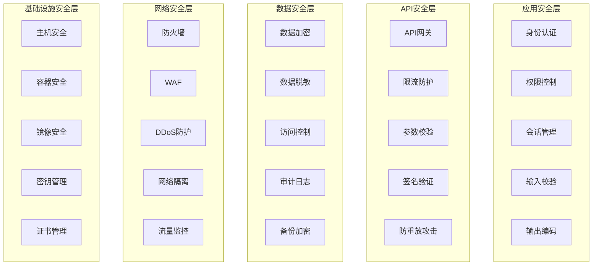

# 🔐 安全架构详细设计
*WeWork Management Platform - Security Architecture Design*

## 📋 安全架构概览

### 🎯 安全目标
- **机密性 (Confidentiality)**: 确保敏感数据不被未授权访问
- **完整性 (Integrity)**: 保证数据在传输和存储过程中的完整性
- **可用性 (Availability)**: 确保系统服务的高可用性
- **可审计性 (Auditability)**: 完整的安全事件记录和追溯
- **合规性 (Compliance)**: 符合国家网络安全法和数据保护法规

### 🏗️ 安全架构分层设计



## 🔑 身份认证与授权设计

### JWT + API Key 双重认证机制

#### JWT认证实现
```java
@Component
public class JwtAuthenticationProvider implements AuthenticationProvider {
    
    private final JwtService jwtService;
    private final UserDetailsService userDetailsService;
    private final RedisTemplate<String, Object> redisTemplate;
    
    @Override
    public Authentication authenticate(Authentication authentication) 
            throws AuthenticationException {
        
        String token = (String) authentication.getCredentials();
        
        try {
            // 1. JWT令牌解析和验证
            Claims claims = jwtService.parseToken(token);
            String userId = claims.getSubject();
            
            // 2. 检查令牌是否在黑名单中
            if (isTokenBlacklisted(token)) {
                throw new JwtTokenExpiredException("Token has been revoked");
            }
            
            // 3. 检查用户状态
            UserDetails userDetails = userDetailsService.loadUserByUsername(userId);
            if (!userDetails.isEnabled()) {
                throw new DisabledException("User account is disabled");
            }
            
            // 4. 检查令牌时效性和刷新
            if (isTokenNearExpiry(claims)) {
                refreshTokenIfNeeded(token, userId);
            }
            
            // 5. 构建认证对象
            Collection<? extends GrantedAuthority> authorities = 
                getAuthoritiesFromClaims(claims);
            
            return new JwtAuthenticationToken(userDetails, token, authorities);
            
        } catch (JwtException e) {
            throw new BadCredentialsException("Invalid JWT token", e);
        }
    }
    
    private boolean isTokenBlacklisted(String token) {
        String tokenHash = DigestUtils.sha256Hex(token);
        return redisTemplate.hasKey("blacklist:token:" + tokenHash);
    }
    
    private void refreshTokenIfNeeded(String token, String userId) {
        // 自动刷新即将过期的令牌
        String newToken = jwtService.generateToken(userId);
        // 通知客户端更新令牌
        eventPublisher.publishEvent(new TokenRefreshEvent(userId, newToken));
    }
}
```

#### API Key认证实现
```java
@Component
public class ApiKeyAuthenticationProvider implements AuthenticationProvider {
    
    private final ApiKeyService apiKeyService;
    private final RateLimitService rateLimitService;
    
    @Override
    public Authentication authenticate(Authentication authentication) 
            throws AuthenticationException {
        
        ApiKeyAuthenticationToken authToken = 
            (ApiKeyAuthenticationToken) authentication;
        
        String keyId = authToken.getKeyId();
        String signature = authToken.getSignature();
        String timestamp = authToken.getTimestamp();
        String requestPath = authToken.getRequestPath();
        String requestBody = authToken.getRequestBody();
        
        try {
            // 1. 获取API Key详情
            ApiKeyDetails apiKeyDetails = apiKeyService.getApiKeyDetails(keyId);
            if (apiKeyDetails == null || !apiKeyDetails.isActive()) {
                throw new BadCredentialsException("Invalid API Key");
            }
            
            // 2. 验证时间戳防重放
            if (isTimestampExpired(timestamp)) {
                throw new BadCredentialsException("Request timestamp expired");
            }
            
            // 3. 验证签名
            String expectedSignature = calculateSignature(
                apiKeyDetails.getSecret(), 
                timestamp, 
                requestPath, 
                requestBody
            );
            
            if (!signature.equals(expectedSignature)) {
                throw new BadCredentialsException("Invalid signature");
            }
            
            // 4. 检查限流
            if (!rateLimitService.tryAcquire(keyId, apiKeyDetails.getRateLimit())) {
                throw new RateLimitExceededException("Rate limit exceeded");
            }
            
            // 5. 检查权限范围
            Collection<? extends GrantedAuthority> authorities = 
                apiKeyDetails.getScopes().stream()
                    .map(scope -> new SimpleGrantedAuthority("SCOPE_" + scope))
                    .collect(Collectors.toList());
            
            return new ApiKeyAuthenticationToken(
                apiKeyDetails, 
                null, 
                authorities
            );
            
        } catch (Exception e) {
            // 记录安全事件
            securityEventPublisher.publishAuthenticationFailure(keyId, e);
            throw new BadCredentialsException("API Key authentication failed", e);
        }
    }
    
    private String calculateSignature(String secret, String timestamp, 
                                    String path, String body) {
        String message = timestamp + "\n" + path + "\n" + body;
        return Hmac.hmacSha256(secret, message);
    }
}
```

### RBAC权限模型设计

#### 权限实体设计
```java
// 用户实体
@Entity
@Table(name = "sys_users")
public class User {
    @Id
    private String userId;
    private String username;
    private String email;
    private UserStatus status;
    private LocalDateTime createdAt;
    private LocalDateTime lastLoginAt;
    
    // 用户角色关联
    @ManyToMany(fetch = FetchType.LAZY)
    @JoinTable(
        name = "user_roles",
        joinColumns = @JoinColumn(name = "user_id"),
        inverseJoinColumns = @JoinColumn(name = "role_id")
    )
    private Set<Role> roles = new HashSet<>();
}

// 角色实体
@Entity
@Table(name = "sys_roles")
public class Role {
    @Id
    private String roleId;
    private String roleName;
    private String roleCode;
    private String description;
    private RoleType roleType;
    private Integer priority;
    
    // 角色权限关联
    @ManyToMany(fetch = FetchType.LAZY)
    @JoinTable(
        name = "role_permissions",
        joinColumns = @JoinColumn(name = "role_id"),
        inverseJoinColumns = @JoinColumn(name = "permission_id")
    )
    private Set<Permission> permissions = new HashSet<>();
}

// 权限实体
@Entity
@Table(name = "sys_permissions")
public class Permission {
    @Id
    private String permissionId;
    private String permissionName;
    private String permissionCode;
    private String resourceType;
    private String operation;
    private String resourcePattern;
    
    // 支持层级权限
    @ManyToOne(fetch = FetchType.LAZY)
    @JoinColumn(name = "parent_id")
    private Permission parent;
    
    @OneToMany(mappedBy = "parent", cascade = CascadeType.ALL)
    private Set<Permission> children = new HashSet<>();
}
```

#### 权限验证实现
```java
@Service
public class PermissionEvaluationService {
    
    private final UserService userService;
    private final RedisTemplate<String, Object> redisTemplate;
    
    @Cacheable(value = "user_permissions", key = "#userId")
    public Set<String> getUserPermissions(String userId) {
        User user = userService.findById(userId);
        Set<String> permissions = new HashSet<>();
        
        // 获取用户所有角色的权限
        for (Role role : user.getRoles()) {
            if (role.isActive()) {
                permissions.addAll(
                    role.getPermissions().stream()
                        .filter(Permission::isActive)
                        .map(Permission::getPermissionCode)
                        .collect(Collectors.toSet())
                );
            }
        }
        
        return permissions;
    }
    
    public boolean hasPermission(String userId, String resource, String operation) {
        Set<String> userPermissions = getUserPermissions(userId);
        
        // 1. 检查直接权限
        String directPermission = resource + ":" + operation;
        if (userPermissions.contains(directPermission)) {
            return true;
        }
        
        // 2. 检查通配符权限
        String wildcardPermission = resource + ":*";
        if (userPermissions.contains(wildcardPermission)) {
            return true;
        }
        
        // 3. 检查全局权限
        if (userPermissions.contains("*:*")) {
            return true;
        }
        
        // 4. 检查模式匹配权限
        return userPermissions.stream()
            .anyMatch(permission -> isPermissionMatched(permission, resource, operation));
    }
    
    private boolean isPermissionMatched(String permission, String resource, String operation) {
        String[] parts = permission.split(":");
        if (parts.length != 2) return false;
        
        String resourcePattern = parts[0];
        String operationPattern = parts[1];
        
        return matchPattern(resourcePattern, resource) && 
               matchPattern(operationPattern, operation);
    }
    
    private boolean matchPattern(String pattern, String value) {
        if ("*".equals(pattern)) return true;
        if (pattern.equals(value)) return true;
        
        // 支持Ant风格通配符
        return AntPathMatcher.match(pattern, value);
    }
}
```

## 🔒 数据安全保护设计

### 数据分类分级策略
```java
public enum DataClassification {
    PUBLIC(0, "公开", "无需特殊保护"),
    INTERNAL(1, "内部", "仅内部人员访问"),
    CONFIDENTIAL(2, "机密", "需要加密存储"),
    TOP_SECRET(3, "绝密", "需要特殊加密和审计");
    
    private final int level;
    private final String name;
    private final String description;
}

@Entity
public class DataSecurityPolicy {
    @Id
    private String policyId;
    
    @Enumerated(EnumType.STRING)
    private DataClassification classification;
    
    private boolean encryptionRequired;
    private String encryptionAlgorithm;
    private boolean auditRequired;
    private boolean maskingRequired;
    private String maskingStrategy;
    private Duration retentionPeriod;
}
```

### 敏感数据加密实现
```java
@Component
public class DataEncryptionService {
    
    private final AESUtil aesUtil;
    private final RSAUtil rsaUtil;
    private final KeyManagementService keyManagementService;
    
    // AES加密敏感数据
    public String encryptSensitiveData(String plainText, DataClassification classification) {
        if (classification.getLevel() < DataClassification.CONFIDENTIAL.getLevel()) {
            return plainText; // 无需加密
        }
        
        try {
            // 获取数据加密密钥
            String dataKey = keyManagementService.getDataEncryptionKey(classification);
            
            // 使用AES-256-GCM加密
            return aesUtil.encryptGCM(plainText, dataKey);
            
        } catch (Exception e) {
            throw new DataEncryptionException("Failed to encrypt sensitive data", e);
        }
    }
    
    public String decryptSensitiveData(String encryptedText, DataClassification classification) {
        if (classification.getLevel() < DataClassification.CONFIDENTIAL.getLevel()) {
            return encryptedText; // 无需解密
        }
        
        try {
            String dataKey = keyManagementService.getDataEncryptionKey(classification);
            return aesUtil.decryptGCM(encryptedText, dataKey);
            
        } catch (Exception e) {
            throw new DataDecryptionException("Failed to decrypt sensitive data", e);
        }
    }
    
    // 字段级加密注解处理
    @EventListener
    public void handleEntityEncryption(PrePersistEvent event) {
        Object entity = event.getEntity();
        encryptEntityFields(entity);
    }
    
    private void encryptEntityFields(Object entity) {
        Field[] fields = entity.getClass().getDeclaredFields();
        
        for (Field field : fields) {
            if (field.isAnnotationPresent(Encrypted.class)) {
                Encrypted annotation = field.getAnnotation(Encrypted.class);
                
                try {
                    field.setAccessible(true);
                    Object value = field.get(entity);
                    
                    if (value instanceof String && !((String) value).isEmpty()) {
                        String encrypted = encryptSensitiveData(
                            (String) value, 
                            annotation.classification()
                        );
                        field.set(entity, encrypted);
                    }
                } catch (Exception e) {
                    log.error("Failed to encrypt field: " + field.getName(), e);
                }
            }
        }
    }
}

// 加密注解
@Target(ElementType.FIELD)
@Retention(RetentionPolicy.RUNTIME)
public @interface Encrypted {
    DataClassification classification() default DataClassification.CONFIDENTIAL;
    String algorithm() default "AES-256-GCM";
}
```

### 数据脱敏策略
```java
@Component
public class DataMaskingService {
    
    public String maskData(String originalData, MaskingStrategy strategy) {
        if (StringUtils.isEmpty(originalData)) {
            return originalData;
        }
        
        return switch (strategy) {
            case PHONE -> maskPhone(originalData);
            case EMAIL -> maskEmail(originalData);
            case ID_CARD -> maskIdCard(originalData);
            case BANK_CARD -> maskBankCard(originalData);
            case NAME -> maskName(originalData);
            case ADDRESS -> maskAddress(originalData);
            default -> originalData;
        };
    }
    
    private String maskPhone(String phone) {
        if (phone.length() < 7) return phone;
        return phone.replaceAll("(\\d{3})\\d{4}(\\d{4})", "$1****$2");
    }
    
    private String maskEmail(String email) {
        int atIndex = email.indexOf('@');
        if (atIndex <= 1) return email;
        
        String username = email.substring(0, atIndex);
        String domain = email.substring(atIndex);
        
        if (username.length() <= 2) {
            return "*" + username.substring(1) + domain;
        } else {
            return username.substring(0, 2) + "***" + domain;
        }
    }
    
    private String maskIdCard(String idCard) {
        if (idCard.length() < 8) return idCard;
        return idCard.replaceAll("(\\d{6})\\d{8}(\\d{4})", "$1********$2");
    }
}

// 脱敏注解
@Target(ElementType.FIELD)
@Retention(RetentionPolicy.RUNTIME)
public @interface Masked {
    MaskingStrategy strategy();
    boolean enabledInProduction() default true;
}
```

## 🌐 API安全防护设计

### API网关安全配置
```java
@Configuration
@EnableWebFluxSecurity
public class ApiGatewaySecurityConfig {
    
    @Bean
    public SecurityWebFilterChain securityWebFilterChain(ServerHttpSecurity http) {
        return http
            // CSRF防护
            .csrf(csrf -> csrf
                .csrfTokenRepository(CookieServerCsrfTokenRepository.withHttpOnlyFalse())
                .requireCsrfProtectionMatcher(exchange -> 
                    !exchange.getRequest().getPath().value().startsWith("/api/public"))
            )
            
            // CORS配置
            .cors(cors -> cors.configurationSource(corsConfigurationSource()))
            
            // 认证配置
            .oauth2ResourceServer(oauth2 -> oauth2
                .jwt(jwt -> jwt.jwtDecoder(jwtDecoder()))
            )
            
            // 授权配置
            .authorizeExchange(exchanges -> exchanges
                .pathMatchers("/api/public/**").permitAll()
                .pathMatchers("/api/v1/accounts/**").hasAnyRole("ADMIN", "ACCOUNT_MANAGER")
                .pathMatchers("/api/v1/messages/**").hasAnyRole("ADMIN", "MESSAGE_MANAGER")
                .anyExchange().authenticated()
            )
            
            // 安全头配置
            .headers(headers -> headers
                .contentSecurityPolicy("default-src 'self'; script-src 'self' 'unsafe-inline'")
                .httpStrictTransportSecurity(hstsSpec -> hstsSpec
                    .maxAgeInSeconds(31536000)
                    .includeSubdomains(true)
                )
            )
            .build();
    }
    
    @Bean
    public CorsConfigurationSource corsConfigurationSource() {
        CorsConfiguration configuration = new CorsConfiguration();
        configuration.setAllowedOriginPatterns(Arrays.asList("https://*.yourdomain.com"));
        configuration.setAllowedMethods(Arrays.asList("GET", "POST", "PUT", "DELETE"));
        configuration.setAllowedHeaders(Arrays.asList("*"));
        configuration.setAllowCredentials(true);
        configuration.setMaxAge(3600L);
        
        UrlBasedCorsConfigurationSource source = new UrlBasedCorsConfigurationSource();
        source.registerCorsConfiguration("/api/**", configuration);
        return source;
    }
}
```

### 参数校验与XSS防护
```java
@ControllerAdvice
public class SecurityValidationAdvice {
    
    private final XSSProtectionService xssProtectionService;
    private final SqlInjectionDetector sqlInjectionDetector;
    
    @EventListener
    public void validateRequestParameters(RequestEvent event) {
        HttpServletRequest request = event.getRequest();
        
        // 1. XSS检测和清理
        cleanXSSFromParameters(request);
        
        // 2. SQL注入检测
        detectSqlInjection(request);
        
        // 3. 路径遍历检测
        detectPathTraversal(request);
        
        // 4. 文件上传安全检查
        if (isFileUploadRequest(request)) {
            validateFileUpload(request);
        }
    }
    
    private void cleanXSSFromParameters(HttpServletRequest request) {
        Map<String, String[]> parameters = request.getParameterMap();
        
        for (Map.Entry<String, String[]> entry : parameters.entrySet()) {
            String[] values = entry.getValue();
            for (int i = 0; i < values.length; i++) {
                String cleaned = xssProtectionService.cleanXSS(values[i]);
                if (!cleaned.equals(values[i])) {
                    // 记录XSS攻击尝试
                    securityEventPublisher.publishXSSAttempt(
                        request.getRemoteAddr(), 
                        entry.getKey(), 
                        values[i]
                    );
                    values[i] = cleaned;
                }
            }
        }
    }
    
    private void detectSqlInjection(HttpServletRequest request) {
        Map<String, String[]> parameters = request.getParameterMap();
        
        for (Map.Entry<String, String[]> entry : parameters.entrySet()) {
            for (String value : entry.getValue()) {
                if (sqlInjectionDetector.isSqlInjection(value)) {
                    securityEventPublisher.publishSqlInjectionAttempt(
                        request.getRemoteAddr(),
                        entry.getKey(),
                        value
                    );
                    throw new SecurityException("Potential SQL injection detected");
                }
            }
        }
    }
}

@Component
public class XSSProtectionService {
    
    private final PolicyFactory policy;
    
    public XSSProtectionService() {
        this.policy = Sanitizers.FORMATTING
            .and(Sanitizers.LINKS)
            .and(Sanitizers.BLOCKS)
            .and(Sanitizers.IMAGES);
    }
    
    public String cleanXSS(String input) {
        if (StringUtils.isEmpty(input)) {
            return input;
        }
        
        // 使用OWASP Java HTML Sanitizer
        return policy.sanitize(input);
    }
    
    public boolean containsXSS(String input) {
        if (StringUtils.isEmpty(input)) {
            return false;
        }
        
        String cleaned = cleanXSS(input);
        return !cleaned.equals(input);
    }
}
```

## 🔍 安全监控与审计

### 安全事件监控系统
```java
@Component
public class SecurityEventMonitor {
    
    private final SecurityEventRepository securityEventRepository;
    private final AlertNotificationService alertNotificationService;
    private final ThreatDetectionEngine threatDetectionEngine;
    
    @EventListener
    @Async
    public void handleSecurityEvent(SecurityEvent event) {
        try {
            // 1. 持久化安全事件
            SecurityEventRecord record = createSecurityEventRecord(event);
            securityEventRepository.save(record);
            
            // 2. 威胁检测分析
            ThreatLevel threatLevel = threatDetectionEngine.analyzeThreat(event);
            
            // 3. 根据威胁等级决定响应措施
            if (threatLevel.isHigh()) {
                // 高威胁：立即告警并可能阻断
                handleHighThreatEvent(event, record);
            } else if (threatLevel.isMedium()) {
                // 中威胁：记录并监控
                handleMediumThreatEvent(event, record);
            }
            
            // 4. 更新用户风险评分
            updateUserRiskScore(event.getUserId(), threatLevel);
            
        } catch (Exception e) {
            log.error("Failed to handle security event", e);
        }
    }
    
    private void handleHighThreatEvent(SecurityEvent event, SecurityEventRecord record) {
        // 发送紧急告警
        AlertMessage alert = AlertMessage.builder()
            .severity(AlertSeverity.CRITICAL)
            .title("高危安全事件检测")
            .message(String.format("检测到高危安全事件: %s", event.getEventType()))
            .source("SecurityMonitor")
            .timestamp(LocalDateTime.now())
            .metadata(Map.of(
                "eventId", record.getEventId(),
                "userId", event.getUserId(),
                "sourceIP", event.getSourceIp(),
                "eventType", event.getEventType().name()
            ))
            .build();
        
        alertNotificationService.sendImmediateAlert(alert);
        
        // 可能的自动响应措施
        if (shouldAutoBlock(event)) {
            securityResponseService.blockIpAddress(event.getSourceIp(), Duration.ofHours(1));
        }
        
        if (shouldLockUser(event)) {
            userSecurityService.lockUser(event.getUserId(), "安全威胁检测");
        }
    }
    
    private SecurityEventRecord createSecurityEventRecord(SecurityEvent event) {
        return SecurityEventRecord.builder()
            .eventId(UUID.randomUUID().toString())
            .eventType(event.getEventType())
            .userId(event.getUserId())
            .sourceIp(event.getSourceIp())
            .userAgent(event.getUserAgent())
            .requestPath(event.getRequestPath())
            .eventDetails(event.getEventDetails())
            .riskScore(event.getRiskScore())
            .timestamp(event.getTimestamp())
            .build();
    }
}

@Entity
@Table(name = "security_events")
public class SecurityEventRecord {
    @Id
    private String eventId;
    
    @Enumerated(EnumType.STRING)
    private SecurityEventType eventType;
    
    private String userId;
    private String sourceIp;
    private String userAgent;
    private String requestPath;
    
    @Column(columnDefinition = "JSON")
    private String eventDetails;
    
    private Integer riskScore;
    private LocalDateTime timestamp;
    
    // 地理位置信息
    private String country;
    private String city;
    private Double latitude;
    private Double longitude;
    
    // 威胁分析结果
    @Enumerated(EnumType.STRING)
    private ThreatLevel threatLevel;
    
    private String threatDescription;
    private Boolean isBlocked;
    private String responseAction;
}
```

### 异常行为检测引擎
```java
@Component
public class ThreatDetectionEngine {
    
    private final UserBehaviorAnalyzer behaviorAnalyzer;
    private final GeolocationService geolocationService;
    private final ThreatIntelligenceService threatIntelligenceService;
    
    public ThreatLevel analyzeThreat(SecurityEvent event) {
        int riskScore = 0;
        List<String> riskFactors = new ArrayList<>();
        
        // 1. 分析用户行为异常
        UserBehaviorProfile profile = behaviorAnalyzer.getUserProfile(event.getUserId());
        if (isAnomalousBehavior(event, profile)) {
            riskScore += 30;
            riskFactors.add("异常用户行为");
        }
        
        // 2. 分析地理位置异常
        GeolocationInfo location = geolocationService.getLocation(event.getSourceIp());
        if (isAnomalousLocation(event.getUserId(), location)) {
            riskScore += 25;
            riskFactors.add("异常地理位置");
        }
        
        // 3. 检查威胁情报
        ThreatIntelligence threat = threatIntelligenceService.checkThreat(event.getSourceIp());
        if (threat.isMalicious()) {
            riskScore += 40;
            riskFactors.add("恶意IP地址");
        }
        
        // 4. 分析时间模式异常
        if (isAnomalousTime(event)) {
            riskScore += 15;
            riskFactors.add("异常访问时间");
        }
        
        // 5. 检查暴力破解模式
        if (isBruteForcePattern(event)) {
            riskScore += 35;
            riskFactors.add("暴力破解攻击");
        }
        
        return ThreatLevel.fromRiskScore(riskScore, riskFactors);
    }
    
    private boolean isAnomalousBehavior(SecurityEvent event, UserBehaviorProfile profile) {
        // 检查访问频率异常
        if (event.getRequestFrequency() > profile.getTypicalFrequency() * 3) {
            return true;
        }
        
        // 检查访问模式异常
        if (!profile.getTypicalPaths().contains(event.getRequestPath()) &&
            event.getEventType() == SecurityEventType.SENSITIVE_OPERATION) {
            return true;
        }
        
        // 检查设备异常
        if (!profile.getKnownDevices().contains(event.getDeviceFingerprint())) {
            return true;
        }
        
        return false;
    }
    
    private boolean isAnomalousLocation(String userId, GeolocationInfo location) {
        // 获取用户历史登录位置
        List<GeolocationInfo> historicalLocations = 
            userLocationService.getHistoricalLocations(userId, Duration.ofDays(30));
        
        // 计算距离最近历史位置的距离
        double minDistance = historicalLocations.stream()
            .mapToDouble(historical -> 
                geolocationService.calculateDistance(historical, location))
            .min()
            .orElse(Double.MAX_VALUE);
        
        // 如果距离超过1000公里且时间间隔小于4小时，认为异常
        return minDistance > 1000 && 
               isRecentLogin(userId, Duration.ofHours(4));
    }
    
    private boolean isBruteForcePattern(SecurityEvent event) {
        if (event.getEventType() != SecurityEventType.AUTHENTICATION_FAILURE) {
            return false;
        }
        
        // 检查同一IP在短时间内的失败尝试次数
        long failureCount = securityEventRepository.countBySourceIpAndEventTypeAndTimestampAfter(
            event.getSourceIp(),
            SecurityEventType.AUTHENTICATION_FAILURE,
            LocalDateTime.now().minusMinutes(15)
        );
        
        return failureCount >= 5;
    }
}
```

### 安全审计日志系统
```java
@Component
public class SecurityAuditLogger {
    
    private final AuditLogRepository auditLogRepository;
    private final LogEncryptionService logEncryptionService;
    
    @EventListener
    @Async
    public void logSecurityEvent(SecurityEvent event) {
        try {
            AuditLogEntry logEntry = createAuditLogEntry(event);
            
            // 敏感信息加密
            if (containsSensitiveData(logEntry)) {
                logEntry = encryptSensitiveFields(logEntry);
            }
            
            // 数字签名防篡改
            logEntry.setSignature(calculateSignature(logEntry));
            
            auditLogRepository.save(logEntry);
            
        } catch (Exception e) {
            // 审计日志失败本身也需要记录
            log.error("Failed to create audit log for security event", e);
            createFailureAuditLog(event, e);
        }
    }
    
    private AuditLogEntry createAuditLogEntry(SecurityEvent event) {
        return AuditLogEntry.builder()
            .logId(UUID.randomUUID().toString())
            .eventType(event.getEventType().name())
            .userId(event.getUserId())
            .sourceIp(event.getSourceIp())
            .userAgent(event.getUserAgent())
            .requestPath(event.getRequestPath())
            .requestMethod(event.getRequestMethod())
            .responseStatus(event.getResponseStatus())
            .eventDetails(objectMapper.writeValueAsString(event.getEventDetails()))
            .timestamp(event.getTimestamp())
            .sessionId(event.getSessionId())
            .build();
    }
    
    private AuditLogEntry encryptSensitiveFields(AuditLogEntry logEntry) {
        // 加密敏感字段
        if (StringUtils.isNotEmpty(logEntry.getEventDetails())) {
            logEntry.setEventDetails(
                logEncryptionService.encrypt(logEntry.getEventDetails())
            );
        }
        
        logEntry.setEncrypted(true);
        return logEntry;
    }
    
    private String calculateSignature(AuditLogEntry logEntry) {
        String message = logEntry.getLogId() + "|" +
                        logEntry.getEventType() + "|" +
                        logEntry.getTimestamp() + "|" +
                        logEntry.getEventDetails();
        
        return logEncryptionService.calculateHMAC(message);
    }
}

@Entity
@Table(name = "audit_logs")
public class AuditLogEntry {
    @Id
    private String logId;
    
    private String eventType;
    private String userId;
    private String sourceIp;
    private String userAgent;
    private String requestPath;
    private String requestMethod;
    private Integer responseStatus;
    
    @Column(columnDefinition = "LONGTEXT")
    private String eventDetails;
    
    private LocalDateTime timestamp;
    private String sessionId;
    
    // 安全相关字段
    private Boolean encrypted = false;
    private String signature;
    private String checksum;
    
    // 索引字段
    @Index
    private String datePartition; // YYYY-MM 格式，用于分区
}
```

## 🛡️ 安全运营管理

### 安全配置管理
```java
@ConfigurationProperties(prefix = "security")
@Data
@Component
public class SecurityConfig {
    
    // JWT配置
    private JwtConfig jwt = new JwtConfig();
    
    // 密码策略配置
    private PasswordPolicy passwordPolicy = new PasswordPolicy();
    
    // 会话配置
    private SessionConfig session = new SessionConfig();
    
    // 限流配置
    private RateLimitConfig rateLimit = new RateLimitConfig();
    
    // 加密配置
    private EncryptionConfig encryption = new EncryptionConfig();
    
    @Data
    public static class JwtConfig {
        private String secretKey;
        private Duration accessTokenExpiry = Duration.ofHours(2);
        private Duration refreshTokenExpiry = Duration.ofDays(7);
        private String issuer = "wework-platform";
        private List<String> allowedAudiences = List.of("web", "mobile", "api");
    }
    
    @Data
    public static class PasswordPolicy {
        private int minLength = 8;
        private int maxLength = 128;
        private boolean requireUppercase = true;
        private boolean requireLowercase = true;
        private boolean requireDigits = true;
        private boolean requireSpecialChars = true;
        private int maxRetries = 5;
        private Duration lockoutDuration = Duration.ofMinutes(15);
        private int passwordHistorySize = 12;
    }
    
    @Data
    public static class SessionConfig {
        private Duration maxInactiveInterval = Duration.ofMinutes(30);
        private int maxConcurrentSessions = 1;
        private boolean invalidateOnMaxSessions = true;
        private boolean trackLastRequest = true;
    }
    
    @Data
    public static class RateLimitConfig {
        private Map<String, RateLimitRule> rules = new HashMap<>();
        
        @PostConstruct
        public void initDefaultRules() {
            rules.put("login", new RateLimitRule(5, Duration.ofMinutes(15)));
            rules.put("api", new RateLimitRule(1000, Duration.ofHours(1)));
            rules.put("sensitive", new RateLimitRule(10, Duration.ofMinutes(5)));
        }
    }
    
    @Data
    public static class EncryptionConfig {
        private String defaultAlgorithm = "AES-256-GCM";
        private String keyDerivationFunction = "PBKDF2WithHmacSHA256";
        private int keyDerivationIterations = 100000;
        private int saltLength = 32;
        private int ivLength = 12;
    }
}
```

### 安全合规检查
```java
@Component
public class SecurityComplianceChecker {
    
    private final SecurityConfig securityConfig;
    private final List<ComplianceRule> complianceRules;
    
    @Scheduled(cron = "0 0 2 * * ?") // 每天凌晨2点执行
    public void performComplianceCheck() {
        ComplianceReport report = new ComplianceReport();
        
        for (ComplianceRule rule : complianceRules) {
            try {
                ComplianceCheckResult result = rule.check();
                report.addResult(result);
                
                if (!result.isCompliant()) {
                    handleNonCompliance(rule, result);
                }
                
            } catch (Exception e) {
                log.error("Compliance check failed for rule: " + rule.getName(), e);
                report.addError(rule.getName(), e.getMessage());
            }
        }
        
        // 生成合规报告
        generateComplianceReport(report);
        
        // 发送给安全团队
        notifySecurityTeam(report);
    }
    
    private void handleNonCompliance(ComplianceRule rule, ComplianceCheckResult result) {
        AlertMessage alert = AlertMessage.builder()
            .severity(AlertSeverity.HIGH)
            .title("安全合规检查失败")
            .message(String.format("合规规则 [%s] 检查失败: %s", 
                    rule.getName(), result.getMessage()))
            .source("ComplianceChecker")
            .timestamp(LocalDateTime.now())
            .metadata(Map.of(
                "rule", rule.getName(),
                "ruleType", rule.getType().name(),
                "details", result.getDetails()
            ))
            .build();
        
        alertNotificationService.sendAlert(alert);
        
        // 自动修复（如果支持）
        if (rule.supportsAutoRemediation()) {
            try {
                rule.autoRemediate(result);
                log.info("Auto-remediated compliance issue for rule: " + rule.getName());
            } catch (Exception e) {
                log.error("Auto-remediation failed for rule: " + rule.getName(), e);
            }
        }
    }
}
```

## 📊 安全指标监控

### 安全KPI定义
```yaml
security_kpis:
  authentication:
    - name: "登录成功率"
      metric: "login_success_rate"
      target: "> 95%"
      alert_threshold: "< 90%"
    
    - name: "平均登录时间"
      metric: "avg_login_time"
      target: "< 2s"
      alert_threshold: "> 5s"
  
  authorization:
    - name: "权限检查成功率"
      metric: "authz_success_rate"
      target: "> 99%"
      alert_threshold: "< 95%"
  
  data_protection:
    - name: "数据加密覆盖率"
      metric: "encryption_coverage"
      target: "> 95%"
      alert_threshold: "< 90%"
  
  incident_response:
    - name: "安全事件响应时间"
      metric: "incident_response_time"
      target: "< 30min"
      alert_threshold: "> 60min"
    
    - name: "高危告警处理率"
      metric: "critical_alert_resolution_rate"
      target: "> 95%"
      alert_threshold: "< 85%"
```

## 🎯 安全设计总结

### 核心安全特性
1. **多层防护**: 从网络到应用的全方位安全防护
2. **零信任架构**: 不信任任何请求，全面验证
3. **实时监控**: 24/7安全事件监控和响应
4. **数据保护**: 端到端的数据加密和脱敏
5. **合规管理**: 符合国家法规和行业标准

### 安全技术栈
- **认证授权**: JWT + OAuth2.0 + RBAC
- **数据加密**: AES-256-GCM + RSA-4096
- **API安全**: Spring Security + API Gateway
- **监控告警**: ELK Stack + 自研安全监控
- **威胁检测**: 机器学习 + 规则引擎

### 安全运营能力
- **自动化响应**: 智能威胁检测和自动阻断
- **合规检查**: 定期安全合规性检查
- **事件追溯**: 完整的安全审计链路
- **风险评估**: 实时用户和系统风险评分
- **应急响应**: 完善的安全事件响应流程
