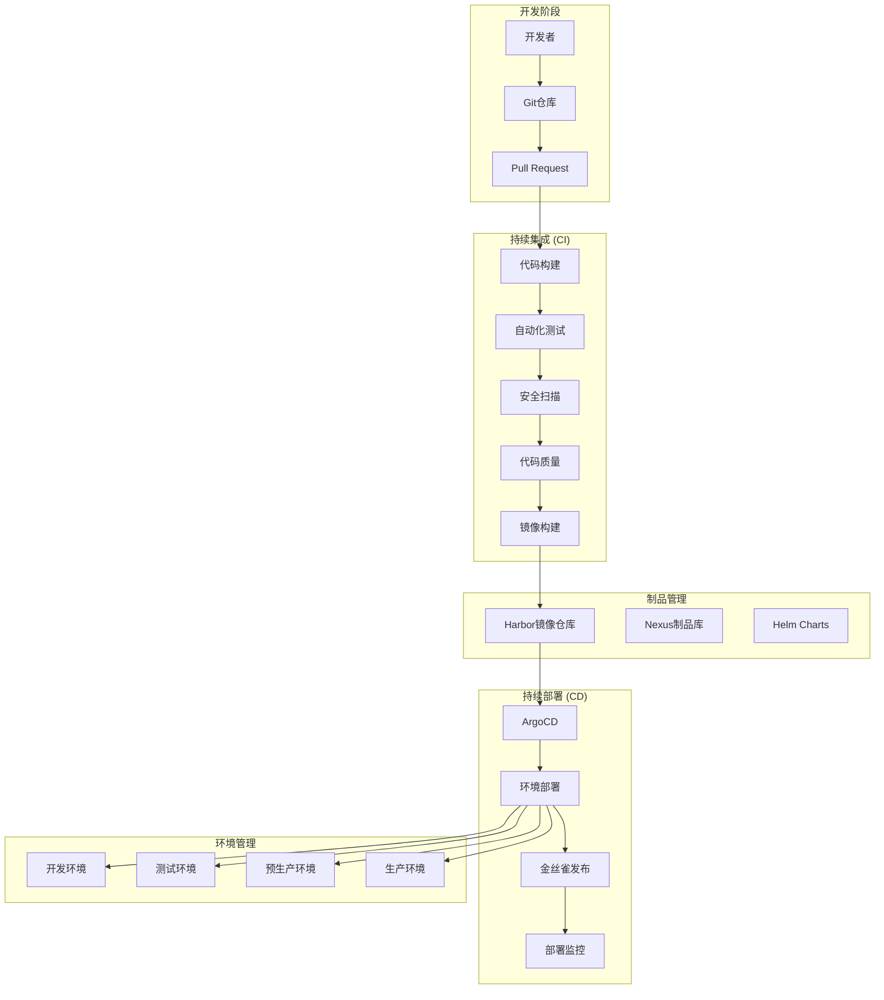

# 🔄 CI/CD流水线详细设计
*WeWork Management Platform - CI/CD Pipeline Design*

## 📋 CI/CD流水线概览

### 🎯 CI/CD目标
- **快速迭代**: 代码提交到生产部署 < 30分钟
- **质量保证**: 自动化测试覆盖率 > 80%
- **安全合规**: 全流程安全扫描和合规检查
- **零停机部署**: 蓝绿部署和灰度发布
- **快速回滚**: 故障回滚时间 < 2分钟

### 🏗️ CI/CD架构设计



## 🔨 持续集成(CI)流水线设计

### GitHub Actions CI配置
```yaml
# .github/workflows/ci.yml
name: CI Pipeline

on:
  push:
    branches: [ main, develop, feature/* ]
  pull_request:
    branches: [ main, develop ]

env:
  REGISTRY: harbor.company.com
  IMAGE_NAME: wework/wework-api
  JAVA_VERSION: '17'

jobs:
  # 代码质量检查
  code-quality:
    name: Code Quality Check
    runs-on: ubuntu-latest
    steps:
    - name: Checkout code
      uses: actions/checkout@v4
      with:
        fetch-depth: 0
    
    - name: Setup Java
      uses: actions/setup-java@v3
      with:
        java-version: ${{ env.JAVA_VERSION }}
        distribution: 'temurin'
    
    - name: Cache Maven dependencies
      uses: actions/cache@v3
      with:
        path: ~/.m2
        key: ${{ runner.os }}-m2-${{ hashFiles('**/pom.xml') }}
        restore-keys: ${{ runner.os }}-m2
    
    # 代码格式检查
    - name: Check code format
      run: ./mvnw spring-javaformat:validate
    
    # PMD静态代码分析
    - name: PMD analysis
      run: ./mvnw pmd:check
    
    # SpotBugs静态分析
    - name: SpotBugs analysis
      run: ./mvnw spotbugs:check
    
    # 依赖漏洞检查
    - name: OWASP dependency check
      run: ./mvnw org.owasp:dependency-check-maven:check
    
    # SonarQube代码质量分析
    - name: SonarQube analysis
      env:
        GITHUB_TOKEN: ${{ secrets.GITHUB_TOKEN }}
        SONAR_TOKEN: ${{ secrets.SONAR_TOKEN }}
      run: |
        ./mvnw clean verify sonar:sonar \
          -Dsonar.projectKey=wework-platform \
          -Dsonar.host.url=${{ secrets.SONAR_HOST_URL }} \
          -Dsonar.login=${{ secrets.SONAR_TOKEN }}

  # 单元测试和集成测试
  test:
    name: Test Suite
    runs-on: ubuntu-latest
    services:
      mysql:
        image: mysql:8.0
        env:
          MYSQL_ROOT_PASSWORD: testpass
          MYSQL_DATABASE: wework_test
        ports:
          - 3306:3306
        options: >-
          --health-cmd="mysqladmin ping"
          --health-interval=10s
          --health-timeout=5s
          --health-retries=3
      
      redis:
        image: redis:7-alpine
        ports:
          - 6379:6379
        options: >-
          --health-cmd="redis-cli ping"
          --health-interval=10s
          --health-timeout=5s
          --health-retries=3
    
    steps:
    - name: Checkout code
      uses: actions/checkout@v4
    
    - name: Setup Java
      uses: actions/setup-java@v3
      with:
        java-version: ${{ env.JAVA_VERSION }}
        distribution: 'temurin'
    
    - name: Cache Maven dependencies
      uses: actions/cache@v3
      with:
        path: ~/.m2
        key: ${{ runner.os }}-m2-${{ hashFiles('**/pom.xml') }}
        restore-keys: ${{ runner.os }}-m2
    
    # 单元测试
    - name: Run unit tests
      run: ./mvnw test -Dspring.profiles.active=test
    
    # 集成测试
    - name: Run integration tests
      run: ./mvnw integration-test -Dspring.profiles.active=test
      env:
        SPRING_DATASOURCE_URL: jdbc:mysql://localhost:3306/wework_test
        SPRING_DATASOURCE_USERNAME: root
        SPRING_DATASOURCE_PASSWORD: testpass
        SPRING_REDIS_HOST: localhost
        SPRING_REDIS_PORT: 6379
    
    # 测试覆盖率报告
    - name: Generate test coverage report
      run: ./mvnw jacoco:report
    
    # 上传覆盖率到Codecov
    - name: Upload coverage to Codecov
      uses: codecov/codecov-action@v3
      with:
        file: ./target/site/jacoco/jacoco.xml
        flags: unittests
        name: codecov-umbrella
    
    # 上传测试结果
    - name: Publish test results
      uses: dorny/test-reporter@v1
      if: success() || failure()
      with:
        name: Maven Tests
        path: target/surefire-reports/*.xml
        reporter: java-junit

  # 安全扫描
  security-scan:
    name: Security Scan
    runs-on: ubuntu-latest
    steps:
    - name: Checkout code
      uses: actions/checkout@v4
    
    - name: Setup Java
      uses: actions/setup-java@v3
      with:
        java-version: ${{ env.JAVA_VERSION }}
        distribution: 'temurin'
    
    # 密钥泄露扫描
    - name: Secret scan
      uses: trufflesecurity/trufflehog@main
      with:
        path: ./
        base: main
        head: HEAD
    
    # 容器镜像安全扫描
    - name: Build temp image for scanning
      run: |
        ./mvnw clean package -DskipTests
        docker build -t temp-scan-image .
    
    - name: Container security scan
      uses: aquasecurity/trivy-action@master
      with:
        image-ref: 'temp-scan-image'
        format: 'sarif'
        output: 'trivy-results.sarif'
    
    - name: Upload Trivy scan results
      uses: github/codeql-action/upload-sarif@v2
      with:
        sarif_file: 'trivy-results.sarif'
    
    # SAST代码安全扫描
    - name: Initialize CodeQL
      uses: github/codeql-action/init@v2
      with:
        languages: java
    
    - name: Autobuild
      uses: github/codeql-action/autobuild@v2
    
    - name: Perform CodeQL Analysis
      uses: github/codeql-action/analyze@v2

  # 构建和推送镜像
  build-and-push:
    name: Build and Push Image
    runs-on: ubuntu-latest
    needs: [code-quality, test, security-scan]
    if: github.ref == 'refs/heads/main' || github.ref == 'refs/heads/develop'
    
    steps:
    - name: Checkout code
      uses: actions/checkout@v4
    
    - name: Setup Java
      uses: actions/setup-java@v3
      with:
        java-version: ${{ env.JAVA_VERSION }}
        distribution: 'temurin'
    
    - name: Cache Maven dependencies
      uses: actions/cache@v3
      with:
        path: ~/.m2
        key: ${{ runner.os }}-m2-${{ hashFiles('**/pom.xml') }}
        restore-keys: ${{ runner.os }}-m2
    
    # 构建应用
    - name: Build application
      run: ./mvnw clean package -DskipTests
    
    # 设置Docker Buildx
    - name: Set up Docker Buildx
      uses: docker/setup-buildx-action@v3
    
    # 登录Harbor
    - name: Login to Harbor
      uses: docker/login-action@v3
      with:
        registry: ${{ env.REGISTRY }}
        username: ${{ secrets.HARBOR_USERNAME }}
        password: ${{ secrets.HARBOR_PASSWORD }}
    
    # 生成镜像标签
    - name: Generate image tags
      id: meta
      uses: docker/metadata-action@v5
      with:
        images: ${{ env.REGISTRY }}/${{ env.IMAGE_NAME }}
        tags: |
          type=ref,event=branch
          type=ref,event=pr
          type=sha,prefix={{branch}}-
          type=raw,value=latest,enable={{is_default_branch}}
    
    # 构建和推送镜像
    - name: Build and push image
      uses: docker/build-push-action@v5
      with:
        context: .
        push: true
        tags: ${{ steps.meta.outputs.tags }}
        labels: ${{ steps.meta.outputs.labels }}
        cache-from: type=gha
        cache-to: type=gha,mode=max
        platforms: linux/amd64,linux/arm64
    
    # 镜像安全扫描
    - name: Scan pushed image
      uses: aquasecurity/trivy-action@master
      with:
        image-ref: ${{ env.REGISTRY }}/${{ env.IMAGE_NAME }}:${{ github.sha }}
        format: 'table'
        exit-code: '1'
        ignore-unfixed: true
        vuln-type: 'os,library'
        severity: 'CRITICAL,HIGH'
    
    # 更新GitOps仓库
    - name: Update GitOps repository
      if: github.ref == 'refs/heads/main'
      run: |
        git clone https://${{ secrets.GITOPS_TOKEN }}@github.com/company/wework-gitops.git
        cd wework-gitops
        
        # 更新镜像标签
        sed -i "s|image: .*wework-api:.*|image: ${{ env.REGISTRY }}/${{ env.IMAGE_NAME }}:${{ github.sha }}|g" \
          environments/staging/kustomization.yaml
        
        git config user.name "GitHub Actions"
        git config user.email "actions@github.com"
        git add .
        git commit -m "Update wework-api image to ${{ github.sha }}"
        git push origin main
```

### Jenkins Pipeline配置
```groovy
// Jenkinsfile
pipeline {
    agent {
        kubernetes {
            yaml """
                apiVersion: v1
                kind: Pod
                spec:
                  containers:
                  - name: maven
                    image: maven:3.9-openjdk-17
                    command:
                    - cat
                    tty: true
                    volumeMounts:
                    - mountPath: /root/.m2
                      name: m2-cache
                  - name: docker
                    image: docker:24-dind
                    securityContext:
                      privileged: true
                    volumeMounts:
                    - mountPath: /var/run/docker.sock
                      name: docker-sock
                  - name: kubectl
                    image: bitnami/kubectl:latest
                    command:
                    - cat
                    tty: true
                  volumes:
                  - name: m2-cache
                    persistentVolumeClaim:
                      claimName: maven-cache
                  - name: docker-sock
                    hostPath:
                      path: /var/run/docker.sock
            """
        }
    }
    
    environment {
        REGISTRY = 'harbor.company.com'
        IMAGE_NAME = 'wework/wework-api'
        HARBOR_CREDENTIALS = credentials('harbor-credentials')
        SONAR_TOKEN = credentials('sonar-token')
        GITOPS_TOKEN = credentials('gitops-token')
    }
    
    stages {
        stage('Checkout') {
            steps {
                checkout scm
                script {
                    env.GIT_COMMIT_SHORT = sh(
                        script: 'git rev-parse --short HEAD',
                        returnStdout: true
                    ).trim()
                    env.BUILD_VERSION = "${env.BRANCH_NAME}-${env.GIT_COMMIT_SHORT}-${env.BUILD_NUMBER}"
                }
            }
        }
        
        stage('Code Quality') {
            parallel {
                stage('Unit Tests') {
                    steps {
                        container('maven') {
                            sh '''
                                mvn clean test \
                                    -Dspring.profiles.active=test \
                                    -Dmaven.test.failure.ignore=true
                            '''
                            
                            publishTestResults(
                                testResultsPattern: 'target/surefire-reports/*.xml'
                            )
                            
                            publishCoverage(
                                adapters: [
                                    jacocoAdapter('target/site/jacoco/jacoco.xml')
                                ],
                                sourceFileResolver: sourceFiles('STORE_LAST_BUILD')
                            )
                        }
                    }
                }
                
                stage('Static Analysis') {
                    steps {
                        container('maven') {
                            // PMD分析
                            sh 'mvn pmd:check'
                            
                            // SpotBugs分析
                            sh 'mvn spotbugs:check'
                            
                            // OWASP依赖检查
                            sh 'mvn org.owasp:dependency-check-maven:check'
                            
                            // SonarQube分析
                            sh """
                                mvn sonar:sonar \\
                                    -Dsonar.projectKey=wework-platform \\
                                    -Dsonar.host.url=${SONAR_HOST_URL} \\
                                    -Dsonar.login=${SONAR_TOKEN}
                            """
                        }
                    }
                    post {
                        always {
                            recordIssues(
                                enabledForFailure: true,
                                tools: [
                                    pmdParser(pattern: 'target/pmd.xml'),
                                    spotBugs(pattern: 'target/spotbugsXml.xml')
                                ]
                            )
                        }
                    }
                }
            }
        }
        
        stage('Security Scan') {
            steps {
                // 密钥扫描
                sh 'trufflehog filesystem . --json > trufflehog-results.json || true'
                
                // 容器安全扫描
                container('docker') {
                    sh '''
                        mvn clean package -DskipTests
                        docker build -t temp-scan:${BUILD_VERSION} .
                        trivy image --format json --output trivy-results.json temp-scan:${BUILD_VERSION}
                    '''
                }
            }
            post {
                always {
                    archiveArtifacts artifacts: '*-results.json', allowEmptyArchive: true
                }
            }
        }
        
        stage('Build Image') {
            when {
                anyOf {
                    branch 'main'
                    branch 'develop'
                    changeRequest()
                }
            }
            steps {
                container('maven') {
                    sh 'mvn clean package -DskipTests'
                }
                
                container('docker') {
                    script {
                        def imageTag = "${env.REGISTRY}/${env.IMAGE_NAME}:${env.BUILD_VERSION}"
                        
                        sh """
                            echo '${HARBOR_CREDENTIALS_PSW}' | docker login ${REGISTRY} -u '${HARBOR_CREDENTIALS_USR}' --password-stdin
                            
                            docker build \\
                                --label "git.commit=${env.GIT_COMMIT}" \\
                                --label "git.branch=${env.BRANCH_NAME}" \\
                                --label "build.number=${env.BUILD_NUMBER}" \\
                                -t ${imageTag} .
                            
                            docker push ${imageTag}
                        """
                        
                        // 如果是主分支，也推送latest标签
                        if (env.BRANCH_NAME == 'main') {
                            def latestTag = "${env.REGISTRY}/${env.IMAGE_NAME}:latest"
                            sh """
                                docker tag ${imageTag} ${latestTag}
                                docker push ${latestTag}
                            """
                        }
                        
                        env.DOCKER_IMAGE = imageTag
                    }
                }
            }
        }
        
        stage('Deploy to Dev') {
            when {
                anyOf {
                    branch 'develop'
                    changeRequest()
                }
            }
            steps {
                container('kubectl') {
                    sh '''
                        # 更新开发环境部署
                        kubectl set image deployment/wework-api \\
                            wework-api=${DOCKER_IMAGE} \\
                            -n wework-dev
                        
                        # 等待部署完成
                        kubectl rollout status deployment/wework-api -n wework-dev --timeout=300s
                        
                        # 运行烟雾测试
                        kubectl run smoke-test-${BUILD_NUMBER} \\
                            --image=curlimages/curl:latest \\
                            --rm -i --restart=Never \\
                            -n wework-dev \\
                            -- curl -f http://wework-api-service/actuator/health
                    '''
                }
            }
        }
        
        stage('Integration Tests') {
            when {
                anyOf {
                    branch 'develop'
                    changeRequest()
                }
            }
            steps {
                container('maven') {
                    sh '''
                        # 运行集成测试
                        mvn integration-test \\
                            -Dspring.profiles.active=integration \\
                            -Dtest.environment.url=http://wework-api-service.wework-dev
                    '''
                }
            }
            post {
                always {
                    publishTestResults(
                        testResultsPattern: 'target/failsafe-reports/*.xml'
                    )
                }
            }
        }
        
        stage('Update GitOps') {
            when {
                branch 'main'
            }
            steps {
                script {
                    sh """
                        git clone https://${GITOPS_TOKEN}@github.com/company/wework-gitops.git
                        cd wework-gitops
                        
                        # 更新预生产环境镜像
                        sed -i 's|image: .*wework-api:.*|image: ${DOCKER_IMAGE}|g' \\
                            environments/staging/kustomization.yaml
                        
                        git config user.name "Jenkins"
                        git config user.email "jenkins@company.com"
                        git add .
                        git commit -m "Update wework-api image to ${BUILD_VERSION} [skip ci]"
                        git push origin main
                    """
                }
            }
        }
    }
    
    post {
        always {
            container('docker') {
                sh 'docker system prune -af || true'
            }
        }
        success {
            script {
                if (env.BRANCH_NAME == 'main') {
                    slackSend(
                        channel: '#deployment',
                        color: 'good',
                        message: """
                            ✅ *Deployment Successful*
                            • *Project*: WeWork Platform
                            • *Version*: ${env.BUILD_VERSION}
                            • *Image*: ${env.DOCKER_IMAGE}
                            • *Branch*: ${env.BRANCH_NAME}
                            • *Commit*: ${env.GIT_COMMIT_SHORT}
                        """
                    )
                }
            }
        }
        failure {
            slackSend(
                channel: '#alerts',
                color: 'danger',
                message: """
                    ❌ *Build Failed*
                    • *Project*: WeWork Platform
                    • *Branch*: ${env.BRANCH_NAME}
                    • *Build*: ${env.BUILD_NUMBER}
                    • *Stage*: ${env.STAGE_NAME}
                    • <${env.BUILD_URL}|View Build>
                """
            )
        }
    }
}
```

## 🚀 持续部署(CD)流水线设计

### ArgoCD应用配置
```yaml
# argocd/applications/wework-api-staging.yaml
apiVersion: argoproj.io/v1alpha1
kind: Application
metadata:
  name: wework-api-staging
  namespace: argocd
  labels:
    app: wework-api
    environment: staging
spec:
  project: wework-platform
  
  source:
    repoURL: https://github.com/company/wework-gitops.git
    targetRevision: main
    path: environments/staging
  
  destination:
    server: https://kubernetes.default.svc
    namespace: wework-staging
  
  syncPolicy:
    automated:
      prune: true
      selfHeal: true
      allowEmpty: false
    syncOptions:
    - CreateNamespace=true
    - PrunePropagationPolicy=background
    - PruneLast=true
    retry:
      limit: 5
      backoff:
        duration: 5s
        factor: 2
        maxDuration: 3m
  
  revisionHistoryLimit: 10
  
  ignoreDifferences:
  - group: apps
    kind: Deployment
    jsonPointers:
    - /spec/replicas

---
# argocd/applications/wework-api-prod.yaml
apiVersion: argoproj.io/v1alpha1
kind: Application
metadata:
  name: wework-api-prod
  namespace: argocd
  labels:
    app: wework-api
    environment: production
spec:
  project: wework-platform
  
  source:
    repoURL: https://github.com/company/wework-gitops.git
    targetRevision: main
    path: environments/prod
  
  destination:
    server: https://kubernetes.default.svc
    namespace: wework-platform
  
  syncPolicy:
    syncOptions:
    - CreateNamespace=true
    - PrunePropagationPolicy=background
    retry:
      limit: 3
      backoff:
        duration: 5s
        factor: 2
        maxDuration: 2m
  
  revisionHistoryLimit: 10

---
# argocd/projects/wework-platform.yaml
apiVersion: argoproj.io/v1alpha1
kind: AppProject
metadata:
  name: wework-platform
  namespace: argocd
spec:
  description: WeWork Platform Project
  
  sourceRepos:
  - 'https://github.com/company/wework-gitops.git'
  - 'https://charts.bitnami.com/bitnami'
  
  destinations:
  - namespace: 'wework-*'
    server: https://kubernetes.default.svc
  
  clusterResourceWhitelist:
  - group: ''
    kind: Namespace
  - group: 'networking.k8s.io'
    kind: NetworkPolicy
  
  namespaceResourceWhitelist:
  - group: ''
    kind: ConfigMap
  - group: ''
    kind: Secret
  - group: ''
    kind: Service
  - group: 'apps'
    kind: Deployment
  - group: 'apps'
    kind: ReplicaSet
  - group: 'networking.k8s.io'
    kind: Ingress
  - group: 'autoscaling'
    kind: HorizontalPodAutoscaler
  
  roles:
  - name: developer
    description: Developer access
    policies:
    - p, proj:wework-platform:developer, applications, get, wework-platform/*, allow
    - p, proj:wework-platform:developer, applications, sync, wework-platform/*-staging, allow
    groups:
    - company:developers
  
  - name: admin
    description: Admin access
    policies:
    - p, proj:wework-platform:admin, applications, *, wework-platform/*, allow
    groups:
    - company:platform-admin
```

### GitOps仓库结构
```bash
wework-gitops/
├── applications/
│   ├── wework-api-staging.yaml
│   ├── wework-api-prod.yaml
│   └── monitoring.yaml
├── base/
│   ├── kustomization.yaml
│   ├── deployment.yaml
│   ├── service.yaml
│   ├── configmap.yaml
│   └── secret.yaml
├── environments/
│   ├── dev/
│   │   ├── kustomization.yaml
│   │   ├── patches/
│   │   └── values/
│   ├── staging/
│   │   ├── kustomization.yaml
│   │   ├── patches/
│   │   ├── values/
│   │   └── hpa.yaml
│   └── prod/
│       ├── kustomization.yaml
│       ├── patches/
│       ├── values/
│       ├── hpa.yaml
│       ├── pdb.yaml
│       └── networkpolicy.yaml
├── charts/
│   └── wework-api/
│       ├── Chart.yaml
│       ├── values.yaml
│       └── templates/
└── scripts/
    ├── promote.sh
    └── rollback.sh
```

### 环境升级脚本
```bash
#!/bin/bash
# scripts/promote.sh - 环境升级脚本

set -e

ENVIRONMENT=$1
IMAGE_TAG=$2
DRY_RUN=${3:-false}

if [ -z "$ENVIRONMENT" ] || [ -z "$IMAGE_TAG" ]; then
    echo "Usage: $0 <environment> <image_tag> [dry_run]"
    echo "Example: $0 prod v1.2.3"
    exit 1
fi

# 验证环境
case $ENVIRONMENT in
    staging|prod)
        ;;
    *)
        echo "Error: Invalid environment. Must be 'staging' or 'prod'"
        exit 1
        ;;
esac

echo "🚀 Promoting image $IMAGE_TAG to $ENVIRONMENT environment"

# 备份当前配置
git pull origin main
cp environments/$ENVIRONMENT/kustomization.yaml environments/$ENVIRONMENT/kustomization.yaml.backup

# 更新镜像标签
sed -i "s|newTag: .*|newTag: $IMAGE_TAG|g" environments/$ENVIRONMENT/kustomization.yaml

# 验证变更
echo "📋 Changes to be applied:"
git diff environments/$ENVIRONMENT/kustomization.yaml

if [ "$DRY_RUN" = "true" ]; then
    echo "🔍 Dry run mode - no changes will be committed"
    git checkout environments/$ENVIRONMENT/kustomization.yaml
    exit 0
fi

# 提交变更
git add environments/$ENVIRONMENT/kustomization.yaml
git commit -m "Promote wework-api to $IMAGE_TAG in $ENVIRONMENT

Promoted by: $(git config user.name)
Environment: $ENVIRONMENT
Image: harbor.company.com/wework/wework-api:$IMAGE_TAG
Timestamp: $(date -u '+%Y-%m-%d %H:%M:%S UTC')"

git push origin main

echo "✅ Successfully promoted to $ENVIRONMENT"
echo "🔍 Monitor deployment: kubectl get pods -n wework-$ENVIRONMENT -w"

# 如果是生产环境，发送通知
if [ "$ENVIRONMENT" = "prod" ]; then
    curl -X POST "$SLACK_WEBHOOK_URL" \
        -H 'Content-type: application/json' \
        --data "{
            \"text\": \"🚀 *Production Deployment Started*\",
            \"attachments\": [{
                \"color\": \"warning\",
                \"fields\": [
                    {\"title\": \"Image\", \"value\": \"$IMAGE_TAG\", \"short\": true},
                    {\"title\": \"Environment\", \"value\": \"$ENVIRONMENT\", \"short\": true},
                    {\"title\": \"Deployed by\", \"value\": \"$(git config user.name)\", \"short\": true}
                ]
            }]
        }"
fi
```

### 回滚脚本
```bash
#!/bin/bash
# scripts/rollback.sh - 回滚脚本

set -e

ENVIRONMENT=$1
TARGET_VERSION=$2

if [ -z "$ENVIRONMENT" ]; then
    echo "Usage: $0 <environment> [target_version]"
    echo "Example: $0 prod v1.2.2"
    exit 1
fi

echo "🔄 Rolling back $ENVIRONMENT environment"

# 如果没有指定目标版本，回滚到上一个版本
if [ -z "$TARGET_VERSION" ]; then
    echo "📜 Finding previous version..."
    TARGET_VERSION=$(git log --oneline -n 10 --grep="Promote.*$ENVIRONMENT" -- environments/$ENVIRONMENT/kustomization.yaml | \
        sed -n '2p' | \
        grep -o 'v[0-9]\+\.[0-9]\+\.[0-9]\+' | \
        head -1)
    
    if [ -z "$TARGET_VERSION" ]; then
        echo "❌ Could not find previous version to rollback to"
        exit 1
    fi
    
    echo "🎯 Target version: $TARGET_VERSION"
fi

# 确认回滚
read -p "⚠️  Are you sure you want to rollback $ENVIRONMENT to $TARGET_VERSION? (yes/no): " CONFIRM
if [ "$CONFIRM" != "yes" ]; then
    echo "❌ Rollback cancelled"
    exit 1
fi

# 执行回滚
git pull origin main

# 更新镜像标签
sed -i "s|newTag: .*|newTag: $TARGET_VERSION|g" environments/$ENVIRONMENT/kustomization.yaml

# 提交回滚
git add environments/$ENVIRONMENT/kustomization.yaml
git commit -m "Rollback wework-api to $TARGET_VERSION in $ENVIRONMENT

Rolled back by: $(git config user.name)
Environment: $ENVIRONMENT
Target version: $TARGET_VERSION
Timestamp: $(date -u '+%Y-%m-%d %H:%M:%S UTC')
Reason: Manual rollback"

git push origin main

echo "✅ Rollback initiated"
echo "🔍 Monitor rollback: kubectl get pods -n wework-$ENVIRONMENT -w"

# 发送通知
curl -X POST "$SLACK_WEBHOOK_URL" \
    -H 'Content-type: application/json' \
    --data "{
        \"text\": \"🔄 *Rollback Initiated*\",
        \"attachments\": [{
            \"color\": \"danger\",
            \"fields\": [
                {\"title\": \"Environment\", \"value\": \"$ENVIRONMENT\", \"short\": true},
                {\"title\": \"Target Version\", \"value\": \"$TARGET_VERSION\", \"short\": true},
                {\"title\": \"Initiated by\", \"value\": \"$(git config user.name)\", \"short\": true}
            ]
        }]
    }"
```

## 🧪 自动化测试策略

### 测试金字塔实现
```yaml
# docker-compose.test.yml - 集成测试环境
version: '3.8'
services:
  app:
    build: .
    environment:
      - SPRING_PROFILES_ACTIVE=test
      - SPRING_DATASOURCE_URL=jdbc:mysql://mysql:3306/wework_test
      - SPRING_DATASOURCE_USERNAME=test
      - SPRING_DATASOURCE_PASSWORD=testpass
      - SPRING_REDIS_HOST=redis
    depends_on:
      mysql:
        condition: service_healthy
      redis:
        condition: service_healthy
    networks:
      - test-network
  
  mysql:
    image: mysql:8.0
    environment:
      MYSQL_ROOT_PASSWORD: rootpass
      MYSQL_DATABASE: wework_test
      MYSQL_USER: test
      MYSQL_PASSWORD: testpass
    healthcheck:
      test: ["CMD", "mysqladmin", "ping", "-h", "localhost"]
      timeout: 5s
      retries: 10
    networks:
      - test-network
  
  redis:
    image: redis:7-alpine
    healthcheck:
      test: ["CMD", "redis-cli", "ping"]
      timeout: 3s
      retries: 10
    networks:
      - test-network
  
  # API测试
  api-tests:
    image: postman/newman:alpine
    command: >
      run /tests/postman_collection.json
      --environment /tests/test_environment.json
      --reporters cli,json
      --reporter-json-export /results/newman-results.json
    volumes:
      - ./tests/postman:/tests
      - ./test-results:/results
    depends_on:
      - app
    networks:
      - test-network
  
  # 性能测试
  performance-tests:
    image: loadimpact/k6:latest
    command: run /tests/load-test.js
    volumes:
      - ./tests/k6:/tests
      - ./test-results:/results
    depends_on:
      - app
    networks:
      - test-network

networks:
  test-network:
    driver: bridge
```

### K6性能测试脚本
```javascript
// tests/k6/load-test.js
import http from 'k6/http';
import { check, sleep } from 'k6';
import { Rate } from 'k6/metrics';

// 自定义指标
const errorRate = new Rate('errors');

export const options = {
  stages: [
    { duration: '5m', target: 100 },   // 5分钟内逐步增加到100个用户
    { duration: '10m', target: 100 },  // 保持100个用户10分钟
    { duration: '5m', target: 200 },   // 5分钟内增加到200个用户
    { duration: '10m', target: 200 },  // 保持200个用户10分钟
    { duration: '5m', target: 0 },     // 5分钟内逐步减少到0
  ],
  thresholds: {
    http_req_duration: ['p(95)<500'],  // 95%的请求响应时间小于500ms
    http_req_failed: ['rate<0.01'],    // 错误率小于1%
    errors: ['rate<0.01'],             // 自定义错误率小于1%
  },
};

const BASE_URL = 'http://app:8080';

// 测试数据
const testData = {
  users: [
    { username: 'test1', password: 'password123' },
    { username: 'test2', password: 'password123' },
    { username: 'test3', password: 'password123' },
  ],
};

export function setup() {
  // 设置测试数据
  console.log('Setting up test data...');
  return testData;
}

export default function(data) {
  const user = data.users[Math.floor(Math.random() * data.users.length)];
  
  // 测试场景1：用户登录
  let loginResponse = http.post(`${BASE_URL}/api/v1/auth/login`, {
    username: user.username,
    password: user.password,
  }, {
    headers: { 'Content-Type': 'application/json' },
  });
  
  const loginSuccess = check(loginResponse, {
    'login status is 200': (r) => r.status === 200,
    'login response time < 500ms': (r) => r.timings.duration < 500,
    'has access token': (r) => r.json('accessToken') !== undefined,
  });
  
  errorRate.add(!loginSuccess);
  
  if (loginSuccess) {
    const token = loginResponse.json('accessToken');
    const headers = {
      'Authorization': `Bearer ${token}`,
      'Content-Type': 'application/json',
    };
    
    // 测试场景2：获取用户信息
    let profileResponse = http.get(`${BASE_URL}/api/v1/users/profile`, { headers });
    
    check(profileResponse, {
      'profile status is 200': (r) => r.status === 200,
      'profile response time < 300ms': (r) => r.timings.duration < 300,
    });
    
    // 测试场景3：发送消息
    let messageResponse = http.post(`${BASE_URL}/api/v1/messages`, {
      content: `Test message ${Date.now()}`,
      targetUser: 'test-recipient',
    }, { headers });
    
    check(messageResponse, {
      'message status is 201': (r) => r.status === 201,
      'message response time < 1000ms': (r) => r.timings.duration < 1000,
    });
    
    // 测试场景4：查询消息历史
    let historyResponse = http.get(`${BASE_URL}/api/v1/messages?page=0&size=20`, { headers });
    
    check(historyResponse, {
      'history status is 200': (r) => r.status === 200,
      'history response time < 800ms': (r) => r.timings.duration < 800,
      'has messages array': (r) => Array.isArray(r.json('content')),
    });
  }
  
  sleep(1); // 暂停1秒
}

export function teardown(data) {
  console.log('Cleaning up test data...');
}
```

### Postman API测试集合
```json
{
  "info": {
    "name": "WeWork API Tests",
    "schema": "https://schema.getpostman.com/json/collection/v2.1.0/collection.json"
  },
  "item": [
    {
      "name": "Health Check",
      "event": [
        {
          "listen": "test",
          "script": {
            "exec": [
              "pm.test('Status code is 200', function () {",
              "    pm.response.to.have.status(200);",
              "});",
              "",
              "pm.test('Response time is less than 200ms', function () {",
              "    pm.expect(pm.response.responseTime).to.be.below(200);",
              "});",
              "",
              "pm.test('Health status is UP', function () {",
              "    const response = pm.response.json();",
              "    pm.expect(response.status).to.eql('UP');",
              "});"
            ]
          }
        }
      ],
      "request": {
        "method": "GET",
        "header": [],
        "url": {
          "raw": "{{baseUrl}}/actuator/health",
          "host": ["{{baseUrl}}"],
          "path": ["actuator", "health"]
        }
      }
    },
    {
      "name": "User Login",
      "event": [
        {
          "listen": "test",
          "script": {
            "exec": [
              "pm.test('Status code is 200', function () {",
              "    pm.response.to.have.status(200);",
              "});",
              "",
              "pm.test('Response contains access token', function () {",
              "    const response = pm.response.json();",
              "    pm.expect(response).to.have.property('accessToken');",
              "    pm.globals.set('accessToken', response.accessToken);",
              "});",
              "",
              "pm.test('Token is valid JWT', function () {",
              "    const response = pm.response.json();",
              "    const token = response.accessToken;",
              "    pm.expect(token.split('.')).to.have.lengthOf(3);",
              "});"
            ]
          }
        }
      ],
      "request": {
        "method": "POST",
        "header": [
          {
            "key": "Content-Type",
            "value": "application/json"
          }
        ],
        "body": {
          "mode": "raw",
          "raw": "{\n  \"username\": \"{{testUsername}}\",\n  \"password\": \"{{testPassword}}\"\n}"
        },
        "url": {
          "raw": "{{baseUrl}}/api/v1/auth/login",
          "host": ["{{baseUrl}}"],
          "path": ["api", "v1", "auth", "login"]
        }
      }
    },
    {
      "name": "Send Message",
      "event": [
        {
          "listen": "prerequest",
          "script": {
            "exec": [
              "const token = pm.globals.get('accessToken');",
              "pm.request.headers.add({",
              "    key: 'Authorization',",
              "    value: `Bearer ${token}`",
              "});"
            ]
          }
        },
        {
          "listen": "test",
          "script": {
            "exec": [
              "pm.test('Status code is 201', function () {",
              "    pm.response.to.have.status(201);",
              "});",
              "",
              "pm.test('Response contains message ID', function () {",
              "    const response = pm.response.json();",
              "    pm.expect(response).to.have.property('messageId');",
              "    pm.globals.set('lastMessageId', response.messageId);",
              "});",
              "",
              "pm.test('Response time is acceptable', function () {",
              "    pm.expect(pm.response.responseTime).to.be.below(2000);",
              "});"
            ]
          }
        }
      ],
      "request": {
        "method": "POST",
        "header": [
          {
            "key": "Content-Type",
            "value": "application/json"
          }
        ],
        "body": {
          "mode": "raw",
          "raw": "{\n  \"content\": \"Test message from Postman\",\n  \"targetUser\": \"test-recipient\",\n  \"messageType\": \"TEXT\"\n}"
        },
        "url": {
          "raw": "{{baseUrl}}/api/v1/messages",
          "host": ["{{baseUrl}}"],
          "path": ["api", "v1", "messages"]
        }
      }
    }
  ],
  "variable": [
    {
      "key": "baseUrl",
      "value": "http://app:8080"
    },
    {
      "key": "testUsername",
      "value": "testuser"
    },
    {
      "key": "testPassword",
      "value": "testpass123"
    }
  ]
}
```

## 📊 质量门控和合规检查

### SonarQube质量门控配置
```yaml
# sonar-project.properties
sonar.projectKey=wework-platform
sonar.projectName=WeWork Platform
sonar.projectVersion=1.0.0

# 源码路径
sonar.sources=src/main/java
sonar.tests=src/test/java
sonar.java.binaries=target/classes
sonar.java.test.binaries=target/test-classes

# 排除文件
sonar.exclusions=**/generated/**,**/target/**,**/*.min.js

# 代码覆盖率
sonar.coverage.jacoco.xmlReportPaths=target/site/jacoco/jacoco.xml
sonar.junit.reportPaths=target/surefire-reports

# 质量门控
sonar.qualitygate.wait=true

# 重复代码检测
sonar.cpd.java.minimumtokens=100

# 认知复杂度
sonar.java.cognitive.complexity=15
```

### 自定义质量门控脚本
```bash
#!/bin/bash
# scripts/quality-gate.sh

set -e

SONAR_PROJECT_KEY="wework-platform"
SONAR_HOST_URL=$1
SONAR_TOKEN=$2

if [ -z "$SONAR_HOST_URL" ] || [ -z "$SONAR_TOKEN" ]; then
    echo "Usage: $0 <sonar_host_url> <sonar_token>"
    exit 1
fi

echo "🔍 Checking SonarQube quality gate..."

# 获取项目分析状态
TASK_URL=$(curl -s -u $SONAR_TOKEN: \
    "$SONAR_HOST_URL/api/ce/component?component=$SONAR_PROJECT_KEY" | \
    jq -r '.current.analysisId')

if [ "$TASK_URL" = "null" ]; then
    echo "❌ No analysis found for project $SONAR_PROJECT_KEY"
    exit 1
fi

# 等待分析完成
echo "⏳ Waiting for analysis to complete..."
while true; do
    STATUS=$(curl -s -u $SONAR_TOKEN: \
        "$SONAR_HOST_URL/api/ce/task?id=$TASK_URL" | \
        jq -r '.task.status')
    
    case $STATUS in
        "SUCCESS")
            echo "✅ Analysis completed successfully"
            break
            ;;
        "FAILED"|"CANCELED")
            echo "❌ Analysis failed with status: $STATUS"
            exit 1
            ;;
        "PENDING"|"IN_PROGRESS")
            echo "⏳ Analysis in progress..."
            sleep 10
            ;;
        *)
            echo "❓ Unknown status: $STATUS"
            sleep 10
            ;;
    esac
done

# 检查质量门控状态
echo "🚦 Checking quality gate status..."
QG_STATUS=$(curl -s -u $SONAR_TOKEN: \
    "$SONAR_HOST_URL/api/qualitygates/project_status?projectKey=$SONAR_PROJECT_KEY" | \
    jq -r '.projectStatus.status')

echo "Quality gate status: $QG_STATUS"

case $QG_STATUS in
    "OK")
        echo "✅ Quality gate passed!"
        ;;
    "ERROR")
        echo "❌ Quality gate failed!"
        
        # 获取失败原因
        curl -s -u $SONAR_TOKEN: \
            "$SONAR_HOST_URL/api/qualitygates/project_status?projectKey=$SONAR_PROJECT_KEY" | \
            jq -r '.projectStatus.conditions[] | select(.status=="ERROR") | "- \(.metricKey): \(.actualValue) (threshold: \(.errorThreshold))"'
        
        exit 1
        ;;
    "WARN")
        echo "⚠️ Quality gate passed with warnings"
        ;;
    *)
        echo "❓ Unknown quality gate status: $QG_STATUS"
        exit 1
        ;;
esac

# 获取关键指标
echo "📊 Quality metrics:"
curl -s -u $SONAR_TOKEN: \
    "$SONAR_HOST_URL/api/measures/component?component=$SONAR_PROJECT_KEY&metricKeys=coverage,duplicated_lines_density,code_smells,bugs,vulnerabilities,security_hotspots" | \
    jq -r '.component.measures[] | "- \(.metric): \(.value)"'

echo "🎉 Quality gate check completed successfully!"
```

## 🔔 监控和通知集成

### Slack通知集成
```yaml
# .github/workflows/notifications.yml
name: Notifications

on:
  workflow_run:
    workflows: ["CI Pipeline"]
    types:
      - completed

jobs:
  notify:
    runs-on: ubuntu-latest
    if: ${{ github.event.workflow_run.conclusion != 'skipped' }}
    
    steps:
    - name: Get workflow info
      id: workflow
      run: |
        echo "status=${{ github.event.workflow_run.conclusion }}" >> $GITHUB_OUTPUT
        echo "run_url=${{ github.event.workflow_run.html_url }}" >> $GITHUB_OUTPUT
        echo "branch=${{ github.event.workflow_run.head_branch }}" >> $GITHUB_OUTPUT
        echo "commit=$(echo '${{ github.event.workflow_run.head_sha }}' | cut -c1-7)" >> $GITHUB_OUTPUT
    
    - name: Notify success
      if: ${{ github.event.workflow_run.conclusion == 'success' }}
      uses: 8398a7/action-slack@v3
      with:
        status: ${{ job.status }}
        channel: '#deployments'
        username: 'GitHub Actions'
        icon_emoji: ':rocket:'
        fields: repo,message,commit,author,action,eventName,ref,workflow
        custom_payload: |
          {
            "attachments": [{
              "color": "good",
              "title": "🚀 Deployment Successful",
              "fields": [
                {
                  "title": "Repository",
                  "value": "${{ github.repository }}",
                  "short": true
                },
                {
                  "title": "Branch",
                  "value": "${{ steps.workflow.outputs.branch }}",
                  "short": true
                },
                {
                  "title": "Commit",
                  "value": "${{ steps.workflow.outputs.commit }}",
                  "short": true
                },
                {
                  "title": "Workflow",
                  "value": "<${{ steps.workflow.outputs.run_url }}|View Details>",
                  "short": true
                }
              ]
            }]
          }
      env:
        SLACK_WEBHOOK_URL: ${{ secrets.SLACK_WEBHOOK_URL }}
    
    - name: Notify failure
      if: ${{ github.event.workflow_run.conclusion == 'failure' }}
      uses: 8398a7/action-slack@v3
      with:
        status: failure
        channel: '#alerts'
        username: 'GitHub Actions'
        icon_emoji: ':warning:'
        custom_payload: |
          {
            "attachments": [{
              "color": "danger",
              "title": "❌ Build Failed",
              "fields": [
                {
                  "title": "Repository",
                  "value": "${{ github.repository }}",
                  "short": true
                },
                {
                  "title": "Branch",
                  "value": "${{ steps.workflow.outputs.branch }}",
                  "short": true
                },
                {
                  "title": "Commit",
                  "value": "${{ steps.workflow.outputs.commit }}",
                  "short": true
                },
                {
                  "title": "Workflow",
                  "value": "<${{ steps.workflow.outputs.run_url }}|View Details>",
                  "short": true
                }
              ]
            }]
          }
      env:
        SLACK_WEBHOOK_URL: ${{ secrets.SLACK_WEBHOOK_URL }}
```

### 部署状态监控
```bash
#!/bin/bash
# scripts/deployment-monitor.sh

set -e

NAMESPACE=$1
DEPLOYMENT=$2
TIMEOUT=${3:-300}
SLACK_WEBHOOK_URL=$4

if [ -z "$NAMESPACE" ] || [ -z "$DEPLOYMENT" ]; then
    echo "Usage: $0 <namespace> <deployment> [timeout] [slack_webhook]"
    exit 1
fi

echo "🔍 Monitoring deployment: $DEPLOYMENT in namespace: $NAMESPACE"

# 等待部署完成
echo "⏳ Waiting for deployment to complete (timeout: ${TIMEOUT}s)..."
if kubectl rollout status deployment/$DEPLOYMENT -n $NAMESPACE --timeout=${TIMEOUT}s; then
    echo "✅ Deployment completed successfully"
    DEPLOY_STATUS="success"
else
    echo "❌ Deployment failed or timed out"
    DEPLOY_STATUS="failed"
fi

# 获取部署详情
REPLICAS=$(kubectl get deployment $DEPLOYMENT -n $NAMESPACE -o jsonpath='{.status.replicas}')
READY_REPLICAS=$(kubectl get deployment $DEPLOYMENT -n $NAMESPACE -o jsonpath='{.status.readyReplicas}')
IMAGE=$(kubectl get deployment $DEPLOYMENT -n $NAMESPACE -o jsonpath='{.spec.template.spec.containers[0].image}')

echo "📊 Deployment Status:"
echo "  - Total Replicas: $REPLICAS"
echo "  - Ready Replicas: $READY_REPLICAS"
echo "  - Image: $IMAGE"

# 健康检查
echo "🏥 Performing health check..."
SERVICE_NAME="${DEPLOYMENT}-service"
if kubectl get service $SERVICE_NAME -n $NAMESPACE > /dev/null 2>&1; then
    # 创建临时Pod进行健康检查
    kubectl run health-check-$(date +%s) \
        --image=curlimages/curl:latest \
        --rm -i --restart=Never \
        -n $NAMESPACE \
        -- curl -f http://$SERVICE_NAME/actuator/health
    
    if [ $? -eq 0 ]; then
        echo "✅ Health check passed"
        HEALTH_STATUS="healthy"
    else
        echo "❌ Health check failed"
        HEALTH_STATUS="unhealthy"
        DEPLOY_STATUS="failed"
    fi
else
    echo "⚠️ Service not found, skipping health check"
    HEALTH_STATUS="unknown"
fi

# 发送Slack通知
if [ -n "$SLACK_WEBHOOK_URL" ]; then
    if [ "$DEPLOY_STATUS" = "success" ] && [ "$HEALTH_STATUS" = "healthy" ]; then
        COLOR="good"
        EMOJI="🚀"
        TITLE="Deployment Successful"
    else
        COLOR="danger"
        EMOJI="❌"
        TITLE="Deployment Failed"
    fi
    
    curl -X POST "$SLACK_WEBHOOK_URL" \
        -H 'Content-type: application/json' \
        --data "{
            \"text\": \"$EMOJI *$TITLE*\",
            \"attachments\": [{
                \"color\": \"$COLOR\",
                \"fields\": [
                    {\"title\": \"Namespace\", \"value\": \"$NAMESPACE\", \"short\": true},
                    {\"title\": \"Deployment\", \"value\": \"$DEPLOYMENT\", \"short\": true},
                    {\"title\": \"Replicas\", \"value\": \"$READY_REPLICAS/$REPLICAS\", \"short\": true},
                    {\"title\": \"Health\", \"value\": \"$HEALTH_STATUS\", \"short\": true},
                    {\"title\": \"Image\", \"value\": \"$IMAGE\", \"short\": false}
                ]
            }]
        }"
fi

# 退出码
if [ "$DEPLOY_STATUS" = "success" ] && [ "$HEALTH_STATUS" = "healthy" ]; then
    exit 0
else
    exit 1
fi
```

## 🎯 CI/CD流水线总结

### 核心流水线特性
1. **持续集成**: 代码质量检查、自动化测试、安全扫描
2. **持续部署**: GitOps工作流、多环境管理、蓝绿部署
3. **质量保证**: 测试金字塔、性能测试、质量门控
4. **安全合规**: 密钥扫描、容器扫描、SAST/DAST
5. **监控通知**: 实时状态监控、多渠道通知、审计日志
6. **自动化运维**: 一键部署、自动回滚、环境升级

### 流水线指标
- **构建时间**: < 15分钟
- **部署时间**: < 5分钟
- **测试覆盖率**: > 80%
- **安全扫描**: 0容忍高危漏洞
- **回滚时间**: < 2分钟
- **成功率**: > 95%

### 技术栈
- **CI平台**: GitHub Actions、Jenkins
- **CD工具**: ArgoCD、Argo Rollouts
- **质量检查**: SonarQube、CodeQL、Trivy
- **测试工具**: JUnit、Postman、K6
- **监控通知**: Slack、Email、Webhook
- **制品管理**: Harbor、Nexus、Helm
