# 🚀 部署架构详细设计
*WeWork Management Platform - Deployment Architecture Design*

## 📋 部署架构概览

### 🎯 部署目标
- **云原生架构**: 基于容器和Kubernetes的现代化部署
- **多环境支持**: 开发、测试、预生产、生产环境隔离
- **高可用部署**: 99.9%+ 可用性保障
- **自动化运维**: 一键部署、自动扩缩容、故障自愈
- **安全合规**: 企业级安全和合规要求

### 🏗️ 部署架构设计

```mermaid
graph TB
    subgraph "外部流量"
        ELB[外部负载均衡器]
        CDN[CDN加速]
        DNS[智能DNS]
    end
    
    subgraph "Kubernetes集群"
        subgraph "Ingress层"
            IG1[Nginx Ingress]
            IG2[Istio Gateway]
        end
        
        subgraph "应用层"
            API1[API服务Pod]
            API2[API服务Pod]
            API3[API服务Pod]
            WEB1[Web服务Pod]
            WEB2[Web服务Pod]
        end
        
        subgraph "中间件层"
            REDIS1[Redis集群]
            MQ1[RabbitMQ集群]
            ES1[Elasticsearch集群]
        end
        
        subgraph "数据层"
            DB1[MySQL主库]
            DB2[MySQL从库]
            MINIO1[MinIO对象存储]
        end
        
        subgraph "监控层"
            PROM[Prometheus]
            GRAF[Grafana]
            ALERT[AlertManager]
            JAEGER[Jaeger追踪]
        end
    end
    
    subgraph "基础设施"
        HARBOR[Harbor镜像仓库]
        NEXUS[Nexus制品库]
        VAULT[HashiCorp Vault]
    end
    
    DNS --> ELB
    CDN --> ELB
    ELB --> IG1
    IG1 --> API1
    IG1 --> WEB1
    API1 --> REDIS1
    API1 --> DB1
    PROM --> API1
```



## 🐳 容器化架构设计

### Docker镜像构建策略
```dockerfile
# 多阶段构建优化镜像大小
FROM eclipse-temurin:17-jdk-alpine AS builder

WORKDIR /app

# 复制依赖文件
COPY pom.xml .
COPY .mvn .mvn
COPY mvnw .

# 下载依赖（利用Docker缓存）
RUN ./mvnw dependency:go-offline -B

# 复制源码并构建
COPY src src
RUN ./mvnw clean package -DskipTests -B

# 运行时镜像
FROM eclipse-temurin:17-jre-alpine

# 安全配置
RUN addgroup -g 1001 appgroup && \
    adduser -u 1001 -G appgroup -s /bin/sh -D appuser

# 安装必要工具
RUN apk add --no-cache curl

WORKDIR /app

# 复制应用文件
COPY --from=builder /app/target/*.jar app.jar

# 创建日志目录
RUN mkdir -p /app/logs && \
    chown -R appuser:appgroup /app

# 切换到非root用户
USER appuser

# 健康检查
HEALTHCHECK --interval=30s --timeout=10s --start-period=5s --retries=3 \
    CMD curl -f http://localhost:8080/actuator/health || exit 1

# JVM优化参数
ENV JAVA_OPTS="-server \
    -XX:+UseG1GC \
    -XX:MaxGCPauseMillis=100 \
    -XX:+UseContainerSupport \
    -XX:MaxRAMPercentage=75.0 \
    -Djava.security.egd=file:/dev/./urandom \
    -Dspring.profiles.active=prod"

EXPOSE 8080

ENTRYPOINT ["sh", "-c", "java $JAVA_OPTS -jar app.jar"]
```

### 镜像分层优化
```dockerfile
# .dockerignore 文件
.git
.gitignore
README.md
Dockerfile*
docker-compose*
.dockerignore
node_modules
npm-debug.log
.nyc_output
.vscode
.idea
*.swp
*.swo
*~

# 基础镜像优化
FROM eclipse-temurin:17-jre-alpine AS base

# 安装基础依赖
RUN apk add --no-cache \
    curl \
    bash \
    tzdata \
    fontconfig \
    ttf-dejavu

# 设置时区
RUN cp /usr/share/zoneinfo/Asia/Shanghai /etc/localtime && \
    echo "Asia/Shanghai" > /etc/timezone

# 应用镜像
FROM base AS app

WORKDIR /app

# 创建应用用户
RUN addgroup -g 1001 spring && \
    adduser -u 1001 -G spring -s /bin/sh -D spring

# 复制应用
ARG JAR_FILE=target/*.jar
COPY ${JAR_FILE} app.jar

# 设置权限
RUN chown spring:spring app.jar

USER spring:spring

# 启动脚本
COPY --chown=spring:spring docker-entrypoint.sh /usr/local/bin/
RUN chmod +x /usr/local/bin/docker-entrypoint.sh

ENTRYPOINT ["docker-entrypoint.sh"]
```

### 应用启动脚本
```bash
#!/bin/bash
# docker-entrypoint.sh

set -e

# 默认JVM参数
DEFAULT_JVM_OPTS="-server -XX:+UseG1GC -XX:MaxGCPauseMillis=100"

# 容器内存限制感知
if [ -n "$MEMORY_LIMIT" ]; then
    # 根据容器内存限制设置堆内存
    HEAP_SIZE=$(echo "$MEMORY_LIMIT * 0.75" | bc)
    JVM_OPTS="$JVM_OPTS -Xmx${HEAP_SIZE}m"
fi

# 环境特定配置
case "$SPRING_PROFILES_ACTIVE" in
    "dev")
        JVM_OPTS="$JVM_OPTS -Xdebug -Xrunjdwp:transport=dt_socket,server=y,suspend=n,address=*:5005"
        ;;
    "prod")
        JVM_OPTS="$JVM_OPTS -XX:+HeapDumpOnOutOfMemoryError -XX:HeapDumpPath=/app/logs/"
        ;;
esac

# 合并所有JVM参数
FINAL_JVM_OPTS="$DEFAULT_JVM_OPTS $JVM_OPTS $JAVA_OPTS"

echo "Starting application with JVM options: $FINAL_JVM_OPTS"
echo "Active profiles: $SPRING_PROFILES_ACTIVE"

# 启动应用
exec java $FINAL_JVM_OPTS -jar app.jar "$@"
```

## ☸️ Kubernetes部署配置

### 命名空间和资源配额
```yaml
# namespace.yaml
apiVersion: v1
kind: Namespace
metadata:
  name: wework-platform
  labels:
    name: wework-platform
    environment: production

---
# 资源配额
apiVersion: v1
kind: ResourceQuota
metadata:
  name: wework-platform-quota
  namespace: wework-platform
spec:
  hard:
    requests.cpu: "20"
    requests.memory: 40Gi
    limits.cpu: "40"
    limits.memory: 80Gi
    persistentvolumeclaims: "20"
    pods: "50"
    services: "20"
    secrets: "30"
    configmaps: "30"

---
# 限制范围
apiVersion: v1
kind: LimitRange
metadata:
  name: wework-platform-limits
  namespace: wework-platform
spec:
  limits:
  - type: Container
    default:
      cpu: 500m
      memory: 1Gi
    defaultRequest:
      cpu: 100m
      memory: 256Mi
    max:
      cpu: 4
      memory: 8Gi
    min:
      cpu: 50m
      memory: 128Mi
  - type: PersistentVolumeClaim
    max:
      storage: 100Gi
    min:
      storage: 1Gi
```

### 应用部署配置
```yaml
# wework-api-deployment.yaml
apiVersion: apps/v1
kind: Deployment
metadata:
  name: wework-api
  namespace: wework-platform
  labels:
    app: wework-api
    version: v1
    component: backend
spec:
  replicas: 3
  strategy:
    type: RollingUpdate
    rollingUpdate:
      maxSurge: 1
      maxUnavailable: 0
  selector:
    matchLabels:
      app: wework-api
  template:
    metadata:
      labels:
        app: wework-api
        version: v1
        component: backend
      annotations:
        prometheus.io/scrape: "true"
        prometheus.io/port: "8080"
        prometheus.io/path: "/actuator/prometheus"
    spec:
      # 反亲和性配置
      affinity:
        podAntiAffinity:
          preferredDuringSchedulingIgnoredDuringExecution:
          - weight: 100
            podAffinityTerm:
              labelSelector:
                matchExpressions:
                - key: app
                  operator: In
                  values:
                  - wework-api
              topologyKey: kubernetes.io/hostname
      
      # 服务账户
      serviceAccountName: wework-api-sa
      
      # 安全上下文
      securityContext:
        runAsNonRoot: true
        runAsUser: 1001
        runAsGroup: 1001
        fsGroup: 1001
      
      # 初始化容器
      initContainers:
      - name: wait-for-db
        image: busybox:1.35
        command: ['sh', '-c']
        args:
        - |
          until nc -z mysql-service 3306; do
            echo "Waiting for MySQL..."
            sleep 2
          done
          echo "MySQL is ready!"
      
      containers:
      - name: wework-api
        image: harbor.company.com/wework/wework-api:v1.0.0
        imagePullPolicy: IfNotPresent
        
        ports:
        - name: http
          containerPort: 8080
          protocol: TCP
        - name: management
          containerPort: 8081
          protocol: TCP
        
        # 环境变量
        env:
        - name: SPRING_PROFILES_ACTIVE
          value: "prod"
        - name: JAVA_OPTS
          value: "-XX:+UseContainerSupport -XX:MaxRAMPercentage=75.0"
        - name: TZ
          value: "Asia/Shanghai"
        
        # 环境变量从ConfigMap和Secret获取
        envFrom:
        - configMapRef:
            name: wework-api-config
        - secretRef:
            name: wework-api-secrets
        
        # 资源限制
        resources:
          requests:
            memory: "1Gi"
            cpu: "500m"
          limits:
            memory: "2Gi"
            cpu: "1"
        
        # 健康检查
        livenessProbe:
          httpGet:
            path: /actuator/health/liveness
            port: management
          initialDelaySeconds: 60
          periodSeconds: 30
          timeoutSeconds: 10
          failureThreshold: 3
        
        readinessProbe:
          httpGet:
            path: /actuator/health/readiness
            port: management
          initialDelaySeconds: 30
          periodSeconds: 10
          timeoutSeconds: 5
          failureThreshold: 3
        
        startupProbe:
          httpGet:
            path: /actuator/health
            port: management
          initialDelaySeconds: 30
          periodSeconds: 10
          timeoutSeconds: 5
          failureThreshold: 12
        
        # 卷挂载
        volumeMounts:
        - name: logs
          mountPath: /app/logs
        - name: config
          mountPath: /app/config
          readOnly: true
        - name: secrets
          mountPath: /app/secrets
          readOnly: true
        
        # 安全上下文
        securityContext:
          allowPrivilegeEscalation: false
          readOnlyRootFilesystem: true
          capabilities:
            drop:
            - ALL
      
      # 卷定义
      volumes:
      - name: logs
        emptyDir: {}
      - name: config
        configMap:
          name: wework-api-config
      - name: secrets
        secret:
          secretName: wework-api-secrets
          defaultMode: 0400
      
      # 镜像拉取密钥
      imagePullSecrets:
      - name: harbor-secret
      
      # DNS配置
      dnsPolicy: ClusterFirst
      
      # 重启策略
      restartPolicy: Always
      
      # 终止宽限期
      terminationGracePeriodSeconds: 30

---
# 服务配置
apiVersion: v1
kind: Service
metadata:
  name: wework-api-service
  namespace: wework-platform
  labels:
    app: wework-api
    component: backend
spec:
  type: ClusterIP
  ports:
  - name: http
    port: 80
    targetPort: 8080
    protocol: TCP
  - name: management
    port: 8081
    targetPort: 8081
    protocol: TCP
  selector:
    app: wework-api

---
# 服务账户
apiVersion: v1
kind: ServiceAccount
metadata:
  name: wework-api-sa
  namespace: wework-platform
  labels:
    app: wework-api

---
# ConfigMap配置
apiVersion: v1
kind: ConfigMap
metadata:
  name: wework-api-config
  namespace: wework-platform
data:
  application.yml: |
    server:
      port: 8080
      shutdown: graceful
    
    management:
      server:
        port: 8081
      endpoints:
        web:
          exposure:
            include: health,info,metrics,prometheus
      endpoint:
        health:
          show-details: always
          probes:
            enabled: true
    
    spring:
      application:
        name: wework-api
      
      datasource:
        url: jdbc:mysql://mysql-service:3306/wework?useSSL=false&serverTimezone=Asia/Shanghai
        username: ${DB_USERNAME}
        password: ${DB_PASSWORD}
        hikari:
          maximum-pool-size: 20
          minimum-idle: 5
          connection-timeout: 30000
          idle-timeout: 600000
          max-lifetime: 1800000
      
      redis:
        host: redis-service
        port: 6379
        password: ${REDIS_PASSWORD}
        timeout: 3000ms
        jedis:
          pool:
            max-active: 50
            max-idle: 20
            min-idle: 5
            max-wait: 3000ms
    
    logging:
      level:
        com.wework: INFO
        org.springframework.web: DEBUG
      pattern:
        console: "%d{yyyy-MM-dd HH:mm:ss} [%thread] %-5level %logger{36} - %msg%n"
        file: "%d{yyyy-MM-dd HH:mm:ss} [%thread] %-5level %logger{36} - %msg%n"
      file:
        name: /app/logs/application.log
        max-size: 100MB
        max-history: 30

---
# Secret配置
apiVersion: v1
kind: Secret
metadata:
  name: wework-api-secrets
  namespace: wework-platform
type: Opaque
data:
  DB_USERNAME: d2V3b3Jr  # base64 encoded
  DB_PASSWORD: cGFzc3dvcmQ=  # base64 encoded
  REDIS_PASSWORD: cmVkaXNwYXNz  # base64 encoded
  JWT_SECRET: and0LXNlY3JldC1rZXk=  # base64 encoded
```

### Ingress网关配置
```yaml
# ingress.yaml
apiVersion: networking.k8s.io/v1
kind: Ingress
metadata:
  name: wework-platform-ingress
  namespace: wework-platform
  annotations:
    nginx.ingress.kubernetes.io/rewrite-target: /
    nginx.ingress.kubernetes.io/ssl-redirect: "true"
    nginx.ingress.kubernetes.io/force-ssl-redirect: "true"
    nginx.ingress.kubernetes.io/proxy-body-size: "50m"
    nginx.ingress.kubernetes.io/proxy-connect-timeout: "60"
    nginx.ingress.kubernetes.io/proxy-send-timeout: "60"
    nginx.ingress.kubernetes.io/proxy-read-timeout: "60"
    nginx.ingress.kubernetes.io/rate-limit: "100"
    nginx.ingress.kubernetes.io/rate-limit-window: "1m"
    cert-manager.io/cluster-issuer: "letsencrypt-prod"
spec:
  ingressClassName: nginx
  tls:
  - hosts:
    - api.wework.company.com
    secretName: wework-api-tls
  rules:
  - host: api.wework.company.com
    http:
      paths:
      - path: /
        pathType: Prefix
        backend:
          service:
            name: wework-api-service
            port:
              number: 80

---
# Istio Gateway配置
apiVersion: networking.istio.io/v1beta1
kind: Gateway
metadata:
  name: wework-platform-gateway
  namespace: wework-platform
spec:
  selector:
    istio: ingressgateway
  servers:
  - port:
      number: 443
      name: https
      protocol: HTTPS
    tls:
      mode: SIMPLE
      credentialName: wework-api-tls
    hosts:
    - api.wework.company.com
  - port:
      number: 80
      name: http
      protocol: HTTP
    hosts:
    - api.wework.company.com
    tls:
      httpsRedirect: true

---
# Istio VirtualService配置
apiVersion: networking.istio.io/v1beta1
kind: VirtualService
metadata:
  name: wework-platform-vs
  namespace: wework-platform
spec:
  hosts:
  - api.wework.company.com
  gateways:
  - wework-platform-gateway
  http:
  - match:
    - uri:
        prefix: /api/v1/health
    route:
    - destination:
        host: wework-api-service
        port:
          number: 8081
  - match:
    - uri:
        prefix: /api/
    route:
    - destination:
        host: wework-api-service
        port:
          number: 80
    timeout: 30s
    retries:
      attempts: 3
      perTryTimeout: 10s
      retryOn: 5xx,reset,connect-failure,refused-stream
  - match:
    - uri:
        prefix: /
    redirect:
      uri: /api/v1/docs
```

## 🌈 多环境部署策略

### 环境配置管理
```yaml
# environments/dev/kustomization.yaml
apiVersion: kustomize.config.k8s.io/v1beta1
kind: Kustomization

namespace: wework-dev

resources:
- ../../base

patches:
- patch: |-
    - op: replace
      path: /spec/replicas
      value: 1
  target:
    kind: Deployment
    name: wework-api

- patch: |-
    - op: replace
      path: /spec/hard/requests.cpu
      value: "4"
    - op: replace
      path: /spec/hard/requests.memory
      value: "8Gi"
  target:
    kind: ResourceQuota
    name: wework-platform-quota

configMapGenerator:
- name: wework-api-config
  files:
  - application-dev.yml

secretGenerator:
- name: wework-api-secrets
  literals:
  - DB_USERNAME=devuser
  - DB_PASSWORD=devpass
  - REDIS_PASSWORD=devredis

images:
- name: harbor.company.com/wework/wework-api
  newTag: dev-latest

---
# environments/staging/kustomization.yaml
apiVersion: kustomize.config.k8s.io/v1beta1
kind: Kustomization

namespace: wework-staging

resources:
- ../../base

patches:
- patch: |-
    - op: replace
      path: /spec/replicas
      value: 2
  target:
    kind: Deployment
    name: wework-api

configMapGenerator:
- name: wework-api-config
  files:
  - application-staging.yml

secretGenerator:
- name: wework-api-secrets
  literals:
  - DB_USERNAME=staginguser
  - DB_PASSWORD=stagingpass
  - REDIS_PASSWORD=stagingredis

images:
- name: harbor.company.com/wework/wework-api
  newTag: staging-v1.0.0

---
# environments/prod/kustomization.yaml
apiVersion: kustomize.config.k8s.io/v1beta1
kind: Kustomization

namespace: wework-platform

resources:
- ../../base
- hpa.yaml
- pdb.yaml

patches:
- patch: |-
    - op: replace
      path: /spec/replicas
      value: 5
  target:
    kind: Deployment
    name: wework-api

- patch: |-
    - op: replace
      path: /spec/template/spec/containers/0/resources/requests/memory
      value: "2Gi"
    - op: replace
      path: /spec/template/spec/containers/0/resources/limits/memory
      value: "4Gi"
  target:
    kind: Deployment
    name: wework-api

configMapGenerator:
- name: wework-api-config
  files:
  - application-prod.yml

secretGenerator:
- name: wework-api-secrets
  envs:
  - secrets.env

images:
- name: harbor.company.com/wework/wework-api
  newTag: v1.0.0
```

### HPA和PDB配置
```yaml
# environments/prod/hpa.yaml
apiVersion: autoscaling/v2
kind: HorizontalPodAutoscaler
metadata:
  name: wework-api-hpa
  namespace: wework-platform
spec:
  scaleTargetRef:
    apiVersion: apps/v1
    kind: Deployment
    name: wework-api
  minReplicas: 5
  maxReplicas: 20
  metrics:
  - type: Resource
    resource:
      name: cpu
      target:
        type: Utilization
        averageUtilization: 70
  - type: Resource
    resource:
      name: memory
      target:
        type: Utilization
        averageUtilization: 80
  - type: Pods
    pods:
      metric:
        name: http_requests_per_second
      target:
        type: AverageValue
        averageValue: "100"
  behavior:
    scaleDown:
      stabilizationWindowSeconds: 300
      policies:
      - type: Percent
        value: 10
        periodSeconds: 60
    scaleUp:
      stabilizationWindowSeconds: 60
      policies:
      - type: Percent
        value: 50
        periodSeconds: 30

---
# environments/prod/pdb.yaml
apiVersion: policy/v1
kind: PodDisruptionBudget
metadata:
  name: wework-api-pdb
  namespace: wework-platform
spec:
  minAvailable: 3
  selector:
    matchLabels:
      app: wework-api
```

## 🔄 蓝绿部署和灰度发布

### Argo Rollouts配置
```yaml
# rollout.yaml
apiVersion: argoproj.io/v1alpha1
kind: Rollout
metadata:
  name: wework-api-rollout
  namespace: wework-platform
spec:
  replicas: 5
  strategy:
    canary:
      canaryService: wework-api-canary
      stableService: wework-api-stable
      trafficRouting:
        istio:
          virtualService:
            name: wework-platform-vs
            routes:
            - primary
          destinationRule:
            name: wework-api-dr
            canarySubsetName: canary
            stableSubsetName: stable
      steps:
      - setWeight: 10
      - pause: {duration: 2m}
      - setWeight: 20
      - pause: {duration: 2m}
      - setWeight: 40
      - pause: {duration: 2m}
      - setWeight: 60
      - pause: {duration: 2m}
      - setWeight: 80
      - pause: {duration: 2m}
      - setWeight: 100
      maxSurge: "25%"
      maxUnavailable: 0
      analysis:
        templates:
        - templateName: success-rate
        startingStep: 1
        args:
        - name: service-name
          value: wework-api-canary
  selector:
    matchLabels:
      app: wework-api
  template:
    metadata:
      labels:
        app: wework-api
    spec:
      containers:
      - name: wework-api
        image: harbor.company.com/wework/wework-api:v1.0.0
        ports:
        - name: http
          containerPort: 8080
          protocol: TCP
        resources:
          requests:
            memory: "2Gi"
            cpu: "500m"
          limits:
            memory: "4Gi"
            cpu: "1"

---
# 分析模板
apiVersion: argoproj.io/v1alpha1
kind: AnalysisTemplate
metadata:
  name: success-rate
  namespace: wework-platform
spec:
  args:
  - name: service-name
  metrics:
  - name: success-rate
    successCondition: result[0] >= 0.95
    provider:
      prometheus:
        address: http://prometheus:9090
        query: |
          sum(rate(http_requests_total{service="{{args.service-name}}",code!~"5.."}[2m])) /
          sum(rate(http_requests_total{service="{{args.service-name}}"}[2m]))
  - name: avg-response-time
    successCondition: result[0] <= 0.5
    provider:
      prometheus:
        address: http://prometheus:9090
        query: |
          histogram_quantile(0.95,
            sum(rate(http_request_duration_seconds_bucket{service="{{args.service-name}}"}[2m])) by (le)
          )

---
# Canary Service
apiVersion: v1
kind: Service
metadata:
  name: wework-api-canary
  namespace: wework-platform
spec:
  ports:
  - port: 80
    targetPort: 8080
    protocol: TCP
  selector:
    app: wework-api

---
# Stable Service  
apiVersion: v1
kind: Service
metadata:
  name: wework-api-stable
  namespace: wework-platform
spec:
  ports:
  - port: 80
    targetPort: 8080
    protocol: TCP
  selector:
    app: wework-api

---
# Destination Rule
apiVersion: networking.istio.io/v1beta1
kind: DestinationRule
metadata:
  name: wework-api-dr
  namespace: wework-platform
spec:
  host: wework-api-service
  subsets:
  - name: stable
    labels:
      app: wework-api
  - name: canary
    labels:
      app: wework-api
```

### 蓝绿部署脚本
```bash
#!/bin/bash
# blue-green-deploy.sh

set -e

NAMESPACE="wework-platform"
APP_NAME="wework-api"
NEW_VERSION=$1
CURRENT_COLOR=$(kubectl get service ${APP_NAME}-active -n ${NAMESPACE} -o jsonpath='{.spec.selector.color}' 2>/dev/null || echo "blue")

if [ "$CURRENT_COLOR" = "blue" ]; then
    NEW_COLOR="green"
    OLD_COLOR="blue"
else
    NEW_COLOR="blue"
    OLD_COLOR="green"
fi

echo "Current color: $CURRENT_COLOR"
echo "Deploying to: $NEW_COLOR"
echo "New version: $NEW_VERSION"

# 1. 部署新版本到非活跃环境
echo "Deploying new version to $NEW_COLOR environment..."
kubectl set image deployment/${APP_NAME}-${NEW_COLOR} \
    ${APP_NAME}=harbor.company.com/wework/${APP_NAME}:${NEW_VERSION} \
    -n ${NAMESPACE}

# 2. 等待部署完成
echo "Waiting for $NEW_COLOR deployment to be ready..."
kubectl rollout status deployment/${APP_NAME}-${NEW_COLOR} -n ${NAMESPACE} --timeout=300s

# 3. 健康检查
echo "Performing health check on $NEW_COLOR environment..."
for i in {1..30}; do
    if kubectl exec -n ${NAMESPACE} deployment/${APP_NAME}-${NEW_COLOR} -- \
        curl -f http://localhost:8080/actuator/health > /dev/null 2>&1; then
        echo "Health check passed!"
        break
    fi
    echo "Health check attempt $i failed, retrying..."
    sleep 10
done

# 4. 烟雾测试
echo "Running smoke tests on $NEW_COLOR environment..."
SMOKE_TEST_POD=$(kubectl run smoke-test-${NEW_COLOR} \
    --image=curlimages/curl:latest \
    --rm -i --restart=Never \
    -n ${NAMESPACE} \
    -- curl -f http://${APP_NAME}-${NEW_COLOR}:80/api/v1/health)

if [ $? -eq 0 ]; then
    echo "Smoke tests passed!"
else
    echo "Smoke tests failed! Rolling back..."
    exit 1
fi

# 5. 切换流量
echo "Switching traffic to $NEW_COLOR environment..."
kubectl patch service ${APP_NAME}-active \
    -p '{"spec":{"selector":{"color":"'${NEW_COLOR}'"}}}' \
    -n ${NAMESPACE}

# 6. 验证切换
echo "Verifying traffic switch..."
sleep 10
kubectl get service ${APP_NAME}-active -n ${NAMESPACE} -o yaml

# 7. 清理旧版本（可选）
read -p "Do you want to scale down the $OLD_COLOR environment? (y/n): " -n 1 -r
echo
if [[ $REPLY =~ ^[Yy]$ ]]; then
    echo "Scaling down $OLD_COLOR environment..."
    kubectl scale deployment ${APP_NAME}-${OLD_COLOR} --replicas=0 -n ${NAMESPACE}
fi

echo "Blue-green deployment completed successfully!"
echo "Active environment: $NEW_COLOR"
echo "Version deployed: $NEW_VERSION"
```

## 🔒 网络安全和策略

### 网络策略配置
```yaml
# network-policy.yaml
apiVersion: networking.k8s.io/v1
kind: NetworkPolicy
metadata:
  name: wework-platform-netpol
  namespace: wework-platform
spec:
  podSelector:
    matchLabels:
      app: wework-api
  policyTypes:
  - Ingress
  - Egress
  
  # 入站规则
  ingress:
  # 允许来自Ingress Controller的流量
  - from:
    - namespaceSelector:
        matchLabels:
          name: ingress-nginx
    ports:
    - protocol: TCP
      port: 8080
  
  # 允许来自同一命名空间的流量
  - from:
    - namespaceSelector:
        matchLabels:
          name: wework-platform
    ports:
    - protocol: TCP
      port: 8080
    - protocol: TCP
      port: 8081
  
  # 允许来自监控系统的流量
  - from:
    - namespaceSelector:
        matchLabels:
          name: monitoring
    ports:
    - protocol: TCP
      port: 8081
  
  # 出站规则
  egress:
  # 允许访问数据库
  - to:
    - podSelector:
        matchLabels:
          app: mysql
    ports:
    - protocol: TCP
      port: 3306
  
  # 允许访问Redis
  - to:
    - podSelector:
        matchLabels:
          app: redis
    ports:
    - protocol: TCP
      port: 6379
  
  # 允许DNS查询
  - to: []
    ports:
    - protocol: UDP
      port: 53
    - protocol: TCP
      port: 53
  
  # 允许HTTPS出站（用于外部API调用）
  - to: []
    ports:
    - protocol: TCP
      port: 443

---
# Istio AuthorizationPolicy
apiVersion: security.istio.io/v1beta1
kind: AuthorizationPolicy
metadata:
  name: wework-api-authz
  namespace: wework-platform
spec:
  selector:
    matchLabels:
      app: wework-api
  rules:
  # 允许健康检查
  - to:
    - operation:
        paths: ["/actuator/health", "/actuator/health/*"]
  
  # 需要JWT认证的API
  - from:
    - source:
        requestPrincipals: ["*"]
    to:
    - operation:
        paths: ["/api/v1/*"]
    when:
    - key: request.headers[authorization]
      values: ["Bearer *"]
  
  # 允许公开的API文档
  - to:
    - operation:
        paths: ["/api/v1/docs", "/api/v1/docs/*"]

---
# PeerAuthentication
apiVersion: security.istio.io/v1beta1
kind: PeerAuthentication
metadata:
  name: wework-platform-pa
  namespace: wework-platform
spec:
  mtls:
    mode: STRICT
```

### Pod安全策略
```yaml
# pod-security-policy.yaml
apiVersion: policy/v1beta1
kind: PodSecurityPolicy
metadata:
  name: wework-platform-psp
spec:
  privileged: false
  allowPrivilegeEscalation: false
  requiredDropCapabilities:
    - ALL
  volumes:
    - 'configMap'
    - 'emptyDir'
    - 'projected'
    - 'secret'
    - 'downwardAPI'
    - 'persistentVolumeClaim'
  runAsUser:
    rule: 'MustRunAsNonRoot'
  seLinux:
    rule: 'RunAsAny'
  fsGroup:
    rule: 'RunAsAny'
  readOnlyRootFilesystem: true

---
# ClusterRole
apiVersion: rbac.authorization.k8s.io/v1
kind: ClusterRole
metadata:
  name: wework-platform-psp-user
rules:
- apiGroups: ['policy']
  resources: ['podsecuritypolicies']
  verbs: ['use']
  resourceNames:
  - wework-platform-psp

---
# ClusterRoleBinding
apiVersion: rbac.authorization.k8s.io/v1
kind: ClusterRoleBinding
metadata:
  name: wework-platform-psp-user
roleRef:
  kind: ClusterRole
  name: wework-platform-psp-user
  apiGroup: rbac.authorization.k8s.io
subjects:
- kind: ServiceAccount
  name: wework-api-sa
  namespace: wework-platform
```

## 💾 存储和数据管理

### 持久化存储配置
```yaml
# storage.yaml
apiVersion: storage.k8s.io/v1
kind: StorageClass
metadata:
  name: fast-ssd
  annotations:
    storageclass.kubernetes.io/is-default-class: "false"
provisioner: kubernetes.io/aws-ebs
parameters:
  type: gp3
  iops: "3000"
  throughput: "125"
  encrypted: "true"
allowVolumeExpansion: true
volumeBindingMode: WaitForFirstConsumer

---
# MySQL持久化卷
apiVersion: v1
kind: PersistentVolumeClaim
metadata:
  name: mysql-pvc
  namespace: wework-platform
spec:
  accessModes:
    - ReadWriteOnce
  storageClassName: fast-ssd
  resources:
    requests:
      storage: 100Gi

---
# Redis持久化卷
apiVersion: v1
kind: PersistentVolumeClaim
metadata:
  name: redis-pvc
  namespace: wework-platform
spec:
  accessModes:
    - ReadWriteOnce
  storageClassName: fast-ssd
  resources:
    requests:
      storage: 20Gi

---
# 日志持久化卷
apiVersion: v1
kind: PersistentVolumeClaim
metadata:
  name: logs-pvc
  namespace: wework-platform
spec:
  accessModes:
    - ReadWriteMany
  storageClassName: nfs-client
  resources:
    requests:
      storage: 50Gi
```

### 备份策略配置
```yaml
# backup-cronjob.yaml
apiVersion: batch/v1
kind: CronJob
metadata:
  name: mysql-backup
  namespace: wework-platform
spec:
  schedule: "0 2 * * *"  # 每天凌晨2点
  jobTemplate:
    spec:
      template:
        spec:
          containers:
          - name: mysql-backup
            image: mysql:8.0
            command:
            - /bin/bash
            - -c
            - |
              BACKUP_FILE="/backup/mysql-backup-$(date +%Y%m%d-%H%M%S).sql"
              mysqldump -h mysql-service -u root -p$MYSQL_ROOT_PASSWORD \
                --single-transaction --routines --triggers wework > $BACKUP_FILE
              
              # 压缩备份文件
              gzip $BACKUP_FILE
              
              # 删除7天前的备份
              find /backup -name "mysql-backup-*.sql.gz" -mtime +7 -delete
              
              echo "Backup completed: $BACKUP_FILE.gz"
            env:
            - name: MYSQL_ROOT_PASSWORD
              valueFrom:
                secretKeyRef:
                  name: mysql-secret
                  key: root-password
            volumeMounts:
            - name: backup-storage
              mountPath: /backup
          volumes:
          - name: backup-storage
            persistentVolumeClaim:
              claimName: backup-pvc
          restartPolicy: OnFailure

---
# Redis备份配置
apiVersion: batch/v1
kind: CronJob
metadata:
  name: redis-backup
  namespace: wework-platform
spec:
  schedule: "0 3 * * *"  # 每天凌晨3点
  jobTemplate:
    spec:
      template:
        spec:
          containers:
          - name: redis-backup
            image: redis:7-alpine
            command:
            - /bin/sh
            - -c
            - |
              BACKUP_FILE="/backup/redis-backup-$(date +%Y%m%d-%H%M%S).rdb"
              redis-cli -h redis-service -a $REDIS_PASSWORD --rdb $BACKUP_FILE
              
              # 压缩备份文件
              gzip $BACKUP_FILE
              
              # 删除7天前的备份
              find /backup -name "redis-backup-*.rdb.gz" -mtime +7 -delete
              
              echo "Redis backup completed: $BACKUP_FILE.gz"
            env:
            - name: REDIS_PASSWORD
              valueFrom:
                secretKeyRef:
                  name: redis-secret
                  key: password
            volumeMounts:
            - name: backup-storage
              mountPath: /backup
          volumes:
          - name: backup-storage
            persistentVolumeClaim:
              claimName: backup-pvc
          restartPolicy: OnFailure
```

## 🎯 部署架构总结

### 核心部署特性
1. **云原生架构**: 基于Kubernetes的现代化容器部署
2. **多环境管理**: 开发、测试、预生产、生产环境隔离
3. **自动化部署**: 蓝绿部署、灰度发布、滚动更新
4. **高可用保障**: 多副本、反亲和性、故障自愈
5. **安全合规**: 网络策略、安全上下文、RBAC权限
6. **存储管理**: 持久化存储、自动备份、数据恢复

### 部署指标
- **部署效率**: 一键部署 < 5分钟
- **回滚速度**: 故障回滚 < 2分钟  
- **可用性**: 部署过程零停机
- **安全等级**: 企业级安全合规
- **扩展性**: 支持多集群、多区域部署

### 技术栈
- **容器技术**: Docker、containerd
- **编排平台**: Kubernetes、Helm
- **服务网格**: Istio、Envoy
- **持续部署**: Argo CD、Argo Rollouts
- **监控告警**: Prometheus、Grafana
- **日志管理**: ELK Stack、Fluent Bit
