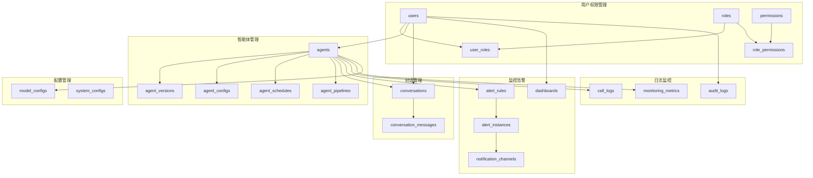

# 智能体交互运维平台 - 数据库设计

## 概述

本文档描述了智能体交互运维平台的MongoDB数据库设计，包括集合结构、字段定义、索引策略和数据关系。

## 数据库架构

### 核心集合

#### 智能体管理模块
1. **agents** - 智能体主表
2. **agent_versions** - 版本历史表
3. **agent_configs** - 智能体详细配置表
4. **agent_schedules** - 智能体调度任务表
5. **agent_pipelines** - 智能体工作流表
6. **agent_dependencies** - 智能体依赖关系表
7. **agent_resources** - 智能体资源配置表
8. **agent_deployments** - 智能体部署记录表

#### 模型和知识库模块
9. **model_configs** - 模型配置表
10. **knowledge_bases** - 知识库表
11. **knowledge_documents** - 知识库文档表
12. **training_datasets** - 训练数据集表
13. **fine_tuning_jobs** - 微调任务表

#### 对话管理模块
14. **conversations** - 对话会话表
15. **conversation_messages** - 对话消息表
16. **conversation_contexts** - 对话上下文表

#### 用户权限模块
17. **users** - 用户表
18. **roles** - 角色表
19. **permissions** - 权限表

#### 监控和日志模块
20. **call_logs** - 调用日志表（时序集合）
21. **monitoring_metrics** - 监控指标表（时序集合）
22. **performance_logs** - 性能日志表（时序集合）

#### 告警监控模块
23. **alert_rules** - 告警规则表
24. **alert_instances** - 告警实例表
25. **alert_notifications** - 告警通知表
26. **notification_channels** - 通知渠道表
27. **threshold_configs** - 阈值配置表

#### 监控面板模块
28. **dashboards** - 监控面板表
29. **dashboard_widgets** - 面板组件表
30. **metric_definitions** - 指标定义表

#### 系统配置模块
31. **system_configs** - 系统配置表
32. **audit_logs** - 审计日志表

---

## 集合详细设计

### 1. agents（智能体主表）

存储智能体的基本信息和配置。

```javascript
{
  _id: ObjectId,
  name: String,                    // 智能体名称
  type: String,                    // 智能体类型：功能型、专科型、综合型
  description: String,             // 智能体描述
  
  // API配置
  apiConfig: {
    endpoint: String,              // API端点
    apiKey: String,               // API密钥（加密存储）
    headers: Object,              // 请求头配置
    timeout: Number,              // 超时时间（毫秒）
    retryCount: Number,           // 重试次数
    enabled: Boolean              // API功能是否启用
  },
  
  // 对话配置
  chatConfig: {
    enabled: Boolean,             // 是否启用对话功能
    url: String,                  // 对话URL路径
    welcomeMessage: String,       // 欢迎消息
    suggestedQuestions: [String], // 建议问题列表
    maxTokens: Number,            // 最大token数
    temperature: Number           // 温度参数
  },
  
  // 生命周期管理
  lifecycleState: String,         // 生命周期状态：测试中、已发布、维护中、已下线
  currentVersion: String,         // 当前版本号
  
  // 权限和访问控制
  ownerId: ObjectId,              // 所有者用户ID
  visibility: String,             // 可见性：public、private、internal
  allowedUsers: [ObjectId],       // 允许访问的用户ID列表
  allowedRoles: [ObjectId],       // 允许访问的角色ID列表
  
  // 统计信息
  stats: {
    totalCalls: Number,           // 总调用次数
    successCalls: Number,         // 成功调用次数
    lastCallTime: Date,           // 最后调用时间
    avgResponseTime: Number       // 平均响应时间
  },
  
  // 元数据
  tags: [String],                 // 标签
  category: String,               // 分类
  priority: Number,               // 优先级
  
  // 时间戳
  createdAt: Date,
  updatedAt: Date,
  createdBy: ObjectId,            // 创建者用户ID
  updatedBy: ObjectId             // 最后更新者用户ID
}
```

**索引策略：**
```javascript
// 复合索引
db.agents.createIndex({ "lifecycleState": 1, "type": 1 })
db.agents.createIndex({ "ownerId": 1, "createdAt": -1 })
db.agents.createIndex({ "visibility": 1, "lifecycleState": 1 })

// 单字段索引
db.agents.createIndex({ "name": 1 })
db.agents.createIndex({ "createdAt": -1 })
db.agents.createIndex({ "updatedAt": -1 })

// 文本索引（支持全文搜索）
db.agents.createIndex({ 
  "name": "text", 
  "description": "text", 
  "tags": "text" 
})
```

---

### 2. agent_versions（版本历史表）

存储智能体的版本历史和配置变更记录。

```javascript
{
  _id: ObjectId,
  agentId: ObjectId,              // 关联的智能体ID
  version: String,                // 版本号（如：v1.0.0）
  versionType: String,            // 版本类型：major、minor、patch
  
  // 变更信息
  changeLog: {
    type: String,                 // 变更类型：功能调整、参数优化、修复问题、其他
    description: String,          // 变更描述
    hasApiChanges: Boolean,       // 是否有API变更
    hasConfigChanges: Boolean,    // 是否有配置变更
    breakingChanges: Boolean      // 是否为破坏性变更
  },
  
  // 配置快照
  configSnapshot: {
    apiConfig: Object,            // API配置快照
    chatConfig: Object,           // 对话配置快照
    otherConfigs: Object          // 其他配置快照
  },
  
  // 版本状态
  state: String,                  // 版本状态：开发中、测试中、已发布、已废弃
  isActive: Boolean,              // 是否为当前活跃版本
  
  // 发布信息
  releaseNotes: String,           // 发布说明
  releasedAt: Date,              // 发布时间
  releasedBy: ObjectId,          // 发布者用户ID
  
  // 回滚信息
  rollbackInfo: {
    canRollback: Boolean,         // 是否可回滚
    rollbackToVersion: String,    // 可回滚到的版本
    rollbackReason: String        // 回滚原因
  },
  
  // 时间戳
  createdAt: Date,
  createdBy: ObjectId
}
```

**索引策略：**
```javascript
db.agent_versions.createIndex({ "agentId": 1, "createdAt": -1 })
db.agent_versions.createIndex({ "agentId": 1, "version": 1 }, { unique: true })
db.agent_versions.createIndex({ "state": 1, "createdAt": -1 })
db.agent_versions.createIndex({ "isActive": 1, "agentId": 1 })
```

---

### 3. users（用户表）

存储用户基本信息和认证数据。

```javascript
{
  _id: ObjectId,
  username: String,               // 用户名（唯一）
  email: String,                  // 邮箱（唯一）
  passwordHash: String,           // 密码哈希
  
  // 用户信息
  profile: {
    firstName: String,            // 名
    lastName: String,             // 姓
    displayName: String,          // 显示名称
    avatar: String,               // 头像URL
    phone: String,                // 电话
    department: String,           // 部门
    position: String              // 职位
  },
  
  // 角色和权限
  roles: [ObjectId],              // 角色ID列表
  permissions: [String],          // 直接权限列表
  
  // 账户状态
  status: String,                 // 账户状态：active、inactive、suspended、deleted
  emailVerified: Boolean,         // 邮箱是否验证
  lastLoginAt: Date,              // 最后登录时间
  loginCount: Number,             // 登录次数
  
  // 安全设置
  security: {
    twoFactorEnabled: Boolean,    // 是否启用双因子认证
    apiKeys: [{                   // API密钥列表
      keyId: String,
      keyHash: String,
      name: String,
      permissions: [String],
      expiresAt: Date,
      createdAt: Date,
      lastUsedAt: Date
    }],
    sessionTimeout: Number        // 会话超时时间
  },
  
  // 偏好设置
  preferences: {
    language: String,             // 语言偏好
    timezone: String,             // 时区
    theme: String,                // 主题
    notifications: Object         // 通知设置
  },
  
  // 时间戳
  createdAt: Date,
  updatedAt: Date,
  createdBy: ObjectId
}
```

**索引策略：**
```javascript
db.users.createIndex({ "username": 1 }, { unique: true })
db.users.createIndex({ "email": 1 }, { unique: true })
db.users.createIndex({ "status": 1, "createdAt": -1 })
db.users.createIndex({ "roles": 1 })
db.users.createIndex({ "security.apiKeys.keyId": 1 })
```

---

### 4. roles（角色表）

定义系统角色和权限模板。

```javascript
{
  _id: ObjectId,
  name: String,                   // 角色名称（唯一）
  displayName: String,            // 显示名称
  description: String,            // 角色描述
  
  // 权限列表
  permissions: [String],          // 权限标识符列表
  
  // 角色层级
  level: Number,                  // 角色级别（数字越大权限越高）
  parentRole: ObjectId,           // 父角色ID
  childRoles: [ObjectId],         // 子角色ID列表
  
  // 角色状态
  isActive: Boolean,              // 是否激活
  isSystem: Boolean,              // 是否为系统内置角色
  
  // 资源访问控制
  resourceAccess: {
    agents: {                     // 智能体访问权限
      read: Boolean,
      write: Boolean,
      delete: Boolean,
      manage: Boolean
    },
    monitoring: {                 // 监控数据访问权限
      read: Boolean,
      export: Boolean
    },
    users: {                      // 用户管理权限
      read: Boolean,
      write: Boolean,
      delete: Boolean
    },
    system: {                     // 系统管理权限
      config: Boolean,
      logs: Boolean,
      backup: Boolean
    }
  },
  
  // 时间戳
  createdAt: Date,
  updatedAt: Date,
  createdBy: ObjectId
}
```

**索引策略：**
```javascript
db.roles.createIndex({ "name": 1 }, { unique: true })
db.roles.createIndex({ "isActive": 1, "level": -1 })
db.roles.createIndex({ "parentRole": 1 })
```

---

### 5. permissions（权限表）

定义系统中所有可用的权限。

```javascript
{
  _id: ObjectId,
  code: String,                   // 权限代码（唯一）
  name: String,                   // 权限名称
  description: String,            // 权限描述
  category: String,               // 权限分类
  
  // 权限层级
  level: Number,                  // 权限级别
  parentPermission: ObjectId,     // 父权限ID
  
  // 权限状态
  isActive: Boolean,              // 是否激活
  isSystem: Boolean,              // 是否为系统权限
  
  // 时间戳
  createdAt: Date,
  updatedAt: Date
}
```

**索引策略：**
```javascript
db.permissions.createIndex({ "code": 1 }, { unique: true })
db.permissions.createIndex({ "category": 1, "isActive": 1 })
```

---

### 6. call_logs（调用日志表 - 时序集合）

存储智能体API调用的详细日志。

```javascript
{
  _id: ObjectId,
  
  // 时序字段
  timestamp: Date,                // 调用时间戳
  
  // 元数据字段
  metadata: {
    agentId: ObjectId,            // 智能体ID
    agentName: String,            // 智能体名称
    userId: ObjectId,             // 调用用户ID
    sessionId: String,            // 会话ID
    requestId: String,            // 请求ID（唯一）
    clientIp: String,             // 客户端IP
    userAgent: String             // 用户代理
  },
  
  // 调用信息
  request: {
    method: String,               // 请求方法
    endpoint: String,             // 请求端点
    headers: Object,              // 请求头
    body: Object,                 // 请求体（可能需要脱敏）
    size: Number                  // 请求大小（字节）
  },
  
  // 响应信息
  response: {
    statusCode: Number,           // HTTP状态码
    headers: Object,              // 响应头
    body: Object,                 // 响应体（可能需要脱敏）
    size: Number,                 // 响应大小（字节）
    responseTime: Number          // 响应时间（毫秒）
  },
  
  // 错误信息
  error: {
    type: String,                 // 错误类型
    message: String,              // 错误消息
    code: String,                 // 错误代码
    stack: String                 // 错误堆栈（开发环境）
  },
  
  // 使用统计
  usage: {
    promptTokens: Number,         // 提示词token数
    completionTokens: Number,     // 完成token数
    totalTokens: Number,          // 总token数
    cost: Number                  // 调用成本
  },
  
  // 状态和标记
  status: String,                 // 调用状态：success、error、timeout、cancelled
  isSuccess: Boolean,             // 是否成功
  retryCount: Number,             // 重试次数
  tags: [String]                  // 标签
}
```

**时序集合配置：**
```javascript
db.createCollection("call_logs", {
  timeseries: {
    timeField: "timestamp",
    metaField: "metadata",
    granularity: "minutes"
  }
})
```

**索引策略：**
```javascript
db.call_logs.createIndex({ "metadata.agentId": 1, "timestamp": -1 })
db.call_logs.createIndex({ "metadata.userId": 1, "timestamp": -1 })
db.call_logs.createIndex({ "status": 1, "timestamp": -1 })
db.call_logs.createIndex({ "metadata.requestId": 1 }, { unique: true })
```

---

### 7. monitoring_metrics（监控指标表 - 时序集合）

存储系统和智能体的监控指标数据。

```javascript
{
  _id: ObjectId,
  
  // 时序字段
  timestamp: Date,                // 指标时间戳
  
  // 元数据字段
  metadata: {
    agentId: ObjectId,            // 智能体ID（可选）
    metricType: String,           // 指标类型：system、agent、api
    source: String,               // 数据源
    environment: String           // 环境：dev、test、prod
  },
  
  // 性能指标
  performance: {
    responseTime: Number,         // 响应时间（毫秒）
    throughput: Number,           // 吞吐量（请求/秒）
    errorRate: Number,            // 错误率（百分比）
    successRate: Number,          // 成功率（百分比）
    concurrency: Number           // 并发数
  },
  
  // 资源使用指标
  resources: {
    cpuUsage: Number,             // CPU使用率（百分比）
    memoryUsage: Number,          // 内存使用率（百分比）
    diskUsage: Number,            // 磁盘使用率（百分比）
    networkIn: Number,            // 网络入流量（字节/秒）
    networkOut: Number            // 网络出流量（字节/秒）
  },
  
  // 业务指标
  business: {
    totalCalls: Number,           // 总调用数
    activeSessions: Number,       // 活跃会话数
    totalUsers: Number,           // 总用户数
    tokenUsage: Number,           // Token使用量
    cost: Number                  // 成本
  },
  
  // 自定义指标
  custom: Object                  // 自定义指标数据
}
```

**时序集合配置：**
```javascript
db.createCollection("monitoring_metrics", {
  timeseries: {
    timeField: "timestamp",
    metaField: "metadata",
    granularity: "minutes"
  }
})
```

**索引策略：**
```javascript
db.monitoring_metrics.createIndex({ "metadata.agentId": 1, "timestamp": -1 })
db.monitoring_metrics.createIndex({ "metadata.metricType": 1, "timestamp": -1 })
db.monitoring_metrics.createIndex({ "metadata.source": 1, "timestamp": -1 })
```

---

### 8. system_configs（系统配置表）

存储系统级别的配置信息。

```javascript
{
  _id: ObjectId,
  key: String,                    // 配置键（唯一）
  value: Mixed,                   // 配置值（可以是任意类型）
  type: String,                   // 值类型：string、number、boolean、object、array
  category: String,               // 配置分类
  description: String,            // 配置描述
  
  // 配置属性
  isEncrypted: Boolean,           // 是否加密存储
  isReadonly: Boolean,            // 是否只读
  isRequired: Boolean,            // 是否必需
  
  // 验证规则
  validation: {
    pattern: String,              // 正则表达式
    minValue: Number,             // 最小值
    maxValue: Number,             // 最大值
    allowedValues: [Mixed]        // 允许的值列表
  },
  
  // 版本控制
  version: Number,                // 配置版本
  previousValue: Mixed,           // 上一个值
  
  // 时间戳
  createdAt: Date,
  updatedAt: Date,
  updatedBy: ObjectId
}
```

**索引策略：**
```javascript
db.system_configs.createIndex({ "key": 1 }, { unique: true })
db.system_configs.createIndex({ "category": 1 })
db.system_configs.createIndex({ "updatedAt": -1 })
```

---

### 9. agent_configs（智能体详细配置表）

存储智能体的详细配置信息，支持复杂的配置管理。

```javascript
{
  _id: ObjectId,
  agentId: ObjectId,              // 关联的智能体ID
  configType: String,             // 配置类型：model、prompt、workflow、resource
  
  // 模型配置
  modelConfig: {
    provider: String,             // 模型提供商：openai、anthropic、local
    modelName: String,            // 模型名称
    version: String,              // 模型版本
    endpoint: String,             // 模型端点
    apiKey: String,               // API密钥（加密）
    maxTokens: Number,            // 最大token数
    temperature: Number,          // 温度参数
    topP: Number,                 // Top-p参数
    frequencyPenalty: Number,     // 频率惩罚
    presencePenalty: Number,      // 存在惩罚
    stopSequences: [String],      // 停止序列
    timeout: Number,              // 超时时间
    retryCount: Number            // 重试次数
  },
  
  // 提示词配置
  promptConfig: {
    systemPrompt: String,         // 系统提示词
    userPromptTemplate: String,   // 用户提示词模板
    assistantPrompt: String,      // 助手提示词
    fewShotExamples: [{           // 少样本示例
      input: String,
      output: String,
      reasoning: String
    }],
    promptVariables: Object,      // 提示词变量
    promptVersions: [{            // 提示词版本历史
      version: String,
      content: String,
      performance: Object,
      createdAt: Date
    }]
  },
  
  // 工作流配置
  workflowConfig: {
    steps: [{                     // 工作流步骤
      stepId: String,
      stepName: String,
      stepType: String,           // 步骤类型：llm、tool、condition、loop
      config: Object,
      nextSteps: [String],
      errorHandling: Object
    }],
    triggers: [{                  // 触发器配置
      triggerType: String,        // 触发类型：schedule、event、webhook
      config: Object,
      enabled: Boolean
    }],
    parallelExecution: Boolean,   // 是否支持并行执行
    maxConcurrency: Number,       // 最大并发数
    timeoutConfig: Object         // 超时配置
  },
  
  // 资源配置
  resourceConfig: {
    cpu: {                        // CPU配置
      request: String,            // 请求量
      limit: String               // 限制量
    },
    memory: {                     // 内存配置
      request: String,
      limit: String
    },
    gpu: {                        // GPU配置
      type: String,               // GPU类型
      count: Number,              // GPU数量
      memory: String
    },
    storage: {                    // 存储配置
      size: String,
      type: String,               // 存储类型
      mountPath: String
    },
    network: {                    // 网络配置
      bandwidth: String,
      qos: String
    }
  },
  
  // 安全配置
  securityConfig: {
    encryption: {
      enabled: Boolean,
      algorithm: String,
      keyId: String
    },
    authentication: {
      required: Boolean,
      methods: [String],          // 认证方法
      tokenExpiry: Number
    },
    rateLimit: {
      enabled: Boolean,
      requestsPerMinute: Number,
      burstSize: Number
    },
    accessControl: {
      allowedIPs: [String],
      blockedIPs: [String],
      requiredRoles: [String]
    }
  },
  
  // 配置状态
  status: String,                 // 配置状态：draft、testing、active、deprecated
  isActive: Boolean,              // 是否激活
  priority: Number,               // 优先级
  
  // 版本控制
  version: String,                // 配置版本
  parentConfigId: ObjectId,       // 父配置ID
  
  // 验证规则
  validation: {
    rules: [Object],              // 验证规则
    lastValidation: {
      isValid: Boolean,
      errors: [String],
      validatedAt: Date
    }
  },
  
  // 时间戳
  createdAt: Date,
  updatedAt: Date,
  createdBy: ObjectId,
  updatedBy: ObjectId
}
```

**索引策略：**
```javascript
db.agent_configs.createIndex({ "agentId": 1, "configType": 1 })
db.agent_configs.createIndex({ "status": 1, "isActive": 1 })
db.agent_configs.createIndex({ "version": 1, "createdAt": -1 })
```

---

### 10. agent_schedules（智能体调度任务表）

管理智能体的调度任务和执行计划。

```javascript
{
  _id: ObjectId,
  agentId: ObjectId,              // 关联的智能体ID
  scheduleName: String,           // 调度任务名称
  description: String,            // 任务描述
  
  // 调度配置
  scheduleConfig: {
    type: String,                 // 调度类型：cron、interval、once、event
    cronExpression: String,       // Cron表达式
    interval: Number,             // 间隔时间（秒）
    startTime: Date,              // 开始时间
    endTime: Date,                // 结束时间
    timezone: String,             // 时区
    maxExecutions: Number,        // 最大执行次数
    maxDuration: Number           // 最大执行时长（秒）
  },
  
  // 执行配置
  executionConfig: {
    priority: Number,             // 执行优先级
    retryPolicy: {
      maxRetries: Number,
      retryDelay: Number,
      backoffMultiplier: Number
    },
    resourceLimits: {
      cpu: String,
      memory: String,
      timeout: Number
    },
    environment: Object,          // 环境变量
    arguments: Object             // 执行参数
  },
  
  // 依赖配置
  dependencies: [{
    dependencyType: String,       // 依赖类型：schedule、agent、external
    targetId: ObjectId,           // 目标ID
    condition: String,            // 依赖条件
    waitTimeout: Number           // 等待超时
  }],
  
  // 通知配置
  notificationConfig: {
    onSuccess: {
      enabled: Boolean,
      channels: [ObjectId],       // 通知渠道ID
      template: String
    },
    onFailure: {
      enabled: Boolean,
      channels: [ObjectId],
      template: String
    },
    onTimeout: {
      enabled: Boolean,
      channels: [ObjectId],
      template: String
    }
  },
  
  // 执行统计
  executionStats: {
    totalExecutions: Number,      // 总执行次数
    successfulExecutions: Number, // 成功执行次数
    failedExecutions: Number,     // 失败执行次数
    lastExecutionTime: Date,      // 最后执行时间
    lastExecutionStatus: String,  // 最后执行状态
    avgExecutionTime: Number,     // 平均执行时间
    nextExecutionTime: Date       // 下次执行时间
  },
  
  // 状态管理
  status: String,                 // 调度状态：active、paused、stopped、error
  isEnabled: Boolean,             // 是否启用
  
  // 时间戳
  createdAt: Date,
  updatedAt: Date,
  createdBy: ObjectId,
  updatedBy: ObjectId
}
```

**索引策略：**
```javascript
db.agent_schedules.createIndex({ "agentId": 1, "status": 1 })
db.agent_schedules.createIndex({ "scheduleConfig.nextExecutionTime": 1 })
db.agent_schedules.createIndex({ "isEnabled": 1, "status": 1 })
```

---

### 11. agent_pipelines（智能体工作流表）

定义智能体的复杂工作流和流水线。

```javascript
{
  _id: ObjectId,
  pipelineName: String,           // 流水线名称
  description: String,            // 流水线描述
  
  // 流水线定义
  definition: {
    version: String,              // 流水线版本
    nodes: [{                     // 节点定义
      nodeId: String,
      nodeName: String,
      nodeType: String,           // 节点类型：agent、condition、parallel、sequential
      agentId: ObjectId,          // 关联智能体ID
      config: Object,             // 节点配置
      position: {                 // 节点位置（用于可视化）
        x: Number,
        y: Number
      },
      inputs: [String],           // 输入参数
      outputs: [String]           // 输出参数
    }],
    edges: [{                     // 连接关系
      edgeId: String,
      sourceNodeId: String,       // 源节点ID
      targetNodeId: String,       // 目标节点ID
      condition: String,          // 连接条件
      dataMapping: Object         // 数据映射
    }],
    variables: Object,            // 全局变量
    constants: Object             // 常量定义
  },
  
  // 执行配置
  executionConfig: {
    mode: String,                 // 执行模式：sequential、parallel、dag
    maxConcurrency: Number,       // 最大并发数
    timeout: Number,              // 超时时间
    errorHandling: String,        // 错误处理策略：stop、continue、retry
    rollbackStrategy: String      // 回滚策略
  },
  
  // 输入输出定义
  inputSchema: Object,            // 输入数据模式
  outputSchema: Object,           // 输出数据模式
  
  // 权限控制
  permissions: {
    ownerId: ObjectId,            // 所有者
    readers: [ObjectId],          // 可读用户
    writers: [ObjectId],          // 可写用户
    executors: [ObjectId]         // 可执行用户
  },
  
  // 版本管理
  version: String,                // 当前版本
  parentPipelineId: ObjectId,     // 父流水线ID
  isTemplate: Boolean,            // 是否为模板
  
  // 统计信息
  stats: {
    totalExecutions: Number,
    successfulExecutions: Number,
    averageExecutionTime: Number,
    lastExecutedAt: Date
  },
  
  // 状态管理
  status: String,                 // 状态：draft、testing、published、deprecated
  isActive: Boolean,              // 是否激活
  
  // 时间戳
  createdAt: Date,
  updatedAt: Date,
  createdBy: ObjectId,
  updatedBy: ObjectId
}
```

**索引策略：**
```javascript
db.agent_pipelines.createIndex({ "status": 1, "isActive": 1 })
db.agent_pipelines.createIndex({ "permissions.ownerId": 1 })
db.agent_pipelines.createIndex({ "isTemplate": 1, "status": 1 })
```

---

### 12. alert_rules（告警规则表）

定义系统和智能体的告警规则。

```javascript
{
  _id: ObjectId,
  ruleName: String,               // 规则名称
  description: String,            // 规则描述
  category: String,               // 规则分类：system、agent、business
  
  // 目标配置
  target: {
    type: String,                 // 目标类型：agent、system、pipeline
    targetId: ObjectId,           // 目标ID
    scope: String                 // 作用范围：global、tenant、user
  },
  
  // 指标配置
  metric: {
    metricName: String,           // 指标名称
    aggregation: String,          // 聚合方式：avg、sum、max、min、count
    timeWindow: Number,           // 时间窗口（秒）
    dataSource: String            // 数据源
  },
  
  // 条件配置
  conditions: [{
    operator: String,             // 操作符：gt、lt、eq、ne、gte、lte
    threshold: Number,            // 阈值
    duration: Number,             // 持续时间（秒）
    severity: String              // 严重程度：info、warning、error、critical
  }],
  
  // 告警配置
  alertConfig: {
    cooldownPeriod: Number,       // 冷却期（秒）
    maxAlerts: Number,            // 最大告警数
    autoResolve: Boolean,         // 自动解决
    resolveTimeout: Number,       // 解决超时（秒）
    suppressionRules: [Object]    // 抑制规则
  },
  
  // 通知配置
  notifications: [{
    channelId: ObjectId,          // 通知渠道ID
    severity: [String],           // 适用严重程度
    template: String,             // 通知模板
    frequency: String,            // 通知频率：immediate、batched、digest
    batchInterval: Number         // 批量间隔（秒）
  }],
  
  // 自动化操作
  automation: {
    enabled: Boolean,             // 是否启用自动化
    actions: [{                   // 自动化动作
      actionType: String,         // 动作类型：restart、scale、notification
      config: Object,             // 动作配置
      conditions: [String]        // 执行条件
    }]
  },
  
  // 规则状态
  status: String,                 // 规则状态：active、inactive、testing
  isEnabled: Boolean,             // 是否启用
  priority: Number,               // 优先级
  
  // 统计信息
  stats: {
    totalTriggers: Number,        // 总触发次数
    lastTriggeredAt: Date,        // 最后触发时间
    falsePositiveCount: Number,   // 误报次数
    avgResolutionTime: Number     // 平均解决时间
  },
  
  // 时间戳
  createdAt: Date,
  updatedAt: Date,
  createdBy: ObjectId,
  updatedBy: ObjectId
}
```

**索引策略：**
```javascript
db.alert_rules.createIndex({ "status": 1, "isEnabled": 1 })
db.alert_rules.createIndex({ "target.targetId": 1, "target.type": 1 })
db.alert_rules.createIndex({ "category": 1, "priority": -1 })
```

---

### 13. alert_instances（告警实例表）

存储具体的告警实例和状态。

```javascript
{
  _id: ObjectId,
  ruleId: ObjectId,               // 关联的告警规则ID
  
  // 告警基本信息
  alertName: String,              // 告警名称
  alertId: String,                // 告警唯一标识
  severity: String,               // 严重程度
  status: String,                 // 告警状态：firing、resolved、suppressed、acknowledged
  
  // 触发信息
  triggerInfo: {
    triggeredAt: Date,            // 触发时间
    metricValue: Number,          // 触发时的指标值
    threshold: Number,            // 阈值
    triggerCondition: String,     // 触发条件
    dataPoints: [Object]          // 相关数据点
  },
  
  // 目标信息
  target: {
    type: String,                 // 目标类型
    targetId: ObjectId,           // 目标ID
    targetName: String,           // 目标名称
    labels: Object                // 标签信息
  },
  
  // 解决信息
  resolution: {
    resolvedAt: Date,             // 解决时间
    resolvedBy: ObjectId,         // 解决人
    resolutionType: String,       // 解决类型：auto、manual
    resolutionNote: String,       // 解决备注
    rootCause: String,            // 根本原因
    preventiveMeasures: String    // 预防措施
  },
  
  // 确认信息
  acknowledgment: {
    acknowledgedAt: Date,         // 确认时间
    acknowledgedBy: ObjectId,     // 确认人
    acknowledgmentNote: String    // 确认备注
  },
  
  // 影响评估
  impact: {
    affectedUsers: Number,        // 影响用户数
    affectedAgents: [ObjectId],   // 影响的智能体
    businessImpact: String,       // 业务影响
    estimatedLoss: Number         // 估计损失
  },
  
  // 通知记录
  notifications: [{
    channelId: ObjectId,          // 通知渠道
    sentAt: Date,                 // 发送时间
    status: String,               // 发送状态
    recipients: [String],         // 接收人
    retryCount: Number            // 重试次数
  }],
  
  // 自动化操作记录
  automationActions: [{
    actionType: String,           // 操作类型
    executedAt: Date,             // 执行时间
    status: String,               // 执行状态
    result: Object,               // 执行结果
    errorMessage: String          // 错误信息
  }],
  
  // 关联信息
  relatedAlerts: [ObjectId],      // 相关告警
  incidents: [ObjectId],          // 关联事件
  
  // 时间戳
  createdAt: Date,
  updatedAt: Date,
  lastStatusChange: Date
}
```

**索引策略：**
```javascript
db.alert_instances.createIndex({ "ruleId": 1, "status": 1 })
db.alert_instances.createIndex({ "target.targetId": 1, "createdAt": -1 })
db.alert_instances.createIndex({ "severity": 1, "status": 1 })
db.alert_instances.createIndex({ "triggerInfo.triggeredAt": -1 })
```

---

### 14. dashboards（监控面板表）

定义监控面板的布局和配置。

```javascript
{
  _id: ObjectId,
  dashboardName: String,          // 面板名称
  description: String,            // 面板描述
  category: String,               // 面板分类
  
  // 布局配置
  layout: {
    type: String,                 // 布局类型：grid、flex、custom
    columns: Number,              // 列数
    rows: Number,                 // 行数
    gridSize: Object,             // 网格大小
    responsive: Boolean           // 是否响应式
  },
  
  // 组件列表
  widgets: [{
    widgetId: String,             // 组件唯一ID
    widgetType: String,           // 组件类型：chart、table、metric、alert
    title: String,                // 组件标题
    position: {                   // 组件位置
      x: Number,
      y: Number,
      width: Number,
      height: Number
    },
    config: Object,               // 组件配置
    dataSource: {                 // 数据源配置
      type: String,               // 数据源类型
      query: String,              // 查询语句
      refreshInterval: Number     // 刷新间隔
    },
    styling: Object               // 样式配置
  }],
  
  // 过滤器配置
  filters: [{
    filterId: String,             // 过滤器ID
    filterName: String,           // 过滤器名称
    filterType: String,           // 过滤器类型
    options: [Object],            // 过滤选项
    defaultValue: Mixed,          // 默认值
    affectedWidgets: [String]     // 影响的组件
  }],
  
  // 时间范围配置
  timeRange: {
    type: String,                 // 时间类型：relative、absolute、custom
    defaultRange: String,         // 默认范围
    allowCustom: Boolean,         // 允许自定义
    maxRange: String              // 最大范围
  },
  
  // 权限配置
  permissions: {
    ownerId: ObjectId,            // 所有者
    visibility: String,           // 可见性：private、shared、public
    viewers: [ObjectId],          // 可查看用户
    editors: [ObjectId]           // 可编辑用户
  },
  
  // 分享配置
  sharing: {
    isShareable: Boolean,         // 是否可分享
    shareToken: String,           // 分享令牌
    shareExpiry: Date,            // 分享过期时间
    allowExport: Boolean          // 允许导出
  },
  
  // 状态信息
  status: String,                 // 状态：active、archived、template
  isTemplate: Boolean,            // 是否为模板
  templateCategory: String,       // 模板分类
  
  // 使用统计
  usage: {
    viewCount: Number,            // 查看次数
    lastViewedAt: Date,           // 最后查看时间
    favoriteCount: Number,        // 收藏次数
    exportCount: Number           // 导出次数
  },
  
  // 版本控制
  version: String,                // 版本号
  parentDashboardId: ObjectId,    // 父面板ID
  
  // 时间戳
  createdAt: Date,
  updatedAt: Date,
  createdBy: ObjectId,
  updatedBy: ObjectId
}
```

**索引策略：**
```javascript
db.dashboards.createIndex({ "permissions.ownerId": 1, "status": 1 })
db.dashboards.createIndex({ "category": 1, "isTemplate": 1 })
db.dashboards.createIndex({ "usage.lastViewedAt": -1 })
```

---

### 15. conversations（对话会话表）

管理智能体与用户的对话会话。

```javascript
{
  _id: ObjectId,
  sessionId: String,              // 会话唯一标识
  
  // 参与者信息
  participants: {
    userId: ObjectId,             // 用户ID
    agentId: ObjectId,            // 智能体ID
    userInfo: {                   // 用户信息
      name: String,
      avatar: String,
      role: String
    },
    agentInfo: {                  // 智能体信息
      name: String,
      type: String,
      version: String
    }
  },
  
  // 会话配置
  sessionConfig: {
    maxMessages: Number,          // 最大消息数
    timeout: Number,              // 超时时间
    retentionPeriod: Number,      // 保留期（天）
    allowFileUpload: Boolean,     // 允许文件上传
    allowImageUpload: Boolean,    // 允许图片上传
    maxFileSize: Number           // 最大文件大小
  },
  
  // 会话状态
  status: String,                 // 会话状态：active、ended、timeout、error
  startTime: Date,                // 开始时间
  endTime: Date,                  // 结束时间
  lastActivityTime: Date,         // 最后活动时间
  
  // 统计信息
  stats: {
    messageCount: Number,         // 消息总数
    userMessageCount: Number,     // 用户消息数
    agentMessageCount: Number,    // 智能体消息数
    avgResponseTime: Number,      // 平均响应时间
    totalTokens: Number,          // 总token使用量
    cost: Number                  // 会话成本
  },
  
  // 上下文信息
  context: {
    topic: String,                // 对话主题
    intent: String,               // 用户意图
    entities: [Object],           // 实体信息
    sentiment: String,            // 情感分析
    language: String,             // 语言
    variables: Object             // 会话变量
  },
  
  // 质量评估
  quality: {
    userSatisfaction: Number,     // 用户满意度(1-5)
    resolutionStatus: String,     // 解决状态：resolved、unresolved、escalated
    feedback: String,             // 用户反馈
    rating: Number,               // 评分
    reviewNotes: String           // 评审备注
  },
  
  // 标签和分类
  tags: [String],                 // 标签
  category: String,               // 分类
  priority: String,               // 优先级
  
  // 元数据
  metadata: {
    source: String,               // 来源：web、mobile、api
    channel: String,              // 渠道：chat、voice、video
    device: String,               // 设备信息
    location: Object,             // 地理位置
    referrer: String              // 来源页面
  },
  
  // 时间戳
  createdAt: Date,
  updatedAt: Date
}
```

**索引策略：**
```javascript
db.conversations.createIndex({ "participants.userId": 1, "startTime": -1 })
db.conversations.createIndex({ "participants.agentId": 1, "status": 1 })
db.conversations.createIndex({ "sessionId": 1 }, { unique: true })
db.conversations.createIndex({ "status": 1, "lastActivityTime": -1 })
```

---

### 16. notification_channels（通知渠道表）

定义各种通知渠道的配置。

```javascript
{
  _id: ObjectId,
  channelName: String,            // 渠道名称
  channelType: String,            // 渠道类型：email、sms、webhook、slack、dingtalk、wechat
  description: String,            // 渠道描述
  
  // 渠道配置
  config: {
    // 邮件配置
    email: {
      smtpHost: String,           // SMTP服务器
      smtpPort: Number,           // SMTP端口
      username: String,           // 用户名
      password: String,           // 密码（加密）
      from: String,               // 发送人
      encryption: String          // 加密方式：ssl、tls
    },
    
    // 短信配置
    sms: {
      provider: String,           // 服务商：aliyun、tencent、aws
      accessKey: String,          // 访问密钥
      secretKey: String,          // 密钥（加密）
      signName: String,           // 签名
      templateId: String          // 模板ID
    },
    
    // Webhook配置
    webhook: {
      url: String,                // Webhook URL
      method: String,             // HTTP方法
      headers: Object,            // 请求头
      authType: String,           // 认证类型
      authConfig: Object          // 认证配置
    },
    
    // Slack配置
    slack: {
      botToken: String,           // Bot Token
      channelId: String,          // 频道ID
      workspace: String           // 工作区
    },
    
    // 钉钉配置
    dingtalk: {
      accessToken: String,        // 访问令牌
      secret: String,             // 密钥
      chatId: String              // 群聊ID
    }
  },
  
  // 模板配置
  templates: [{
    templateId: String,           // 模板ID
    templateName: String,         // 模板名称
    subject: String,              // 主题
    content: String,              // 内容模板
    variables: [String],          // 变量列表
    isDefault: Boolean            // 是否默认模板
  }],
  
  // 限流配置
  rateLimit: {
    enabled: Boolean,             // 是否启用限流
    maxPerMinute: Number,         // 每分钟最大发送数
    maxPerHour: Number,           // 每小时最大发送数
    maxPerDay: Number             // 每天最大发送数
  },
  
  // 重试配置
  retryConfig: {
    enabled: Boolean,             // 是否启用重试
    maxRetries: Number,           // 最大重试次数
    retryDelay: Number,           // 重试延迟（秒）
    backoffMultiplier: Number     // 退避倍数
  },
  
  // 状态管理
  status: String,                 // 状态：active、inactive、error
  isEnabled: Boolean,             // 是否启用
  
  // 统计信息
  stats: {
    totalSent: Number,            // 总发送数
    successCount: Number,         // 成功数
    failureCount: Number,         // 失败数
    lastSentAt: Date,             // 最后发送时间
    avgDeliveryTime: Number       // 平均送达时间
  },
  
  // 时间戳
  createdAt: Date,
  updatedAt: Date,
  createdBy: ObjectId,
  updatedBy: ObjectId
}
```

**索引策略：**
```javascript
db.notification_channels.createIndex({ "channelType": 1, "status": 1 })
db.notification_channels.createIndex({ "isEnabled": 1, "status": 1 })
```

---

### 17. model_configs（模型配置表）

存储AI模型的详细配置信息。

```javascript
{
  _id: ObjectId,
  modelName: String,              // 模型名称
  modelDisplayName: String,       // 模型显示名称
  provider: String,               // 提供商：openai、anthropic、azure、local
  modelType: String,              // 模型类型：chat、completion、embedding、vision
  
  // 基础配置
  basicConfig: {
    apiEndpoint: String,          // API端点
    apiVersion: String,           // API版本
    modelId: String,              // 模型ID
    maxTokens: Number,            // 最大token数
    contextWindow: Number,        // 上下文窗口大小
    supportedFeatures: [String]   // 支持的功能：streaming、function_calling、vision
  },
  
  // 参数配置
  parameters: {
    temperature: {
      default: Number,            // 默认值
      min: Number,                // 最小值
      max: Number,                // 最大值
      step: Number                // 步长
    },
    topP: {
      default: Number,
      min: Number,
      max: Number,
      step: Number
    },
    frequencyPenalty: {
      default: Number,
      min: Number,
      max: Number,
      step: Number
    },
    presencePenalty: {
      default: Number,
      min: Number,
      max: Number,
      step: Number
    },
    stopSequences: {
      default: [String],
      maxCount: Number
    }
  },
  
  // 认证配置
  authentication: {
    type: String,                 // 认证类型：api_key、oauth、custom
    keyName: String,              // 密钥名称
    headerName: String,           // 请求头名称
    secretKey: String,            // 密钥（加密存储）
    additionalHeaders: Object     // 额外请求头
  },
  
  // 性能配置
  performance: {
    timeout: Number,              // 超时时间（秒）
    retryCount: Number,           // 重试次数
    concurrencyLimit: Number,     // 并发限制
    rateLimitConfig: {            // 限流配置
      requestsPerMinute: Number,
      tokensPerMinute: Number,
      burstSize: Number
    }
  },
  
  // 成本配置
  pricing: {
    inputTokenPrice: Number,      // 输入token价格（每1K token）
    outputTokenPrice: Number,     // 输出token价格（每1K token）
    currency: String,             // 货币单位
    freeQuota: Number,            // 免费配额（token数）
    billingModel: String          // 计费模式：pay_per_use、subscription
  },
  
  // 能力配置
  capabilities: {
    maxInputLength: Number,       // 最大输入长度
    maxOutputLength: Number,      // 最大输出长度
    supportedLanguages: [String], // 支持的语言
    supportedFormats: [String],   // 支持的格式
    functionCalling: Boolean,     // 是否支持函数调用
    streaming: Boolean,           // 是否支持流式输出
    vision: Boolean,              // 是否支持图像
    audio: Boolean                // 是否支持音频
  },
  
  // 质量配置
  quality: {
    benchmarkScores: Object,      // 基准测试分数
    reliability: Number,          // 可靠性评分（1-5）
    accuracy: Number,             // 准确性评分（1-5）
    speed: Number,                // 速度评分（1-5）
    cost: Number                  // 成本评分（1-5）
  },
  
  // 状态管理
  status: String,                 // 状态：active、deprecated、beta、maintenance
  isAvailable: Boolean,           // 是否可用
  isRecommended: Boolean,         // 是否推荐
  
  // 版本控制
  version: String,                // 模型版本
  releaseDate: Date,              // 发布日期
  deprecationDate: Date,          // 废弃日期
  
  // 时间戳
  createdAt: Date,
  updatedAt: Date,
  createdBy: ObjectId
}
```

**索引策略：**
```javascript
db.model_configs.createIndex({ "provider": 1, "modelType": 1 })
db.model_configs.createIndex({ "status": 1, "isAvailable": 1 })
db.model_configs.createIndex({ "isRecommended": 1, "status": 1 })
```

---

### 18. conversation_messages（对话消息表）

存储对话中的详细消息内容。

```javascript
{
  _id: ObjectId,
  conversationId: ObjectId,       // 关联的对话ID
  messageId: String,              // 消息唯一标识
  
  // 消息基本信息
  messageType: String,            // 消息类型：text、image、file、audio、video、system
  content: {
    text: String,                 // 文本内容
    files: [{                     // 文件列表
      fileName: String,
      fileType: String,
      fileSize: Number,
      fileUrl: String,
      thumbnail: String
    }],
    images: [{                    // 图片列表
      imageUrl: String,
      caption: String,
      width: Number,
      height: Number
    }],
    metadata: Object              // 其他元数据
  },
  
  // 发送者信息
  sender: {
    type: String,                 // 发送者类型：user、agent、system
    id: ObjectId,                 // 发送者ID
    name: String,                 // 发送者名称
    avatar: String                // 头像
  },
  
  // 消息状态
  status: String,                 // 消息状态：sending、sent、delivered、read、failed
  isVisible: Boolean,             // 是否可见
  isDeleted: Boolean,             // 是否已删除
  
  // 智能体响应信息（仅AI消息）
  aiResponse: {
    modelUsed: String,            // 使用的模型
    promptTokens: Number,         // 提示词token数
    completionTokens: Number,     // 完成token数
    totalTokens: Number,          // 总token数
    responseTime: Number,         // 响应时间（毫秒）
    cost: Number,                 // 成本
    temperature: Number,          // 使用的温度参数
    confidence: Number            // 置信度
  },
  
  // 功能调用信息
  functionCalls: [{
    functionName: String,         // 函数名称
    arguments: Object,            // 函数参数
    result: Object,               // 执行结果
    executionTime: Number,        // 执行时间
    status: String                // 执行状态
  }],
  
  // 引用和回复
  references: {
    replyToMessageId: ObjectId,   // 回复的消息ID
    quotedText: String,           // 引用的文本
    relatedMessages: [ObjectId]   // 相关消息
  },
  
  // 情感和意图分析
  analysis: {
    sentiment: String,            // 情感：positive、negative、neutral
    emotion: String,              // 情绪：happy、sad、angry、surprised
    intent: String,               // 意图
    entities: [Object],           // 实体识别
    topics: [String],             // 主题标签
    language: String,             // 语言检测
    toxicity: Number              // 毒性检测分数
  },
  
  // 质量评估
  quality: {
    relevance: Number,            // 相关性（1-5）
    helpfulness: Number,          // 有用性（1-5）
    accuracy: Number,             // 准确性（1-5）
    completeness: Number,         // 完整性（1-5）
    userFeedback: String,         // 用户反馈：thumbs_up、thumbs_down
    feedbackComment: String       // 反馈评论
  },
  
  // 编辑历史
  editHistory: [{
    editedAt: Date,               // 编辑时间
    editedBy: ObjectId,           // 编辑人
    previousContent: Object,      // 之前的内容
    editReason: String            // 编辑原因
  }],
  
  // 时间戳
  timestamp: Date,                // 消息时间戳
  createdAt: Date,
  updatedAt: Date
}
```

**索引策略：**
```javascript
db.conversation_messages.createIndex({ "conversationId": 1, "timestamp": -1 })
db.conversation_messages.createIndex({ "sender.id": 1, "timestamp": -1 })
db.conversation_messages.createIndex({ "messageType": 1, "timestamp": -1 })
db.conversation_messages.createIndex({ "status": 1, "isVisible": 1 })
```

---

### 19. audit_logs（审计日志表）

记录系统中所有重要操作的审计日志。

```javascript
{
  _id: ObjectId,
  
  // 基本信息
  eventType: String,              // 事件类型：create、update、delete、login、logout、access
  entityType: String,             // 实体类型：user、agent、config、system
  entityId: ObjectId,             // 实体ID
  action: String,                 // 具体操作
  
  // 操作者信息
  actor: {
    userId: ObjectId,             // 操作用户ID
    username: String,             // 用户名
    userType: String,             // 用户类型：admin、user、system
    ipAddress: String,            // IP地址
    userAgent: String,            // 用户代理
    sessionId: String             // 会话ID
  },
  
  // 目标信息
  target: {
    resourceType: String,         // 资源类型
    resourceId: ObjectId,         // 资源ID
    resourceName: String,         // 资源名称
    previousState: Object,        // 变更前状态
    newState: Object,             // 变更后状态
    changeSet: Object             // 变更集合
  },
  
  // 操作结果
  result: {
    status: String,               // 操作状态：success、failure、partial
    errorCode: String,            // 错误代码
    errorMessage: String,         // 错误信息
    duration: Number,             // 操作耗时（毫秒）
    affectedRows: Number          // 影响的记录数
  },
  
  // 安全信息
  security: {
    riskLevel: String,            // 风险级别：low、medium、high、critical
    requiresReview: Boolean,      // 是否需要审查
    sensitiveData: Boolean,       // 是否涉及敏感数据
    complianceFlags: [String],    // 合规标记
    dataClassification: String    // 数据分类
  },
  
  // 上下文信息
  context: {
    requestId: String,            // 请求ID
    correlationId: String,        // 关联ID
    businessContext: Object,      // 业务上下文
    technicalContext: Object,     // 技术上下文
    metadata: Object              // 其他元数据
  },
  
  // 时间信息
  timestamp: Date,                // 操作时间戳
  createdAt: Date
}
```

**索引策略：**
```javascript
db.audit_logs.createIndex({ "timestamp": -1 })
db.audit_logs.createIndex({ "actor.userId": 1, "timestamp": -1 })
db.audit_logs.createIndex({ "entityType": 1, "eventType": 1, "timestamp": -1 })
db.audit_logs.createIndex({ "target.resourceType": 1, "timestamp": -1 })
db.audit_logs.createIndex({ "security.riskLevel": 1, "timestamp": -1 })
```

---

## 数据关系图



**详细关系说明：**

```
# 核心关系
users (1) ←→ (N) agents (ownerId)
users (N) ←→ (N) roles (user_roles)
roles (1) ←→ (N) permissions (role_permissions)

# 智能体关系
agents (1) ←→ (N) agent_versions (agentId)
agents (1) ←→ (N) agent_configs (agentId)
agents (1) ←→ (N) agent_schedules (agentId)
agents (1) ←→ (N) agent_pipelines (definition.nodes.agentId)

# 对话关系
users (1) ←→ (N) conversations (participants.userId)
agents (1) ←→ (N) conversations (participants.agentId)
conversations (1) ←→ (N) conversation_messages (conversationId)

# 监控告警关系
agents (1) ←→ (N) alert_rules (target.targetId)
alert_rules (1) ←→ (N) alert_instances (ruleId)
notification_channels (1) ←→ (N) alert_rules (notifications.channelId)

# 日志关系
agents (1) ←→ (N) call_logs (metadata.agentId)
users (1) ←→ (N) call_logs (metadata.userId)
agents (1) ←→ (N) monitoring_metrics (metadata.agentId)

# 配置关系
agents (N) ←→ (N) model_configs (referenced in agent_configs)
users (1) ←→ (N) dashboards (permissions.ownerId)
```

---

## 性能优化建议

### 1. 分片策略

**call_logs 集合分片：**
```javascript
// 基于时间和智能体ID的复合分片键
sh.shardCollection("platform.call_logs", { 
  "timestamp": 1, 
  "metadata.agentId": 1 
})
```

**monitoring_metrics 集合分片：**
```javascript
// 基于时间和指标类型的复合分片键
sh.shardCollection("platform.monitoring_metrics", { 
  "timestamp": 1, 
  "metadata.metricType": 1 
})
```

### 2. 数据归档策略

```javascript
// 自动删除90天前的调用日志
db.call_logs.createIndex(
  { "timestamp": 1 }, 
  { expireAfterSeconds: 7776000 }  // 90天
)

// 自动删除30天前的详细监控数据
db.monitoring_metrics.createIndex(
  { "timestamp": 1 }, 
  { expireAfterSeconds: 2592000 }  // 30天
)
```

### 3. 读写分离

- 使用MongoDB副本集
- 监控查询使用从节点
- 写操作使用主节点

---

## 安全考虑

### 1. 数据加密

```javascript
// 敏感字段加密
{
  "apiConfig.apiKey": { "$encrypt": true },
  "users.passwordHash": { "$encrypt": true },
  "request.body": { "$encrypt": true },  // 可选
  "response.body": { "$encrypt": true }  // 可选
}
```

### 2. 访问控制

```javascript
// 基于角色的访问控制
db.createRole({
  role: "agentManager",
  privileges: [
    {
      resource: { db: "platform", collection: "agents" },
      actions: ["find", "insert", "update", "remove"]
    },
    {
      resource: { db: "platform", collection: "agent_versions" },
      actions: ["find", "insert"]
    }
  ],
  roles: []
})
```

### 3. 审计日志

所有重要操作都应记录审计日志，包括：
- 智能体创建/修改/删除
- 用户权限变更
- 系统配置修改
- 敏感数据访问

---

## 备份策略

1. **全量备份**：每日凌晨进行全量备份
2. **增量备份**：每小时进行增量备份
3. **时序数据**：使用专门的时序数据备份策略
4. **跨地域备份**：重要数据进行跨地域备份

---

## 监控指标

### 数据库性能监控

- 连接数
- 查询响应时间
- 索引使用率
- 磁盘使用率
- 内存使用率

### 业务指标监控

- 智能体调用量
- 错误率趋势
- 用户活跃度
- 数据增长率

---

## 扩展考虑

1. **多租户支持**：为未来多租户架构预留设计空间
2. **国际化**：支持多语言和多时区
3. **插件系统**：支持第三方插件扩展
4. **API版本管理**：支持API版本演进
5. **数据湖集成**：支持大数据分析需求 